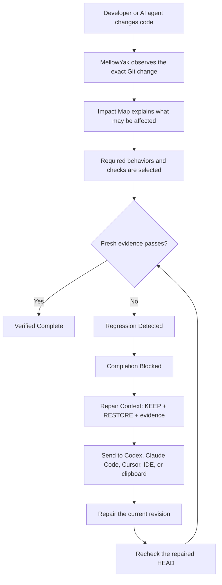
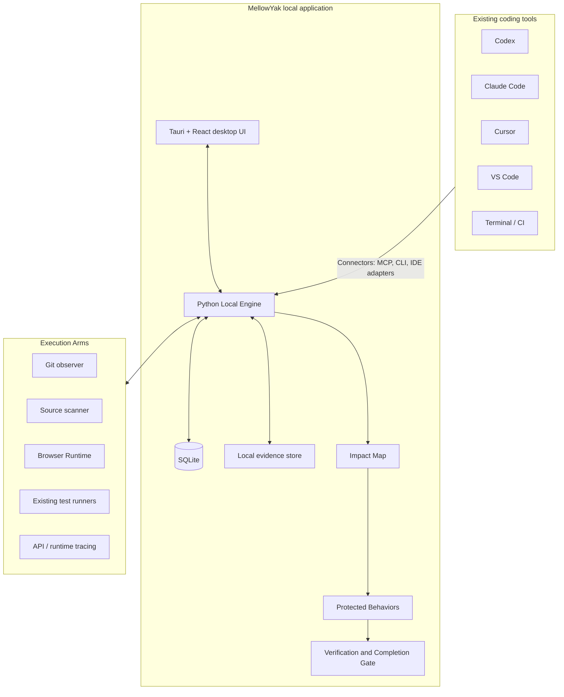

> [!CAUTION]
> **NON-NEGOTIABLE UI LOCALIZATION RULE:** No user-facing UI text may be hardcoded anywhere in MellowYak. Every label, message, title, placeholder, accessible name, and mascot description must be rendered from a translation key. English and Hebrew catalogs must stay complete, and Hebrew UI must render right-to-left. Run `python3 scripts/check_ui_translation_keys.py` before every commit.

<div align="center">

# MellowYak

### Protect what already works.

**A local-first behavior and regression guard for AI-assisted software changes.**

[](#project-status)
[](#privacy-by-design)
[](#local-first-architecture)
[](#installation)

</div>

> [!IMPORTANT]
> MellowYak is in active development. This README defines the product contract and intended full workflow. It does **not** claim that every capability described below is already implemented or production-ready. Current implementation status must be verified through the project roadmap and validation reports.

---

## What is MellowYak?

MellowYak is a local application that runs quietly beside tools such as Codex, Claude Code, Cursor, VS Code, terminal-based agents, and existing CI systems.

Its job is not to write code.

Its job is to help answer a harder question:

> **When an AI changes the code, what existing behavior might also be affected—and what must be rechecked before the work is called done?**

MellowYak observes an exact code change, connects that change to relevant source, runtime areas, tests, and protected behaviors, runs or requests the smallest defensible set of checks, and keeps completion blocked when required evidence is missing or failing.

When a regression is found, MellowYak prepares focused repair context for any coding agent:

- what the new change must **keep**;
- what existing behavior must be **restored**;
- what changed;
- why the failed behavior is related;
- which files and evidence matter;
- which checks must pass after the repair.

The repaired revision is then verified again.

---

## The problem

AI coding agents can produce requested changes quickly, but “the requested area works” is not the same as “the change is safe to finish.”

A normal AI-assisted workflow can fail in several expensive ways:

- the agent fixes one area and breaks another;
- the model says `Done` after checking only the requested screen;
- every new session rediscovers the same repository;
- large repository scans consume time, context, and provider tokens;
- teams rerun far more tests than necessary—or miss the relevant ones;
- a regression is discovered later, after review, merge, deployment, or customer use;
- the next model receives “a test failed” and must rediscover the cause;
- screenshots, traces, previous good behavior, and repair evidence are scattered;
- private source and evidence are uploaded to external systems by default.

MellowYak is designed to reduce that waste without replacing the developer’s coding agent, test framework, Git workflow, or CI platform.

---

## The core product loop



The simple customer story is:

```text
AI changed one thing.
MellowYak found what else might be affected.
It checked only what now needed fresh proof.
One existing behavior failed.
MellowYak blocked completion.
It gave the coding agent focused repair context.
The repaired revision passed.
```

---

## What MellowYak solves

### 1. False “Done”

A coding agent may complete the requested edit while an existing behavior elsewhere is broken.

MellowYak separates:

- **requested work succeeded**
- **existing affected behavior still works**
- **completion is supportable**

A successful requested feature is not enough when a required protected behavior fails.

### 2. Repository rediscovery

Instead of beginning every task with a broad scan, MellowYak builds focused context from the project map, current change, protected behaviors, relevant evidence, and known constraints.

Broad discovery remains available as a fallback, but it is not the default.

### 3. Verification overload

MellowYak does not assume that every change requires every check.

It identifies:

- checks required by direct impact;
- checks required by transitive impact;
- checks required by criticality or policy;
- checks that can be skipped for this revision;
- areas that remain unknown or unsupported.

### 4. Slow regression diagnosis

When something fails, MellowYak preserves:

- the exact base and current Git revisions;
- last-known-good evidence;
- current failing evidence;
- the change diff;
- the explainable impact path;
- related files, APIs, tests, and runtime areas;
- the requested feature that must not be rolled back.

### 5. Privacy and source control

MellowYak is designed to keep source, project data, evidence, and history on the user’s machine.

No mandatory MellowYak account or cloud service is required for the local core.

---

## Full product capabilities

### Local application

MellowYak is designed as one installable desktop product:

- macOS application and `.dmg`;
- Windows installer `.exe`;
- Linux AppImage and `.deb`.

The user should not need to install or configure Python, Node.js, SQLite, Docker, Apache, Nginx, MariaDB, or an APC server.

### Passive-first monitoring

MellowYak does not require the developer to create a task or session before every edit.

The normal workflow is:

1. install MellowYak;
2. add a repository;
3. connect the coding tools and execution adapters you use;
4. work normally;
5. open MellowYak when a change needs explanation, verification, repair, or review.

Change Sessions are created automatically from Git and connector activity.

### Project readiness

When a repository is added, MellowYak detects what it can verify:

- Git repository, branch, and current HEAD;
- dirty working state;
- languages and frameworks;
- files, symbols, imports, routes, selectors, and shared components;
- tests and test frameworks;
- available runtime environments;
- available browser execution;
- connected coding tools;
- known and unknown coverage.

MellowYak must show honest states such as:

- `Ready`
- `Ready with limits`
- `Unknown`
- `Runtime unavailable`
- `Index stale`
- `Verification blocked`

It must never turn missing knowledge into a green result.

### Focused context

MellowYak can prepare a compact Context Receipt for a coding agent:

- relevant files;
- relevant symbols;
- related protected behaviors;
- previous evidence;
- known constraints;
- unresolved unknowns;
- exact context bytes;
- provider usage when genuinely available.

It does not claim token savings without comparable provider-measured evidence.

### Impact Map

The Impact Map is the technical core of MellowYak.

It connects relationships such as:

```text
changed file
→ symbol or shared component
→ route, API, runtime area, or test
→ protected behavior
→ required fresh evidence
```

Relationships carry provenance and must be distinguishable as:

- observed at runtime;
- derived from source structure;
- framework-derived;
- historical;
- manually approved;
- inferred;
- unknown;
- stale.

The map explains **why** a behavior or check was selected. It is not allowed to pretend that the complete blast radius is known.

### Protected Behaviors

Protected Behaviors describe what must remain true in human language.

Example:

```text
Behavior:
Rescheduling a meeting to 14:00 saves 14:00.

Criticality:
High

Last known good:
Git revision 19f2ab

Verification:
Browser flow + API assertion
```

A behavior may include:

- expected result;
- criticality;
- source and runtime relationships;
- verification method;
- environment and persona;
- last-known-good revision;
- screenshots, traces, API responses, and test results;
- limitations and unsupported scope;
- version history and lineage.

### Record Behavior

For supported applications, the user can record a working flow:

```text
Record Behavior
→ perform the action normally
→ stop and review
→ confirm the expected result
→ protect the behavior
```

The capture engine may collect, when available and explicitly enabled:

- browser actions;
- URLs and runtime state;
- relevant DOM elements;
- network/API requests;
- screenshots before and after;
- Playwright traces or video;
- source/runtime relationships;
- instrumented runtime functions and services;
- assertions proposed for human review.

Recording is evidence capture—not automatic truth. The user approves what the behavior means.

### Exact change observation

Each Change Session is bound to a source identity such as:

```text
project
base commit
head commit
analysis revision
```

A new commit, force-push, or relevant index change creates a new evaluation. Old evidence is preserved rather than silently rewritten.

### Selective verification

For each change, MellowYak produces a protection plan:

```text
27 protected behaviors
4 require fresh proof
23 are not required for this change
```

Checks may come from:

- existing unit, integration, API, or end-to-end tests;
- approved browser behaviors;
- deterministic runtime assertions;
- policy-required critical flows;
- manually approved checks.

MellowYak selects and explains checks. It does not replace mature test frameworks.

### Completion Gate

A change may move through states such as:

```text
WORKING
IMPACT FOUND
RECHECK REQUIRED
VERIFYING
REGRESSION DETECTED
REPAIRING
VERIFIED COMPLETE
```

`VERIFIED COMPLETE` means the current revision passed the required checks under the current known scope.

It does **not** mean:

- zero regressions are possible;
- the complete blast radius is known;
- unsupported areas were verified;
- future changes inherit the pass.

### Regression and Repair

When a required behavior fails, MellowYak displays:

```text
LAST KNOWN GOOD
selected 14:00
saved 14:00

CURRENT
selected 14:00
saved 15:00
```

It then creates a model-neutral Repair Context:

```text
KEEP
Timezone labels on meeting cards.

RESTORE
Rescheduling to 14:00 must save 14:00.

LIKELY RELATION
Shared time conversion affects display and serialization.

RELEVANT
formatEventTime.ts
EventCard.tsx
RescheduleModal.tsx
reschedule.spec.ts

RECHECK AFTER FIX
4 required behaviors
```

The repair context can be sent through an enabled connector or copied manually.

### Evidence

MellowYak keeps revision-bound evidence such as:

- Git diffs and file hashes;
- screenshots;
- browser traces and videos;
- API responses;
- test outputs;
- runtime observations;
- behavior results;
- last-known-good records;
- regression and repair history.

Evidence remains tied to the revision, environment, persona, runner, and verification method that produced it.

### Value and economic receipt

MellowYak makes avoided work visible without inventing savings.

Possible metrics include:

- repository files indexed;
- files supplied to the coding agent;
- files actually opened;
- broad searches performed or avoided;
- exact source bytes read;
- context bytes supplied;
- provider input/output/cached tokens when measured;
- required checks;
- checks skipped;
- full-suite versus selected verification runtime;
- regressions caught before completion;
- repair attempts;
- repair-context size;
- elapsed time to relevant source and repair.

Every value is labeled as one of:

- `MEASURED`
- `USER CONFIGURED`
- `ESTIMATED`
- `UNAVAILABLE`

MellowYak does not publish a token-saving percentage or regression-prevention percentage without reproducible comparable evidence.

### Connectors

Connectors connect MellowYak to where work happens.

Planned connector types include:

- MCP;
- CLI;
- Codex;
- Claude Code;
- Cursor;
- VS Code;
- browser-based model interfaces;
- manual clipboard;
- CI and Git provider integrations.

A connector may:

- report work intent;
- request focused context;
- query the Impact Map;
- receive repair context;
- submit a structured result;
- report provider usage when available.

Connectors do not become the product’s source of truth for correctness.

### Execution Arms

Execution Arms are different from Connectors.

Connectors communicate with coding tools. Execution Arms observe or verify the project itself.

Examples:

- Git observer;
- source scanner;
- Browser Runtime;
- existing test runners;
- API/runtime tracing;
- local process adapters;
- future mobile, desktop, or service-specific runners.

This separation keeps MellowYak model-neutral and allows non-browser projects to use the same core workflow.

---

## How it works day to day

```text
1. Install MellowYak.
2. Add a local Git repository.
3. MellowYak scans the supported source structure and available checks.
4. Connect Codex, Claude Code, Cursor, VS Code, or another tool.
5. Work in the coding tool you already use.
6. MellowYak observes the exact Git change.
7. Impact Map identifies relevant areas and protected behaviors.
8. MellowYak selects required checks and skips irrelevant ones.
9. If everything required passes, the revision becomes Verified Complete.
10. If something fails, completion is blocked.
11. MellowYak prepares focused repair context.
12. The coding agent repairs the current change without removing the requested feature.
13. MellowYak verifies the repaired revision again.
14. Evidence and measured value are stored locally.
```

---

## Local-first architecture

The target desktop architecture is:



### Target implementation stack

- **Desktop shell:** Tauri 2
- **UI:** React, TypeScript, Vite
- **Local engine:** Python
- **Local API:** FastAPI
- **Data models:** Pydantic
- **Database:** SQLite with SQLAlchemy and Alembic
- **Evidence:** local filesystem with content hashes and SQLite metadata
- **Realtime UI:** local events/WebSocket or Tauri event bridge
- **Browser execution:** Playwright-based local worker
- **Agent interface:** MCP and CLI, with optional IDE/model adapters

The packaged application should include its runtime dependencies. End users should install one application—not a development stack.

---

## Privacy by design

The local-core design contract is:

```text
Source code          LOCAL
Git history          LOCAL
Project map          LOCAL
Protected behaviors  LOCAL
Database             LOCAL
Screenshots/traces   LOCAL
Evidence              LOCAL
Regression history   LOCAL
MellowYak Cloud      NOT REQUIRED
Mandatory account    NO
```

MellowYak itself must not upload project data to MellowYak-operated servers.

Data may leave the machine only through a connector the user explicitly enables. For example, sending selected context to Codex or Claude Code means that selected context is handled under that provider’s configuration and policy—not by a hidden MellowYak upload path.

Privacy claims are considered verified only after automated tests and package-level inspection prove the implemented behavior.

---

## Product interface

The complete product is organized around a passive monitoring workflow rather than manual task administration.

| Screen | Purpose |
|---|---|
| Welcome | Choose local use and understand the privacy model |
| First Setup | Verify the Local Engine, SQLite database, storage paths, and local-only mode |
| Add Project | Select a repository and detect Git, framework, tests, runtime, and tools |
| Project Readiness | Show indexed capabilities, unknowns, limits, and missing execution support |
| Home / Command Center | Monitor current activity, regressions requiring attention, and measured value |
| Projects | View and manage monitored repositories |
| Project Overview | See project health, current activity, readiness, protected behaviors, and recent value |
| Change Cockpit | Follow one exact change from work through impact, verification, regression, repair, and completion |
| Impact Map | Explore explainable source/runtime/behavior relationships |
| Protected Behaviors | Define and review what must continue to work |
| Verification | Review selected checks, skipped checks, progress, policy, and results |
| Regression & Repair | Compare last-known-good with current failure and create repair context |
| Evidence | Browse revision-bound screenshots, traces, API responses, tests, and history |
| Value | Review measured work avoided and clearly labeled estimates |
| Connectors | Connect coding agents, IDEs, CI, Git providers, and manual workflows |
| Settings | Configure passive/observe/strict modes, local storage, privacy, policies, and execution adapters |

The primary screen during active work is the **Change Cockpit**. The developer should not need to move through many unrelated dashboards to understand one change.

---

## Who MellowYak is for

### Solo developers

MellowYak can reduce repeated repository discovery, unnecessary context, broad searches, and the time spent reconstructing why something broke.

### Independent developers and startups

It provides a repeatable way to protect a small set of critical flows while using fast-moving AI coding tools.

### Agencies

It can keep evidence, behavior history, and impact boundaries separated by client project while reducing repeated verification and diagnosis.

### Product teams

It can provide explainable change impact, selected verification, shared protected behaviors, evidence, and CI status tied to exact revisions.

### Larger organizations

A future optional team or enterprise layer may add shared policy, RBAC, audit, hosted or private runners, retention, Git checks, and organization analytics while keeping full source and sensitive evidence customer-controlled by default.

---

## What MellowYak is not

MellowYak is not:

- another code-writing model;
- a replacement for Codex, Claude Code, Cursor, Copilot, or IDE agents;
- an issue tracker or project-management system;
- a replacement for Git or CI;
- a guarantee of zero regressions;
- a claim of complete blast-radius analysis;
- a universal test generator;
- a cloud service that requires source upload;
- a reason to trust an AI agent’s `Done` message without evidence.

The intended principle is:

> **Unknown remains unknown. Missing evidence remains missing. A failed required behavior remains blocked.**

---

## Project status

MellowYak Phase 5 now adds deterministic Protection Plans, selective local Browser Replay, deterministic assertion execution, explicit human verification, separate current evidence, supported regression decisions, an immutable local Completion Gate, model-neutral Repair Context, and re-verification for a repaired exact source identity to the Phase 1–4 foundation. It is not a released product. `VERIFIED COMPLETE` covers only checks required by the current known Protection Plan; it is not complete blast-radius knowledge or a deployment guarantee. Windows, Linux, and Apple Silicon remain CI-configured or unverified rather than runtime-verified on this Intel macOS revision.

The complete workflow described in this README is the product direction. Implementation must advance through verified stages.

### Phase 1 — Local core foundation

- implemented Tauri/React desktop shell;
- implemented managed PyInstaller Python sidecar;
- tested loopback-only, dynamic-port, per-launch authenticated communication;
- migrated local SQLite database with persistent installation identity;
- platform-native local storage paths;
- First Setup UI backed by live engine values;
- macOS build evidence plus Windows/Linux packaging workflows;
- privacy, security, architecture and APC migration documentation.

Phase 1 remains the security and storage boundary. Phase 2 extends it without adding a cloud service, account requirement, source upload, recorder, behavior verification, completion gate, or connector execution.

### Phase 2 — Projects and Git

- implemented native-folder Add Project and restart-persistent project list;
- implemented read-only Git repository, branch, HEAD, staged, unstaged and untracked observation;
- implemented passive debounced file/Git observation with pause/resume and polling fallback;
- implemented bounded local source inventory with ignore, artifact, binary, sensitive, oversized and escaping-symlink boundaries;
- implemented deterministic Python AST and conservative JavaScript/TypeScript/TSX/PHP relationship adapters;
- implemented scan progress/cancellation, findings, provenance, staleness, unknown/unsupported counts, relationship search and honest readiness;
- implemented SQLite migration `0002_project_git_impact` without storing source contents;
- configured macOS and Windows artifacts to build from the exact same Git commit in `.github/workflows/desktop-build.yml`.

Phase 2 does **not** claim complete blast-radius knowledge or regression protection. It establishes the local evidence graph on which later Protected Behaviors and verification gates can operate.

### Phase 3 — Impact expansion and context

- implemented stable committed `base → HEAD` and dirty `HEAD + worktree fingerprint` Change identity;
- implemented deterministic `reverse-impact-v1` traversal over known static project relationships;
- implemented separate parsed and heuristic treatment, bounded depth/results/paths, and visible truncation reasons;
- implemented revision-bound explainable paths plus terminal unknown and stale boundaries;
- implemented optional deterministic task-intent ranking without embeddings or model calls;
- implemented `mellowyak.context_receipt.v1` with explicit budgets, per-item reasons, exclusions, zero source bytes, and no upload;
- implemented Change Detail and Impact Explorer desktop views;
- implemented translation-key-only product copy with complete English and Hebrew dictionaries and document-level RTL in Hebrew;
- implemented asynchronous sidecar startup so a slow packaged-engine handshake reports a UI state instead of crashing the macOS application;
- implemented one authoritative startup pipeline tied to real health, local storage/database, readiness/privacy capability, project-discovery and final-readiness events; its eight-frame MellowYak animation never reports ready before an empty or populated project list is renderable;
- implemented non-verified Behavior Candidates derived from impacted tests;
- implemented SQLite migration `0003_reverse_impact_context` while preserving prior project data;
- reviewed selected APC Project MAP and source-map-first concepts read-only, with clean rewrites and documented provenance.

Phase 3 does **not** implement Protected Behaviors, runtime capture, automatic or selective test execution, PASS/FAIL results, Last Known Good evidence, Completion Gate, Regression Detected, Repair Context, connectors, token savings, accounts, cloud sync, signing, or release publishing.

### Phase 4 — Behaviors and evidence

- implemented immutable behavior versions with explicit criticality, provenance, limitations and Draft/Protected/Archived lifecycle;
- implemented candidate-to-Draft preparation without creating a baseline or protection claim;
- implemented project-scoped loopback-only runtime settings and an ephemeral Playwright Chromium execution arm;
- implemented bounded, redacted actions, local network metadata, start/final screenshots, pause/resume, review and expected-assertion definitions;
- implemented atomic content-addressed evidence, deterministic manifests, SHA-256 integrity, human attestation, revocation and Last Known Good lineage;
- implemented Protected Behaviors, capture review, evidence timeline and behavior-aware Impact Explorer surfaces in English and Hebrew RTL;
- added migration `0004_behavior_evidence_browser` and a deterministic local PulsePlan reschedule fixture.

Phase 4 does **not** run stored assertions as verification, replay captures authoritatively, select checks, label behaviors PASS/FAIL, decide regressions, block completion, or generate repair context.

### Phase 5 — Verification, gate, and repair

- implemented source-bound REQUIRED/SUGGESTED/SKIPPED/NEEDS_REVIEW/UNKNOWN selection with explainable paths and bounded policy;
- implemented selective replay of accepted browser behaviors in a fresh ephemeral loopback-only context;
- implemented URL, DOM, attribute, API-call and HTTP-status assertions plus explicit human attestation;
- implemented separate current verification evidence without mutating Last Known Good;
- implemented evidence-supported regression decisions and an immutable local Completion Gate;
- implemented deterministic `mellowyak.repair_context.v1` with KEEP, RESTORE, relative references, local copy/save and no source contents;
- implemented source-change invalidation, re-verification, regression resolution and preserved failure history;
- package-verified the complete seeded PulsePlan regression and repair loop on Intel macOS.

Phase 5 does **not** provide complete blast-radius knowledge, zero-regression guarantees, automatic code repair, automatic baseline replacement, Codex/Claude/Cursor/VS Code integration, provider token or financial savings, cloud/team operation, signing, notarization, public release, or safe-deployment certification.

### Phase 6 — Connectors, value, and release

- MCP and CLI;
- IDE/model adapters;
- CI/Git integration;
- measurement ledger;
- Value screen;
- signed and tested desktop packages;
- public technical preview.

---

## Built from APC—without carrying the monolith

MellowYak is a new product, not a visual rename of APC.

It is being extracted from selected APC technology and lessons, including:

- Local Bridge execution and connector concepts;
- Browser Runtime and Playwright foundations;
- Project MAP source signatures and source/runtime relationships;
- source-map-first discovery rules;
- Completion/Result Capsule scope, proof, and idempotency concepts;
- Verified history, evidence, hashes, and lineage;
- local execution, telemetry, and connector adapters.

The new product does **not** inherit APC wholesale.

The migration intentionally leaves behind or rewrites:

- the PHP/MariaDB remote control plane as a desktop requirement;
- mandatory Docker topology;
- unsafe or legacy routes;
- generic health-only “engine” containers;
- legacy task and UI islands;
- unverified cognitive-delivery claims;
- unproven token-saving claims;
- server-era credential and tenant boundaries that do not belong in the local core.

Every reused APC component must be classified, reviewed, tested, and documented before entering MellowYak.

---

## Installation

No public installer is available. Local development packaging is unsigned and unnotarized and must not be treated as a production release.

The planned distribution is:

- **macOS:** `.app` and `.dmg`
- **Windows:** NSIS `.exe`
- **Linux:** AppImage and `.deb`

The release requirement is one installable application with bundled runtime dependencies.

---

## Development

Contributors need Python 3.11+ (Python 3.12 is the CI target), Node.js 22+, Rust stable and the Tauri prerequisites for their platform. End users will not need these toolchains after installation.

```sh
python3 scripts/dev.py bootstrap
python3 scripts/dev.py dev
python3 scripts/dev.py test
python3 scripts/dev.py lint
python3 scripts/dev.py typecheck
python3 scripts/dev.py engine-build
python3 scripts/dev.py desktop-build
python3 scripts/dev.py package
python3 scripts/dev.py install-macos
python3 scripts/dev.py clean
```

The API contract is tracked at `packages/contracts/openapi.json`. After an API change:

```sh
engine/.venv/bin/python scripts/export_openapi.py
cd apps/desktop && npm run contract:generate
```

The intended repository structure is:

```text
apps/
  desktop/
    src/
    src-tauri/

engine/
  src/mellowyak_engine/
  tests/

packages/
  contracts/

assets/
  brand/
  mascot/
    sheet/
    poses/
    manifest/

docs/
  architecture/
  migration/
  privacy/
  validation/

scripts/
```

Generated installers, local databases, evidence files, virtual environments, `node_modules`, Rust build output, and secrets must not be committed. Local macOS iteration uses `install-macos` to update `/Applications/MellowYak.app` directly; DMG, Windows NSIS `.exe`, Linux AppImage/DEB, and signed updater metadata belong only in GitHub Releases. See [`docs/RELEASES_AND_UPDATES.md`](docs/RELEASES_AND_UPDATES.md).

The mascot source sheet, 16 transparent pose exports, translation-key-only manifest, placement guide, and deterministic extraction command are documented in [`assets/mascot/manifest/mascot-usage.md`](assets/mascot/manifest/mascot-usage.md). Recreate the crops with `python3 scripts/extract_mascot_sheet.py <source.png> assets/mascot`; Pillow is included in the development toolchain. Mascot accessible descriptions are translation keys in both English and Hebrew, never hardcoded JSX text.

The eight-frame startup animation source, deterministic background normalization and shared-canvas extraction contract are documented in [`assets/mascot/loading/README.md`](assets/mascot/loading/README.md). Startup copy is translation-key-only, Hebrew is RTL, frame playback is preloaded and visibility-aware, and reduced motion uses a static frame.

The current Phase 3 UI review contains 24 full-resolution English/Hebrew screenshots, including real startup and narrow-window states, design notes, a 25-page PDF, the app-icon master, both mascot sheets, and an implementation/APC-extraction summary in [`docs/ui-review/phase-3-2026-08-24/`](docs/ui-review/phase-3-2026-08-24/PHASE_3_SUMMARY.md). All screenshot data is synthetic.

The canonical source may be Git-backed, as it is for MellowYak, but Git is not a requirement for every future APC-managed project. MellowYak desktop artifacts are generated from source and uploaded as CI artifacts; built binaries are not committed to source history. The optional future APC integration is an authenticated, project-scoped API adapter. MellowYak does not copy APC PHP, MariaDB, tenant, task, or UI code and does not require an APC server to run.

---

## Metric integrity

MellowYak treats measurement as evidence, not decoration.

A public result must identify:

- exact project and Git revision;
- model and model version when relevant;
- control and product conditions;
- number of runs;
- provider receipts when tokens are claimed;
- exclusions and failed runs;
- measured versus estimated fields.

When provider usage is unavailable, MellowYak may report deterministic proxies such as context bytes, files opened, source bytes read, searches performed, verification runtime, checks selected, and repair attempts—but must not relabel those as provider tokens.

---

## Contributing

MellowYak is intended to become an inspectable, developer-first open-source project.

Contribution guidelines will prioritize:

- small, reviewable changes;
- deterministic tests;
- explicit privacy boundaries;
- honest capability statuses;
- no hidden outbound network behavior;
- no fake verification results;
- reproducible evidence;
- accessibility;
- cross-platform behavior;
- secure defaults.

See [`CONTRIBUTING.md`](CONTRIBUTING.md) for the implemented development workflow.

---

## Security

Security reports should not be filed as public issues when they contain exploit details or sensitive project information.

See [`SECURITY.md`](SECURITY.md) for the reporting and current implementation boundary.

The local engine must default to loopback-only communication, per-launch authentication, restricted origins, redacted logs, and no outbound MellowYak network dependency.

---

## License

No license file existed at the Phase 1 starting point, so no license was silently added. See [`docs/OPEN_SOURCE_LICENSE_DECISION.md`](docs/OPEN_SOURCE_LICENSE_DECISION.md) for the pending owner decision.

No README statement should be interpreted as formal trademark, licensing, security, or production-readiness clearance.

---

## Frequently asked questions

### Is MellowYak another coding agent?

No. Your existing coding agent writes or repairs code. MellowYak supplies focused project context, explains likely impact, selects required checks, preserves evidence, and controls whether completion is supportable.

### Does MellowYak replace tests?

No. It uses existing tests and approved behaviors. It may add adapters and behavior checks, but established test runners remain the execution authority.

### Does MellowYak guarantee no regressions?

No. It blocks known required failures, exposes unknown coverage, and keeps decisions tied to exact evidence and revisions.

### Does source leave my machine?

The local-core architecture is designed so that MellowYak itself does not upload source or evidence. Data leaves only through connectors you explicitly enable. This claim must be continuously verified by tests and package inspection.

### Does MellowYak require a cloud account?

No mandatory account or MellowYak cloud service is planned for the local core.

### Will it work only with browser applications?

No. Browser Runtime is an important execution adapter, but the core model is:

```text
Source change
→ runtime or execution relationship
→ protected behavior
→ required evidence
```

Future adapters can support APIs, services, CLI tools, desktop applications, and other runtimes.

### Is token saving the main product?

No. Token and context efficiency are benefits to measure. The main product is protecting existing behavior and reducing the cost of turning an AI-authored edit into a change that can be trusted.

---

<div align="center">

## MellowYak

**Passive by default. Active when it matters.**

**Protect what already works.**

</div>
