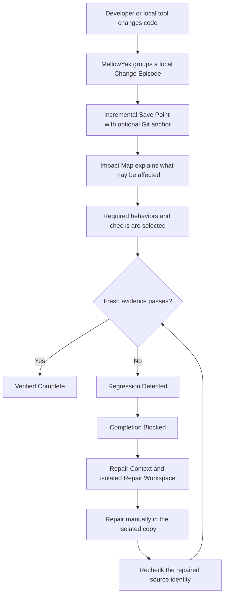
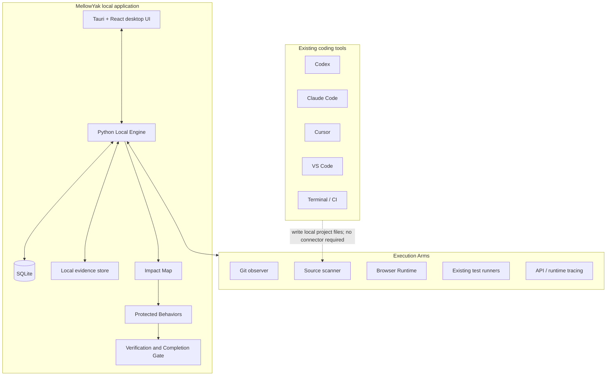

> [!CAUTION]
> **NON-NEGOTIABLE UI LOCALIZATION RULE:** No user-facing UI text may be hardcoded anywhere in MellowYak. Every label, message, title, placeholder, accessible name, and mascot description must be rendered from a translation key. English and Hebrew catalogs must stay complete, Arabic & Hebrew UI must render right-to-left. Run `python3 scripts/check_ui_translation_keys.py` before every commit.

<div align="center">

# MellowYak

### Protect what already works.

**A local-first behavior and regression guard for AI-assisted software changes.**

[](#project-status)
[](#privacy-by-design)
[](#local-first-architecture)
[](#installation)

</div>

> [!IMPORTANT]
> MellowYak is in active development. This README defines the product contract and intended full workflow. It does **not** claim that every capability described below is already implemented or production-ready. Current implementation status must be verified through the project roadmap and validation reports.

---

## What is MellowYak?

MellowYak is a local application that runs quietly beside tools such as Codex, Claude Code, Cursor, VS Code, terminal-based agents, and existing CI systems.

Its job is not to write code.

Its job is to help answer a harder question:

> **When an AI changes the code, what existing behavior might also be affected—and what must be rechecked before the work is called done?**

MellowYak observes an exact code change, connects that change to relevant source, runtime areas, tests, and protected behaviors, runs or requests the smallest defensible set of checks, and keeps completion blocked when required evidence is missing or failing.

When a regression is found, MellowYak prepares focused repair context for any coding agent:

- what the new change must **keep**;
- what existing behavior must be **restored**;
- what changed;
- why the failed behavior is related;
- which files and evidence matter;
- which checks must pass after the repair.

The repaired revision is then verified again.

---

## The problem

AI coding agents can produce requested changes quickly, but “the requested area works” is not the same as “the change is safe to finish.”

A normal AI-assisted workflow can fail in several expensive ways:

- the agent fixes one area and breaks another;
- the model says `Done` after checking only the requested screen;
- every new session rediscovers the same repository;
- large repository scans consume time, context, and provider tokens;
- teams rerun far more tests than necessary—or miss the relevant ones;
- a regression is discovered later, after review, merge, deployment, or customer use;
- the next model receives “a test failed” and must rediscover the cause;
- screenshots, traces, previous good behavior, and repair evidence are scattered;
- private source and evidence are uploaded to external systems by default.

MellowYak is designed to reduce that waste without replacing the developer’s coding agent, test framework, Git workflow, or CI platform.

---

## The core product loop



The simple customer story is:

```text
AI changed one thing.
MellowYak found what else might be affected.
It checked only what now needed fresh proof.
One existing behavior failed.
MellowYak blocked completion.
It prepared focused local repair context.
The repaired source identity passed.
```

---

## What MellowYak solves

### 1. False “Done”

A coding agent may complete the requested edit while an existing behavior elsewhere is broken.

MellowYak separates:

- **requested work succeeded**
- **existing affected behavior still works**
- **completion is supportable**

A successful requested feature is not enough when a required protected behavior fails.

### 2. Repository rediscovery

Instead of beginning every task with a broad scan, MellowYak builds focused context from the project map, current change, protected behaviors, relevant evidence, and known constraints.

Broad discovery remains available as a fallback, but it is not the default.

### 3. Verification overload

MellowYak does not assume that every change requires every check.

It identifies:

- checks required by direct impact;
- checks required by transitive impact;
- checks required by criticality or policy;
- checks that can be skipped for this revision;
- areas that remain unknown or unsupported.

### 4. Slow regression diagnosis

When something fails, MellowYak preserves:

- the exact base and current Git revisions;
- last-known-good evidence;
- current failing evidence;
- the change diff;
- the explainable impact path;
- related files, APIs, tests, and runtime areas;
- the requested feature that must not be rolled back.

### 5. Privacy and source control

MellowYak is designed to keep source, project data, evidence, and history on the user’s machine.

No mandatory MellowYak account or cloud service is required for the local core.

---

## Full product capabilities

### Local application

MellowYak is designed as one installable desktop product:

- macOS application and `.dmg`;
- Windows installer `.exe`;
- Linux AppImage and `.deb`.

The user should not need to install or configure Python, Node.js, SQLite, Docker, Apache, Nginx, MariaDB, or an APC server.

### Passive-first monitoring

MellowYak does not require the developer to create a task or session before every edit.

The normal workflow is:

1. install MellowYak;
2. add a repository;
3. connect the coding tools and execution adapters you use;
4. work normally;
5. open MellowYak when a change needs explanation, verification, repair, or review.

Change Sessions are created automatically from Git and connector activity.

### Project readiness

When a repository is added, MellowYak detects what it can verify:

- Git repository, branch, and current HEAD;
- dirty working state;
- languages and frameworks;
- files, symbols, imports, routes, selectors, and shared components;
- tests and test frameworks;
- available runtime environments;
- available browser execution;
- connected coding tools;
- known and unknown coverage.

MellowYak must show honest states such as:

- `Ready`
- `Ready with limits`
- `Unknown`
- `Runtime unavailable`
- `Index stale`
- `Verification blocked`

It must never turn missing knowledge into a green result.

### Focused context

MellowYak can prepare a compact Context Receipt for a coding agent:

- relevant files;
- relevant symbols;
- related protected behaviors;
- previous evidence;
- known constraints;
- unresolved unknowns;
- exact context bytes;
- provider usage when genuinely available.

It does not claim token savings without comparable provider-measured evidence.

### Impact Map

The Impact Map is the technical core of MellowYak.

It connects relationships such as:

```text
changed file
→ symbol or shared component
→ route, API, runtime area, or test
→ protected behavior
→ required fresh evidence
```

Relationships carry provenance and must be distinguishable as:

- observed at runtime;
- derived from source structure;
- framework-derived;
- historical;
- manually approved;
- inferred;
- unknown;
- stale.

The map explains **why** a behavior or check was selected. It is not allowed to pretend that the complete blast radius is known.

### Protected Behaviors

Protected Behaviors describe what must remain true in human language.

Example:

```text
Behavior:
Rescheduling a meeting to 14:00 saves 14:00.

Criticality:
High

Last known good:
Git revision 19f2ab

Verification:
Browser flow + API assertion
```

A behavior may include:

- expected result;
- criticality;
- source and runtime relationships;
- verification method;
- environment and persona;
- last-known-good revision;
- screenshots, traces, API responses, and test results;
- limitations and unsupported scope;
- version history and lineage.

### Record Behavior

For supported applications, the user can record a working flow:

```text
Record Behavior
→ perform the action normally
→ stop and review
→ confirm the expected result
→ protect the behavior
```

The capture engine may collect, when available and explicitly enabled:

- browser actions;
- URLs and runtime state;
- relevant DOM elements;
- network/API requests;
- screenshots before and after;
- Playwright traces or video;
- source/runtime relationships;
- instrumented runtime functions and services;
- assertions proposed for human review.

Recording is evidence capture—not automatic truth. The user approves what the behavior means.

### Exact change observation

Each Change Session is bound to a source identity such as:

```text
project
snapshot manifest digest
Episode and parent/current Save Point
optional Git branch, HEAD, and worktree fingerprint
Runtime Profile versions used by evidence
```

A settled Episode or relevant Git state creates a new evaluation. Git is optional. Old evidence and
profile/probe versions are preserved rather than silently rewritten.

### Selective verification

For each change, MellowYak produces a protection plan:

```text
27 protected behaviors
4 require fresh proof
23 are not required for this change
```

Checks may come from:

- existing unit, integration, API, or end-to-end tests;
- approved browser behaviors;
- deterministic runtime assertions;
- policy-required critical flows;
- manually approved checks.

MellowYak selects and explains checks. It does not replace mature test frameworks.

### Completion Gate

A change may move through states such as:

```text
WORKING
IMPACT FOUND
RECHECK REQUIRED
VERIFYING
REGRESSION DETECTED
REPAIRING
VERIFIED COMPLETE
```

`VERIFIED COMPLETE` means the current revision passed the required checks under the current known scope.

It does **not** mean:

- zero regressions are possible;
- the complete blast radius is known;
- unsupported areas were verified;
- future changes inherit the pass.

### Regression and Repair

When a required behavior fails, MellowYak displays:

```text
LAST KNOWN GOOD
selected 14:00
saved 14:00

CURRENT
selected 14:00
saved 15:00
```

It then creates a model-neutral Repair Context:

```text
KEEP
Timezone labels on meeting cards.

RESTORE
Rescheduling to 14:00 must save 14:00.

LIKELY RELATION
Shared time conversion affects display and serialization.

RELEVANT
formatEventTime.ts
EventCard.tsx
RescheduleModal.tsx
reschedule.spec.ts

RECHECK AFTER FIX
4 required behaviors
```

Repair Context may be copied explicitly. Phase 7 can also create a local isolated Repair Workspace;
it has no coding-agent connector and never applies changes to the live project.

### Evidence

MellowYak keeps revision-bound evidence such as:

- Git diffs and file hashes;
- screenshots;
- browser traces and videos;
- API responses;
- test outputs;
- runtime observations;
- behavior results;
- last-known-good records;
- regression and repair history.

Evidence remains tied to the revision, environment, persona, runner, and verification method that produced it.

### Value and economic receipt

MellowYak makes avoided work visible without inventing savings.

Possible metrics include:

- repository files indexed;
- files supplied to the coding agent;
- files actually opened;
- broad searches performed or avoided;
- exact source bytes read;
- context bytes supplied;
- provider input/output/cached tokens when measured;
- required checks;
- checks skipped;
- full-suite versus selected verification runtime;
- regressions caught before completion;
- repair attempts;
- repair-context size;
- elapsed time to relevant source and repair.

Every value is labeled as one of:

- `MEASURED`
- `USER CONFIGURED`
- `ESTIMATED`
- `UNAVAILABLE`

MellowYak does not publish a token-saving percentage or regression-prevention percentage without reproducible comparable evidence.

### Future connectors (not implemented)

Phase 7 contains no Codex, Claude Code, Cursor, VS Code, MCP, CLI-agent, CI, or provider connector.
MellowYak observes local outcomes and remains prompt-blind. The items below are product-direction ideas,
not current capabilities.

Connectors connect MellowYak to where work happens.

Planned connector types include:

- MCP;
- CLI;
- Codex;
- Claude Code;
- Cursor;
- VS Code;
- browser-based model interfaces;
- manual clipboard;
- CI and Git provider integrations.

A connector may:

- report work intent;
- request focused context;
- query the Impact Map;
- receive repair context;
- submit a structured result;
- report provider usage when available.

Connectors do not become the product’s source of truth for correctness.

### Execution Arms

Execution Arms are different from Connectors.

Connectors communicate with coding tools. Execution Arms observe or verify the project itself.

Examples:

- Git observer;
- source scanner;
- Browser Runtime;
- existing test runners;
- API/runtime tracing;
- local process adapters;
- future mobile, desktop, or service-specific runners.

This separation keeps MellowYak model-neutral and allows non-browser projects to use the same core workflow.

---

## How it works day to day

```text
1. Install MellowYak.
2. Add a local project folder; Git is optional.
3. Confirm its Runtime Profiles and create the initial incremental Save Point.
4. Work normally in any editor or local coding tool; no integration is required.
5. MellowYak groups settled local writes into an Episode and reuses unchanged snapshot content.
6. Impact Map selects bounded relevant behaviors and Probes.
7. A file change alone remains a WATCH signal, never a regression claim.
8. If required comparable evidence passes, the current source identity can support completion.
9. If a previously accepted PASS fails reproducibly, MellowYak can record a confirmed regression.
10. MellowYak prepares focused Repair Context and an optional isolated Repair Workspace.
11. Repair remains manual and outside the live project in Phase 7.
12. Evidence and history remain local.
```

---

## Local-first architecture

The target desktop architecture is:



### Target implementation stack

- **Desktop shell:** Tauri 2
- **UI:** React, TypeScript, Vite
- **Local engine:** Python
- **Local API:** FastAPI
- **Data models:** Pydantic
- **Database:** SQLite with SQLAlchemy and Alembic
- **Evidence:** local filesystem with content hashes and SQLite metadata
- **Source memory:** local SHA-256 object/manifests store with SQLite references
- **Realtime UI:** local events/WebSocket or Tauri event bridge
- **Browser execution:** Playwright-based local worker
- **Runtime/verification:** versioned Runtime Profiles and Browser/API/CLI/Process/Test/Manual Probes

The packaged application should include its runtime dependencies. End users should install one application—not a development stack.

---

## Privacy by design

The local-core design contract is:

```text
Source code          LOCAL
Git history          LOCAL
Project map          LOCAL
Protected behaviors  LOCAL
Database             LOCAL
Screenshots/traces   LOCAL
Evidence              LOCAL
Regression history   LOCAL
MellowYak Cloud      NOT REQUIRED
Mandatory account    NO
```

MellowYak itself must not upload project data to MellowYak-operated servers.

Phase 7 contains no coding-agent connector, prompt/history reader, provider-token access, source upload,
evidence upload, or cloud synchronization path. Explicit local clipboard/file/open actions remain under
the user's control.

Privacy claims are considered verified only after automated tests and package-level inspection prove the implemented behavior.

---

## Product interface

The complete product is organized around a passive monitoring workflow rather than manual task administration.

| Screen | Purpose |
|---|---|
| Welcome | Choose local use and understand the privacy model |
| First Setup | Verify the Local Engine, SQLite database, storage paths, and local-only mode |
| Add Project / Runtime Wizard | Select a local folder, confirm project type and multiple runtimes, choose privacy/retention, and create the first Save Point; Git is optional |
| Project Readiness | Show indexed capabilities, unknowns, limits, and missing execution support |
| Home / Command Center | Monitor current activity, regressions requiring attention, and measured value |
| Projects | View and manage monitored repositories |
| Project Overview | See project health, current activity, readiness, protected behaviors, and recent value |
| Change Cockpit | Follow one exact change from work through impact, verification, regression, repair, and completion |
| Impact Map | Explore explainable source/runtime/behavior relationships |
| Protected Behaviors | Define and review what must continue to work |
| Runtime | Detect, configure, version, validate, and observe primary/secondary Runtime Profiles |
| Memory / Save Points | Review Episodes, deduplicated snapshots, milestones, retention, and isolated materialization |
| Verification | Review selected checks, skipped checks, progress, policy, and results |
| Regression & Repair | Compare last-known-good with current failure and create repair context |
| Evidence | Browse revision-bound screenshots, traces, API responses, tests, and history |
| Value | Review measured work avoided and clearly labeled estimates |
| Settings | Configure passive/observe/strict modes, local storage, privacy, policies, and execution adapters |

The primary screen during active work is the **Change Cockpit**. The developer should not need to move through many unrelated dashboards to understand one change.

---

## Who MellowYak is for

### Solo developers

MellowYak can reduce repeated repository discovery, unnecessary context, broad searches, and the time spent reconstructing why something broke.

### Independent developers and startups

It provides a repeatable way to protect a small set of critical flows while using fast-moving AI coding tools.

### Agencies

It can keep evidence, behavior history, and impact boundaries separated by client project while reducing repeated verification and diagnosis.

### Product teams

It can provide explainable change impact, selected verification, shared protected behaviors, evidence, and CI status tied to exact revisions.

### Larger organizations

A future optional team or enterprise layer may add shared policy, RBAC, audit, hosted or private runners, retention, Git checks, and organization analytics while keeping full source and sensitive evidence customer-controlled by default.

---

## What MellowYak is not

MellowYak is not:

- another code-writing model;
- a replacement for Codex, Claude Code, Cursor, Copilot, or IDE agents;
- an issue tracker or project-management system;
- a replacement for Git or CI;
- a guarantee of zero regressions;
- a claim of complete blast-radius analysis;
- a universal test generator;
- a cloud service that requires source upload;
- a reason to trust an AI agent’s `Done` message without evidence.

The intended principle is:

> **Unknown remains unknown. Missing evidence remains missing. A failed required behavior remains blocked.**

---

## Project status

MellowYak `0.5.0-preview.3` is the active Phase 16M Intel macOS physical-acceptance candidate. It
preserves the Phase 15M product lock, adds opt-in synthetic tray-menu and native-notification labs
for physical menu-bar and banner evidence, completes the missing English/Hebrew alert translations, and renders `HIGH`
tray alerts distinctly instead of falling back to `INFO`. The lab is disabled by default, contains
no project/source data. Tray-menu mode requires `MELLOWYAK_ACCEPTANCE_LAB=tray-notifications` plus
`MELLOWYAK_TRAY_LAB_STATE`; native banners require `MELLOWYAK_ACCEPTANCE_LAB=native-notifications`
plus `MELLOWYAK_NOTIFICATION_LAB_STATE`. Physical acceptance and trusted public distribution remain
blocked until their documented gates pass.

MellowYak `0.5.0-preview.1` was the Phase 15M Intel macOS product-lock source. It adds immutable
Known-Good lineage, an explicit Expected Change decision/reverification/promotion contract, truthful
event-driven repair language, and immutable local Yak Receipts. The final ad-hoc-signed Intel app and
DMG pass source, migration, package, updater, and automated native-lifecycle validation. Physical
human acceptance of tray/notification clicks, login, lock, sleep, Finder drag/alias, and disruptive OS
transitions remains pending because no operator was present and Screen Recording permission was not
available. Developer ID signing and notarization are not configured, so this is a controlled local
technical preview—not a trusted public Mac release. Exact results and the English operator guide are
in [`docs/phase-15m-delivery/PHASE_15M_MASTER_REPORT.md`](docs/phase-15m-delivery/PHASE_15M_MASTER_REPORT.md)
and [`docs/phase-15m-delivery/PHASE_15M_OPERATOR_MANUAL.md`](docs/phase-15m-delivery/PHASE_15M_OPERATOR_MANUAL.md).

The complete workflow described in this README is the product direction. Implementation must advance through verified stages.

### Phase 1 — Local core foundation

- implemented Tauri/React desktop shell;
- implemented managed PyInstaller Python sidecar;
- tested loopback-only, dynamic-port, per-launch authenticated communication;
- migrated local SQLite database with persistent installation identity;
- platform-native local storage paths;
- First Setup UI backed by live engine values;
- macOS build evidence plus Windows/Linux packaging workflows;
- privacy, security, architecture and APC migration documentation.

Phase 1 remains the security and storage boundary. Phase 2 extends it without adding a cloud service, account requirement, source upload, recorder, behavior verification, completion gate, or connector execution.

### Phase 2 — Projects and Git

- implemented native-folder Add Project and restart-persistent project list;
- implemented read-only Git repository, branch, HEAD, staged, unstaged and untracked observation;
- implemented passive debounced file/Git observation with pause/resume and polling fallback;
- implemented bounded local source inventory with ignore, artifact, binary, sensitive, oversized and escaping-symlink boundaries;
- implemented deterministic Python AST and conservative JavaScript/TypeScript/TSX/PHP relationship adapters;
- implemented scan progress/cancellation, findings, provenance, staleness, unknown/unsupported counts, relationship search and honest readiness;
- implemented SQLite migration `0002_project_git_impact` without storing source contents;
- configured macOS and Windows artifacts to build from the exact same Git commit in `.github/workflows/desktop-build.yml`.

Phase 2 does **not** claim complete blast-radius knowledge or regression protection. It establishes the local evidence graph on which later Protected Behaviors and verification gates can operate.

### Phase 3 — Impact expansion and context

- implemented stable committed `base → HEAD` and dirty `HEAD + worktree fingerprint` Change identity;
- implemented deterministic `reverse-impact-v1` traversal over known static project relationships;
- implemented separate parsed and heuristic treatment, bounded depth/results/paths, and visible truncation reasons;
- implemented revision-bound explainable paths plus terminal unknown and stale boundaries;
- implemented optional deterministic task-intent ranking without embeddings or model calls;
- implemented `mellowyak.context_receipt.v1` with explicit budgets, per-item reasons, exclusions, zero source bytes, and no upload;
- implemented Change Detail and Impact Explorer desktop views;
- implemented translation-key-only product copy with complete English and Hebrew dictionaries and document-level RTL in Hebrew;
- implemented asynchronous sidecar startup so a slow packaged-engine handshake reports a UI state instead of crashing the macOS application;
- implemented one authoritative startup pipeline tied to real health, local storage/database, readiness/privacy capability, project-discovery and final-readiness events; its eight-frame MellowYak animation never reports ready before an empty or populated project list is renderable;
- implemented non-verified Behavior Candidates derived from impacted tests;
- implemented SQLite migration `0003_reverse_impact_context` while preserving prior project data;
- reviewed selected APC Project MAP and source-map-first concepts read-only, with clean rewrites and documented provenance.

Phase 3 does **not** implement Protected Behaviors, runtime capture, automatic or selective test execution, PASS/FAIL results, Last Known Good evidence, Completion Gate, Regression Detected, Repair Context, connectors, token savings, accounts, cloud sync, signing, or release publishing.

### Phase 4 — Behaviors and evidence

- implemented immutable behavior versions with explicit criticality, provenance, limitations and Draft/Protected/Archived lifecycle;
- implemented candidate-to-Draft preparation without creating a baseline or protection claim;
- implemented project-scoped loopback-only runtime settings and an ephemeral Playwright Chromium execution arm;
- implemented bounded, redacted actions, local network metadata, start/final screenshots, pause/resume, review and expected-assertion definitions;
- implemented atomic content-addressed evidence, deterministic manifests, SHA-256 integrity, human attestation, revocation and Last Known Good lineage;
- implemented Protected Behaviors, capture review, evidence timeline and behavior-aware Impact Explorer surfaces in English and Hebrew RTL;
- added migration `0004_behavior_evidence_browser` and a deterministic local PulsePlan reschedule fixture.

Phase 4 does **not** run stored assertions as verification, replay captures authoritatively, select checks, label behaviors PASS/FAIL, decide regressions, block completion, or generate repair context.

### Phase 5 — Verification, gate, and repair

- implemented source-bound REQUIRED/SUGGESTED/SKIPPED/NEEDS_REVIEW/UNKNOWN selection with explainable paths and bounded policy;
- implemented selective replay of accepted browser behaviors in a fresh ephemeral loopback-only context;
- implemented URL, DOM, attribute, API-call and HTTP-status assertions plus explicit human attestation;
- implemented separate current verification evidence without mutating Last Known Good;
- implemented evidence-supported regression decisions and an immutable local Completion Gate;
- implemented deterministic `mellowyak.repair_context.v1` with KEEP, RESTORE, relative references, local copy/save and no source contents;
- implemented source-change invalidation, re-verification, regression resolution and preserved failure history;
- package-verified the complete seeded PulsePlan regression and repair loop on Intel macOS.

Phase 5 does **not** provide complete blast-radius knowledge, zero-regression guarantees, automatic code repair, automatic baseline replacement, Codex/Claude/Cursor/VS Code integration, provider token or financial savings, cloud/team operation, signing, notarization, public release, or safe-deployment certification.

### Phase 6 — Desktop productization, tray, alerts, and project lifecycle

- implemented a global desktop shell with Command Center, Projects, Alerts, and Settings;
- implemented project search/filter/action menus, notification mute, disconnect/reconnect, relocation, and source-safe local-data deletion;
- implemented durable deduplicated local alerts, unread/read/resolved lifecycle, direct local routes, and real verification/regression/gate event production;
- implemented persistent native-notification preferences and Quiet Mode with one-hour, until-tomorrow, until-off, and critical-override behavior;
- implemented a translated macOS/Windows tray/menu foundation, single-instance handling, close-to-background monitoring, explicit Quit, and Start at Login;
- implemented truthful per-project capability modes for source-only and source-plus-runtime projects;
- added migration `0006_desktop_productization` while preserving migrations `0001` through `0005`;
- preserved the non-negotiable translation-key-only rule across English and Hebrew RTL desktop surfaces and translated native tray resources;
- added a synthetic-data Phase 6 screenshot/PDF handoff under `docs/phase-6-desktop-productization-2026-08-24/`.

Phase 6 does **not** add accounts, cloud sync, source or evidence upload, automatic repair, MCP/CLI connectors, external CI merge enforcement, signing, notarization, or a public release. Native-notification click routing remains platform-limited until a verified plugin callback is available; the persistent in-app alert always carries the exact destination.

### Phase 7 — Runtime Profiles, Snapshot Memory, and Universal Probes

- implemented an eight-step first-time/local-project Runtime Wizard and later setup for existing projects;
- implemented several versioned primary/secondary Runtime Profiles with Python, Node, PHP, generic,
  and bounded metadata detection through one fail-open adapter contract;
- made Git optional through snapshot-backed Source Identity v2 while retaining existing Git evidence;
- implemented coalesced Episodes and deterministic incremental local SHA-256 Save Points that reuse
  unchanged objects and materialize only outside the live project;
- implemented explicit pinned known-good milestones that require Probe PASS or human attestation;
- implemented versioned Browser, API, CLI, Process, Test, and Manual Probes that feed the existing
  Protection Plan and regression engine;
- implemented deterministic `WATCH`, `SUSPECTED`, `HIGH`, and `CONFIRMED` evidence states;
- implemented isolated local Repair Workspace creation/open/delete with no automatic apply;
- added Runtime and Memory project screens, actionable Ready-with-limits details, and complete
  translation-key-only English/Hebrew RTL copy;
- added migration `0007_runtime_snapshot_probe_foundation` while preserving `0001`–`0006`.

Phase 7 does **not** add Codex/Claude/Cursor/VS Code/MCP integration, prompt/provider-token access,
cloud upload, automatic repair/apply, live-project overwrite, production deployment, autonomous
rollback, process-memory checkpointing, accounts, billing, signing, notarization, or public release.

Phase 7 user and technical documentation is indexed in
[`docs/phase-7-delivery/README.md`](docs/phase-7-delivery/README.md),
[`docs/product/RUNTIME_PROFILE_GUIDE.md`](docs/product/RUNTIME_PROFILE_GUIDE.md),
[`docs/product/SAVE_POINTS_AND_KNOWN_GOOD.md`](docs/product/SAVE_POINTS_AND_KNOWN_GOOD.md), and
[`docs/product/PROBE_TYPES.md`](docs/product/PROBE_TYPES.md).

### Phase 8 — Validated Repair, Safe Apply, Rollback, and Demo Lab

- isolated Repair Workspaces now detect bounded candidate ADD/MODIFY/DELETE/RENAME/MODE_CHANGE metadata without storing source bytes in SQLite;
- deterministic candidate validation runs the original failed Probe first and requires every required workspace check to pass for the exact candidate identity;
- analysis, validation, Apply preparation, live commit, and rollback remain separate capabilities;
- every live Apply requires explicit deliberate confirmation and a short-lived one-time transaction/project/candidate/source-bound nonce;
- a fresh pinned pre-Apply Safety Snapshot and durable fsynced journal precede live writes;
- every affected path uses safe path resolution and hash preconditions; stale live source blocks Apply before any write;
- fresh live verification follows Apply and never reuses workspace PASS evidence;
- failed post-Apply verification restores only transaction-affected paths from the Safety Snapshot and verifies byte identity;
- unresolved recovery stops writes and produces a redacted local Recovery Bundle;
- the optional Portable Repair Package contains explicitly selected local context, no absolute paths, and no upload;
- the offline synthetic Demo Lab and disposable Product Self-Test exercise the complete loop without a private project;
- migration `0008_validated_repair_apply` preserves migrations `0001`–`0007`;
- every new visible surface is translation-key-only in English and Hebrew RTL.

Phase 8 does **not** generate repairs, call models, read prompt/provider state, automatically Apply,
merge stale source, restore arbitrary history, replace an accepted Known-Good milestone, commit or push
Git changes, deploy, upload source/evidence, provide cloud backup, or claim universal cross-platform
filesystem atomicity. Local packages remain unsigned and unnotarized.

Phase 8 documentation and synthetic screenshots are indexed in
[`docs/phase-8-delivery/README.md`](docs/phase-8-delivery/README.md).

### Phase 9 — Technical Preview readiness

- implemented persisted first run with replay and upgrade-safe skip for existing installations;
- implemented disconnected-project visibility and identity-checked reconnect/relocate without moving source;
- implemented privacy-safe dynamic native tray state, single-instance focus, close-to-tray, and explicit Quit;
- implemented allowlisted notification activation routes with in-app fallback and safe rejection of forged/stale routes;
- implemented local diagnostics, storage integrity, bounded diagnostic copy data, and redacted support bundles;
- implemented a disposable loopback signed-updater validator covering valid, tampered, wrong-key, lower/no-update, and interrupted content;
- implemented clean-install, Phase 8 upgrade, package acceptance, artifact inventory, and current-platform lifecycle evidence;
- implemented Active/Balanced/Battery Saver behavior without weakening identity, recovery, integrity, verification, or Apply safeguards;
- configured native macOS Intel/Apple Silicon, Windows x64, and Linux x64 build jobs with honest per-platform status;
- added migration `0009_technical_preview_readiness` while preserving migrations `0001`–`0008` and existing installation identity/data;
- retained translation-key-only English/Hebrew UI with complete Hebrew RTL, reduced motion, focus, and zoom/reflow behavior.

Phase 9 does **not** add cloud sync, accounts, analytics upload, model/provider SDKs, prompt/history
access, automatic repair or Apply, Git push, deployment, APC runtime dependency, public release, or a
real-project acceptance claim. The Intel macOS package is locally verified but unsigned and
unnotarized. Apple Silicon, Windows, Linux, production updater delivery, and physical native
notification-click behavior remain explicitly unverified.

Phase 9 implementation, exact evidence, screenshots/PDF, package inventory, platform/signing matrix,
security review, troubleshooting, and operator acceptance guidance are indexed in
[`docs/phase-9-delivery/README.md`](docs/phase-9-delivery/README.md).

### Phase 10 — Product Truth and daily workflow

- implemented bounded read-only aggregates for Home, Project Overview, Activity/Episode Detail,
  Regression Detail, and Diagnostics over existing Phase 1–9 records;
- replaced acceptance-only hero states with operational status, known facts, limitations, next actions,
  and progressive technical disclosure;
- made First Run an accessible persisted single-choice flow with real background preferences;
- presented checks, behaviors, confirmed regression evidence, Repair Workspace, candidate validation,
  deliberate Apply, rollback, disconnected projects, support, updater, and activity modes as one
  coherent product path;
- retained translation-key-only English and Hebrew catalogs with full RTL and LTR technical tokens;
- retained schema `0009_technical_preview_readiness`; no Phase 10 migration or dependency/license
  change was required;
- package-verified Phase 8, Phase 9, and Phase 10 flows on Intel macOS, installed the matching app,
  and verified isolated native lifecycle with zero orphans;
- added 36 deterministic synthetic screenshots plus Markdown, HTML, PDF, operator, security, package,
  limitation, and Phase 11 readiness handoff documents;
- pinned same-source macOS/Windows/Linux toolchains and build/validation wrappers without claiming an
  unexecuted platform as working.

Phase 10 does **not** add model/provider integration, prompt access, cloud/source upload, analytics,
accounts, automatic repair, automatic Apply, Git push, deployment, signing, notarization, public
release, APC runtime coupling, or real-project acceptance. Intel macOS x86_64 is locally verified;
Apple Silicon, Windows, Linux, production updater delivery, and physical notification-click behavior
remain explicitly unverified.

Phase 10 implementation, exact results, screenshots/PDF, package inventory, UX/security review,
operator walkthrough, limitations, and readiness checklist are indexed in
[`docs/phase-10-delivery/README.md`](docs/phase-10-delivery/README.md).

### Phase 11M — Intel macOS native hardening

- replaced the Intel macOS PyInstaller one-file engine with a private one-directory app resource;
  Windows and Linux retain their existing sidecar packaging;
- reduced measured packaged-engine median handshake time on the acceptance Mac from 19.07 seconds to
  2.02 seconds while retaining the 19.87-second first cold-cache observation as an explicit maximum;
- added structured startup events and supervised recovery for up to three unexpected engine exits;
  explicit Quit terminates the child and prevents restart;
- made macOS notification activation focus the existing window and open the exact engine-validated
  local route only after a default notification action;
- removed the First Run controlled/uncontrolled React warning and added a regression assertion;
- split the 591.08 kB production JavaScript chunk into measured vendor, translation, operational and
  acceptance chunks; the largest output is now 199.18 kB (49.50 kB gzip);
- added disposable case-sensitive APFS, native lifecycle, two-version updater, signing-readiness and
  Intel macOS CI acceptance tooling;
- retained schema `0009_technical_preview_readiness`, version `0.2.0-preview.1`, local-only data,
  translation-key-only English/Hebrew RTL, explicit Apply and no automatic repair.

Phase 11M does **not** claim Apple Silicon, Windows or Linux runtime acceptance; no public release,
push, production updater, Developer ID signing, notarization, private project, cloud/source upload,
model/provider integration, automatic repair or automatic Apply is performed. Physical Notification
Center clicks, a real login-session restart, sleep/wake and lock/unlock remain manual native gates.

The complete implementation, exact local evidence, screenshots and limitations are indexed in
[`docs/phase-11m-macos-delivery/README.md`](docs/phase-11m-macos-delivery/README.md).

### Phase 13M — Passive Sentinel and bounded automatic rechecks

- connects the existing watcher, settled Episodes, immutable snapshots, Impact selection, approved
  Probe versions, accepted Known Good milestones, and Regression Findings through one authoritative
  local orchestration path;
- adds immutable global, project, and behavior policy revisions with conservative ask-first defaults;
- adds a persistent SQLite queue with per-project serialization, bounded global concurrency,
  source-identity deduplication, stale-job protection, deferred work, cancellation, and restart
  recovery for safe idempotent jobs only;
- enforces persisted global/project daily runtime budgets with restart-safe accounting and explicit
  `DAILY_RUNTIME_BUDGET_EXHAUSTED` deferral;
- enforces validated IANA-timezone allowed-hours schedules, including overnight and DST boundaries,
  with explicit `OUTSIDE_ALLOWED_HOURS` deferral and next-eligible timestamps;
- makes Run Now a bounded, source-bound, durable audited override for one current safe deferred job
  rather than a release of the whole queue;
- classifies retry evidence as pass, confirmed, flaky, inconclusive, cancelled, or needs review and
  keeps confirmed incidents deduplicated by stable behavior/baseline/source/category identity;
- records evidence-backed Impact Memory relations with provenance and explicit limitations;
- expands the synthetic loopback-only RideFlow reference project to four behaviors: nearest-ride
  selection, driver availability, ride cancellation, and deterministic fare preview;
- adds operational monitoring settings plus translation-key-only English/Hebrew RTL product-truth
  surfaces for policies, queue state, recovery, fan-out, flakiness, and background results;
- adds migration `0010_passive_sentinel_orchestration` while preserving migrations `0001`–`0009`;
- passes 198 Python tests, 28 React tests, the migration matrix, package validators Phase 8–13M,
  updater transaction, native lifecycle, Acceptance Lab, and case-sensitive filesystem safety on
  Intel macOS; Developer ID signing, notarization, public updater publication, and physical OS
  interaction boundaries remain explicitly unverified.

Phase 13M does **not** add automatic repair or Apply, model/provider access, cloud/source upload,
external analytics, Git push, deployment, public releases, or APC coupling. It remains Git-optional,
local-first, fail-open for ordinary source editing, and bound to exact source identities. See the
single consolidated delivery document in
[`docs/phase-13m-delivery/PHASE_13M_MASTER_REPORT.md`](docs/phase-13m-delivery/PHASE_13M_MASTER_REPORT.md).

### Phase 14M — Real-world public-project compatibility

- verifies the Phase 13M closure before branching from its annotated local tag;
- exercises disposable, immutable copies of Datasette, Excalidraw, Vite, and Tauri with exact
  upstream commits and recorded licenses, without committing any upstream source;
- adds a typed, installation-specific compatibility model whose eight states never turn partial
  understanding into a universal support claim;
- discovers bounded nested Python and Node package roots, runtime ownership, package managers,
  frameworks, tests, entry points, expected loopback ports, and approval-required executable-plus-
  argv command definitions without running detected project scripts automatically;
- classifies files as source, test, dependency manifest, dependency lock, generated, build output,
  cache, sensitive, unsupported, or ignored while keeping sensitive contents out of evidence;
- validates Git-less, monorepo, large-project, generated-file, lockfile, large-fan-out, symlink,
  watcher-gap, stale-work, retry/flakiness, budget, allowed-hours, repair, explicit Apply, and byte-
  identical rollback boundaries through the production loopback API;
- keeps all GUI copy translation-key-only with exact English/Hebrew catalog parity, Hebrew RTL, and
  a future-locale-ready catalog architecture;
- keeps the database at `0010_passive_sentinel_orchestration`; no schema change is required.

Phase 14M does **not** claim universal framework support, root cause, complete behavior coverage,
Windows/Linux/Apple Silicon runtime acceptance, physical macOS interaction acceptance, Developer ID
signing, notarization, Gatekeeper public distribution, production updater publication, cloud/source
upload, private-project acceptance, automatic repair generation, or automatic Apply. Those boundaries
remain explicit in the Phase 14M master report and user manual.

### Phase 15M — Intel Mac product lock

- makes an accepted Known Good immutable and preserves superseded versions as lineage roots/entries;
- requires an operator reason, exact source/runtime-bound reverify, comparable PASS, fresh source
  check, comparison, and single-use short-lived confirmation before promotion;
- prevents direct acceptance from silently replacing an existing Known Good;
- presents verified repair, live recheck, success, and byte-identical rollback as event-driven truth;
- creates one immutable, project/Episode/source-bound Yak Receipt with checked, passed, confirmed,
  deferred, runtime-unavailable, omitted, unknown, and source-modified facts;
- adds migration `0011_baseline_lock_and_local_proof` and preserves all historical migrations/data;
- keeps all visible GUI copy in exact English/Hebrew translation-key parity with Hebrew RTL;
- builds and installs the Intel `0.5.0-preview.1` app and DMG with local ad-hoc signatures;
- passes 210 Python tests, 29 React tests, deterministic OpenAPI, migrations, Phase 8–15 package
  validators, updater E2E, and automated installed-app lifecycle checks;
- defers Protection Map Lite and the Five-Minute Teach Flow to avoid feature creep.

Phase 15M does **not** claim physical human macOS acceptance, trusted public distribution,
Developer ID signing, notarization, universal framework support, complete behavior coverage, root
cause, automatic repair generation, automatic Apply, Windows/Linux/Apple Silicon readiness, or a
production updater channel. See the Phase 15M master report for the exact blocked physical matrix.

---

## Built from APC—without carrying the monolith

MellowYak is a new product, not a visual rename of APC.

It is being extracted from selected APC technology and lessons, including:

- Local Bridge execution and connector concepts;
- Browser Runtime and Playwright foundations;
- Project MAP source signatures and source/runtime relationships;
- source-map-first discovery rules;
- Completion/Result Capsule scope, proof, and idempotency concepts;
- Verified history, evidence, hashes, and lineage;
- local execution, telemetry, and connector adapters.

The new product does **not** inherit APC wholesale.

The migration intentionally leaves behind or rewrites:

- the PHP/MariaDB remote control plane as a desktop requirement;
- mandatory Docker topology;
- unsafe or legacy routes;
- generic health-only “engine” containers;
- legacy task and UI islands;
- unverified cognitive-delivery claims;
- unproven token-saving claims;
- server-era credential and tenant boundaries that do not belong in the local core.

Every reused APC component must be classified, reviewed, tested, and documented before entering MellowYak.

---

## Installation

No public installer is available. Local development packaging is unsigned and unnotarized and must not be treated as a production release.

The planned distribution is:

- **macOS:** `.app` and `.dmg`
- **Windows:** NSIS `.exe`
- **Linux:** AppImage and `.deb`

The release requirement is one installable application with bundled runtime dependencies.

### One source, native platform packages

MellowYak is one product and one source tree. macOS, Windows and Linux builds use the
same React UI, Python engine, SQLite migrations, OpenAPI contract, translation catalogs,
version and exact Git commit. Platform code is limited to native packaging and adapters
such as paths, file locking, tray, notifications, WebView runtime and updater selection.
No platform maintains a separate product implementation.

Native acceptance remains independent: a macOS package passing on macOS does not prove
Windows or Linux runtime behavior. The Windows x64 workflow builds an NSIS installer and
records source/package evidence; it may be marked fully working only after the packaged
lifecycle is exercised on Windows. See
[`ADR-0038`](docs/architecture/ADR-0038-same-source-cross-platform-delivery.md).

---

## Development

Contributors need Python 3.11+ (Python 3.12 is the CI target), Node.js 22+, Rust stable and the Tauri prerequisites for their platform. End users will not need these toolchains after installation.

Pinned platform bootstrap commands:

```sh
./scripts/bootstrap-macos.sh
./scripts/bootstrap-linux.sh
```

```powershell
.\scripts\bootstrap-windows.ps1
.\scripts\build-platform.ps1 -Bundle nsis
.\scripts\validate-windows.ps1
```

The Windows validator intentionally reports source/package verification unless a native
operator explicitly supplies `-LifecycleVerified` after completing the documented
lifecycle. Platform artifact manifests bind the installer to its exact commit, schema,
architecture, validation status and SHA-256 hashes.

```sh
python3 scripts/dev.py bootstrap
python3 scripts/dev.py dev
python3 scripts/dev.py test
python3 scripts/dev.py lint
python3 scripts/dev.py typecheck
python3 scripts/dev.py engine-build
python3 scripts/dev.py desktop-build
python3 scripts/dev.py package
python3 scripts/dev.py install-macos
python3 scripts/dev.py clean
```

The API contract is tracked at `packages/contracts/openapi.json`. After an API change:

```sh
engine/.venv/bin/python scripts/export_openapi.py
cd apps/desktop && npm run contract:generate
```

The intended repository structure is:

```text
apps/
  desktop/
    src/
    src-tauri/

engine/
  src/mellowyak_engine/
  tests/

packages/
  contracts/

assets/
  brand/
  mascot/
    sheet/
    poses/
    manifest/

docs/
  architecture/
  migration/
  privacy/
  validation/

scripts/
```

Generated installers, local databases, evidence files, virtual environments, `node_modules`, Rust build output, and secrets must not be committed. Local macOS iteration uses `install-macos` to update `/Applications/MellowYak.app` directly; DMG, Windows NSIS `.exe`, Linux AppImage/DEB, and signed updater metadata belong only in GitHub Releases. See [`docs/RELEASES_AND_UPDATES.md`](docs/RELEASES_AND_UPDATES.md).

The mascot source sheet, 16 transparent pose exports, translation-key-only manifest, placement guide, and deterministic extraction command are documented in [`assets/mascot/manifest/mascot-usage.md`](assets/mascot/manifest/mascot-usage.md). Recreate the crops with `python3 scripts/extract_mascot_sheet.py <source.png> assets/mascot`; Pillow is included in the development toolchain. Mascot accessible descriptions are translation keys in both English and Hebrew, never hardcoded JSX text.

The eight-frame startup animation source, deterministic background normalization and shared-canvas extraction contract are documented in [`assets/mascot/loading/README.md`](assets/mascot/loading/README.md). Startup copy is translation-key-only, Hebrew is RTL, frame playback is preloaded and visibility-aware, and reduced motion uses a static frame.

The current Phase 3 UI review contains 24 full-resolution English/Hebrew screenshots, including real startup and narrow-window states, design notes, a 25-page PDF, the app-icon master, both mascot sheets, and an implementation/APC-extraction summary in [`docs/ui-review/phase-3-2026-08-24/`](docs/ui-review/phase-3-2026-08-24/PHASE_3_SUMMARY.md). All screenshot data is synthetic.

The canonical source may be Git-backed, as it is for MellowYak, but Git is not a requirement for every future APC-managed project. MellowYak desktop artifacts are generated from source and uploaded as CI artifacts; built binaries are not committed to source history. The optional future APC integration is an authenticated, project-scoped API adapter. MellowYak does not copy APC PHP, MariaDB, tenant, task, or UI code and does not require an APC server to run.

---

## Metric integrity

MellowYak treats measurement as evidence, not decoration.

A public result must identify:

- exact project and Git revision;
- model and model version when relevant;
- control and product conditions;
- number of runs;
- provider receipts when tokens are claimed;
- exclusions and failed runs;
- measured versus estimated fields.

When provider usage is unavailable, MellowYak may report deterministic proxies such as context bytes, files opened, source bytes read, searches performed, verification runtime, checks selected, and repair attempts—but must not relabel those as provider tokens.

---

## Contributing

MellowYak is intended to become an inspectable, developer-first open-source project.

Contribution guidelines will prioritize:

- small, reviewable changes;
- deterministic tests;
- explicit privacy boundaries;
- honest capability statuses;
- no hidden outbound network behavior;
- no fake verification results;
- reproducible evidence;
- accessibility;
- cross-platform behavior;
- secure defaults.

See [`CONTRIBUTING.md`](CONTRIBUTING.md) for the implemented development workflow.

---

## Security

Security reports should not be filed as public issues when they contain exploit details or sensitive project information.

See [`SECURITY.md`](SECURITY.md) for the reporting and current implementation boundary.

The local engine must default to loopback-only communication, per-launch authentication, restricted origins, redacted logs, and no outbound MellowYak network dependency.

---

## License

No license file existed at the Phase 1 starting point, so no license was silently added. See [`docs/OPEN_SOURCE_LICENSE_DECISION.md`](docs/OPEN_SOURCE_LICENSE_DECISION.md) for the pending owner decision.

No README statement should be interpreted as formal trademark, licensing, security, or production-readiness clearance.

---

## Frequently asked questions

### Is MellowYak another coding agent?

No. Your existing coding agent writes or repairs code. MellowYak supplies focused project context, explains likely impact, selects required checks, preserves evidence, and controls whether completion is supportable.

### Does MellowYak replace tests?

No. It uses existing tests and approved behaviors. It may add adapters and behavior checks, but established test runners remain the execution authority.

### Does MellowYak guarantee no regressions?

No. It blocks known required failures, exposes unknown coverage, and keeps decisions tied to exact evidence and revisions.

### Does source leave my machine?

The local-core architecture is designed so that MellowYak itself does not upload source or evidence.
Phase 8 has no connector or cloud synchronization path. Explicit local copy/open/export actions remain
visible and user-controlled. Portable Repair Packages are local, selected, bounded, and redacted.
This claim must be continuously verified by tests and package inspection.

### Does MellowYak require a cloud account?

No mandatory account or MellowYak cloud service is planned for the local core.

### Will it work only with browser applications?

No. Browser Runtime is an important execution adapter, but the core model is:

```text
Source change
→ runtime or execution relationship
→ protected behavior
→ required evidence
```

Phase 8 retains bounded Browser, loopback API, CLI, Process, Test, and Manual Probes plus versioned
Python, Node, PHP, generic-process, and metadata-only runtime adapters. Availability remains explicit
and platform-specific.

### Is token saving the main product?

No. Token and context efficiency are benefits to measure. The main product is protecting existing behavior and reducing the cost of turning an AI-authored edit into a change that can be trusted.

---

<div align="center">

## MellowYak

**Passive by default. Active when it matters.**

**Protect what already works.**

</div>
