# MellowYak Phase 10 Screen Guide

All 36 screens use deterministic synthetic capture data. No real project, private source, evidence bytes, prompt, credential, provider data, or absolute user path is included.

## 00. First-run welcome

- Purpose: Show the accessible, persisted path from welcome to the selected local destination.
- Displayed state: Deterministic synthetic Phase 10 state rendered through the production component.
- Data source: Explicit screenshot-test fixture; no real project or user data.
- Available actions: Use the visible operational controls to continue to exact local context.
- Known facts: Only values visible in the bounded synthetic evidence are claimed.
- Unknowns: Root cause, complete blast radius, unexecuted checks, and untested platforms remain unclaimed.
- Expected next step: Follow the primary visible action or open technical details when needed.
- Source modified: No
- Surface classification: real operational UI with synthetic capture data.

## 01. Choose how to begin — unselected

- Purpose: Show the accessible, persisted path from welcome to the selected local destination.
- Displayed state: Deterministic synthetic Phase 10 state rendered through the production component.
- Data source: Explicit screenshot-test fixture; no real project or user data.
- Available actions: Use the visible operational controls to continue to exact local context.
- Known facts: Only values visible in the bounded synthetic evidence are claimed.
- Unknowns: Root cause, complete blast radius, unexecuted checks, and untested platforms remain unclaimed.
- Expected next step: Follow the primary visible action or open technical details when needed.
- Source modified: No
- Surface classification: real operational UI with synthetic capture data.

## 02. Demo Lab selected

- Purpose: Show the accessible, persisted path from welcome to the selected local destination.
- Displayed state: Deterministic synthetic Phase 10 state rendered through the production component.
- Data source: Explicit screenshot-test fixture; no real project or user data.
- Available actions: Use the visible operational controls to continue to exact local context.
- Known facts: Only values visible in the bounded synthetic evidence are claimed.
- Unknowns: Root cause, complete blast radius, unexecuted checks, and untested platforms remain unclaimed.
- Expected next step: Follow the primary visible action or open technical details when needed.
- Source modified: No
- Surface classification: real operational UI with synthetic capture data.

## 03. Background behavior

- Purpose: Show the accessible, persisted path from welcome to the selected local destination.
- Displayed state: Deterministic synthetic Phase 10 state rendered through the production component.
- Data source: Explicit screenshot-test fixture; no real project or user data.
- Available actions: Use the visible operational controls to continue to exact local context.
- Known facts: Only values visible in the bounded synthetic evidence are claimed.
- Unknowns: Root cause, complete blast radius, unexecuted checks, and untested platforms remain unclaimed.
- Expected next step: Follow the primary visible action or open technical details when needed.
- Source modified: No
- Surface classification: real operational UI with synthetic capture data.

## 04. Demo Lab ready

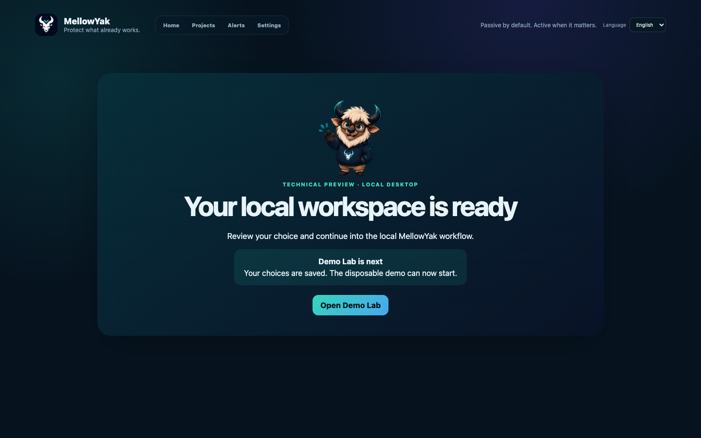

- Purpose: Show the accessible, persisted path from welcome to the selected local destination.
- Displayed state: Deterministic synthetic Phase 10 state rendered through the production component.
- Data source: Explicit screenshot-test fixture; no real project or user data.
- Available actions: Use the visible operational controls to continue to exact local context.
- Known facts: Only values visible in the bounded synthetic evidence are claimed.
- Unknowns: Root cause, complete blast radius, unexecuted checks, and untested platforms remain unclaimed.
- Expected next step: Follow the primary visible action or open technical details when needed.
- Source modified: No
- Surface classification: real operational UI with synthetic capture data.

## 05. Home — no confirmed issue

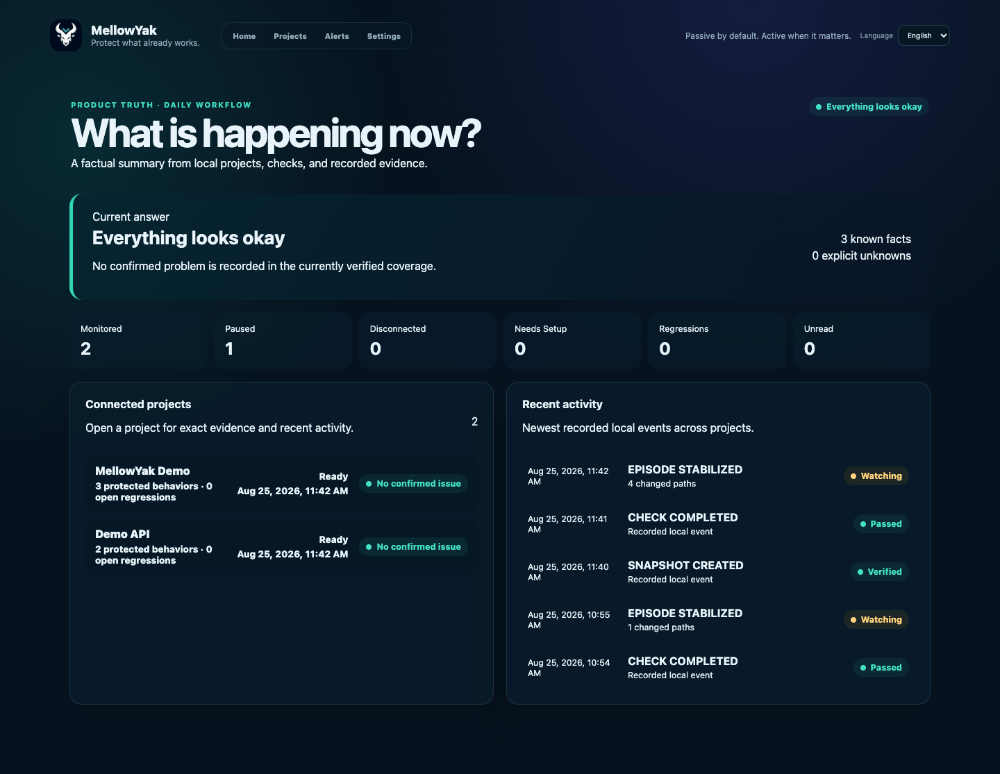

- Purpose: Show the current product state, its evidence, limitations, and safe next action.
- Displayed state: Deterministic synthetic Phase 10 state rendered through the production component.
- Data source: Explicit screenshot-test fixture; no real project or user data.
- Available actions: Use the visible operational controls to continue to exact local context.
- Known facts: Only values visible in the bounded synthetic evidence are claimed.
- Unknowns: Root cause, complete blast radius, unexecuted checks, and untested platforms remain unclaimed.
- Expected next step: Follow the primary visible action or open technical details when needed.
- Source modified: No
- Surface classification: real operational UI with synthetic capture data.

## 06. Home — attention required

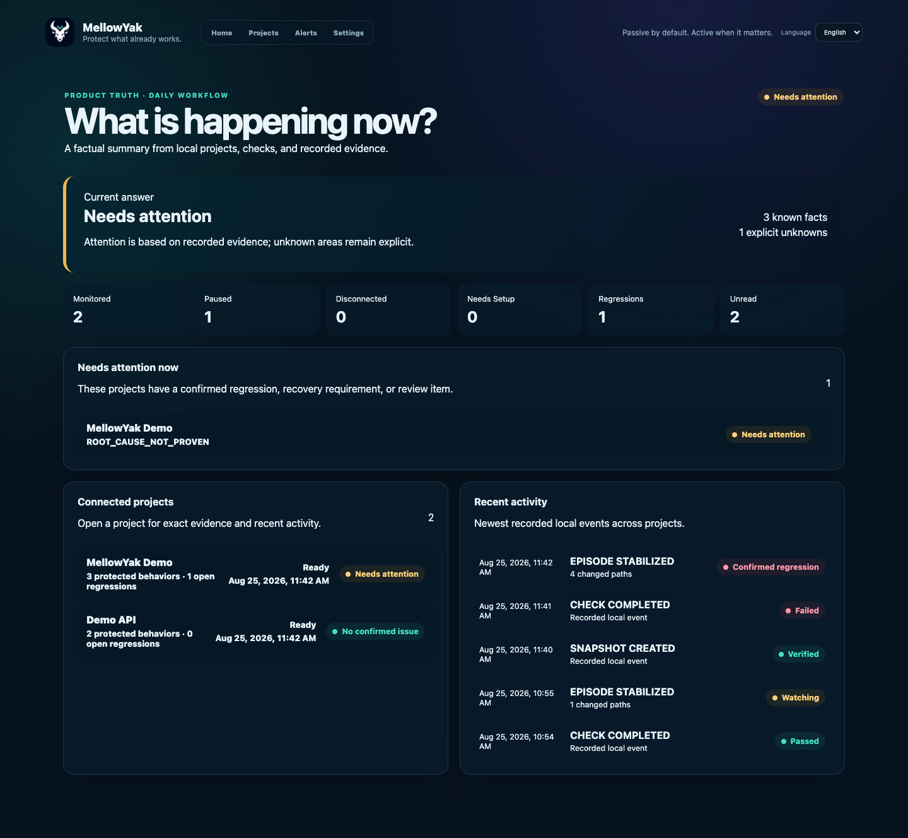

- Purpose: Show the current product state, its evidence, limitations, and safe next action.
- Displayed state: Deterministic synthetic Phase 10 state rendered through the production component.
- Data source: Explicit screenshot-test fixture; no real project or user data.
- Available actions: Use the visible operational controls to continue to exact local context.
- Known facts: Only values visible in the bounded synthetic evidence are claimed.
- Unknowns: Root cause, complete blast radius, unexecuted checks, and untested platforms remain unclaimed.
- Expected next step: Follow the primary visible action or open technical details when needed.
- Source modified: No
- Surface classification: real operational UI with synthetic capture data.

## 07. Project Overview — current evidence

- Purpose: Show the current product state, its evidence, limitations, and safe next action.
- Displayed state: Deterministic synthetic Phase 10 state rendered through the production component.
- Data source: Explicit screenshot-test fixture; no real project or user data.
- Available actions: Use the visible operational controls to continue to exact local context.
- Known facts: Only values visible in the bounded synthetic evidence are claimed.
- Unknowns: Root cause, complete blast radius, unexecuted checks, and untested platforms remain unclaimed.
- Expected next step: Follow the primary visible action or open technical details when needed.
- Source modified: No
- Surface classification: real operational UI with synthetic capture data.

## 08. Project Overview — ready with limits

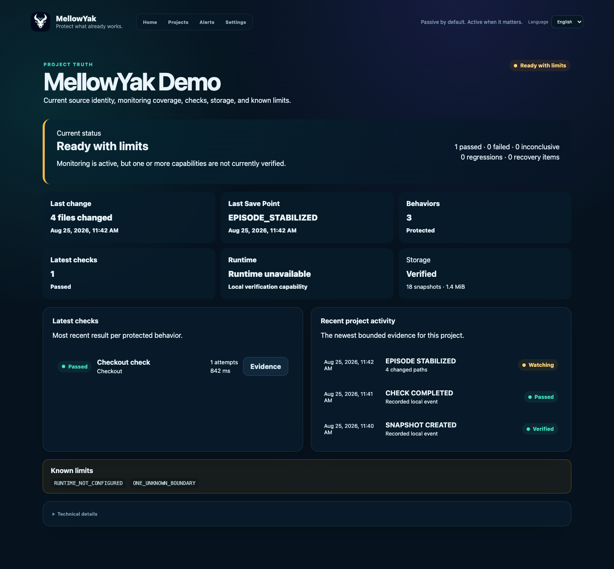

- Purpose: Show the current product state, its evidence, limitations, and safe next action.
- Displayed state: Deterministic synthetic Phase 10 state rendered through the production component.
- Data source: Explicit screenshot-test fixture; no real project or user data.
- Available actions: Use the visible operational controls to continue to exact local context.
- Known facts: Only values visible in the bounded synthetic evidence are claimed.
- Unknowns: Root cause, complete blast radius, unexecuted checks, and untested platforms remain unclaimed.
- Expected next step: Follow the primary visible action or open technical details when needed.
- Source modified: No
- Surface classification: real operational UI with synthetic capture data.

## 09. Project activity timeline

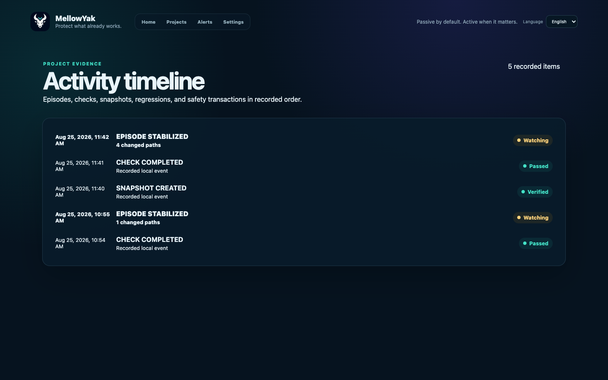

- Purpose: Show the current product state, its evidence, limitations, and safe next action.
- Displayed state: Deterministic synthetic Phase 10 state rendered through the production component.
- Data source: Explicit screenshot-test fixture; no real project or user data.
- Available actions: Use the visible operational controls to continue to exact local context.
- Known facts: Only values visible in the bounded synthetic evidence are claimed.
- Unknowns: Root cause, complete blast radius, unexecuted checks, and untested platforms remain unclaimed.
- Expected next step: Follow the primary visible action or open technical details when needed.
- Source modified: No
- Surface classification: real operational UI with synthetic capture data.

## 10. Episode detail

- Purpose: Show the current product state, its evidence, limitations, and safe next action.
- Displayed state: Deterministic synthetic Phase 10 state rendered through the production component.
- Data source: Explicit screenshot-test fixture; no real project or user data.
- Available actions: Use the visible operational controls to continue to exact local context.
- Known facts: Only values visible in the bounded synthetic evidence are claimed.
- Unknowns: Root cause, complete blast radius, unexecuted checks, and untested platforms remain unclaimed.
- Expected next step: Follow the primary visible action or open technical details when needed.
- Source modified: No
- Surface classification: real operational UI with synthetic capture data.

## 11. Check passed — no regression

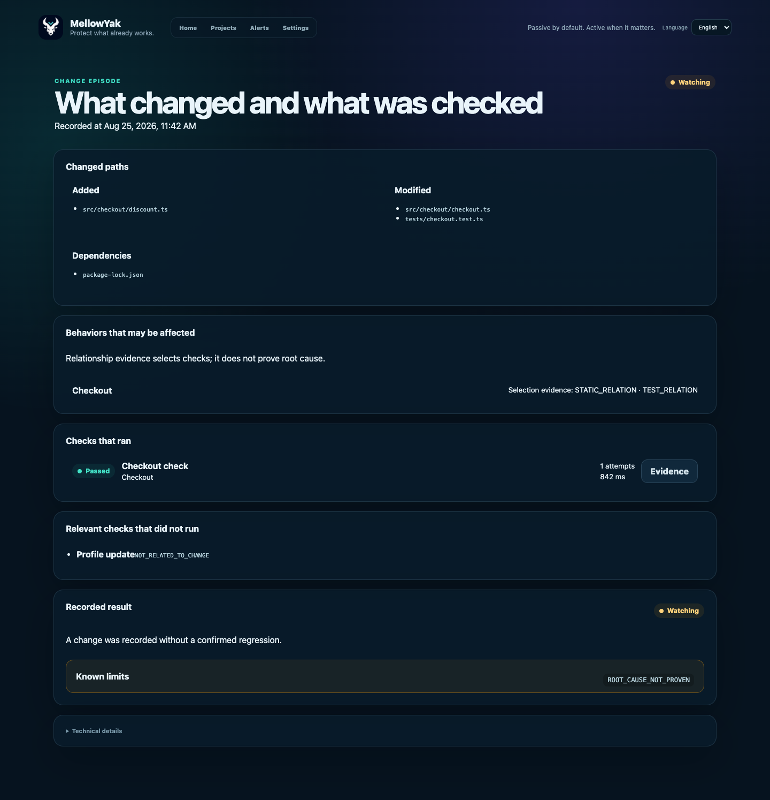

- Purpose: Show the current product state, its evidence, limitations, and safe next action.
- Displayed state: Deterministic synthetic Phase 10 state rendered through the production component.
- Data source: Explicit screenshot-test fixture; no real project or user data.
- Available actions: Review evidence, run again, or create a Repair Workspace.
- Known facts: Only values visible in the bounded synthetic evidence are claimed.
- Unknowns: Root cause, complete blast radius, unexecuted checks, and untested platforms remain unclaimed.
- Expected next step: Follow the primary visible action or open technical details when needed.
- Source modified: No
- Surface classification: real operational UI with synthetic capture data.

## 12. Known-good behavior

- Purpose: Show the current product state, its evidence, limitations, and safe next action.
- Displayed state: Deterministic synthetic Phase 10 state rendered through the production component.
- Data source: Explicit screenshot-test fixture; no real project or user data.
- Available actions: Use the visible operational controls to continue to exact local context.
- Known facts: Only values visible in the bounded synthetic evidence are claimed.
- Unknowns: Root cause, complete blast radius, unexecuted checks, and untested platforms remain unclaimed.
- Expected next step: Follow the primary visible action or open technical details when needed.
- Source modified: No
- Surface classification: real operational UI with synthetic capture data.

## 13. Regression detail — friendly

- Purpose: Show the current product state, its evidence, limitations, and safe next action.
- Displayed state: Deterministic synthetic Phase 10 state rendered through the production component.
- Data source: Explicit screenshot-test fixture; no real project or user data.
- Available actions: Review evidence, run again, or create a Repair Workspace.
- Known facts: Only values visible in the bounded synthetic evidence are claimed.
- Unknowns: Root cause, complete blast radius, unexecuted checks, and untested platforms remain unclaimed.
- Expected next step: Follow the primary visible action or open technical details when needed.
- Source modified: No
- Surface classification: real operational UI with synthetic capture data.

## 14. Regression detail — technical evidence

- Purpose: Show the current product state, its evidence, limitations, and safe next action.
- Displayed state: Deterministic synthetic Phase 10 state rendered through the production component.
- Data source: Explicit screenshot-test fixture; no real project or user data.
- Available actions: Review evidence, run again, or create a Repair Workspace.
- Known facts: Only values visible in the bounded synthetic evidence are claimed.
- Unknowns: Root cause, complete blast radius, unexecuted checks, and untested platforms remain unclaimed.
- Expected next step: Follow the primary visible action or open technical details when needed.
- Source modified: No
- Surface classification: real operational UI with synthetic capture data.

## 15. Repair Workspace

- Purpose: Show the current product state, its evidence, limitations, and safe next action.
- Displayed state: Deterministic synthetic Phase 10 state rendered through the production component.
- Data source: Explicit screenshot-test fixture; no real project or user data.
- Available actions: Use the visible operational controls to continue to exact local context.
- Known facts: Only values visible in the bounded synthetic evidence are claimed.
- Unknowns: Root cause, complete blast radius, unexecuted checks, and untested platforms remain unclaimed.
- Expected next step: Follow the primary visible action or open technical details when needed.
- Source modified: No
- Surface classification: real operational UI with synthetic capture data.

## 16. Candidate validation in progress

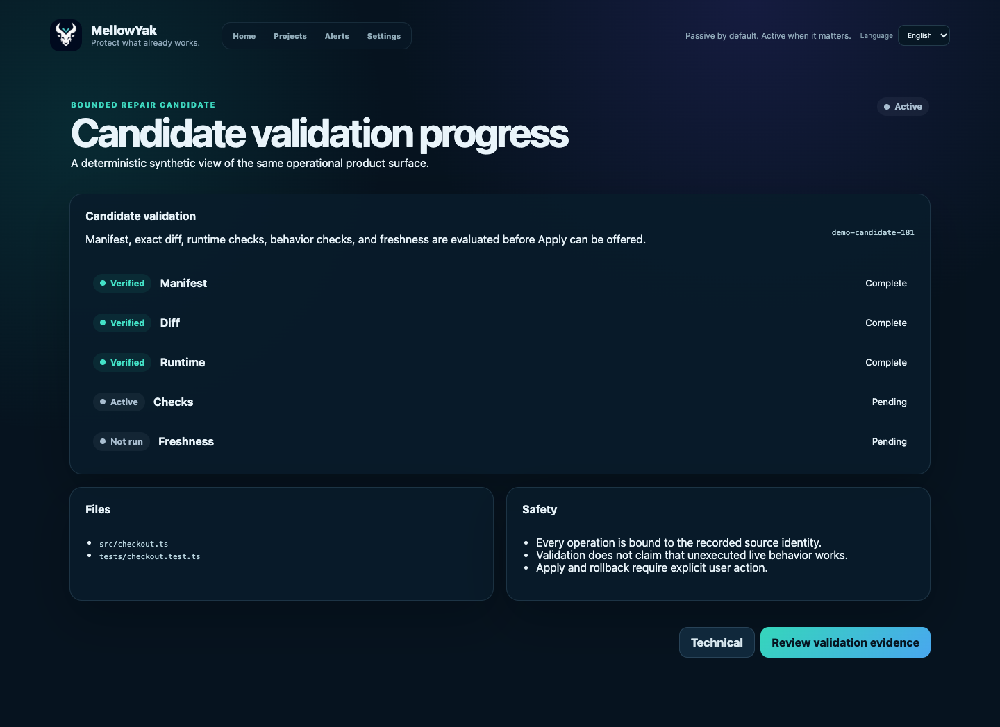

- Purpose: Show the current product state, its evidence, limitations, and safe next action.
- Displayed state: Deterministic synthetic Phase 10 state rendered through the production component.
- Data source: Explicit screenshot-test fixture; no real project or user data.
- Available actions: Use the visible operational controls to continue to exact local context.
- Known facts: Only values visible in the bounded synthetic evidence are claimed.
- Unknowns: Root cause, complete blast radius, unexecuted checks, and untested platforms remain unclaimed.
- Expected next step: Follow the primary visible action or open technical details when needed.
- Source modified: No
- Surface classification: real operational UI with synthetic capture data.

## 17. Candidate validated

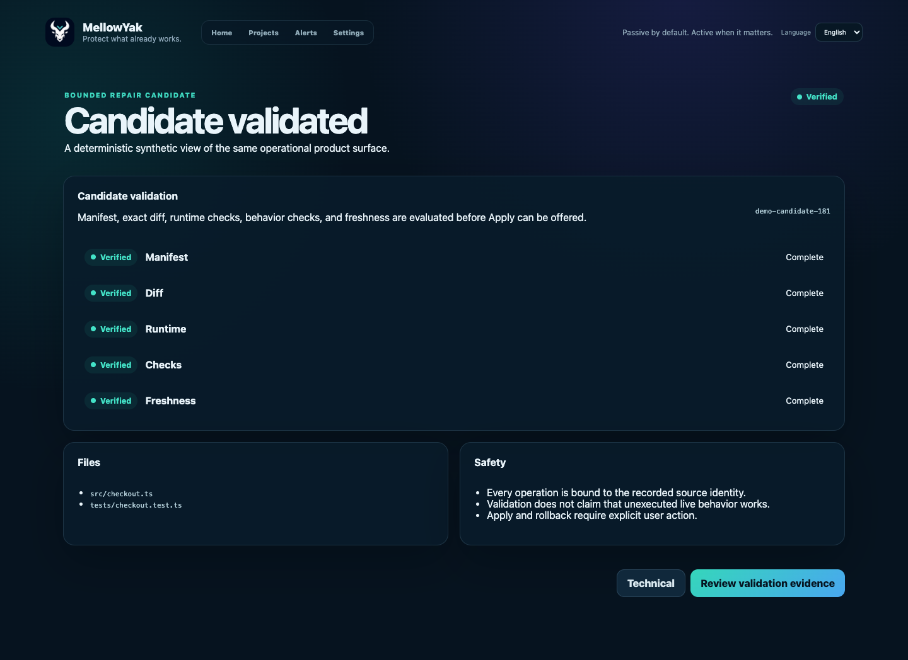

- Purpose: Show the current product state, its evidence, limitations, and safe next action.
- Displayed state: Deterministic synthetic Phase 10 state rendered through the production component.
- Data source: Explicit screenshot-test fixture; no real project or user data.
- Available actions: Use the visible operational controls to continue to exact local context.
- Known facts: Only values visible in the bounded synthetic evidence are claimed.
- Unknowns: Root cause, complete blast radius, unexecuted checks, and untested platforms remain unclaimed.
- Expected next step: Follow the primary visible action or open technical details when needed.
- Source modified: No
- Surface classification: real operational UI with synthetic capture data.

## 18. Apply confirmation

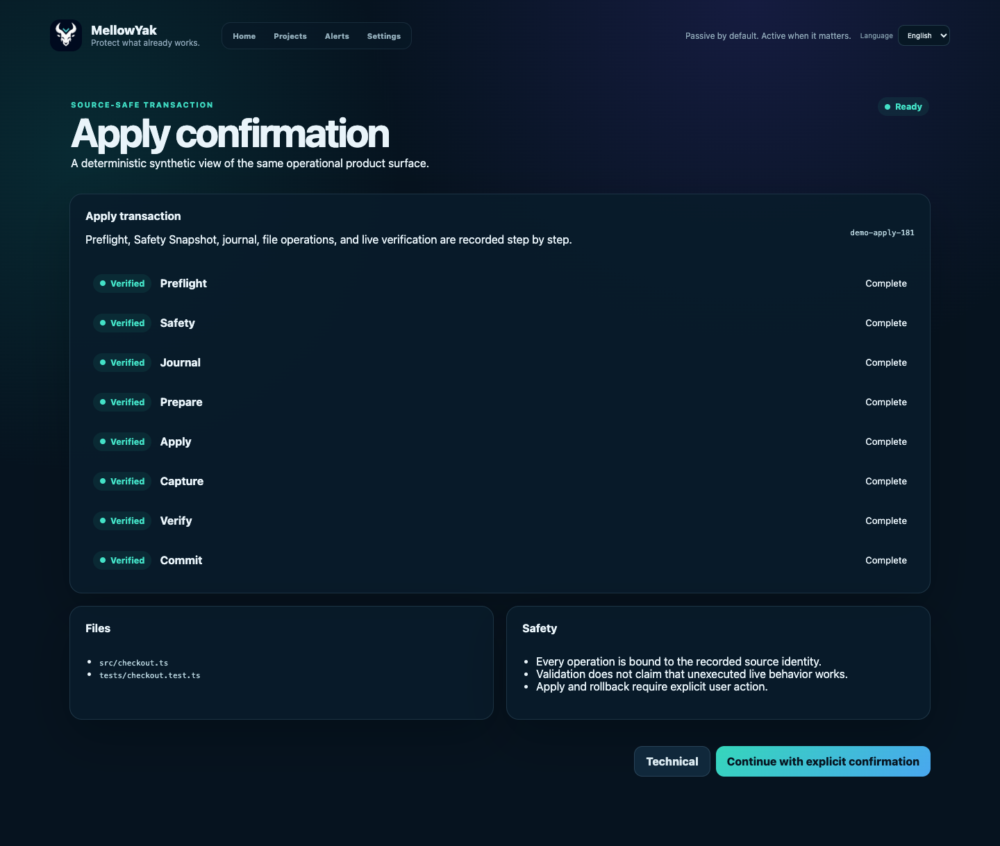

- Purpose: Show the current product state, its evidence, limitations, and safe next action.
- Displayed state: Deterministic synthetic Phase 10 state rendered through the production component.
- Data source: Explicit screenshot-test fixture; no real project or user data.
- Available actions: Review the explicit source-bound transaction and continue only by deliberate action.
- Known facts: Only values visible in the bounded synthetic evidence are claimed.
- Unknowns: Root cause, complete blast radius, unexecuted checks, and untested platforms remain unclaimed.
- Expected next step: Follow the primary visible action or open technical details when needed.
- Source modified: No
- Surface classification: real operational UI with synthetic capture data.

## 19. Apply transaction progress

- Purpose: Show the current product state, its evidence, limitations, and safe next action.
- Displayed state: Deterministic synthetic Phase 10 state rendered through the production component.
- Data source: Explicit screenshot-test fixture; no real project or user data.
- Available actions: Review the explicit source-bound transaction and continue only by deliberate action.
- Known facts: Only values visible in the bounded synthetic evidence are claimed.
- Unknowns: Root cause, complete blast radius, unexecuted checks, and untested platforms remain unclaimed.
- Expected next step: Follow the primary visible action or open technical details when needed.
- Source modified: No
- Surface classification: real operational UI with synthetic capture data.

## 20. Applied and verified

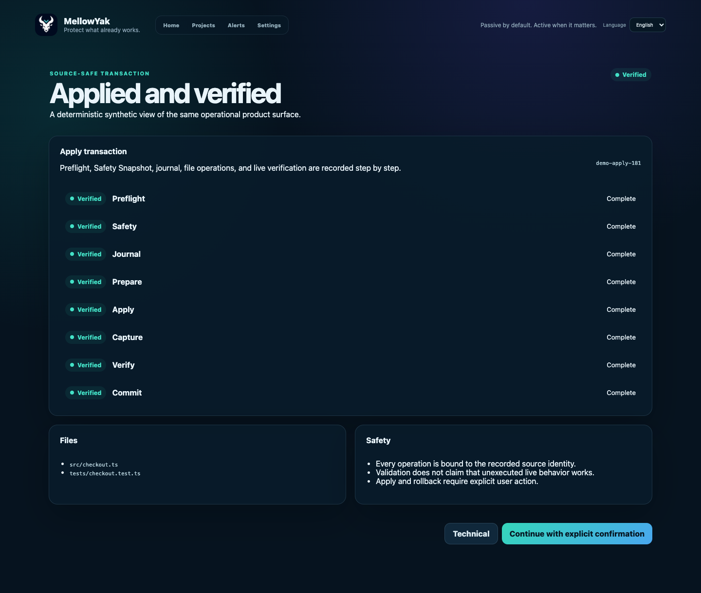

- Purpose: Show the current product state, its evidence, limitations, and safe next action.
- Displayed state: Deterministic synthetic Phase 10 state rendered through the production component.
- Data source: Explicit screenshot-test fixture; no real project or user data.
- Available actions: Use the visible operational controls to continue to exact local context.
- Known facts: Only values visible in the bounded synthetic evidence are claimed.
- Unknowns: Root cause, complete blast radius, unexecuted checks, and untested platforms remain unclaimed.
- Expected next step: Follow the primary visible action or open technical details when needed.
- Source modified: No
- Surface classification: real operational UI with synthetic capture data.

## 21. Rolled back safely

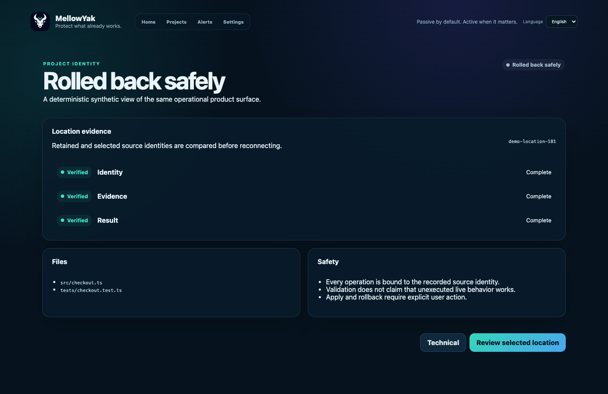

- Purpose: Show the current product state, its evidence, limitations, and safe next action.
- Displayed state: Deterministic synthetic Phase 10 state rendered through the production component.
- Data source: Explicit screenshot-test fixture; no real project or user data.
- Available actions: Use the visible operational controls to continue to exact local context.
- Known facts: Only values visible in the bounded synthetic evidence are claimed.
- Unknowns: Root cause, complete blast radius, unexecuted checks, and untested platforms remain unclaimed.
- Expected next step: Follow the primary visible action or open technical details when needed.
- Source modified: No
- Surface classification: real operational UI with synthetic capture data.

## 22. Disconnected projects

- Purpose: Show the current product state, its evidence, limitations, and safe next action.
- Displayed state: Deterministic synthetic Phase 10 state rendered through the production component.
- Data source: Explicit screenshot-test fixture; no real project or user data.
- Available actions: Use the visible operational controls to continue to exact local context.
- Known facts: Only values visible in the bounded synthetic evidence are claimed.
- Unknowns: Root cause, complete blast radius, unexecuted checks, and untested platforms remain unclaimed.
- Expected next step: Follow the primary visible action or open technical details when needed.
- Source modified: No
- Surface classification: real operational UI with synthetic capture data.

## 23. Reconnect identity preview

- Purpose: Show the current product state, its evidence, limitations, and safe next action.
- Displayed state: Deterministic synthetic Phase 10 state rendered through the production component.
- Data source: Explicit screenshot-test fixture; no real project or user data.
- Available actions: Use the visible operational controls to continue to exact local context.
- Known facts: Only values visible in the bounded synthetic evidence are claimed.
- Unknowns: Root cause, complete blast radius, unexecuted checks, and untested platforms remain unclaimed.
- Expected next step: Follow the primary visible action or open technical details when needed.
- Source modified: No
- Surface classification: real operational UI with synthetic capture data.

## 24. Project mismatch

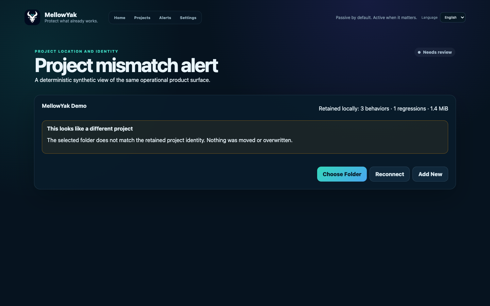

- Purpose: Show the current product state, its evidence, limitations, and safe next action.
- Displayed state: Deterministic synthetic Phase 10 state rendered through the production component.
- Data source: Explicit screenshot-test fixture; no real project or user data.
- Available actions: Use the visible operational controls to continue to exact local context.
- Known facts: Only values visible in the bounded synthetic evidence are claimed.
- Unknowns: Root cause, complete blast radius, unexecuted checks, and untested platforms remain unclaimed.
- Expected next step: Follow the primary visible action or open technical details when needed.
- Source modified: No
- Surface classification: real operational UI with synthetic capture data.

## 25. Diagnostics Center

- Purpose: Show the current product state, its evidence, limitations, and safe next action.
- Displayed state: Deterministic synthetic Phase 10 state rendered through the production component.
- Data source: Explicit screenshot-test fixture; no real project or user data.
- Available actions: Run Self-Test, export support information, or copy redacted diagnostics.
- Known facts: Only values visible in the bounded synthetic evidence are claimed.
- Unknowns: Root cause, complete blast radius, unexecuted checks, and untested platforms remain unclaimed.
- Expected next step: Follow the primary visible action or open technical details when needed.
- Source modified: No
- Surface classification: real operational UI with synthetic capture data.

## 26. Product Self-Test running

- Purpose: Show the current product state, its evidence, limitations, and safe next action.
- Displayed state: Deterministic synthetic Phase 10 state rendered through the production component.
- Data source: Explicit screenshot-test fixture; no real project or user data.
- Available actions: Use the visible operational controls to continue to exact local context.
- Known facts: Only values visible in the bounded synthetic evidence are claimed.
- Unknowns: Root cause, complete blast radius, unexecuted checks, and untested platforms remain unclaimed.
- Expected next step: Follow the primary visible action or open technical details when needed.
- Source modified: No
- Surface classification: real operational UI with synthetic capture data.

## 27. Product Self-Test passed

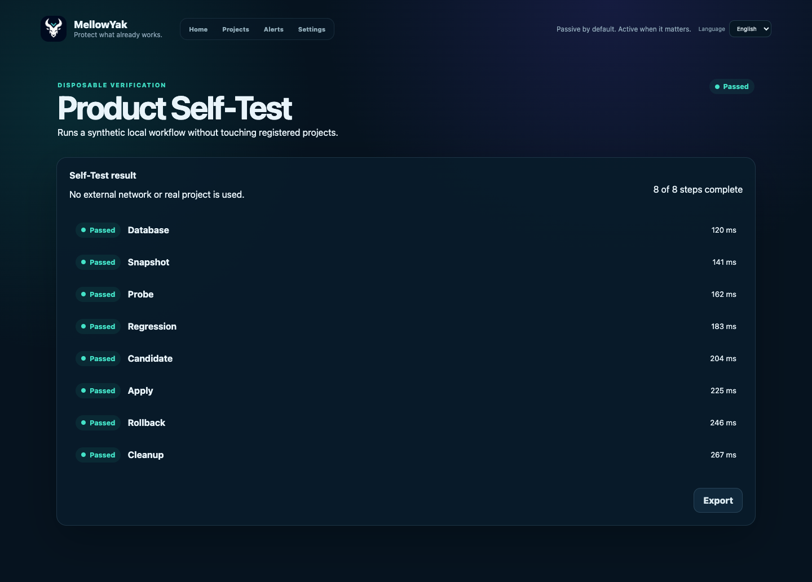

- Purpose: Show the current product state, its evidence, limitations, and safe next action.
- Displayed state: Deterministic synthetic Phase 10 state rendered through the production component.
- Data source: Explicit screenshot-test fixture; no real project or user data.
- Available actions: Use the visible operational controls to continue to exact local context.
- Known facts: Only values visible in the bounded synthetic evidence are claimed.
- Unknowns: Root cause, complete blast radius, unexecuted checks, and untested platforms remain unclaimed.
- Expected next step: Follow the primary visible action or open technical details when needed.
- Source modified: No
- Surface classification: real operational UI with synthetic capture data.

## 28. Support bundle manifest

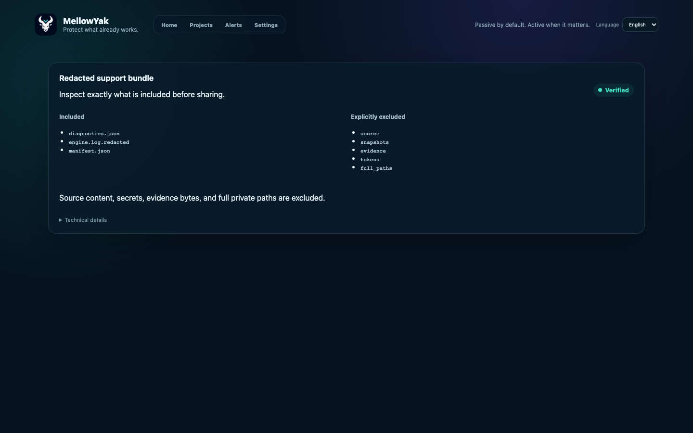

- Purpose: Show the current product state, its evidence, limitations, and safe next action.
- Displayed state: Deterministic synthetic Phase 10 state rendered through the production component.
- Data source: Explicit screenshot-test fixture; no real project or user data.
- Available actions: Use the visible operational controls to continue to exact local context.
- Known facts: Only values visible in the bounded synthetic evidence are claimed.
- Unknowns: Root cause, complete blast radius, unexecuted checks, and untested platforms remain unclaimed.
- Expected next step: Follow the primary visible action or open technical details when needed.
- Source modified: No
- Surface classification: real operational UI with synthetic capture data.

## 29. Update status

- Purpose: Show the current product state, its evidence, limitations, and safe next action.
- Displayed state: Deterministic synthetic Phase 10 state rendered through the production component.
- Data source: Explicit screenshot-test fixture; no real project or user data.
- Available actions: Use the visible operational controls to continue to exact local context.
- Known facts: Only values visible in the bounded synthetic evidence are claimed.
- Unknowns: Root cause, complete blast radius, unexecuted checks, and untested platforms remain unclaimed.
- Expected next step: Follow the primary visible action or open technical details when needed.
- Source modified: No
- Surface classification: real operational UI with synthetic capture data.

## 30. Activity mode settings

- Purpose: Show the current product state, its evidence, limitations, and safe next action.
- Displayed state: Deterministic synthetic Phase 10 state rendered through the production component.
- Data source: Explicit screenshot-test fixture; no real project or user data.
- Available actions: Use the visible operational controls to continue to exact local context.
- Known facts: Only values visible in the bounded synthetic evidence are claimed.
- Unknowns: Root cause, complete blast radius, unexecuted checks, and untested platforms remain unclaimed.
- Expected next step: Follow the primary visible action or open technical details when needed.
- Source modified: No
- Surface classification: real operational UI with synthetic capture data.

## 31. Native menu preview

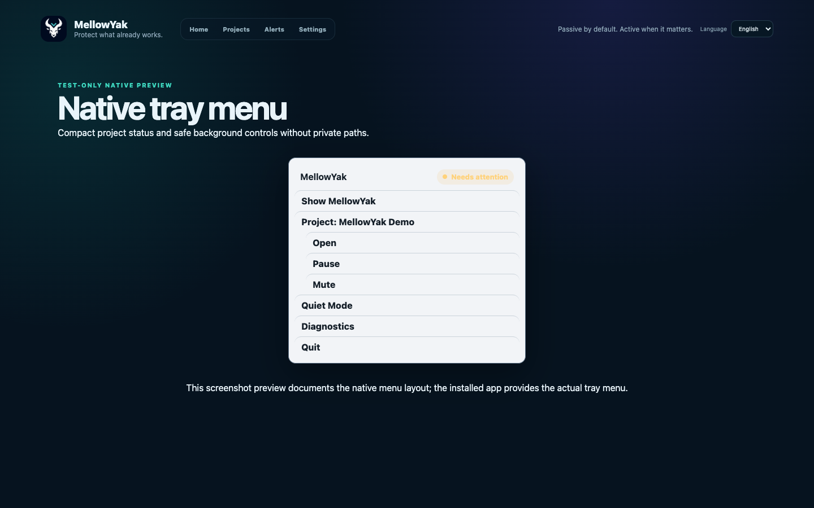

- Purpose: Show the current product state, its evidence, limitations, and safe next action.
- Displayed state: Deterministic synthetic Phase 10 state rendered through the production component.
- Data source: Explicit screenshot-test fixture; no real project or user data.
- Available actions: Use the visible operational controls to continue to exact local context.
- Known facts: Only values visible in the bounded synthetic evidence are claimed.
- Unknowns: Root cause, complete blast radius, unexecuted checks, and untested platforms remain unclaimed.
- Expected next step: Follow the primary visible action or open technical details when needed.
- Source modified: No
- Surface classification: test-only native preview.

## 32. Hebrew RTL Home

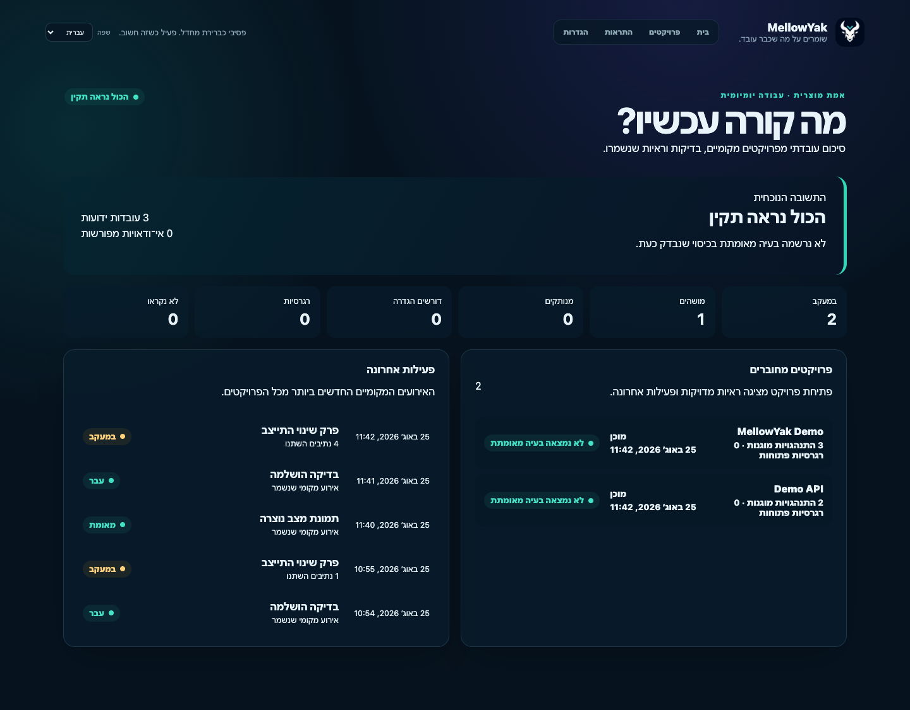

- Purpose: Verify the same operational product surface in Hebrew RTL.
- Displayed state: Deterministic synthetic Phase 10 state rendered through the production component.
- Data source: Explicit screenshot-test fixture; no real project or user data.
- Available actions: Use the visible operational controls to continue to exact local context.
- Known facts: Only values visible in the bounded synthetic evidence are claimed.
- Unknowns: Root cause, complete blast radius, unexecuted checks, and untested platforms remain unclaimed.
- Expected next step: Follow the primary visible action or open technical details when needed.
- Source modified: No
- Surface classification: real operational UI with synthetic capture data.

## 33. Hebrew RTL Project Overview

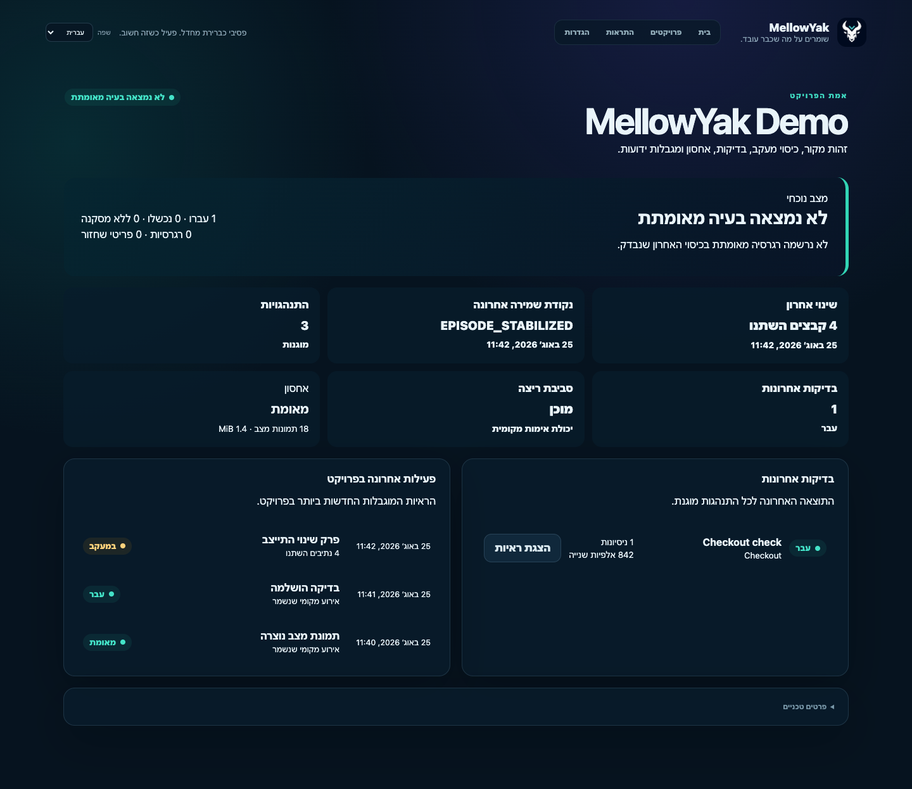

- Purpose: Verify the same operational product surface in Hebrew RTL.
- Displayed state: Deterministic synthetic Phase 10 state rendered through the production component.
- Data source: Explicit screenshot-test fixture; no real project or user data.
- Available actions: Use the visible operational controls to continue to exact local context.
- Known facts: Only values visible in the bounded synthetic evidence are claimed.
- Unknowns: Root cause, complete blast radius, unexecuted checks, and untested platforms remain unclaimed.
- Expected next step: Follow the primary visible action or open technical details when needed.
- Source modified: No
- Surface classification: real operational UI with synthetic capture data.

## 34. Hebrew RTL Regression Detail

- Purpose: Verify the same operational product surface in Hebrew RTL.
- Displayed state: Deterministic synthetic Phase 10 state rendered through the production component.
- Data source: Explicit screenshot-test fixture; no real project or user data.
- Available actions: Review evidence, run again, or create a Repair Workspace.
- Known facts: Only values visible in the bounded synthetic evidence are claimed.
- Unknowns: Root cause, complete blast radius, unexecuted checks, and untested platforms remain unclaimed.
- Expected next step: Follow the primary visible action or open technical details when needed.
- Source modified: No
- Surface classification: real operational UI with synthetic capture data.

## 35. Hebrew RTL Diagnostics

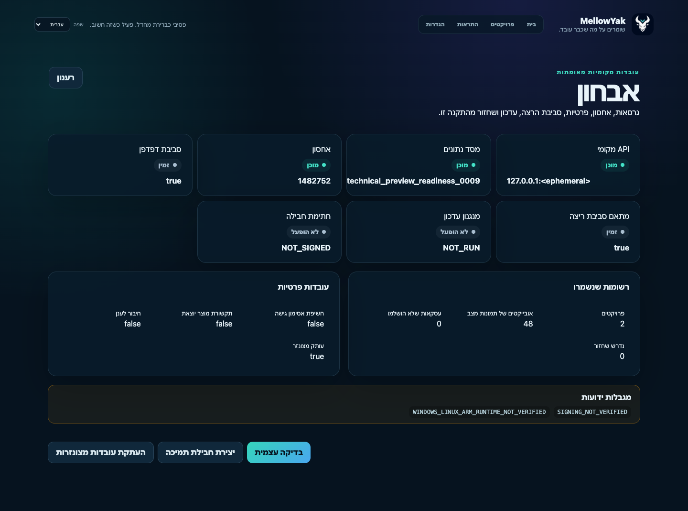

- Purpose: Verify the same operational product surface in Hebrew RTL.
- Displayed state: Deterministic synthetic Phase 10 state rendered through the production component.
- Data source: Explicit screenshot-test fixture; no real project or user data.
- Available actions: Run Self-Test, export support information, or copy redacted diagnostics.
- Known facts: Only values visible in the bounded synthetic evidence are claimed.
- Unknowns: Root cause, complete blast radius, unexecuted checks, and untested platforms remain unclaimed.
- Expected next step: Follow the primary visible action or open technical details when needed.
- Source modified: No
- Surface classification: real operational UI with synthetic capture data.
