# Phase 12M Master Delivery Report

**Phase:** Live Behavior Capture, Workflow State Integrity, and Reference-Project Acceptance

**Acceptance date:** 2026-08-26

**Product version:** `0.3.0-preview.1`

**Database head:** `0009_technical_preview_readiness`
**Outcome:** `VERIFIED_WORKING` for the mandatory automated Phase 12M core; physical macOS boundaries remain explicitly not run.

This is the only Phase 12M delivery document. It consolidates the operational audit, execution record, architecture decisions, product guides, security and privacy report, package validation, manual checklist, limitations, next-phase readiness, and the complete 38-screen guide. The accompanying `images/` directory contains only the PNG files embedded below.

## 1. Executive acceptance

Phase 12M establishes a complete local product loop against a disposable RideFlow reference project: register through the production API, detect four runtime profiles, capture and review a browser behavior, validate a comparable known-good PASS, distinguish a harmless Episode from a repeated comparable regression, create an isolated Repair Workspace, reject an invalid candidate, validate a valid candidate, require explicit Apply confirmation, freshly verify the live project, commit a successful transaction, and roll a failed post-check back byte-identically.

The reference project is synthetic and disposable. No private customer project, APC repository, or operator source tree was used. The product did not use external network access, models, provider tokens, analytics, cloud sync, accounts, or automated repair generation. Apply remains a user-confirmed transaction.

The final Intel macOS app and DMG were rebuilt from source. The final package passed Phase 11M structural validation and the Phase 12M packaged end-to-end validator. The installed application binary is byte-identical to the final build. Developer ID signing, notarization, public updater publication, Apple Silicon, Windows, Linux, and physical OS interactions are outside this phase and are not claimed.

## 2. Source, baseline, and Git audit

| Item | Exact value |
|---|---|
| Repository | `https://github.com/MellowYAK/mellowyak.git` |
| Starting branch | `product/macos-native-hardening` |
| Starting commit | `142c821c16fa035564d70684d5496c853509d3e4` |
| Starting annotated tag | `phase-11m-macos-native-verified-2026-08-25` |
| Tag resolution | `142c821c16fa035564d70684d5496c853509d3e4` |
| Final branch | `product/live-behavior-reference-acceptance` |
| Local commit message | `feat: complete live behavior capture and reference acceptance` |
| Local tag | `phase-12m-live-behavior-verified-2026-08-26` |
| Push/publication | Not performed |

The branch was created from the verified Phase 11M tag without reset, clean, history rewrite, remote modification, or deletion of unrelated user files. Generated applications, DMGs, databases, evidence bytes, browser profiles, workspaces, Apply journals, recovery bundles, private keys, and local runtime state remain excluded from Git. Unrelated Finder Alias files under the Phase 5 screenshot directory were preserved and excluded from the commit.

The user-provided crash reports describe an old temporary `0.2.0-preview.1` bundle launched from `/var/folders/.../MellowYak Acceptance.app`, parented by Python, which aborted in the macOS `did_finish_launching` path. The report contains a SIGABRT but no actionable Rust panic. The current `0.3.0-preview.1` package launched with its bundled engine, reached readiness, and quit cleanly during final package work; therefore the old temporary crash was not reproducible in the current bundle. This is a bounded observation, not a claim that every possible macOS launch failure is eliminated.

## 3. Operational state audit and execution record

The audit found that Phase 11M already supplied the local database, authenticated loopback API, project ownership, runtime profiles, evidence records, verification adapters, regression records, isolated workspaces, transactional Apply, updater fixture, and packaged lifecycle supervision. Phase 12M reused those primitives rather than adding a second product path.

The principal defects were operational truth gaps: workflows used adjacent but inconsistent status words; accepted capture could precede comparable replay validation; screenshot states could visually imply work that had not happened; Apply preparation could create artifacts before explicit confirmation; packaged browser lookup depended on development paths; capture cancellation existed at the API boundary but was absent from the live GUI; and destructive project modals lacked a complete keyboard focus contract.

The implementation sequence was:

1. Record and expose authoritative workflow transition models.
2. Enforce terminal evidence and reject invalid transitions.
3. Tighten browser capture, redaction, cancellation, replay, and origin boundaries.
4. Build the disposable RideFlow reference project and runtime manifest.
5. Execute harmless, failing, repair, Apply, and rollback paths against production APIs.
6. Correct packaged browser/engine resource discovery and local ad-hoc package signing.
7. Add translated English/Hebrew operational surfaces with an explicit screenshot marker.
8. Rebuild, validate, install, document, and close the local Git handoff.

## 4. Consolidated architecture decisions

### ADR-0043 — Live behavior capture

Browser behavior capture is an explicit, visible, project-owned session bound to an approved loopback origin and a captured source/runtime identity. It records compact semantic steps and bounded observations rather than global input. Pause, resume, stop-for-review, and cancel are explicit operations. Cancellation cleans owned browser/process children. A capture is not known good until a comparable replay finishes with PASS and a human accepts the reviewed baseline.

### ADR-0044 — Operational workflow state machines

One typed transition module is authoritative for behavior, Episode, verification, regression, Repair Workspace, candidate, Apply, and updater states. The authenticated `GET /workflow/state-model` route exposes the same model used by the engine and screenshot surface. Invalid edges fail closed. Terminal decisions such as PASS, CONFIRMED, VALIDATED, COMMITTED, ROLLED_BACK, and INVALID_SIGNATURE require evidence.

### ADR-0045 — Reference-project acceptance

RideFlow is generated under a disposable temporary root and registered through the normal product API. It has no dependency download and no external network. Its deterministic change switch makes a harmless change, a repeated regression, a valid repair, and a failed post-check reproducible. The project exists to validate product behavior and must never be represented as a customer result.

### ADR-0046 — Capture secret boundary

Capture is allowlist-origin only. Password values, authorization headers, cookies, and secret canaries are redacted or omitted. Source contents are excluded by default. Browser sessions are ephemeral unless an explicit active session requires them. Test mutation routes require the explicit reference marker and reject normal projects. API/CLI execution remains argv-only and the working directory is project-confined.

## 5. Authoritative workflow state matrix

| Machine | States and significant transitions |
|---|---|
| Behavior | `DRAFT → CAPTURING → CAPTURED → VALIDATING → KNOWN_GOOD`; review, invalid, and disabled branches are explicit. |
| Episode | `OPEN → SETTLING → STABILIZED → IMPACT_PENDING → CHECKS_RUNNING → COMPLETE`; incomplete/cancelled branches remain truthful. |
| Verification | `NOT_SELECTED → QUEUED → RUNNING → PASSED/FAILED/INCONCLUSIVE`; unavailable, skipped, and cancelled are distinct. |
| Regression | `NONE → WATCH → SUSPECTED/HIGH → CONFIRMED`; reviewed, dismissed, and resolved remain separate evidence states. |
| Repair Workspace | `CREATING → READY/CHANGED → VALIDATING → VALIDATED/INVALID`; deletion is terminal. |
| Candidate | `DRAFT → GENERATING → GENERATED → VALIDATING → VALIDATED`; stale, rejected, applied, and retained-after-rollback are explicit. |
| Apply | `NOT_STARTED → AWAITING_CONFIRMATION → PREFLIGHT → SAFETY_SNAPSHOT → JOURNAL_CREATED → PREPARING → WRITING → CAPTURING_LIVE_SOURCE → VERIFYING_LIVE → COMMITTED`, or transaction-scoped `ROLLING_BACK → ROLLED_BACK/RECOVERY_REQUIRED`. |
| Updater | `NOT_CHECKED → CHECKING → UP_TO_DATE/NO_UPDATE/UPDATE_AVAILABLE`; download, signature verification, install, restart, updated, invalid signature, incomplete download, failure, and unpublished production channel are distinct. |

No UI progress indicator creates state on its own. The API returns the state, previous state, transition evidence, known facts, unknowns, and limitations. Apply creates no snapshot, journal, workspace write, or live-project mutation while it is only `AWAITING_CONFIRMATION`.

## 6. Reference project manifest and operator guide

The generated project is **RideFlow Reference**, a small local ride-selection application. Its behavior is deterministic: for pickup `(0,0)`, the nearest available driver is `driver-near`. Fake driver coordinates eliminate external GPS or map dependencies. English is the base language; Hebrew uses RTL and translation maps.

Detected runtime profiles:

| Profile | Runtime type | Purpose |
|---|---|---|
| RideFlow Web frontend | Web | Local browser UI and browser replay |
| RideFlow Python API | API | Local ride and driver endpoints |
| RideFlow deterministic tests | Test | Deterministic domain/API checks |
| RideFlow ride status CLI | CLI | Argv-only ride-status check |

The generated source includes a Node web/proxy layer, Python API/domain layer, CLI, deterministic tests, a runtime manifest, English/Hebrew translations, and the controlled `api/selection_mode.txt` switch. Runtime processes bind to loopback, remain bounded, and are cleaned after work. Operators may recreate it with `scripts/create_phase12m_reference_project.py`; its output root must be disposable and must not be committed.

## 7. Behavior capture guide

1. Connect a local project and approve the detected runtime profile.
2. Define the protected behavior, expected outcome, persona, and preconditions.
3. Start capture against the approved origin. The visible live region announces capture state.
4. Pause/resume, cancel, or stop for review. Cancel terminates owned children and retains no accepted baseline.
5. Review compact steps, exclude irrelevant observations, remove screenshots if needed, and add reviewer notes.
6. Validate using an approved runtime-profile version. A replay must be comparable and PASS.
7. Accept the reviewed result as Known Good. Acceptance records source identity, runtime identity, evidence manifest, and reviewer.

Captured behavior definition:

- Title: **Request nearest ride**
- Description: A passenger request selects the nearest eligible driver.
- Expected outcome: The confirmed ride uses `driver-near`.
- Baseline result: comparable replay `PASS`
- External network: none

## 8. Live regression and repair workflow

The harmless Episode changed source without changing the behavior outcome; the comparable check passed and no regression was created. The controlled regression changed selection behavior and produced the same comparable failure twice. MellowYak persisted a `RegressionFinding`, showed expected versus observed evidence, and did not claim a causal file.

Impact analysis selected checks; it did not prove breakage. Regression Detail kept actual source/runtime identities, retry evidence, baseline comparison, known facts, unknowns, and limitations. Root cause remained unclaimed.

An isolated Repair Workspace was created from the recorded source identity. A deliberately bad candidate was rejected by validation. A valid candidate restored nearest-driver behavior and was marked `VALIDATED`. Stale source identity blocked Apply before any write.

Apply required explicit confirmation. Only after confirmation did preflight, Safety Snapshot, journal creation, preparation, bounded writing, live source capture, and fresh live verification execute. The successful path committed. A separate deliberately failing post-check entered rollback, restored transaction-owned bytes exactly, retained the candidate for inspection, preserved an unrelated sentinel, and left no pending recovery.

| Acceptance step | Result |
|---|---|
| Known-good comparable replay | PASS |
| Harmless change | PASS; no regression |
| Controlled regression | Comparable failure repeated twice; CONFIRMED |
| Bad candidate | REJECTED |
| Valid candidate | VALIDATED |
| Stale source | BLOCKED before write |
| Successful Apply | COMMITTED after fresh live verification |
| Failed post-check | ROLLED_BACK |
| Transaction-owned byte identity | VERIFIED |
| Unrelated sentinel | UNCHANGED |
| Pending recovery | None |

## 9. Database and API

No migration was needed. Existing records could represent capture sessions, steps, assertions, source/runtime binding, replay evidence, regression findings, workspaces, candidates, Apply transactions, and recovery state. The database remains at `0009_technical_preview_readiness`; empty-database creation and upgrades from every prior migration to `0009` passed.

New and extended routes are authenticated, project-owned, typed, bounded, source/runtime-aware, and return known/unknown/limitation truth. The authoritative workflow model is available at `GET /workflow/state-model`. Capture, validate, accept, project reference mutation, workspace, candidate, Apply, and rollback operations use existing production service boundaries. There is no new busy-poll loop.

The deterministic OpenAPI SHA-256 is `d568b0665b6cc9825d945ed8be3d15626eda0fa97e0792fbf3b6719f6c1cc8c1`.

## 10. Security and privacy report

- Approved project origin only; replay cannot leave it.
- No global keyboard monitoring.
- Password values, authorization headers, cookies, and secret canaries are not persisted in evidence, logs, database summaries, screenshots, or support output.
- Capture is visibly active and cancellable; cancellation cleans owned children.
- Unmarked projects cannot use reference mutation routes, and reference fixtures cannot target an existing real project.
- API/CLI execution is argv-only; no shell composition or unconfined working directory.
- Source upload, cloud sync, analytics, model/provider SDKs, accounts, and prompt/provider data are absent.
- Apply is explicit; stale source blocks before mutation; Safety Snapshot and journal precede write.
- Rollback is transaction-scoped and byte identity is verified.
- Explicit Quit leaves zero owned children.
- The reference workflow used no external network and touched no private project.

The repository privacy scan excludes databases, snapshots, evidence bytes, browser profiles, Repair Workspaces, candidates, journals, recovery/support bundles, updater private keys, Apple credentials, generated apps/DMGs, dependency/build directories, reference runtime state, APC data, and absolute user-home paths.

## 11. English, Hebrew, and accessibility

All visible application copy is resolved through translation keys. English is the base catalog and Hebrew has parity. Hebrew product surfaces set RTL; technical identifiers remain LTR inside RTL layouts. No Phase 12M GUI copy is hard-coded.

The final accessibility pass includes keyboard navigation, visible focus styling, live capture-state announcements, semantic progress/status surfaces, correct native checkbox/select/button semantics, color-independent labels, reduced-motion handling, responsive minimum-window layout, 200% text-zoom support, translated English/Hebrew accessible labels, modal focus entry and trap, Tab/Shift+Tab cycling, Escape/cancel behavior, and restoration of focus to the project action trigger. Behavior capture exposes pause/resume, cancel, and stop-for-review without requiring precise pointer-only interaction.

The React suite contains a direct modal keyboard contract test. Capture cancellation is connected to the production API and the capture state is an `aria-live="polite"` status region.

## 12. Toolchain and reproducibility

| Tool | Version |
|---|---|
| Node used for source/package gates | `v22.23.2` from the pinned Node 22 installation |
| npm used with pinned Node | `10.9.8` |
| Python | `3.11.5` |
| rustc | `1.98.0 (88d9e12ae 2026-08-18)` |
| Cargo | `1.98.0 (797e8a9bc 2026-08-05)` |
| macOS | `26.5.2 (25F84)`, Intel x86_64 |
| Command Line Tools | `26.6.0.0.1781586589` at `/Library/Developer/CommandLineTools` |
| Full Xcode | Not selected; `xcodebuild -version` unavailable |

The interactive shell also contains Node 26, but every recorded frontend/package command prepended the pinned Node 22 path. No dependency change was required; lockfiles changed only for synchronized product-version metadata.

## 13. Exact automated results

| Gate | Result |
|---|---|
| Complete Python suite | `191 passed, 1 warning` |
| React/Vitest after final accessibility patch | `28 passed` |
| Total source tests | `219 passed` |
| TypeScript | Passed |
| Vite production build | Passed; no >500 kB advisory |
| UI translation policy | `UI_TRANSLATION_KEYS_ONLY` |
| English/Hebrew catalog parity and RTL | Passed |
| Ruff check/format | Passed; 174 files formatted/checked |
| Cargo format/check | Passed |
| Migration matrix | Empty and every `0001`–`0008` upgrade to `0009` passed |
| Phase 8 packaged safety | `VERIFIED_WORKING` — 9 demo labs, 22 self-tests, 4 byte-identical crash recoveries |
| Phase 9 packaged acceptance | `VERIFIED_WORKING` |
| Phase 10 Product Truth | `VERIFIED_WORKING` |
| Phase 11M final package | `VERIFIED_WORKING` — all 18 package/DMG checks true |
| Phase 12M final package | `VERIFIED_WORKING` — all 23 reference-product checks true |
| Updater E2E fixture | `VERIFIED_WORKING` |
| macOS lifecycle | `VERIFIED_WORKING` — clean launch, single engine, second-instance focus, supervised restart, quit cleanup |
| External network | None observed/allowed in the reference workflow |
| Owned children after quit | `0` |

The final focused frontend run completed 28 React tests, TypeScript, production build, and translation-only verification after capture cancel and modal accessibility were added. At the operator's request, no further broad test repetitions were run after the already successful final Phase 11M and Phase 12M package validators.

## 14. Performance and package footprint

The dynamic observation below was recorded on the same Phase 12M engine/core immediately before the final accessibility-only frontend patch. It is local Intel macOS evidence, not a universal benchmark. The final static app/browser/engine sizes are unchanged; the final DMG size and hash are recorded exactly below.

| Measurement | Observed value |
|---|---|
| Packaged engine handshake runs | `2.651802 s`, `2.302323 s`, `2.181968 s` |
| Median engine handshake | `2.302323 s` |
| Desktop idle CPU mean | `0.233%` |
| Engine idle CPU mean | `0.100%` |
| Desktop idle RSS mean | `107,409,408 bytes` |
| Engine idle RSS mean | `122,159,104 bytes` |
| Browser after session/quit | No owned child remained |
| Phase 12M end-to-end packaged workflow | `30.699004 s` |
| Application size | `887,656,765 bytes` |
| Bundled browser size | `637,205,282 bytes` |
| Bundled engine size | `224,407,691 bytes` |
| Final DMG size | `398,700,210 bytes` |

Frontend-ready, first Home data, first Project Overview data, Diagnostics route load, and per-operation capture/replay/Episode/workspace/candidate/Apply/rollback route times were not separately instrumented. They must not be inferred from the aggregate workflow duration.

## 15. Packaging, signing, and installation

| Artifact | Path | SHA-256 |
|---|---|---|
| Desktop executable | `apps/desktop/src-tauri/target/release/bundle/macos/MellowYak.app/Contents/MacOS/mellowyak-desktop` | `ec9862d78ed5c10aef24034e799d5c4177bdda5d3675f5c09a52f69204bdd394` |
| Engine executable | `apps/desktop/src-tauri/target/release/bundle/macos/MellowYak.app/Contents/Resources/engine/mellowyak-engine/mellowyak-engine` | `cb458340aff8b1737d6cd174c289a3e6a709a38ee09e68177a406348d8b586b2` |
| Intel macOS DMG | `apps/desktop/src-tauri/target/release/bundle/dmg/MellowYak_0.3.0-preview.1_x64.dmg` | `6fd0161e98040adc8c8dcc904bd8ff16b808aa348cd2ea5185d079770298db7b` |
| Installed executable | `/Applications/MellowYak.app/Contents/MacOS/mellowyak-desktop` | `ec9862d78ed5c10aef24034e799d5c4177bdda5d3675f5c09a52f69204bdd394` |

Browser identity is the bundled Intel Chromium/Chrome for Testing runtime described by `mellowyak.packaged_browser.v1`; its executable is resolved from the package manifest, not a developer machine path. The browser directory is `637,205,282 bytes`.

The app and DMG have structurally valid local ad-hoc signatures. Developer ID identity count is zero; notarization and Gatekeeper public distribution are not verified. The production updater channel remains `PRODUCTION_CHANNEL_UNPUBLISHED`; its configuration was not changed. The signed local updater fixture passed valid install and rejected tampering, wrong key, incomplete download, and downgrade while preserving database/settings/project identity and persisting no private key.

The final app was installed at `/Applications/MellowYak.app` without launching it again after the operator requested an end to further checks. The previous installation remains recoverable at `/Applications/MellowYak-previous-20260826-123623-7c4275.app`.

## 16. Manual macOS acceptance checklist

These physical boundaries are implemented but **NOT RUN**. None is marked Passed.

| Boundary | Operator instruction | Expected result | Status | Evidence/timestamp |
|---|---|---|---|---|
| Tray click | Click the physical MellowYak menu-bar item. | Localized menu opens and reflects current state. | Not Run | Operator to record |
| Red close button | Enable keep-running-on-close, then click red close. | Window hides; one app/engine remains; tray stays available. | Not Run | Operator to record |
| Notification Center | Trigger a local eligible alert and click it in Notification Center. | Correct MellowYak destination opens without private copy. | Not Run | Operator to record |
| Start at Login | Enable setting, log out, then log in. | One MellowYak instance starts and supervises one engine. | Not Run | Operator to record |
| Sleep/wake | Sleep the Mac during passive monitoring, then wake. | App reconnects safely without duplicate engine or false status. | Not Run | Operator to record |
| Lock/unlock | Lock and unlock the screen. | State remains coherent and sensitive evidence is not exposed. | Not Run | Operator to record |
| Logout | Log out with MellowYak running. | Owned processes terminate cleanly. | Not Run | Operator to record |
| Finder Alias | Add a project through a Finder Alias. | Canonical path is resolved safely and the source remains local. | Not Run | Operator to record |

Checklist environment: version `0.3.0-preview.1`; branch `product/live-behavior-reference-acceptance`; platform Intel macOS 26.5.2. The operator should add the final commit reported by the local tag and an actual timestamp when each item is performed.

## 17. Limitations and next-phase readiness

- The 38 screenshots use an explicit deterministic fixture boundary and reference-run facts; they are not private-project evidence.
- The synthetic RideFlow result cannot be generalized to a customer project.
- Physical tray, close-to-tray, Notification Center, login, sleep/wake, lock/unlock, logout, and Finder Alias interactions are not run.
- Developer ID signing, notarization, Gatekeeper distribution, production updater publication, Apple Silicon, Windows, and Linux remain unverified or out of scope.
- A full Xcode installation is not selected; Command Line Tools are available.
- Per-route performance timings listed in the phase request were not separately instrumented.
- MellowYak does not claim a root cause from changed files or impact alone.

The codebase is ready for the operator to choose the next phase. Phase 12M stops here: no Windows, Linux, Apple Silicon runtime, public release, production signing, public updater, private-project acceptance, AI, or agent integration begins automatically.

## 18. Screenshot fixture boundary and screen guide

All images below were captured from real MellowYak operational components using the explicit query marker `phase12Fixture=mellowyak.phase12.screenshots.v1`. Production cannot enter this mode accidentally; the surface requires the exact marker, uses the authoritative state model, cannot overwrite real records, and cannot target an existing registered project. Every screenshot therefore has **fixture mode active: yes**. “Entity source” describes the disposable reference acceptance record or signed updater fixture represented by the component; it never means private production data.

### 00 — Reference project created

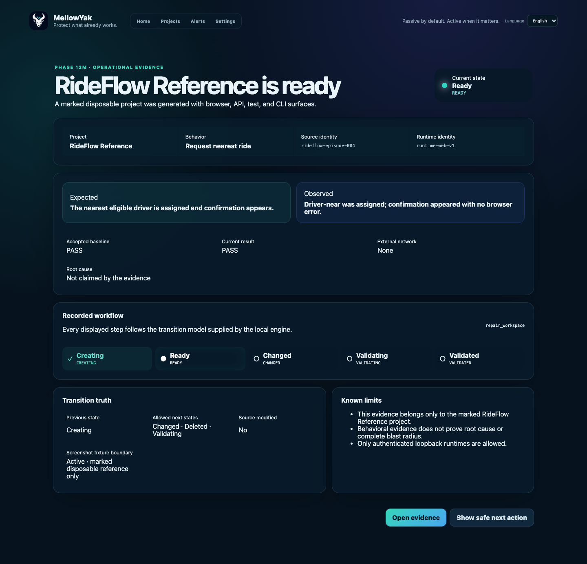

**Entity source:** generated RideFlow project registered through the production API. **State:** Repair Workspace `READY`; previous `CREATING`; allowed next `CHANGED`, `VALIDATING`, or `DELETED`. **Actions:** inspect evidence or continue safely. **Known:** disposable project identity and local manifest exist. **Unknown:** no customer-project implication or causal claim. **Source modified:** no. **Fixture active:** yes.

### 01 — Runtime Wizard detected profiles

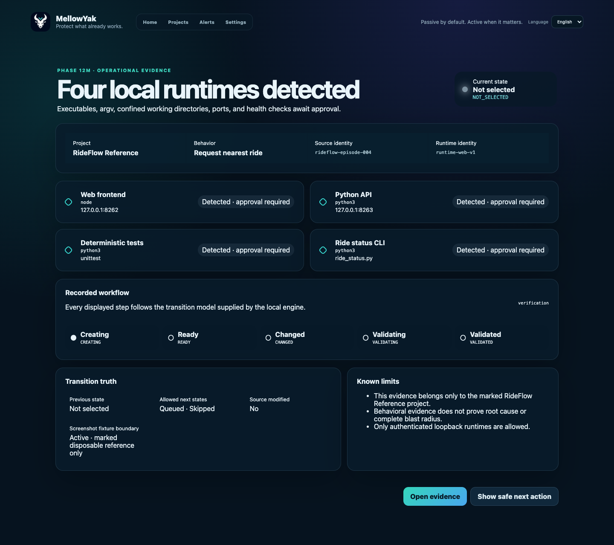

**Entity source:** RideFlow runtime manifest and production detector. **State:** Verification `NOT_SELECTED`; previous `NOT_SELECTED`; allowed next `QUEUED` or `SKIPPED`. **Actions:** review four detected profiles and select one. **Known:** web, API, test, and CLI profiles are present. **Unknown:** no profile is approved or running yet. **Source modified:** no. **Fixture active:** yes.

### 02 — Runtime Wizard approved

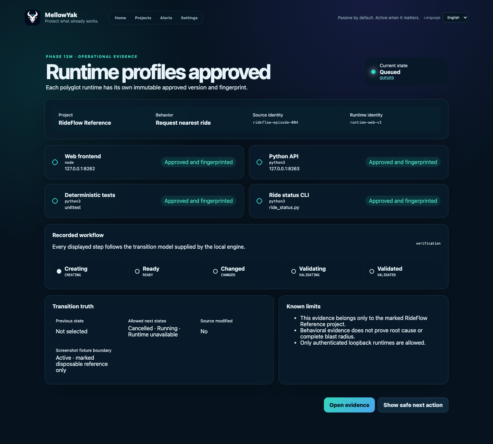

**Entity source:** approved RideFlow runtime-profile versions. **State:** Verification `QUEUED`; previous `NOT_SELECTED`; allowed next `RUNNING`, `CANCELLED`, or `RUNTIME_UNAVAILABLE`. **Actions:** start bounded runtime verification. **Known:** four profiles are approved and identity-bound. **Unknown:** no result exists until execution. **Source modified:** no. **Fixture active:** yes.

### 03 — Behavior capture ready

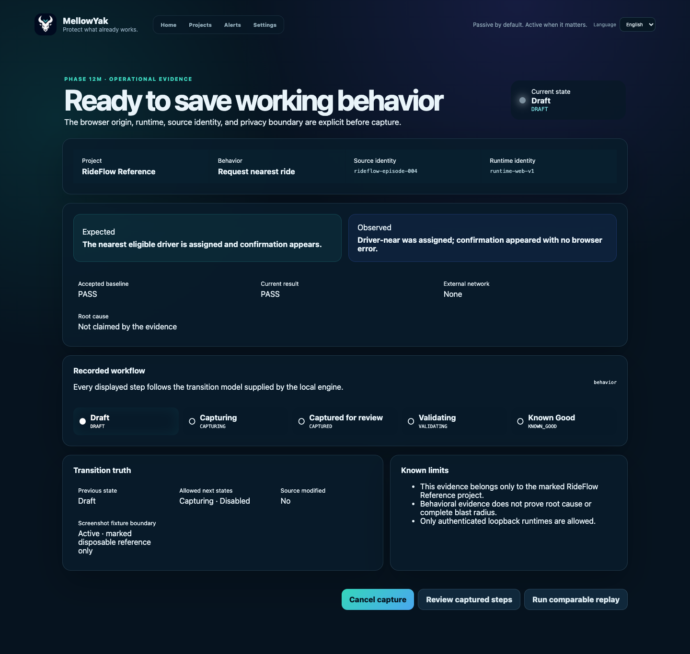

**Entity source:** “Request nearest ride” protected-behavior draft. **State:** Behavior `DRAFT`; previous `DRAFT`; allowed next `CAPTURING` or `DISABLED`. **Actions:** start capture or disable the draft. **Known:** expected outcome is `driver-near`; origin is approved. **Unknown:** no capture or comparable baseline exists. **Source modified:** no. **Fixture active:** yes.

### 04 — Behavior capture active

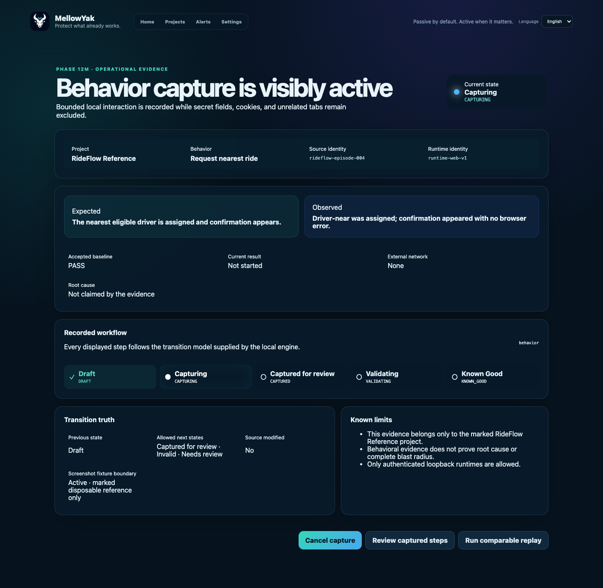

**Entity source:** active browser-capture session against the RideFlow loopback origin. **State:** Behavior `CAPTURING`; previous `DRAFT`; allowed next `CAPTURED`, `NEEDS_REVIEW`, or `INVALID`. **Actions:** pause/resume, cancel, or stop for review. **Known:** capture is visibly active and local-only. **Unknown:** evidence is not accepted and no verdict exists. **Source modified:** no. **Fixture active:** yes.

### 05 — Behavior capture review

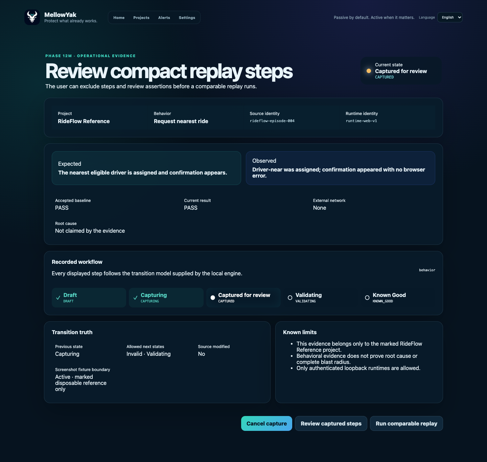

**Entity source:** stopped RideFlow capture with compact steps and redacted observations. **State:** Behavior `CAPTURED`; previous `CAPTURING`; allowed next `VALIDATING` or `INVALID`. **Actions:** include/exclude steps, remove optional screenshots, add notes, validate replay. **Known:** capture and review artifacts exist. **Unknown:** Known Good is not accepted until comparable replay PASS. **Source modified:** no. **Fixture active:** yes.

### 06 — Known Good accepted with PASS

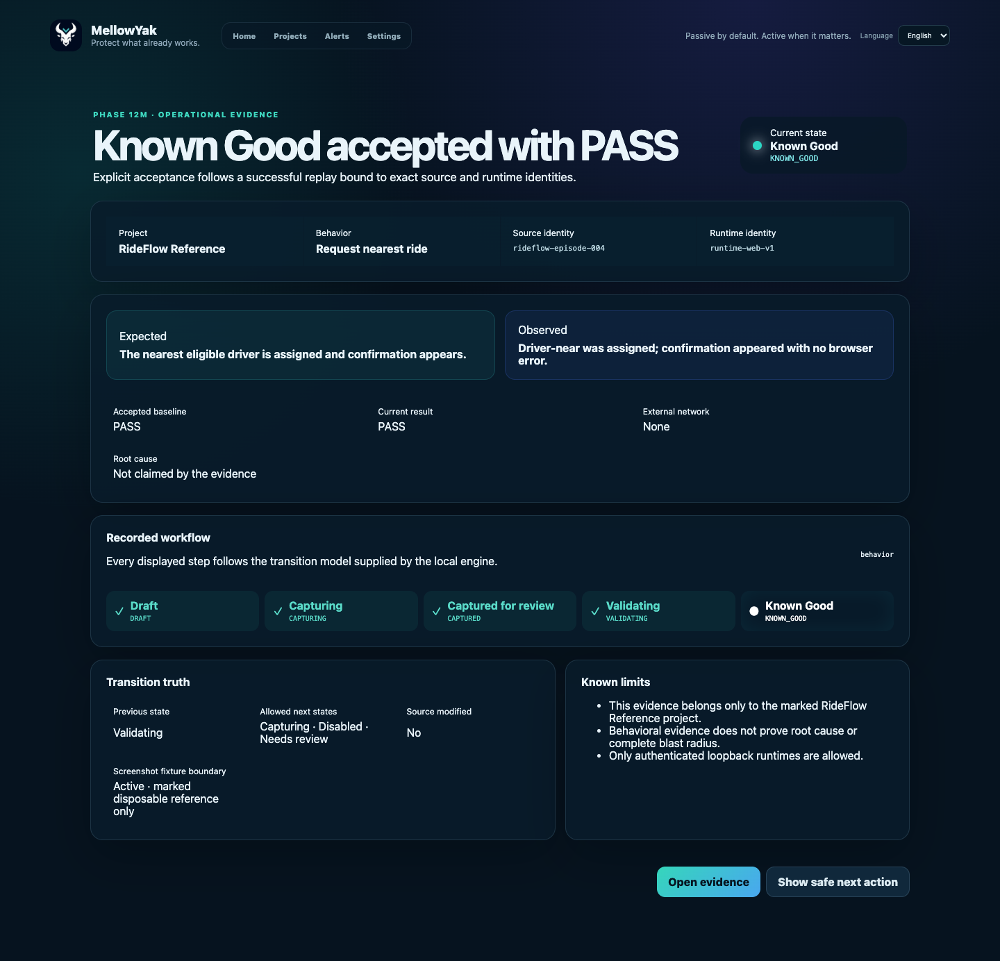

**Entity source:** accepted RideFlow evidence bundle and comparable replay. **State:** Behavior `KNOWN_GOOD`; previous `VALIDATING`; allowed next `CAPTURING`, `NEEDS_REVIEW`, or `DISABLED`. **Actions:** inspect evidence, rerun, or safely continue. **Known:** expected and observed driver are `driver-near`; result is PASS. **Unknown:** no later Episode is implied. **Source modified:** no. **Fixture active:** yes.

### 07 — Project overview with Known Good

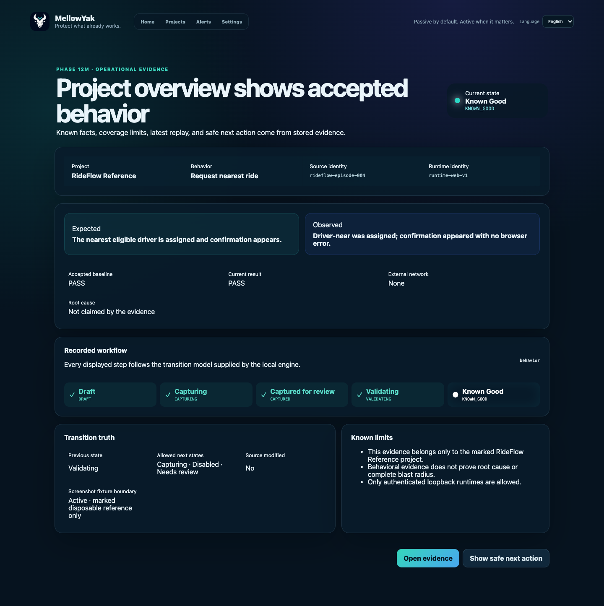

**Entity source:** RideFlow project overview joined to the accepted behavior baseline. **State:** Behavior `KNOWN_GOOD`; previous `VALIDATING`; allowed next `CAPTURING`, `NEEDS_REVIEW`, or `DISABLED`. **Actions:** open behavior/evidence or run a check. **Known:** one comparable accepted baseline exists. **Unknown:** incomplete coverage outside the defined behavior remains explicit. **Source modified:** no. **Fixture active:** yes.

### 08 — Harmless Episode

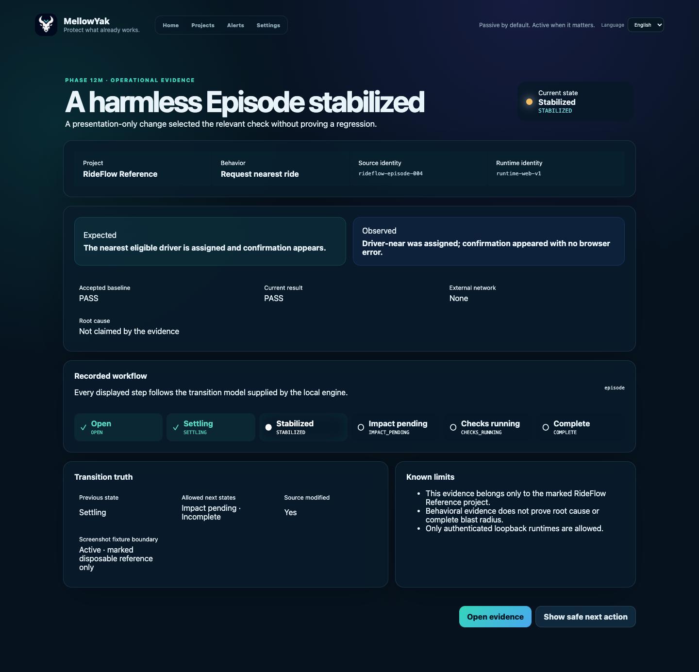

**Entity source:** a bounded RideFlow source Episode created by a harmless local edit. **State:** Episode `STABILIZED`; previous `SETTLING`; allowed next `IMPACT_PENDING` or `INCOMPLETE`. **Actions:** inspect impact or continue check selection. **Known:** source identity changed and settled. **Unknown:** a change alone is not a regression. **Source modified:** yes. **Fixture active:** yes.

### 09 — Check passed with no regression

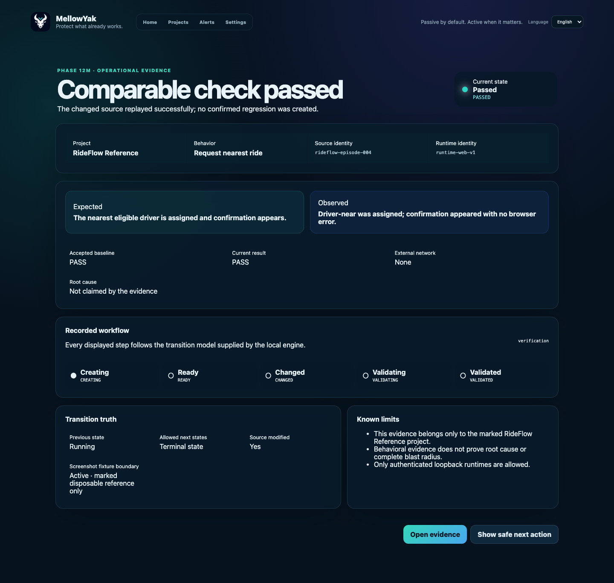

**Entity source:** comparable replay selected by the harmless Episode. **State:** Verification `PASSED`; previous `RUNNING`; terminal for this run. **Actions:** open evidence or return to the project. **Known:** baseline and current outcome are comparable PASS; no RegressionFinding is created. **Unknown:** checks outside declared coverage remain unknown. **Source modified:** yes. **Fixture active:** yes.

### 10 — Controlled regression Episode

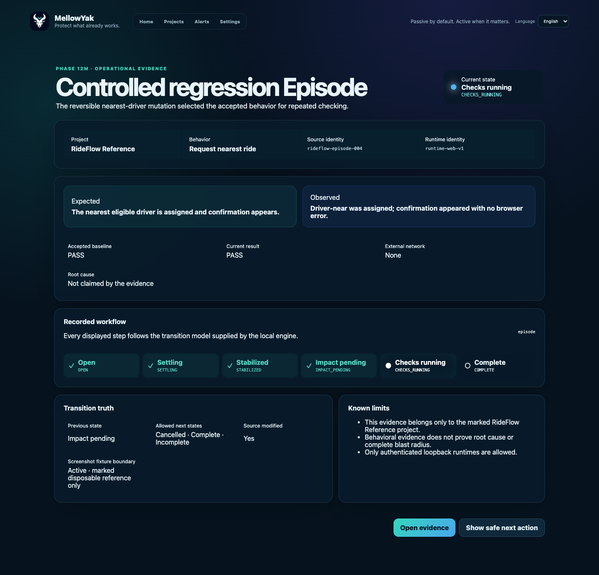

**Entity source:** RideFlow controlled selection-mode change. **State:** Episode `CHECKS_RUNNING`; previous `IMPACT_PENDING`; allowed next `COMPLETE`, `INCOMPLETE`, or `CANCELLED`. **Actions:** observe selected check progress or cancel. **Known:** impact selected the nearest-driver behavior. **Unknown:** impact does not establish causation or failure by itself. **Source modified:** yes. **Fixture active:** yes.

### 11 — Regression confirmed live

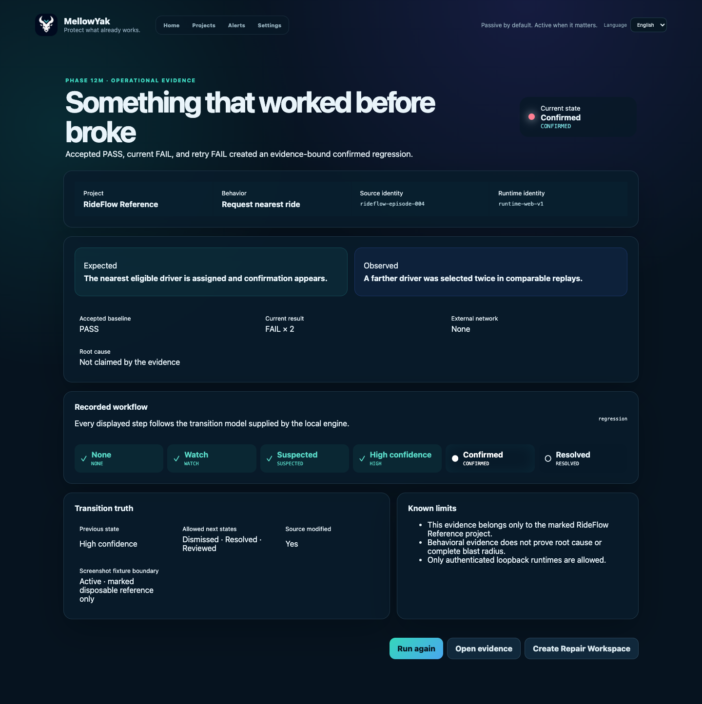

**Entity source:** persisted RegressionFinding from two comparable RideFlow failures. **State:** Regression `CONFIRMED`; previous `HIGH`; allowed next `REVIEWED`, `DISMISSED`, or `RESOLVED`. **Actions:** rerun, open evidence, or create a Repair Workspace. **Known:** accepted baseline passed and current comparable check failed twice. **Unknown:** root cause is not claimed. **Source modified:** yes. **Fixture active:** yes.

### 12 — Regression technical evidence

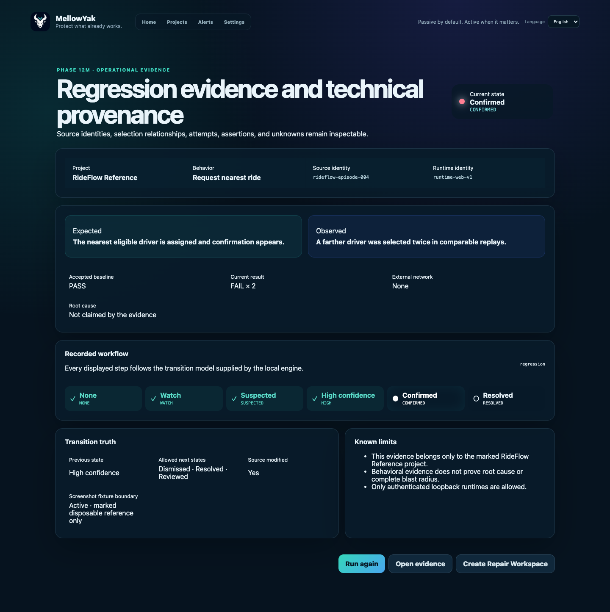

**Entity source:** baseline/current manifests, retry records, runtime identity, and expected/observed values. **State:** Regression `CONFIRMED`; previous `HIGH`; allowed next `REVIEWED`, `DISMISSED`, or `RESOLVED`. **Actions:** inspect evidence, rerun, or start isolated repair. **Known:** the evidence is actual and comparable. **Unknown:** changed-file causality remains unproven. **Source modified:** yes. **Fixture active:** yes.

### 13 — Repair Workspace with live data

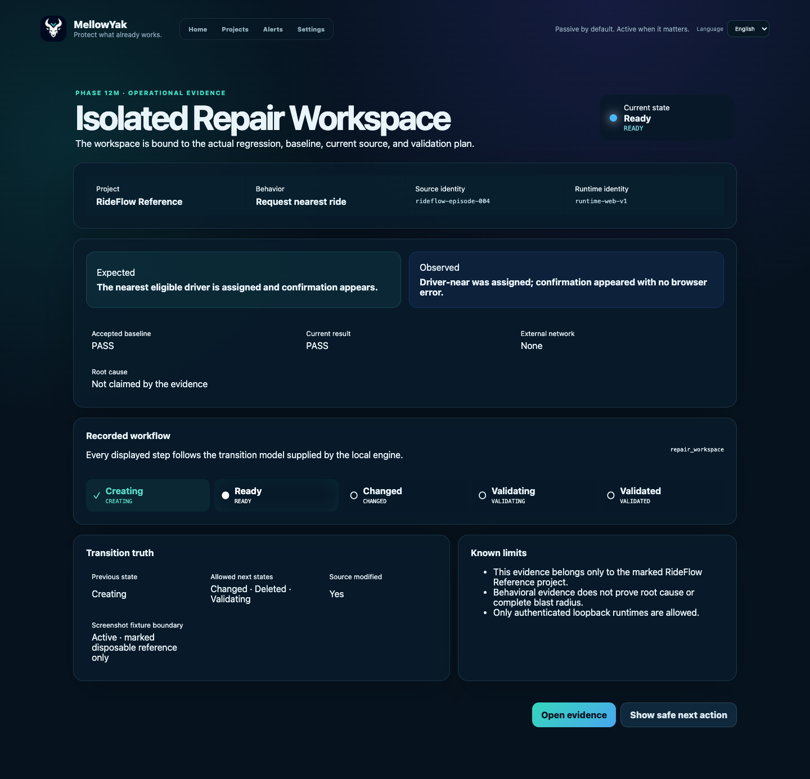

**Entity source:** isolated workspace derived from the RideFlow regression source identity. **State:** Repair Workspace `READY`; previous `CREATING`; allowed next `CHANGED`, `VALIDATING`, or `DELETED`. **Actions:** prepare deterministic candidates, validate, or delete workspace. **Known:** original project is not mutated. **Unknown:** no candidate is valid until checks run. **Source modified:** yes, inside isolation only. **Fixture active:** yes.

### 14 — Bad candidate rejected

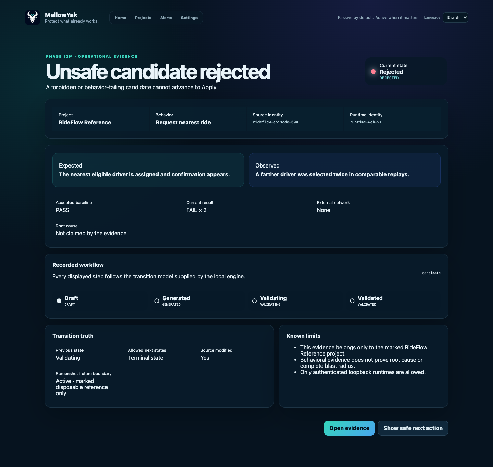

**Entity source:** deliberately invalid RideFlow repair candidate. **State:** Candidate `REJECTED`; previous `VALIDATING`; terminal. **Actions:** inspect failure evidence or select another candidate. **Known:** validation did not restore the protected behavior. **Unknown:** rejection does not diagnose a root cause. **Source modified:** yes, isolated workspace only. **Fixture active:** yes.

### 15 — Valid candidate validated

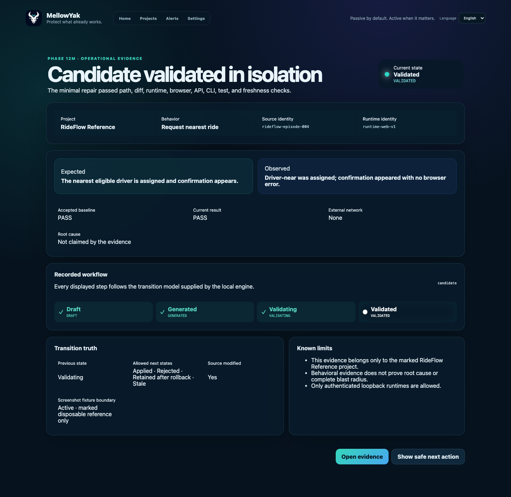

**Entity source:** candidate restoring nearest-driver selection in isolation. **State:** Candidate `VALIDATED`; previous `VALIDATING`; allowed next `APPLIED`, `STALE`, `REJECTED`, or `RETAINED_AFTER_ROLLBACK`. **Actions:** review evidence or prepare explicit Apply. **Known:** candidate checks PASS in the workspace. **Unknown:** live-project success is not assumed. **Source modified:** yes, isolated workspace only. **Fixture active:** yes.

### 16 — Apply awaiting confirmation

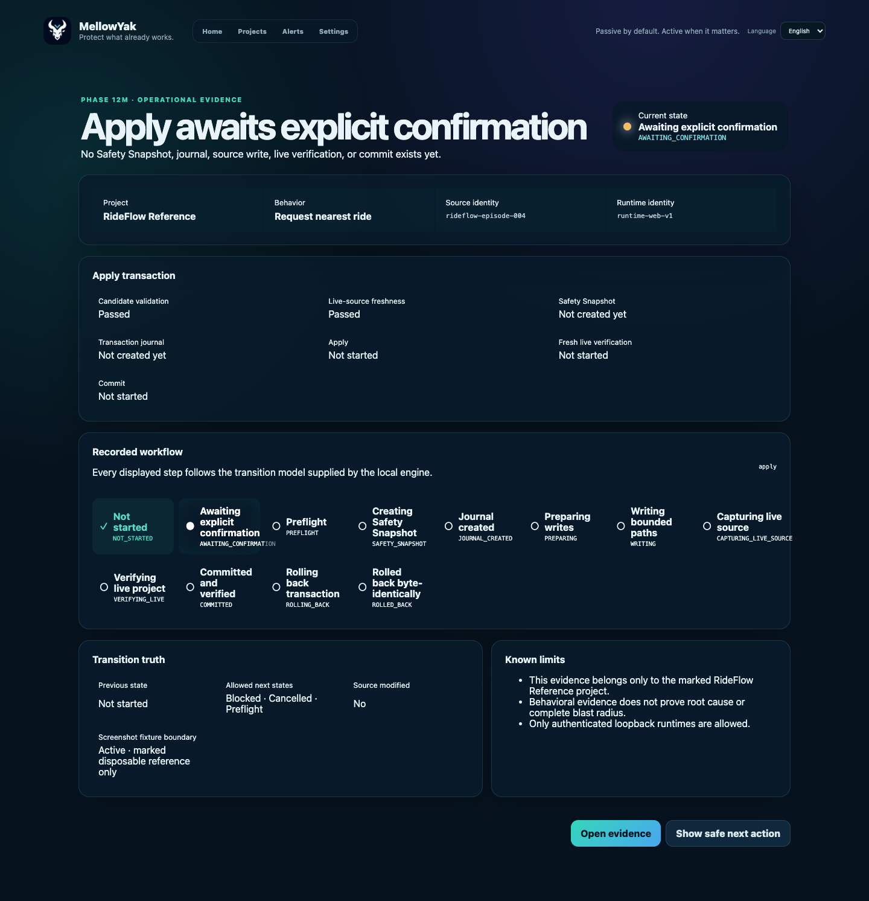

**Entity source:** validated RideFlow candidate and unstarted Apply transaction. **State:** Apply `AWAITING_CONFIRMATION`; previous `NOT_STARTED`; allowed next `PREFLIGHT`, `CANCELLED`, or `BLOCKED`. **Actions:** explicitly confirm or cancel. **Known:** no snapshot, journal, write, or live mutation exists yet. **Unknown:** live result remains unknown. **Source modified:** no. **Fixture active:** yes.

### 17 — Apply preflight

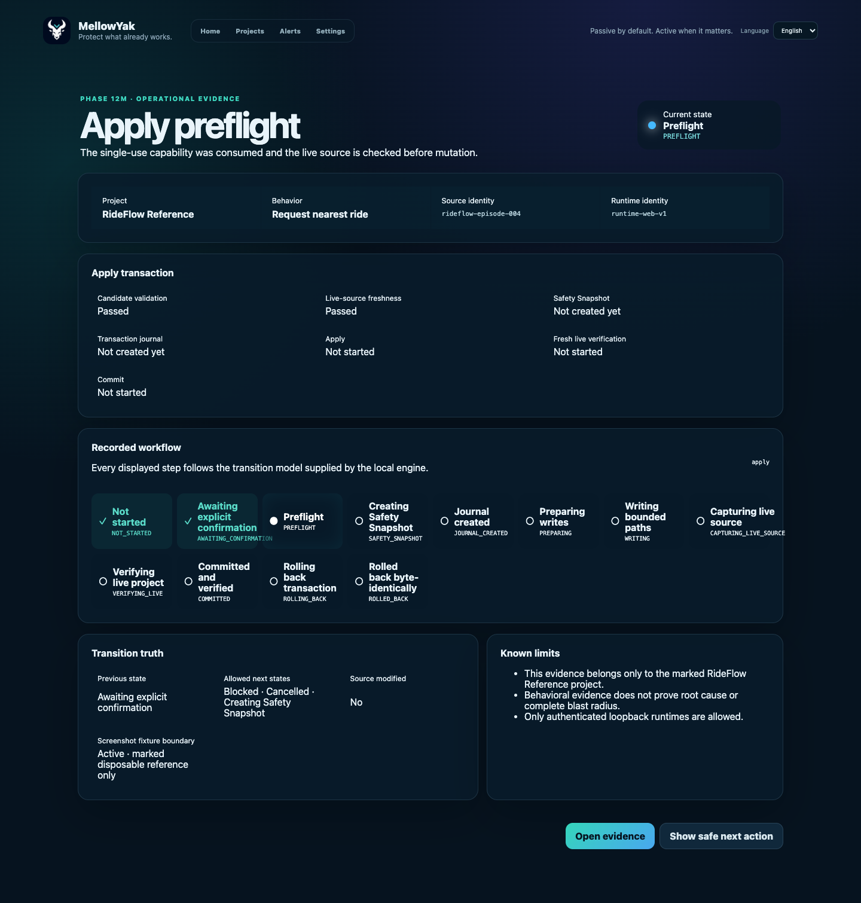

**Entity source:** confirmed Apply transaction bound to current live source identity. **State:** Apply `PREFLIGHT`; previous `AWAITING_CONFIRMATION`; allowed next `SAFETY_SNAPSHOT`, `CANCELLED`, or `BLOCKED`. **Actions:** allow bounded preflight or cancel. **Known:** explicit confirmation exists and stale-source checks run before write. **Unknown:** no live verification result yet. **Source modified:** no. **Fixture active:** yes.

### 18 — Apply writing

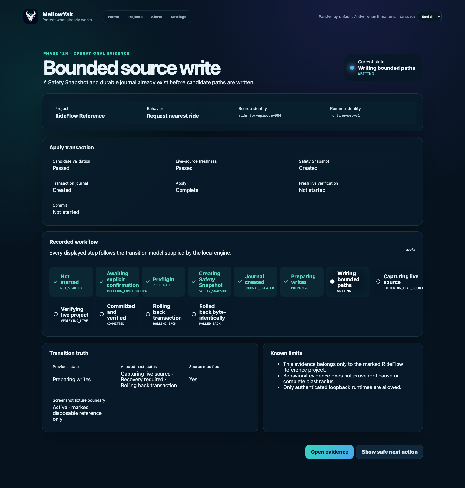

**Entity source:** journaled RideFlow Apply transaction after Safety Snapshot. **State:** Apply `WRITING`; previous `PREPARING`; allowed next `CAPTURING_LIVE_SOURCE`, `ROLLING_BACK`, or `RECOVERY_REQUIRED`. **Actions:** observe transaction; do not initiate a second Apply. **Known:** snapshot and journal precede bounded writes. **Unknown:** post-write live outcome is not yet known. **Source modified:** yes. **Fixture active:** yes.

### 19 — Live verification

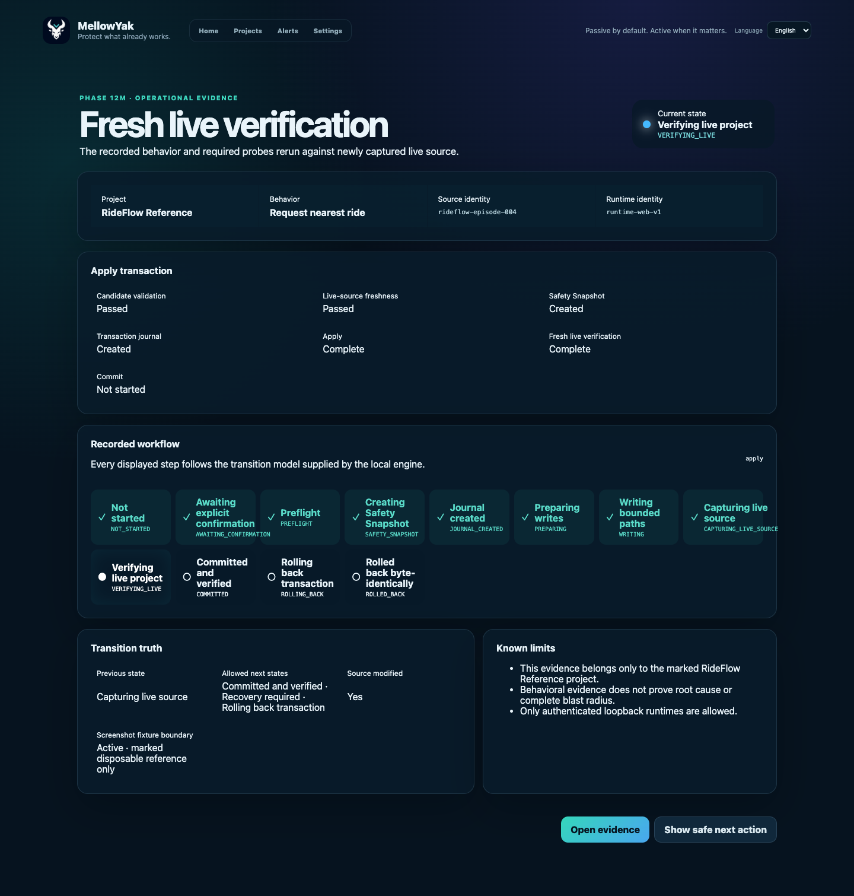

**Entity source:** freshly recaptured live source and rerun RideFlow behavior. **State:** Apply `VERIFYING_LIVE`; previous `CAPTURING_LIVE_SOURCE`; allowed next `COMMITTED`, `ROLLING_BACK`, or `RECOVERY_REQUIRED`. **Actions:** inspect current verification progress/evidence. **Known:** verification runs against the live project, not the workspace. **Unknown:** commit is not decided until the check completes. **Source modified:** yes. **Fixture active:** yes.

### 20 — Applied and verified

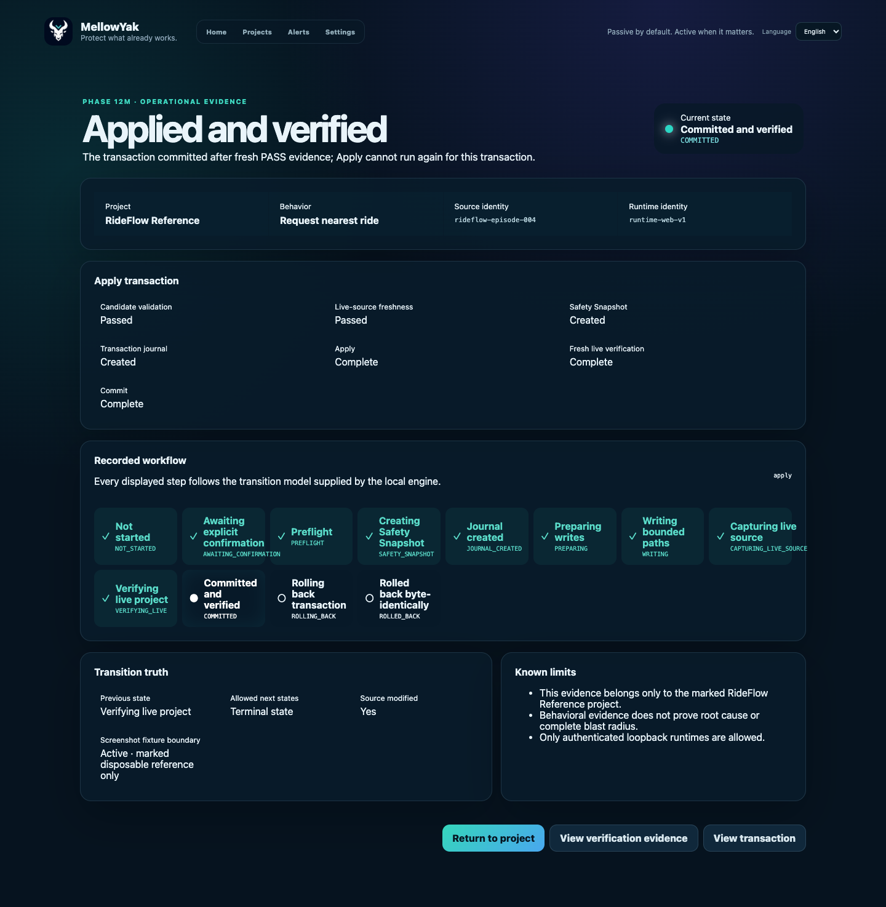

**Entity source:** successful RideFlow Apply transaction and fresh live PASS. **State:** Apply `COMMITTED`; previous `VERIFYING_LIVE`; terminal. **Actions:** return to project, view evidence, or inspect transaction. **Known:** confirmation, snapshot, journal, write, live capture, and PASS are complete. **Unknown:** no broader behavior coverage is implied. **Source modified:** yes, committed. **Fixture active:** yes.

### 21 — Post-check failed

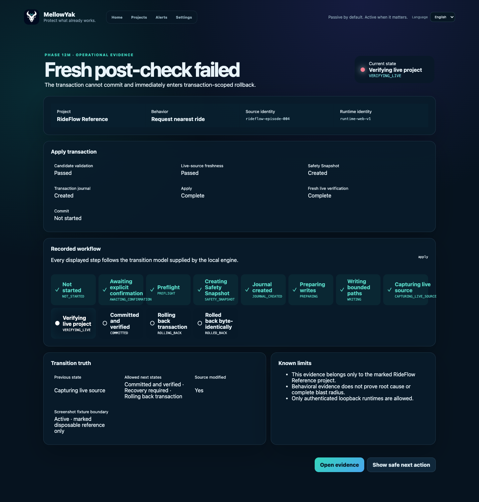

**Entity source:** separate RideFlow Apply transaction with a deliberately failing live post-check. **State:** Apply `VERIFYING_LIVE`; previous `CAPTURING_LIVE_SOURCE`; allowed next `COMMITTED`, `ROLLING_BACK`, or `RECOVERY_REQUIRED`. **Actions:** observe automatic transaction rollback path. **Known:** live post-check failed. **Unknown:** rollback byte identity is not claimed until verified. **Source modified:** yes. **Fixture active:** yes.

### 22 — Rollback running

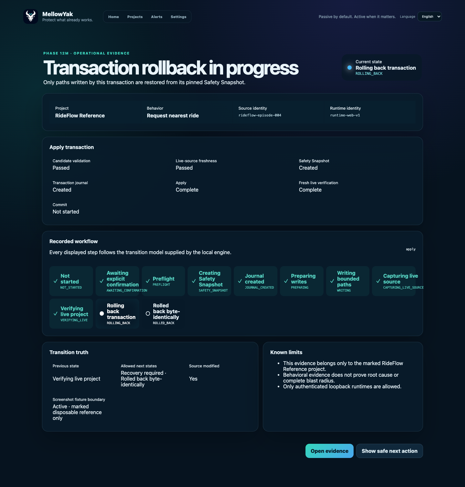

**Entity source:** failed-post-check transaction journal and Safety Snapshot. **State:** Apply `ROLLING_BACK`; previous `VERIFYING_LIVE`; allowed next `ROLLED_BACK` or `RECOVERY_REQUIRED`. **Actions:** observe recovery and avoid overlapping writes. **Known:** rollback is limited to transaction-owned paths. **Unknown:** final byte identity is pending. **Source modified:** yes during restoration. **Fixture active:** yes.

### 23 — Rolled back byte-identically

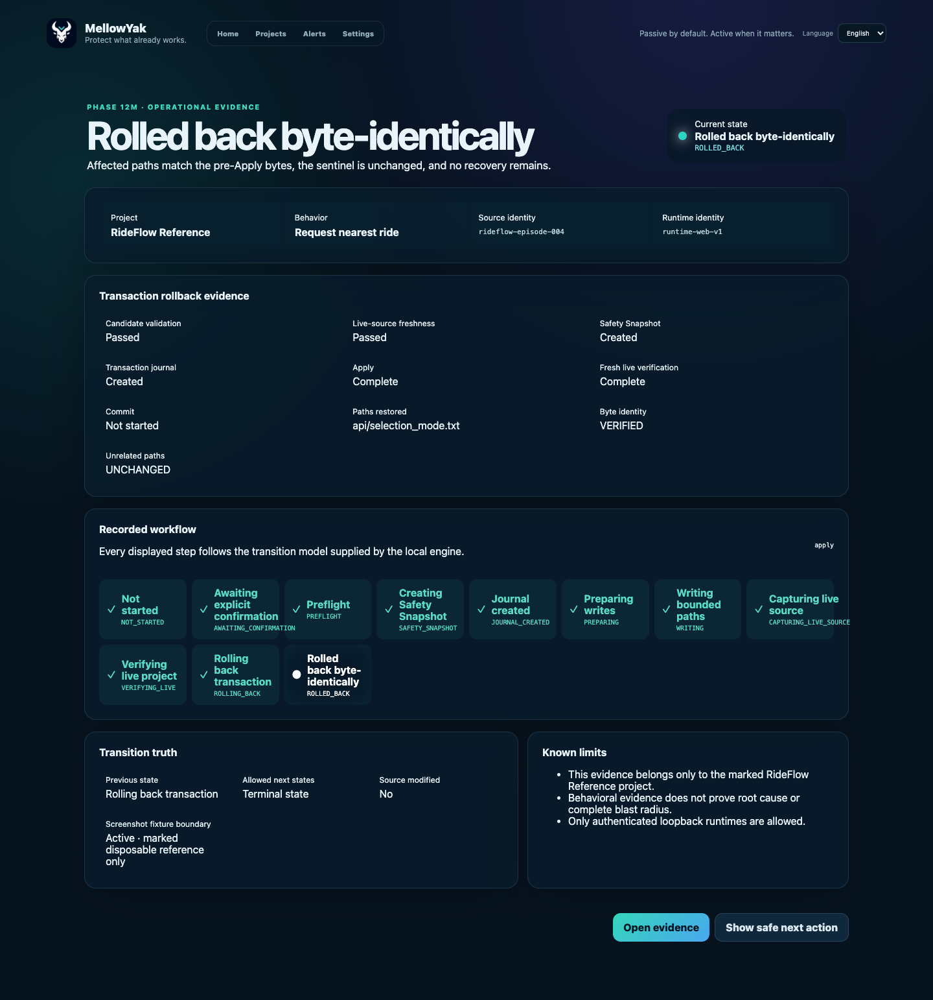

**Entity source:** rollback manifest, restored RideFlow bytes, candidate retention, and unrelated sentinel. **State:** Apply `ROLLED_BACK`; previous `ROLLING_BACK`; terminal. **Actions:** view transaction evidence or revisit retained candidate. **Known:** `api/selection_mode.txt` is byte-identical, sentinel is unchanged, no recovery is pending. **Unknown:** no customer-project inference. **Source modified:** no after restoration. **Fixture active:** yes.

### 24 — Home needs attention

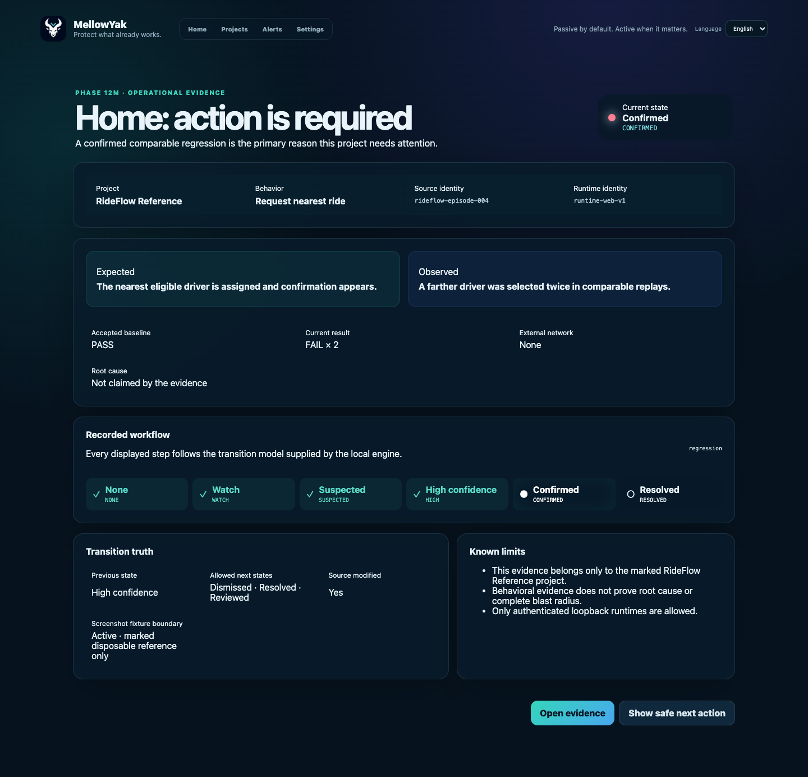

**Entity source:** RideFlow project summary joined to the confirmed RegressionFinding. **State:** Regression `CONFIRMED`; previous `HIGH`; allowed next `REVIEWED`, `DISMISSED`, or `RESOLVED`. **Actions:** open regression/evidence or create repair. **Known:** one confirmed comparable failure needs attention. **Unknown:** root cause and uncovered behaviors remain unknown. **Source modified:** yes. **Fixture active:** yes.

### 25 — Home resolved

**Entity source:** RideFlow project summary after verified Apply resolution. **State:** Regression `RESOLVED`; previous `CONFIRMED`; allowed next `WATCH`. **Actions:** inspect outcome or resume passive monitoring. **Known:** the protected behavior passed after the committed repair. **Unknown:** future Episodes and unprotected behavior remain open. **Source modified:** yes, resolved commit retained. **Fixture active:** yes.

### 26 — Diagnostics: ad-hoc signed

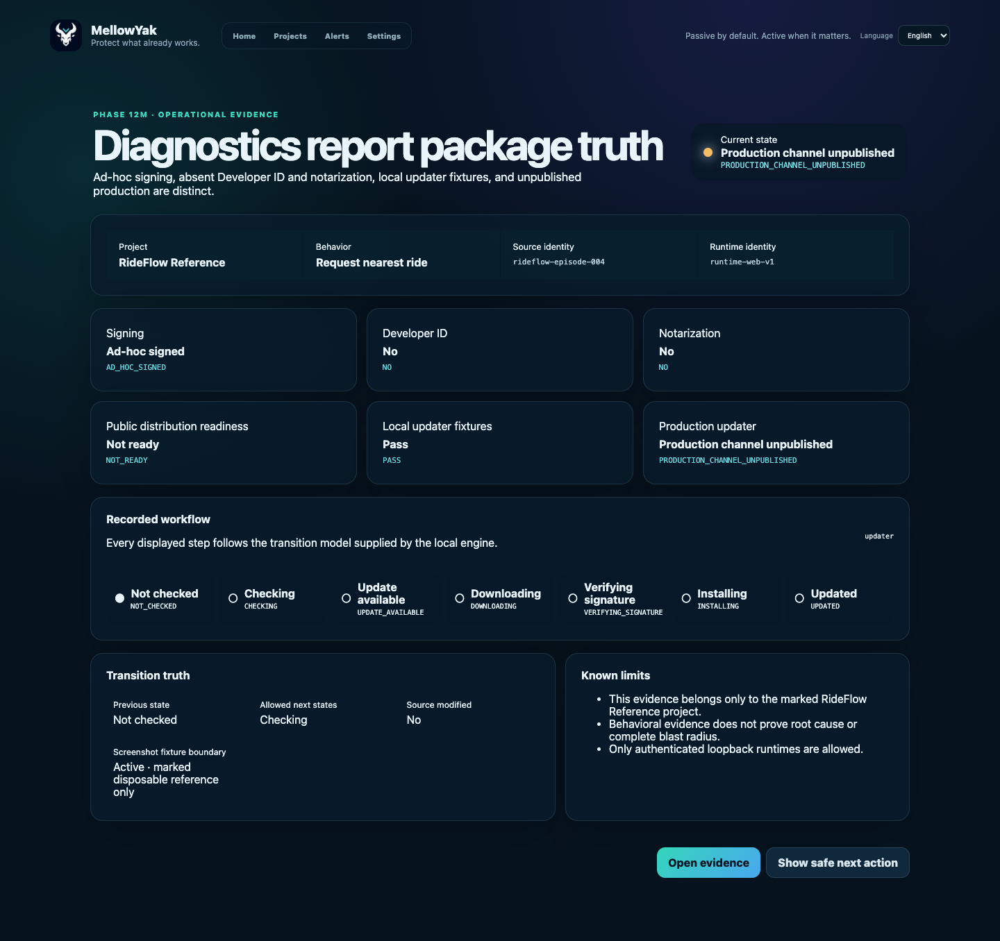

**Entity source:** current package diagnostics and updater configuration. **State:** Updater `PRODUCTION_CHANNEL_UNPUBLISHED`; previous `NOT_CHECKED`; allowed next `CHECKING`. **Actions:** inspect local diagnostics; do not expect a public update. **Known:** version `0.3.0-preview.1`, Intel package, ad-hoc signature, local engine/database readiness. **Unknown:** Developer ID, notarization, and public distribution are not verified. **Source modified:** no. **Fixture active:** yes.

### 27 — Updater not checked

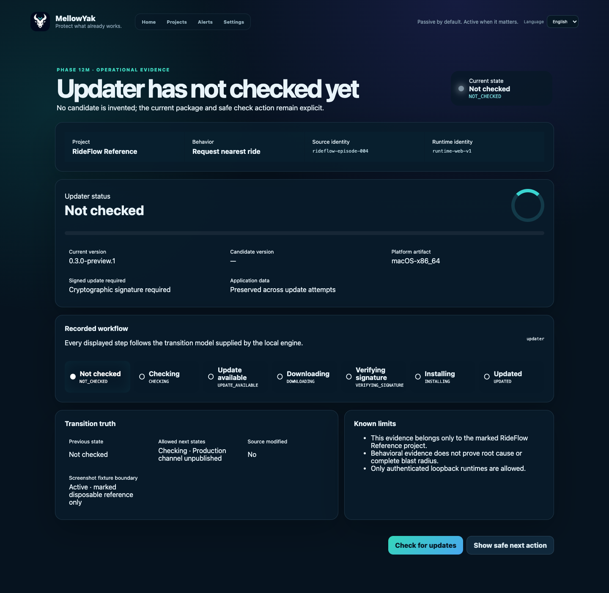

**Entity source:** signed local updater fixture state before a check. **State:** Updater `NOT_CHECKED`; previous `NOT_CHECKED`; allowed next `CHECKING` or `PRODUCTION_CHANNEL_UNPUBLISHED`. **Actions:** check for an update or review safe next action. **Known:** current version and platform artifact identity. **Unknown:** no candidate version yet. **Source modified:** no. **Fixture active:** yes.

### 28 — Update available

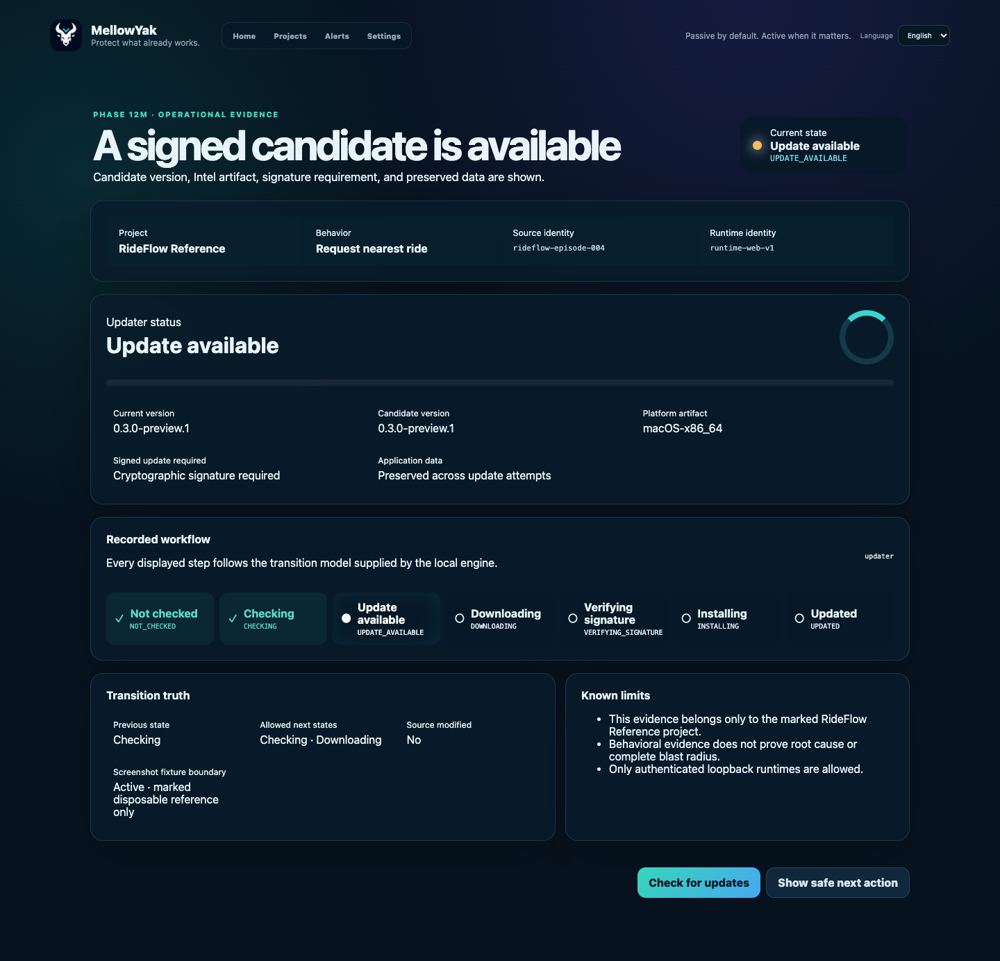

**Entity source:** signed local candidate manifest. **State:** Updater `UPDATE_AVAILABLE`; previous `CHECKING`; allowed next `DOWNLOADING` or `CHECKING`. **Actions:** download or recheck. **Known:** current/candidate versions, artifact, and signature policy. **Unknown:** bytes are not trusted until signature verification. **Source modified:** no. **Fixture active:** yes.

### 29 — Updater downloading

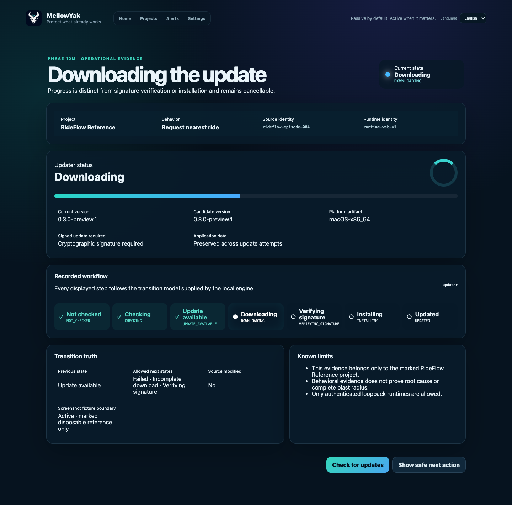

**Entity source:** bounded local updater fixture download. **State:** Updater `DOWNLOADING`; previous `UPDATE_AVAILABLE`; allowed next `VERIFYING_SIGNATURE`, `INCOMPLETE_DOWNLOAD`, or `FAILED`. **Actions:** observe progress or safely retry after an explicit failure. **Known:** candidate artifact is being acquired. **Unknown:** integrity is pending. **Source modified:** no. **Fixture active:** yes.

### 30 — Updater invalid signature

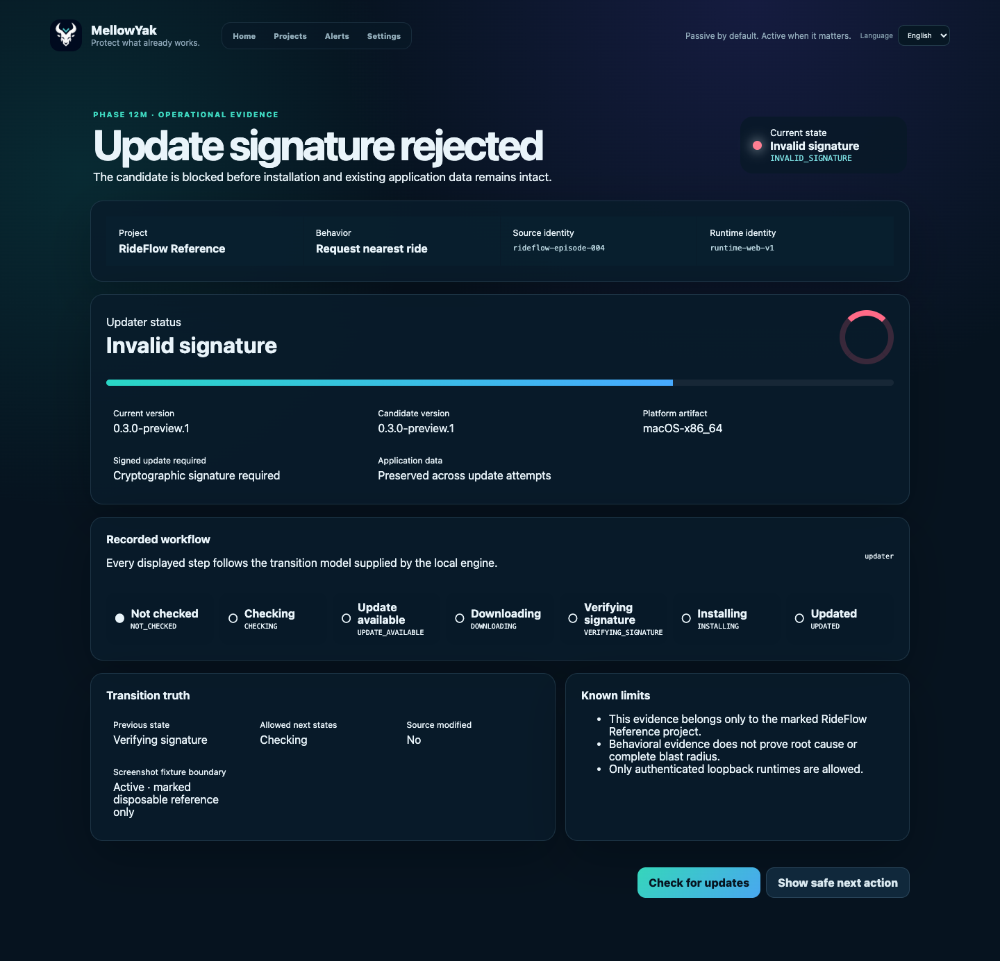

**Entity source:** intentionally tampered updater fixture. **State:** Updater `INVALID_SIGNATURE`; previous `VERIFYING_SIGNATURE`; allowed next `CHECKING`. **Actions:** reject candidate and recheck later. **Known:** installation did not proceed and user data is preserved. **Unknown:** no production candidate is implied. **Source modified:** no. **Fixture active:** yes.

### 31 — Updater updated

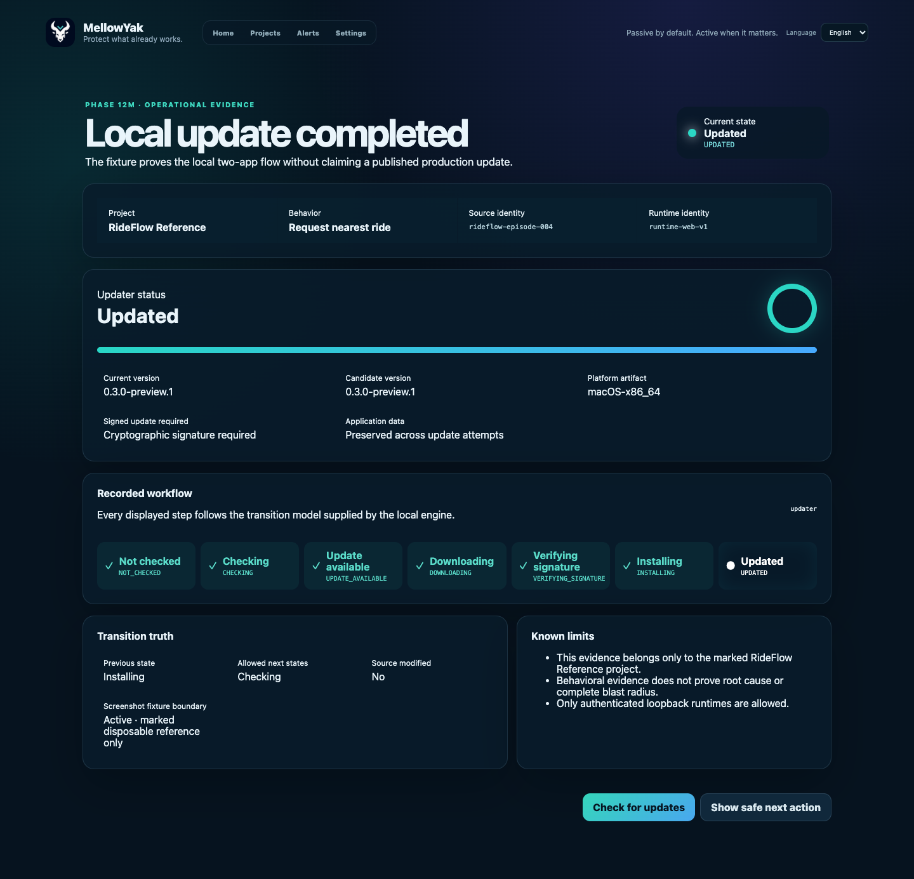

**Entity source:** successfully verified local updater fixture. **State:** Updater `UPDATED`; previous `INSTALLING`; allowed next `CHECKING`. **Actions:** reopen/recheck when appropriate. **Known:** signature policy passed and database/settings/project identity were preserved. **Unknown:** public updater publication remains absent. **Source modified:** no. **Fixture active:** yes.

### 32 — Manual macOS checklist

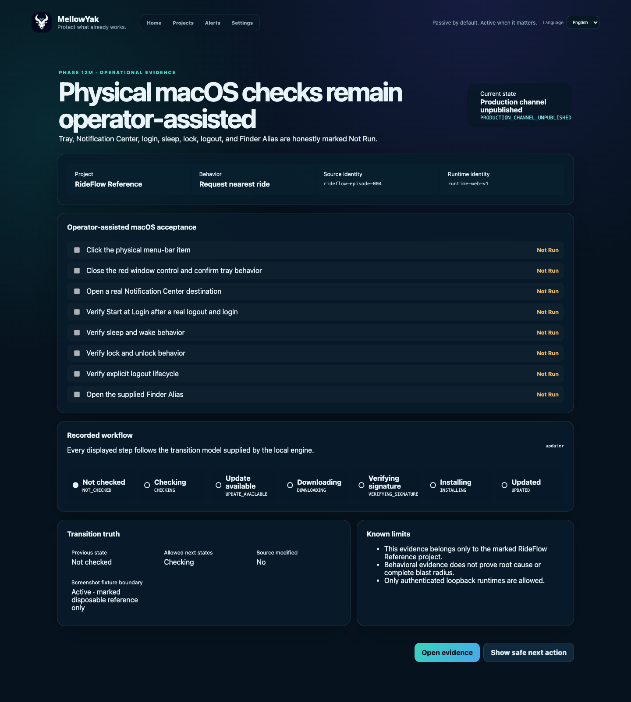

**Entity source:** bounded operator checklist, not automated evidence. **State:** Updater `PRODUCTION_CHANNEL_UNPUBLISHED`; previous `NOT_CHECKED`; allowed next `CHECKING`. **Actions:** physically perform and record tray, close, notification, login, sleep/wake, lock/unlock, logout, and Finder Alias checks. **Known:** implementation entry points exist. **Unknown:** every listed physical result remains Not Run. **Source modified:** no. **Fixture active:** yes.

### 33 — Hebrew Known Good

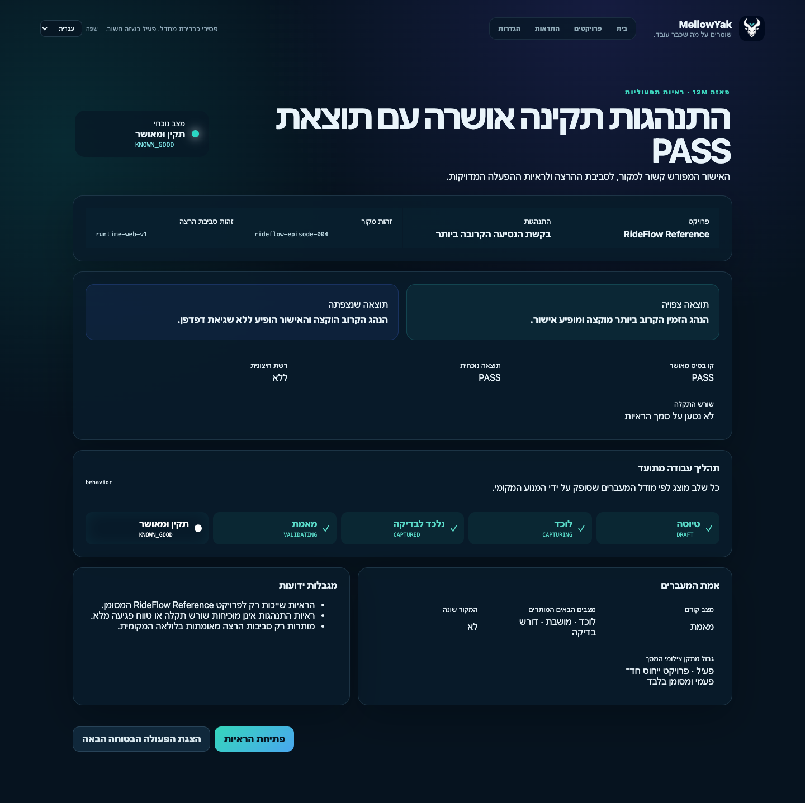

**Entity source:** the same RideFlow accepted baseline rendered through Hebrew translation keys. **State:** Behavior `KNOWN_GOOD`; previous `VALIDATING`; allowed next `CAPTURING`, `NEEDS_REVIEW`, or `DISABLED`. **Actions:** inspect evidence or rerun. **Known:** comparable PASS and RTL layout. **Unknown:** no private-project result. **Source modified:** no. **Fixture active:** yes.

### 34 — Hebrew regression

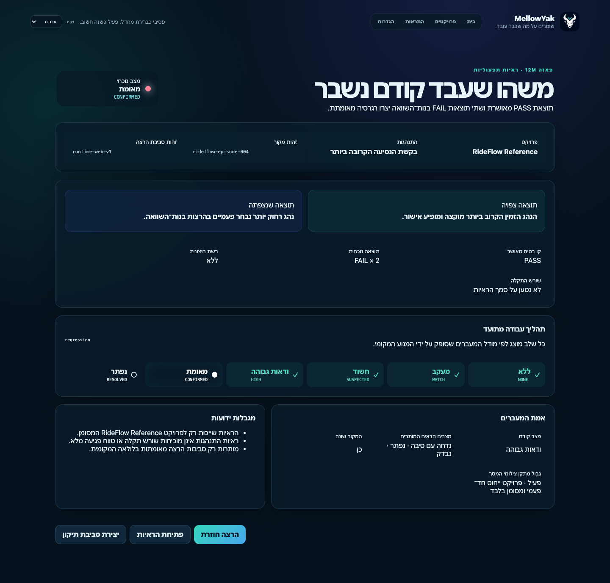

**Entity source:** the same confirmed RideFlow RegressionFinding rendered in Hebrew RTL. **State:** Regression `CONFIRMED`; previous `HIGH`; allowed next `REVIEWED`, `DISMISSED`, or `RESOLVED`. **Actions:** rerun, open evidence, or create repair. **Known:** repeated comparable failure. **Unknown:** root cause is not claimed. **Source modified:** yes. **Fixture active:** yes.

### 35 — Hebrew Apply confirmation

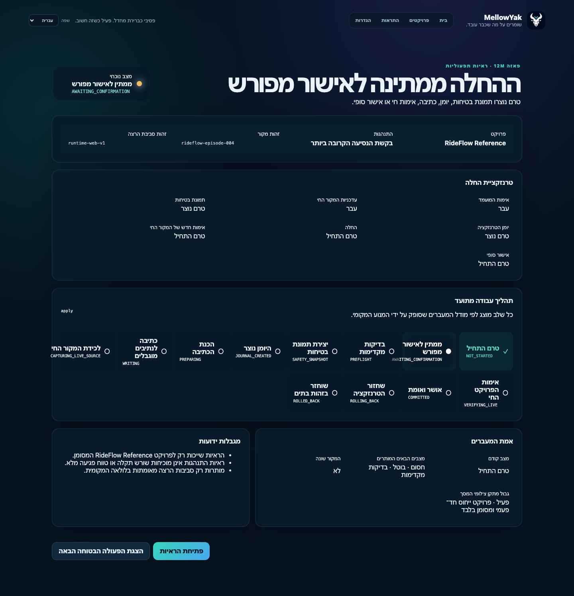

**Entity source:** validated RideFlow candidate at the explicit confirmation boundary, rendered in Hebrew RTL. **State:** Apply `AWAITING_CONFIRMATION`; previous `NOT_STARTED`; allowed next `PREFLIGHT`, `CANCELLED`, or `BLOCKED`. **Actions:** confirm or cancel by keyboard or pointer. **Known:** no snapshot, journal, or write yet. **Unknown:** live outcome. **Source modified:** no. **Fixture active:** yes.

### 36 — Hebrew rollback

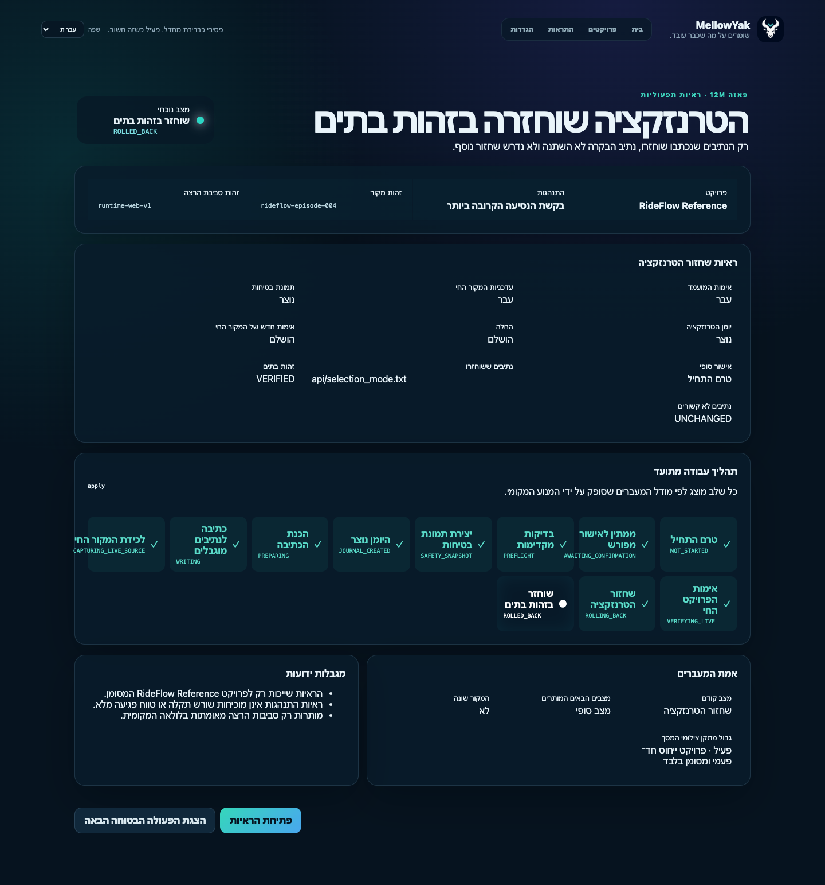

**Entity source:** completed RideFlow transaction rollback rendered in Hebrew RTL. **State:** Apply `ROLLED_BACK`; previous `ROLLING_BACK`; terminal. **Actions:** inspect transaction evidence or retained candidate. **Known:** byte identity verified and unrelated sentinel unchanged. **Unknown:** no broader project claim. **Source modified:** no after restoration. **Fixture active:** yes.

### 37 — Hebrew diagnostics

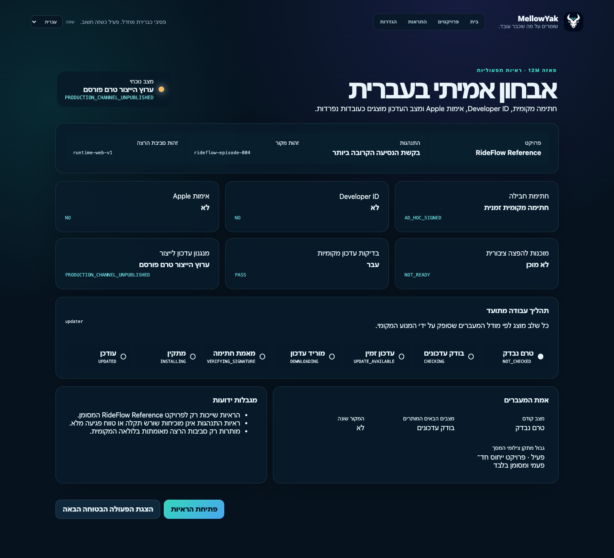

**Entity source:** current local package diagnostics rendered through Hebrew translation keys. **State:** Updater `PRODUCTION_CHANNEL_UNPUBLISHED`; previous `NOT_CHECKED`; allowed next `CHECKING`. **Actions:** inspect local diagnostics. **Known:** ad-hoc signing and unpublished updater are stated accurately; technical identifiers remain LTR. **Unknown:** Developer ID/notarization/public channel. **Source modified:** no. **Fixture active:** yes.

## 19. Delivery integrity

The delivery directory must contain exactly this Markdown file plus the 38 PNG files in `images/`. No PDF, JSON, database, package, source snapshot, evidence byte, browser profile, workspace, journal, recovery bundle, support bundle, private key, or absolute user-home path belongs here.
