# MellowYak Phase 13M Master Report

This is the single consolidated implementation report, operator guide, and screenshot guide for Phase 13M — Passive Sentinel, Automatic Rechecks, Noise Control, and Impact Memory. The companion `images/` directory contains only English product screenshots. Hebrew remains fully implemented in the translation catalog and renders RTL, but duplicate Hebrew screenshots were intentionally omitted at the operator's request.

## 1. תוצאה

Phase 13M implementation is present on the local branch. The watcher now feeds one authoritative settled-Episode callback; orchestration runs, jobs, attempts, policy revisions, recovery records, Impact Memory, flakiness state, and alert deduplication are persistent. A bounded two-worker scheduler serializes each project, rejects stale source identities, and never writes live source. The product exposes real monitoring settings and a complete translated truth surface.

Status is **IMPLEMENTED / OPERATOR MANUAL ACCEPTANCE PENDING**. The operator explicitly stopped further automated and packaged acceptance. Consequently this report does not call the phase verified, does not bump `0.3.0-preview.1`, and does not create the verified tag.

## 2. מקור ו־Git

- Repository: `https://github.com/MellowYAK/mellowyak.git`
- Starting branch: `product/live-behavior-reference-acceptance`
- Starting commit: `fd62f1fd87f308dc329ac9838d09255ec118edc7`
- Starting annotated tag: `phase-12m-live-behavior-verified-2026-08-26`
- Working branch: `product/passive-sentinel-orchestration`
- Remote unchanged: `origin` points to the public MellowYak repository.
- Push, GitHub Release, updater publication, remote mutation, and APC changes: not performed.
- Unrelated untracked `docs/phase-5-delivery/screenshots/* alias` files were preserved and excluded.

## 3. Baseline

The Phase 12M tag resolved exactly to the expected commit before the new branch was created. Recorded baseline results were: Python `191 passed, 1 warning`; React/Vitest `28 passed`; 219 total source tests; TypeScript passed; Vite passed; translation policy `UI_TRANSLATION_KEYS_ONLY`; migration head `0009_technical_preview_readiness`. Baseline toolchain was Node `22.23.2`, npm `10.9.8`, Python `3.11.5`, Rust/Cargo `1.98.0`, macOS `26.5.2`, Intel `x86_64`.

## 4. מחקר טכני

Bounded research informed implementation decisions:

- [Apple FSEvents Programming Guide](https://developer.apple.com/library/archive/documentation/Darwin/Conceptual/FSEvents_ProgGuide/Introduction/Introduction.html): filesystem events may be coalesced, so MellowYak treats writes as hints and waits for a stable Episode.
- [Apple File System Events](https://developer.apple.com/documentation/coreservices/file_system_events): watcher gaps and rescan conditions require snapshot truth rather than assuming event completeness.
- [Python asyncio subprocesses](https://docs.python.org/3/library/asyncio-subprocess.html): approved executables and argv remain structured; timeout and captured output stay bounded.
- [SQLite WAL](https://www.sqlite.org/wal.html): persistent orchestration uses short transactions and one durable local source of truth.
- [Tauri v2 events](https://v2.tauri.app/develop/calling-frontend/): the shell receives meaningful local state transitions rather than a busy polling loop.
- [WCAG 2.2 status messages](https://www.w3.org/WAI/WCAG22/Understanding/status-messages.html): only meaningful changes use polite status announcements.
- [Rust notify](https://docs.rs/notify/latest/notify/): platform watcher behavior reinforces the need for debounce, settle, and source-identity checks.

## 5. Orchestration Audit

The pre-phase system had all required facts but no single post-settle owner. Phase 13M binds `MonitoringService → EpisodeService → SnapshotService → ProbeService` through `OrchestrationService.handle_episode`. Existing behavior links and Impact selection remain authoritative; the new layer schedules and records decisions instead of inventing a second impact engine. The implementation plan was: establish policy revisions, persist queue/run state, connect the Episode callback, add classification and deduplication, expose APIs, add operational UI, expand RideFlow, and consolidate delivery.

## 6. Passive Sentinel

The Sentinel is passive by default. Source observation remains active while project mode defaults to `ASK_BEFORE_CHECKS`. An Episode can therefore create a snapshot and Impact Plan without silently launching a runtime. Automatic Apply, repair generation, source mutation, commit, push, deployment, and cloud transfer remain impossible in this path. Ordinary editing is fail-open: a watcher, scheduler, runtime, or Probe error records a limitation but does not block file writes.

## 7. Episode Pipeline

Low-level changes publish `filesystem_burst_observed`. Episode grouping publishes settling state, uses a 2-second quiet window and 60-second ceiling, then creates one immutable resulting snapshot. Only after the snapshot exists does orchestration bind the Episode, exact source identity, runtime profile versions, policy versions, selected Probe versions, evidence references, selected behaviors, and omitted behaviors. Newer source identities mark older queued/deferred jobs `STALE`.

## 8. Monitoring Policies

Three immutable revision tables implement explicit controls:

- Global: observation, automatic checking, project/probe/browser concurrency, runtime budget, activity/battery/quiet defaults, runtime-start default, and notifications.
- Project: `OBSERVE_ONLY`, `ASK_BEFORE_CHECKS`, `AUTO_SAFE`, `MANUAL_ONLY`, or `PAUSED`, plus settle/budget/runtime/network/resource controls.
- Behavior: `AUTOMATIC`, `ASK`, `MANUAL_ONLY`, or `DISABLED`, plus retry, duration, runtime eligibility, sentinel, escalation, flaky handling, and resolution.

There is no ambiguous “Autopilot” switch. Project and behavior policy must explicitly permit automatic work.

## 9. Automatic Eligibility

Eligibility requires an active connected project, enabled global automatic checks, project `AUTO_SAFE`, behavior `AUTOMATIC`, approved Probe version, accepted Known Good milestone for that Probe version, and explicit automatic runtime permission when a runtime is needed. Battery Saver defers noncritical Browser work. Every denial/defer returns reason codes and exact policy revisions. Quiet Mode affects delivery, not monitoring truth.

## 10. Scheduler

`SchedulerService` is SQLite-backed and restart-aware. It enforces at most two workers globally and one active job per project. Ordering uses bounded priority then creation time, so a project with many behaviors cannot consume both workers. The `(probe_version_id, source_identity_digest)` uniqueness boundary prevents duplicate execution. States include queued, running, deferred, completed, failed, stale, blocked, and cancelled. Operators can inspect, cancel, pause, resume, and run currently eligible deferred work.

## 11. Runtime Lifecycle

Automatic Probe execution reuses the existing approved Runtime Profile and Probe adapters. Runtime profile version and source snapshot are persisted on the job. No shell concatenation or new runtime discovery was added. Missing/unavailable runtime evidence remains inconclusive or runtime-unavailable and cannot become a confirmed regression. The scheduler always rechecks that the latest snapshot digest still matches before starting.

## 12. Resource and Battery Control

Global project/probe/browser concurrency, project check count and duration, behavior timeout/retry, activity mode, and browser-on-battery rules provide layered bounds. Battery Saver keeps observation, Episodes, snapshots, Impact, and critical sentinel work alive while deferring optional Browser work with a visible reason. Returning to Normal resumes only work still current for the latest source identity.

## 13. Impact Memory

Impact Memory records evidence-backed source-key-to-behavior relations with provenance (`EXPLICIT_BEHAVIOR_LINK`, `STATIC_RELATION`, `TEST_RELATION`, `HISTORICAL_PASS`, or `HISTORICAL_FAILURE`), source identity, optional runtime scope, evidence reference, reason, and observed times. A pass never erases a direct relation. The UI explicitly states that history can prioritize checks but does not prove causation.

## 14. Fan-Out Selection

Existing deterministic Impact selection remains the candidate source. Project policy limits selected checks per Episode. Critical/sentinel candidates receive higher queue priority; unselected configured Probes remain visible as omitted and unknown. The product never says omitted behaviors passed and never claims that every dependent route was verified.

## 15. Flakiness and Retry

Each Probe Run retains its attempts. `FAIL → PASS` is `FLAKY`; two comparable failures with matching observations are `CONFIRMED`; differing failures are `NEEDS_REVIEW`; cancellation and inconclusive evidence remain distinct. Flakiness history is persisted by Probe and source identity with a bounded quarantine threshold. Retry attempts do not create independent user incidents.

## 16. Alert Deduplication

Confirmed Probe alerts now use a stable SHA-256 identity over project, behavior, accepted baseline, current source identity, and incident category instead of a new regression UUID. Reoccurrence updates the existing alert route and latest related IDs. A separate deduplication record stores occurrence count and delivery state. This prevents retry storms while retaining immutable attempts and evidence.

## 17. Restart Recovery

On startup, queued and running jobs are audited. Stale snapshot identities become `STALE`. Interrupted safe idempotent jobs return to `QUEUED`; unsafe work becomes `BLOCKED`. A recovery record captures recovered, stale, and interrupted counts. Recovery does not confuse scheduler work with Phase 8 Apply transaction recovery and never resumes live writes.

## 18. RideFlow Behaviors

The marked, disposable, loopback-only RideFlow generator now models four protected behaviors:

1. Request nearest ride — deterministic distance selects the nearest available driver.
2. Driver becomes available — a deterministic local driver becomes eligible.
3. Cancel ride — ride becomes cancelled and the assigned driver is released.
4. Fare preview — deterministic route distance produces a stable reference fare.

It includes driver eligibility, geo distance, ride transitions, fare calculation, presentation UI, shared API path, and lockfile. It has no credentials, maps, GPS, database, payment provider, Docker, or external network.

## 19. Harmless Change

The intended presentation-only flow groups a style/copy burst into one Episode and one snapshot. Impact can omit all functional behaviors or choose an explicitly linked UI sentinel. A passing/omitted result creates no regression and no native alert. This scenario is implemented in orchestration and represented in screenshots; post-implementation packaged execution is left to the manual operator.

## 20. Controlled Regression

The intended reversible driver-eligibility mutation selects `Driver becomes available` and `Request nearest ride`, retries within one Probe Run, and creates one stable confirmed incident only after comparable repeated failure. The code path and truth surfaces are implemented; the operator will perform final mutation acceptance manually.

## 21. Flaky Scenario

The classifier preserves a first failure followed by a passing retry as `FLAKY`, stores both attempts, avoids a confirmed regression, and exposes the uncertainty. It does not hide the first failure or repeatedly notify. Final runtime exercise is manual by operator direction.

## 22. Runtime Unavailable

Runtime startup/adaptor failures fail open and remain inconclusive/runtime-unavailable. They do not satisfy reproducible regression criteria, do not modify source, and provide a safe inspect/retry action. Final packaged runtime-unavailable exercise is manual.

## 23. Rapid-Write Episode

Debounce/settle behavior is designed to turn a rapid write burst into one Episode, one resulting snapshot, and one Impact Plan. The maximum Episode duration prevents indefinite settling. Low-level writes are not individually announced or alerted.

## 24. Superseded Job

Enqueueing work for a new digest marks older queued/deferred work for that project stale. Before execution, the worker compares the job digest with the latest `SourceSnapshot`. A stale result cannot classify newer source, and only current safe work can recover after restart.

## 25. Quiet Mode

Quiet Mode remains a delivery policy: evidence, orchestration, and in-app incidents persist; native delivery may be suppressed. It never pauses monitoring or discards a confirmed local fact. Critical override remains governed by the existing notification preference.

## 26. Background UI

The operational UI shows current/previous state, effective policy, exact source identity, selected/omitted behavior counts, activity mode, queue state, meaningful timeline, known facts, unknowns, and one safe next action. The real Settings page reads and writes global policy revisions through the production API. Fixture routes are marker-gated and do not appear in ordinary workflows.

## 27. Tray

Existing native tray integration consumes meaningful local events. `NEEDS_ATTENTION` is tied to a persisted incident rather than filesystem noise. No new tray polling loop was introduced. The screenshots describe product truth but are not claimed as physical Notification Center interaction evidence.

## 28. Notifications

Only meaningful confirmed/blocked conditions are eligible for native delivery under existing preferences and Quiet Mode. Passes, individual retries, stale jobs, ordinary writes, and omitted behaviors do not notify. Stable deduplication prevents repeat delivery for the same incident identity; restarts do not reinterpret history as new.

## 29. Database and API

Migration `0010_passive_sentinel_orchestration` adds ten non-empty persistence tables without altering Phase 1–12M tables. New bearer-protected routes cover global/project/behavior policy, orchestration list/detail/pause/resume/run-now, queue list/detail/cancel, Episode Impact Plan, and Impact Memory. The deterministic OpenAPI contract and TypeScript client were regenerated. Existing local-only SQLite and loopback bearer boundaries remain unchanged.

## 30. English and Hebrew

All new visible copy is retrieved with translation keys. English is the base catalog; Hebrew contains the same key set and uses document-level RTL while technical IDs remain LTR. The four Hebrew capture states remain implemented for deterministic review, but only English screenshots are delivered per operator instruction. No Phase 13M GUI sentence was added as hardcoded JSX text.

## 31. Accessibility

The surfaces use semantic headings, labeled progress, native controls, readable focus behavior inherited from the product shell, high-contrast status differences, and `aria-live="polite"` only for meaningful policy/orchestration status. State is not communicated by color alone. Technical values use LTR code tokens inside RTL layouts. Reduced-motion capture and responsive layout remain supported.

## 32. Security and Privacy

The orchestration path is local-only, bearer protected, loopback bound, and source-identity scoped. It stores structured facts, IDs, hashes, policy, and evidence references—not source bytes—in orchestration tables. It does not upload, log credentials, expose absolute paths in screenshots, run shell strings, alter live source, Apply, rollback, commit, push, deploy, or call a model/provider. RideFlow is marked synthetic and disposable.

## 33. Portability

Shared Python/React/SQLite logic contains no `/Users/...` assumptions, no macOS-only core API, and no requirement that Git exists. Runtime command structure remains executable plus argv. Path handling continues through `pathlib` and existing safe-resolution services. This phase was developed on Intel macOS only and does not claim Apple Silicon, Windows, or Linux runtime acceptance.

## 34. Performance

The hot path performs one post-settle selection and short SQLite writes. Worker count is capped at two; per-project concurrency is one; selection and changed-path recording are bounded; idle workers wait on a condition; tray uses events rather than busy polling. No post-implementation performance benchmark was run because the operator ended automated acceptance.

## 35. Tests and Exact Results

Exact Phase 12M baseline: Python `191 passed, 1 warning` in `123.92s`; React `28 passed` in `21.30s`; TypeScript, Vite, Ruff, translation-key policy, OpenAPI determinism, migration matrix, and packaged Phase 12M passed.

After Phase 13M implementation, only non-suite completion checks requested for safe authoring were performed: TypeScript compile passed; Ruff static check passed; the language-policy checker returned `UI_TRANSLATION_KEYS_ONLY`; OpenAPI export migrated a fresh temporary database through `0010`; generated TypeScript contract compiled; all 34 English screenshots rendered. The operator explicitly directed that remaining automated/package tests not run and be performed manually. Therefore Phase 13M packaged acceptance and prior packaged regression validators are **NOT RUN after the final implementation**.

## 36. Packaging

No final Phase 13M `.app` or DMG was built after implementation because the mandatory validation sequence was stopped by operator direction. No package was added to Git or this delivery directory. Existing package outputs remain previous-phase artifacts and are not reused as Phase 13M evidence.

## 37. Installation

`/Applications/MellowYak.app` was not replaced during this final pass. The existing safe installer retains recoverable previous app bundles, but running it now would misleadingly imply package acceptance. Installation of the current Phase 13M source is an operator-manual next action after validation.

## 38. Screenshots and Delivery

All screenshots use the synthetic marker `mellowyak.phase13.screenshots.v1`, do not use a registered private project, and never modify source. The displayed RideFlow identities are synthetic. Each page below explains purpose, options, expected behavior, and truth boundaries.

### 00 — Monitoring policy default

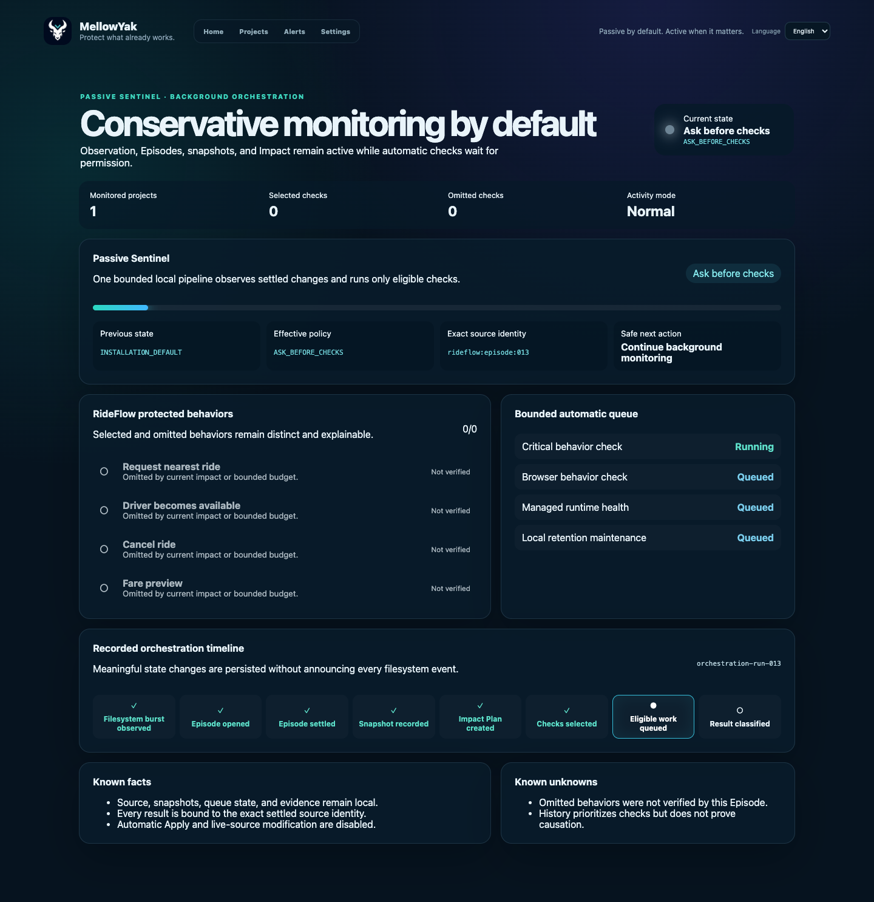

Backing entity: global/project policy revision. Previous → current: `INSTALLATION_DEFAULT → ASK_BEFORE_CHECKS`; allowed next: `OBSERVE_ONLY`, `ASK_BEFORE_CHECKS`, `AUTO_SAFE`, `PAUSED`; policy: ask-first; selected/omitted: 0/4. Known: observation stays active. Unknown: behavior outcomes. Source modification: none. Safe action: inspect policy or explicitly enable bounded checks.

### 01 — Project automatic policy

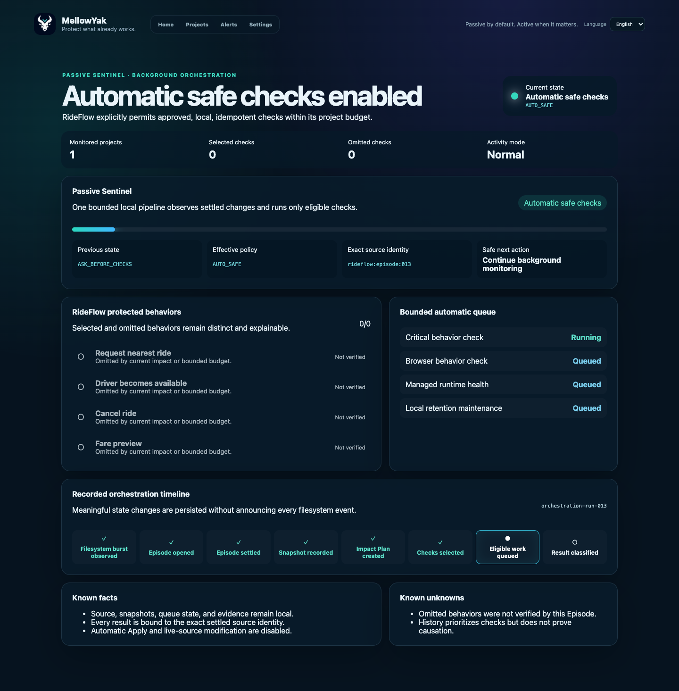

Backing entity: project policy revision. Previous → current: `ASK_BEFORE_CHECKS → AUTO_SAFE`; allowed next: `QUEUED`, `PAUSED`, `ASK_BEFORE_CHECKS`; selected/omitted: 0/4. Known: project permits eligible safe checks. Unknown: individual behavior eligibility. Source modification: none. Safe action: configure behavior policy.

### 02 — Behavior automatic policy

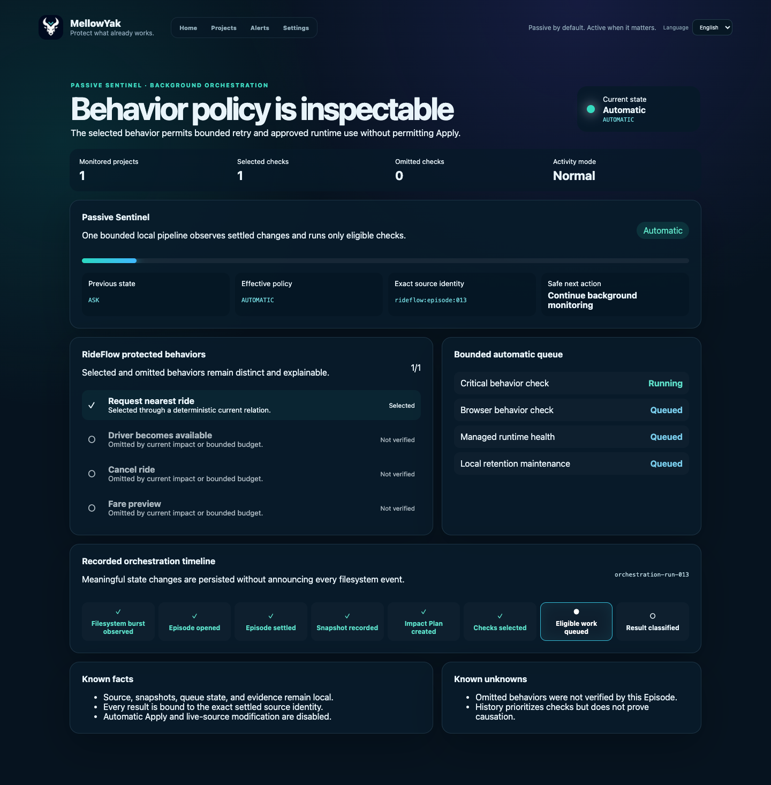

Backing entity: behavior policy revision. Previous → current: `ASK → AUTOMATIC`; allowed next: `QUEUED`, `DEFERRED`, `WAITING_FOR_POLICY`; project policy: `AUTO_SAFE`; selected/omitted: 0/4. Known: one behavior is permitted. Unknown: runtime/baseline readiness. Source modification: none. Safe action: inspect eligibility.

### 03 — Passive monitoring idle

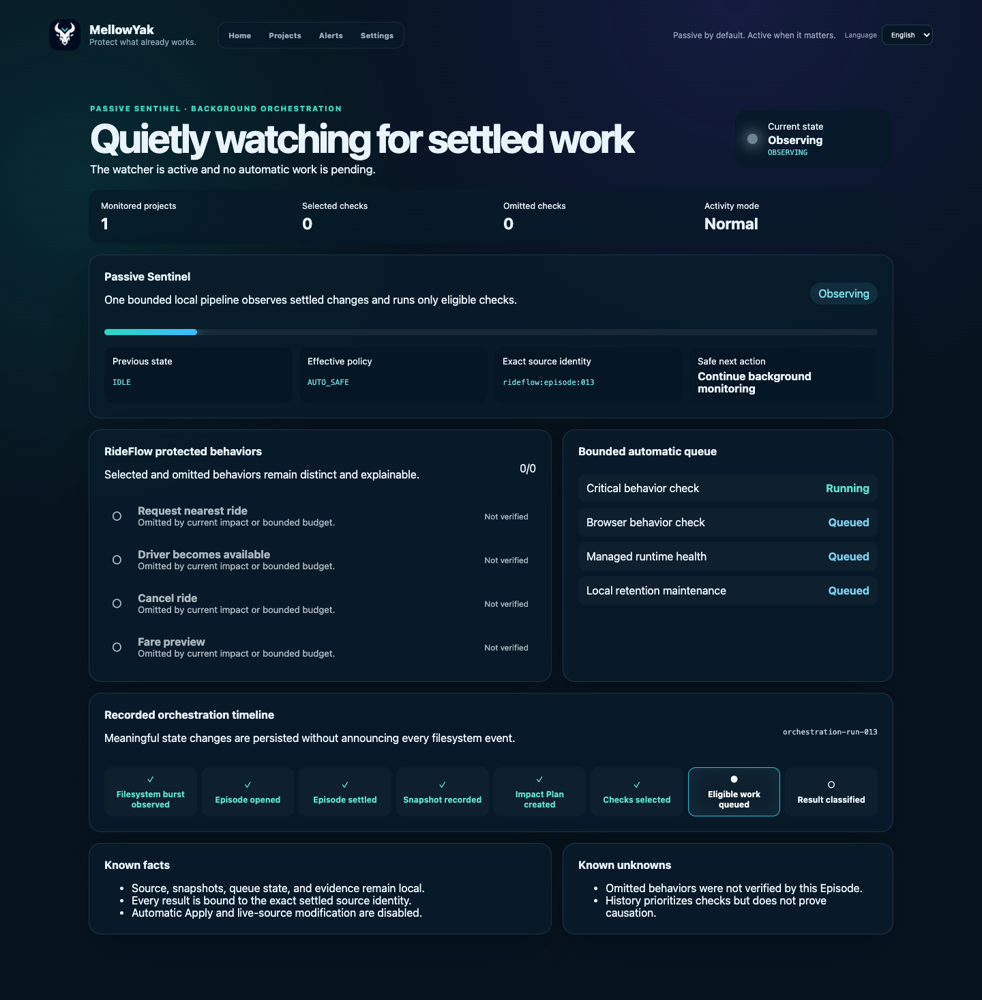

Backing entity: watcher/project state. Previous → current: `OBSERVING → IDLE`; allowed next: `OBSERVING`, `PAUSED`; project policy: `AUTO_SAFE`; selected/omitted: 0/4. Known: watcher is active and queue empty. Unknown: future impact. Source modification: none. Safe action: continue working normally.

### 04 — Filesystem burst observed

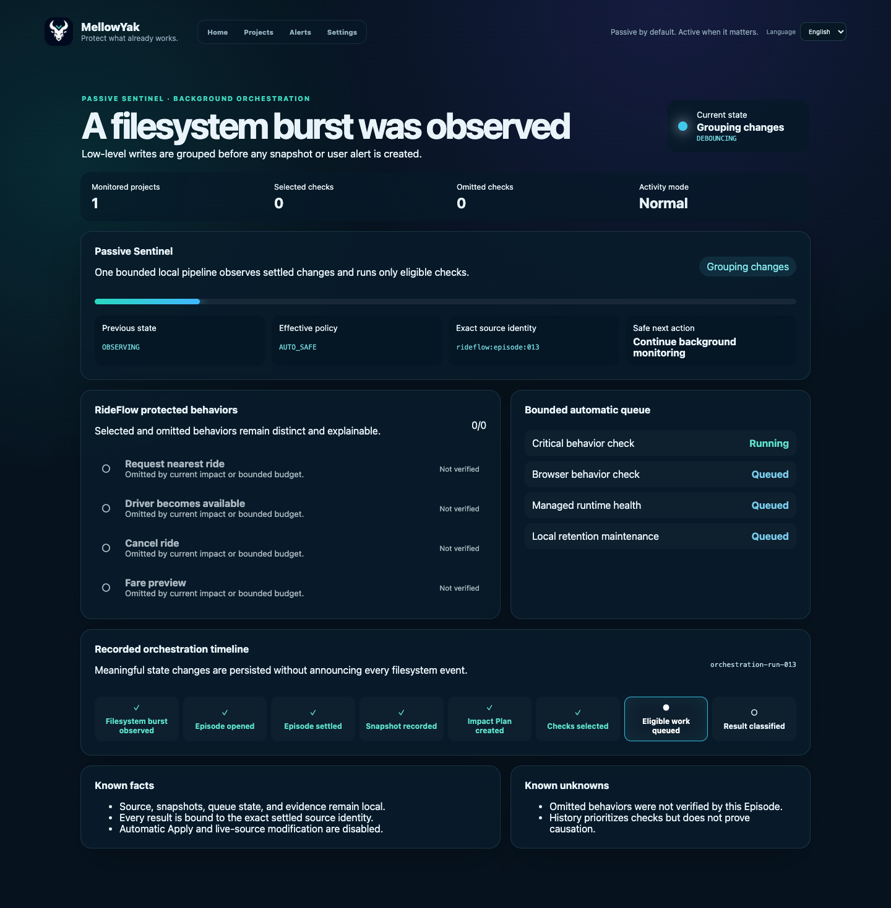

Backing entity: local watcher event. Previous → current: `IDLE → OBSERVING`; allowed next: `DEBOUNCING`, `IDLE`; policy: `AUTO_SAFE`; selected/omitted: 0/4. Known: a burst occurred. Unknown: final changed paths. Source modification: observed only. Safe action: let the edit settle.

### 05 — Episode settling

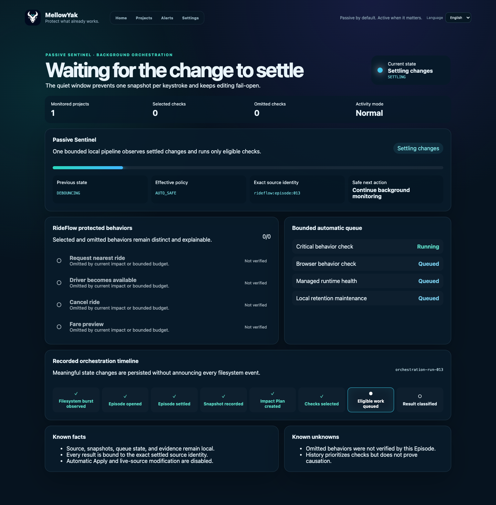

Backing entity: open `SourceEpisode`. Previous → current: `DEBOUNCING → SETTLING`; allowed next: `SNAPSHOTTING`, continued `SETTLING`; policy: `AUTO_SAFE`; selected/omitted: 0/4. Known: events are being coalesced. Unknown: stable source digest. Source modification: observed only. Safe action: continue editing or wait.

### 06 — Episode stabilized

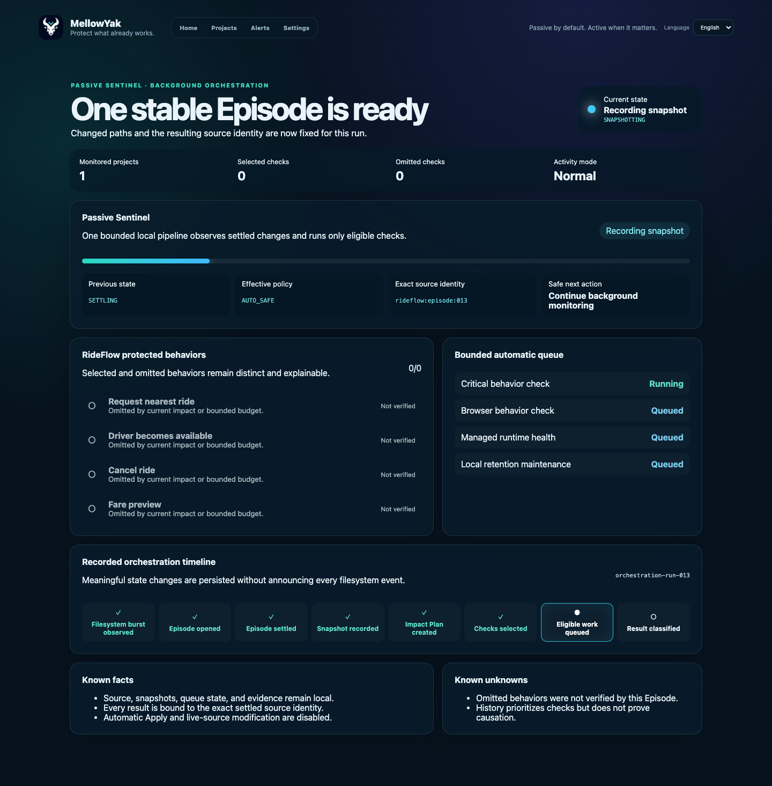

Backing entity: settled Episode/resulting snapshot. Previous → current: `SETTLING → SNAPSHOTTING`; allowed next: `ANALYZING_IMPACT`; policy: `AUTO_SAFE`; selected/omitted: 0/4. Known: one stable source identity exists. Unknown: affected behaviors. Source modification: none by MellowYak. Safe action: allow Impact analysis.

### 07 — Impact Plan created

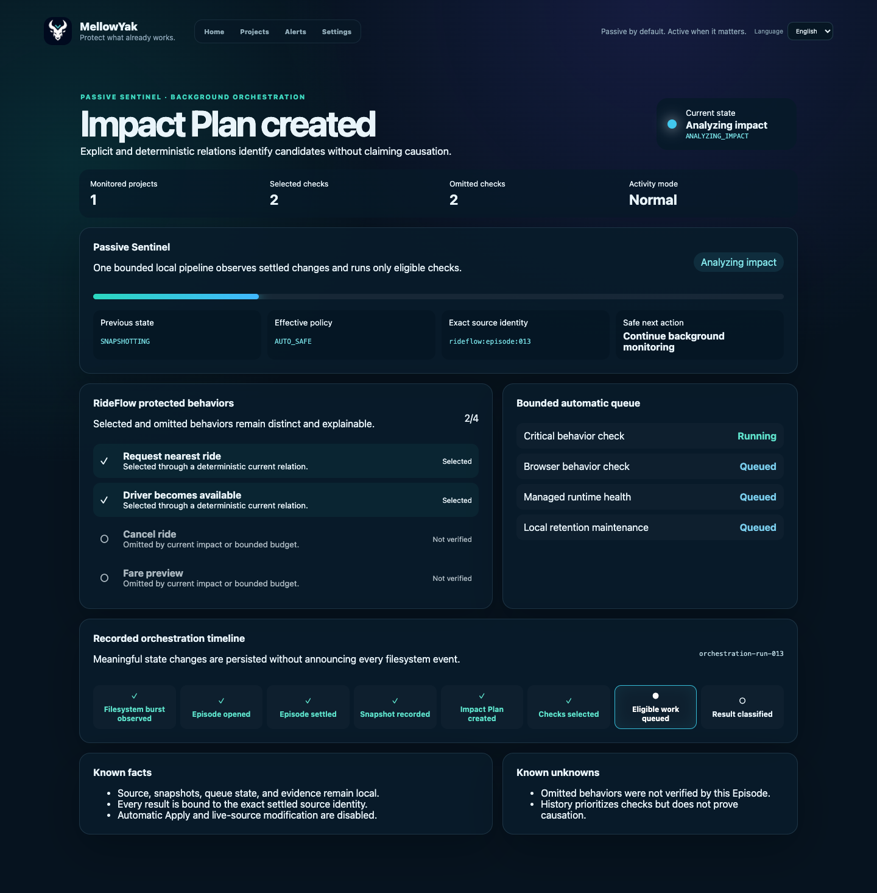

Backing entity: orchestration run plus Impact Plan. Previous → current: `SNAPSHOTTING → ANALYZING_IMPACT`; allowed next: `BUILDING_PLAN`, `WAITING_FOR_POLICY`; policy: `AUTO_SAFE`; selected/omitted: 2/2. Known: deterministic relations. Unknown: omitted outcomes. Source modification: none. Safe action: inspect reasons.

### 08 — Checks selected and omitted

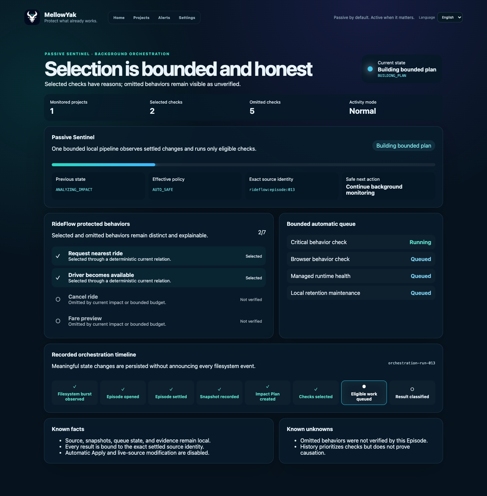

Backing entity: persisted selection. Previous → current: `ANALYZING_IMPACT → BUILDING_PLAN`; allowed next: `QUEUED`, `WAITING_FOR_POLICY`, `DEFERRED`; policy: `AUTO_SAFE`; selected/omitted: 2/2. Known: explicit selected reasons. Unknown: omitted behaviors remain unverified. Source modification: none. Safe action: accept bounded selection or run manually.

### 09 — Automatic check queued

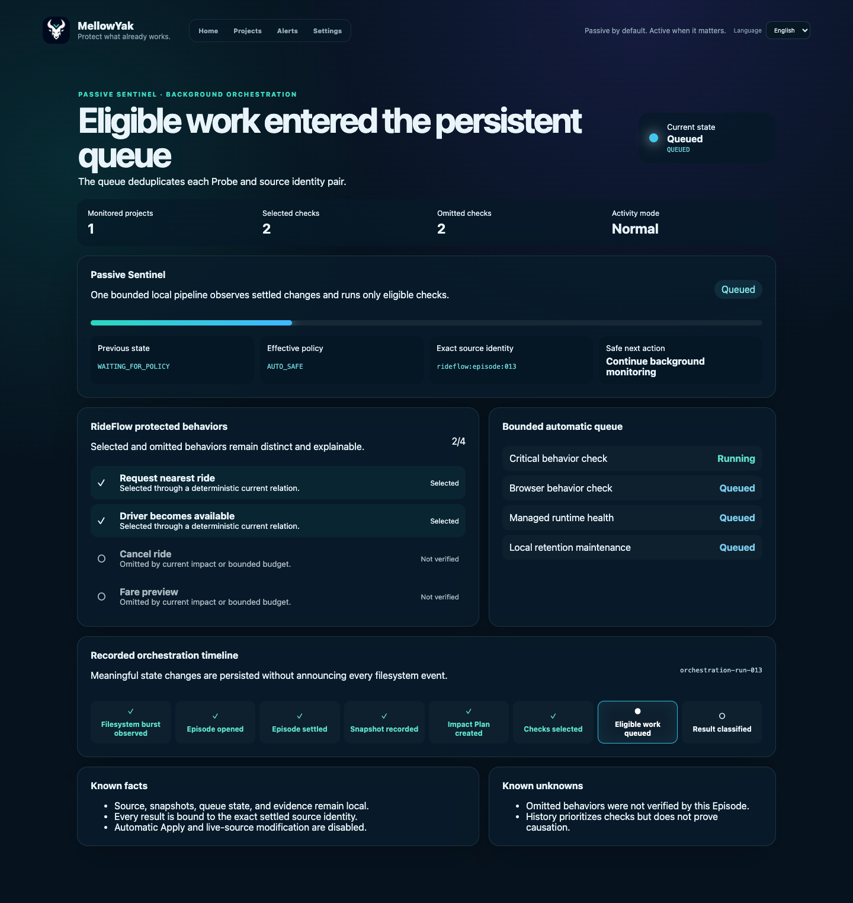

Backing entity: orchestration job. Previous → current: `BUILDING_PLAN → QUEUED`; allowed next: `STARTING_RUNTIME`, `STALE`, `CANCELLED`, `DEFERRED`; policy: `AUTO_SAFE`; selected/omitted: 2/2. Known: Probe/source pair is unique. Unknown: execution result. Source modification: none. Safe action: wait or cancel.

### 10 — Runtime starting

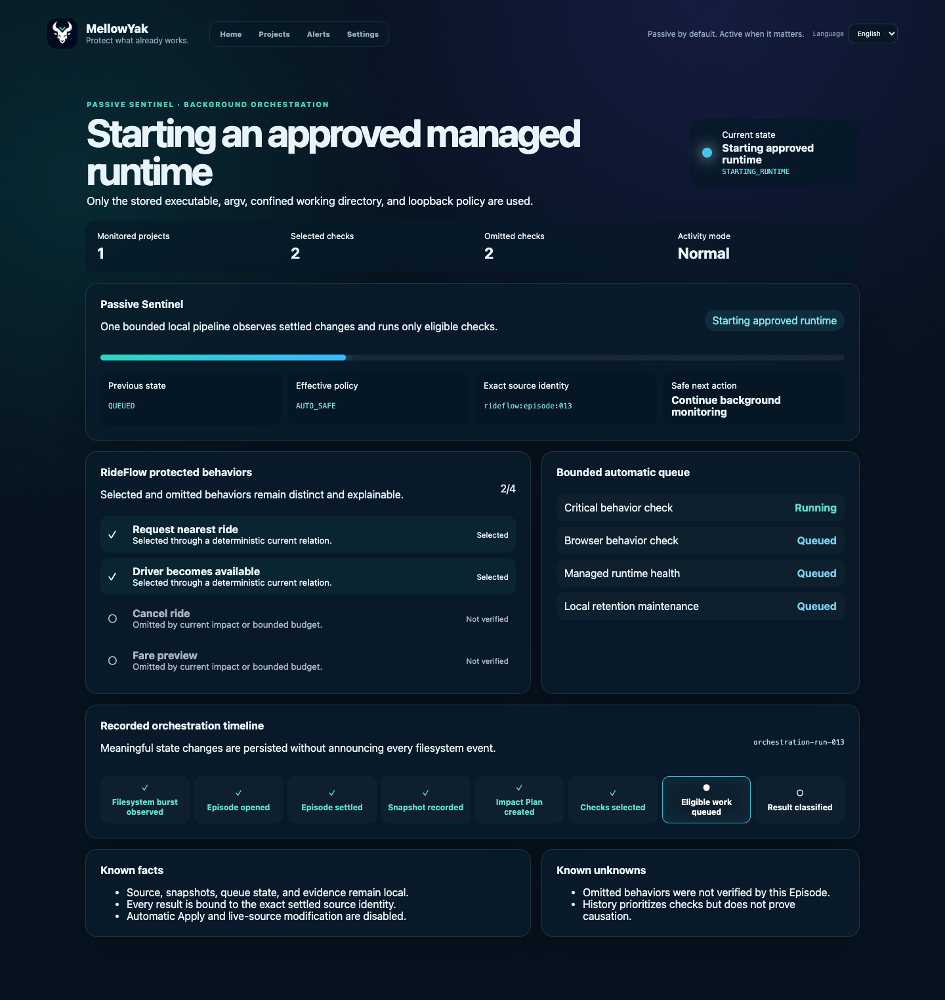

Backing entity: job plus approved Runtime Profile version. Previous → current: `QUEUED → STARTING_RUNTIME`; allowed next: `RUNNING_CHECKS`, `RUNTIME_UNAVAILABLE`, `CANCELLED`; policy: `AUTO_SAFE`; selected/omitted: 2/2. Known: approved executable/argv only. Unknown: health result. Source modification: none. Safe action: wait or inspect runtime.

### 11 — Automatic check running

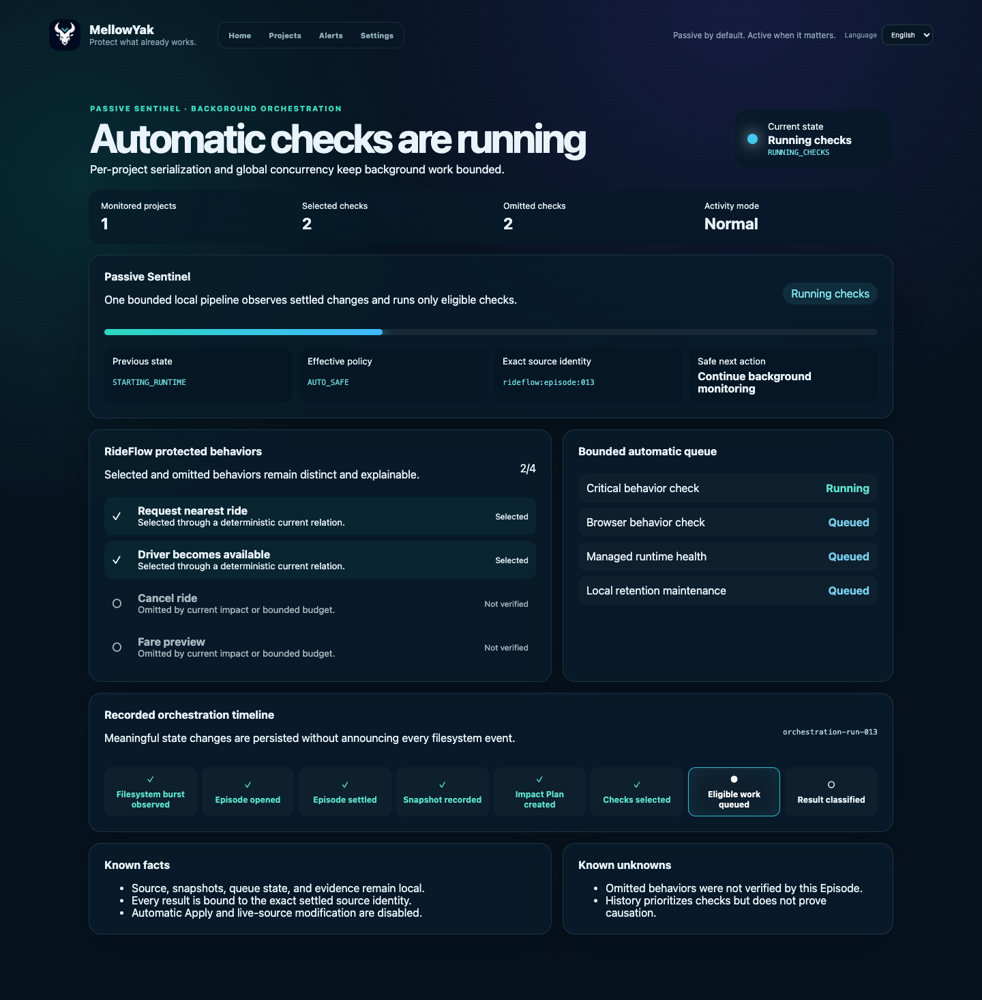

Backing entity: running Probe Run/job. Previous → current: `STARTING_RUNTIME → RUNNING_CHECKS`; allowed next: `PERSISTING_RESULT`, `RETRYING`, `CANCELLED`; policy: `AUTO_SAFE`; selected/omitted: 2/2. Known: exact snapshot is under test. Unknown: final classification. Source modification: none. Safe action: wait or cancel.

### 12 — Automatic check passed

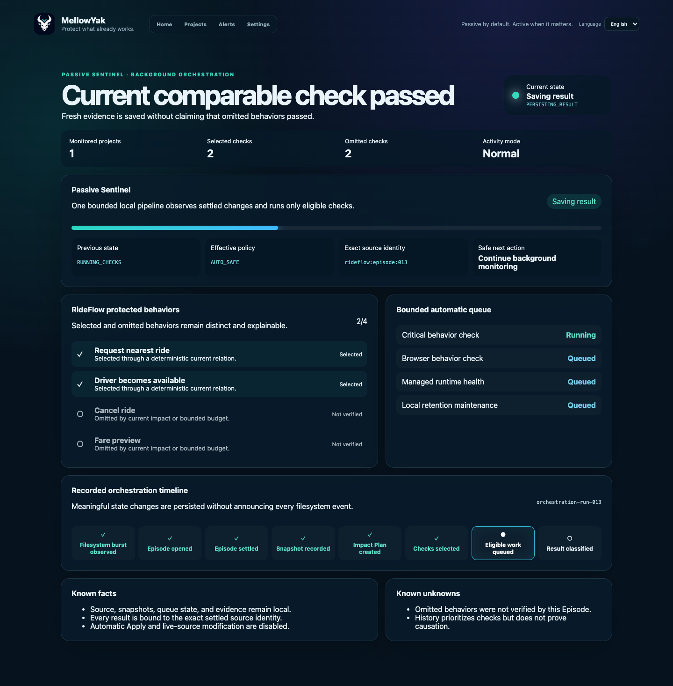

Backing entity: completed Probe Run. Previous → current: `RUNNING_CHECKS → PERSISTING_RESULT`; allowed next: `CLASSIFYING`, `COMPLETE`; policy: `AUTO_SAFE`; selected/omitted: 2/2. Known: selected comparable Probe passed. Unknown: omitted outcomes. Source modification: none. Safe action: review source-bound evidence.

### 13 — No regression result

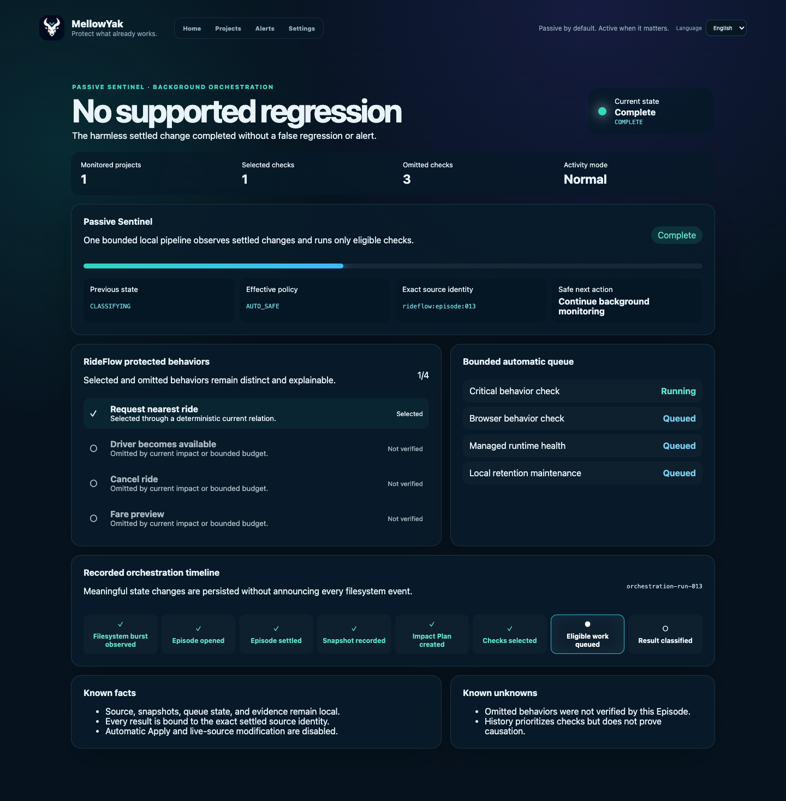

Backing entity: signal classification/orchestration run. Previous → current: `CLASSIFYING → COMPLETE`; allowed next: `MONITORING`; policy: `AUTO_SAFE`; selected/omitted: 2/2. Known: no supported regression for checked behavior. Unknown: omitted behaviors. Source modification: none. Safe action: continue monitoring.

### 14 — Controlled regression running

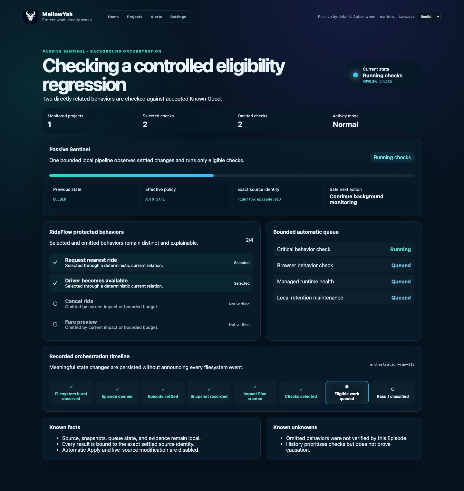

Backing entity: synthetic RideFlow mutation run. Previous → current: `QUEUED → RUNNING_CHECKS`; allowed next: `RETRYING`, `PERSISTING_RESULT`; policy: `AUTO_SAFE`; selected/omitted: 2/2. Known: eligibility-related behaviors selected. Unknown: reproducibility until retry. Source modification: test fixture only. Safe action: wait for bounded retry.

### 15 — Retry in progress

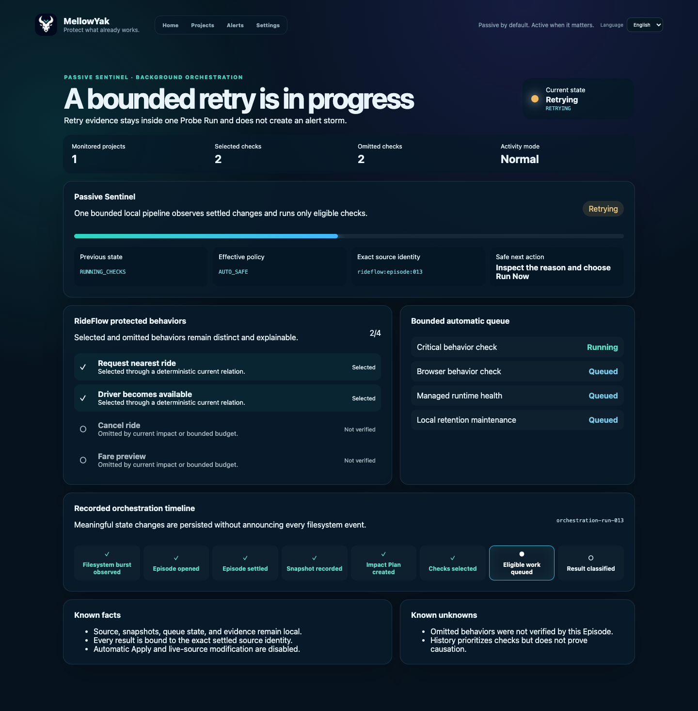

Backing entity: Probe Run attempts. Previous → current: `RUNNING_CHECKS → RETRYING`; allowed next: `CONFIRMED`, `FLAKY`, `INCONCLUSIVE`; policy: `AUTO_SAFE`; selected/omitted: 2/2. Known: one failed attempt retained. Unknown: second result. Source modification: fixture only. Safe action: wait; do not duplicate alerts.

### 16 — Confirmed regression deduplicated

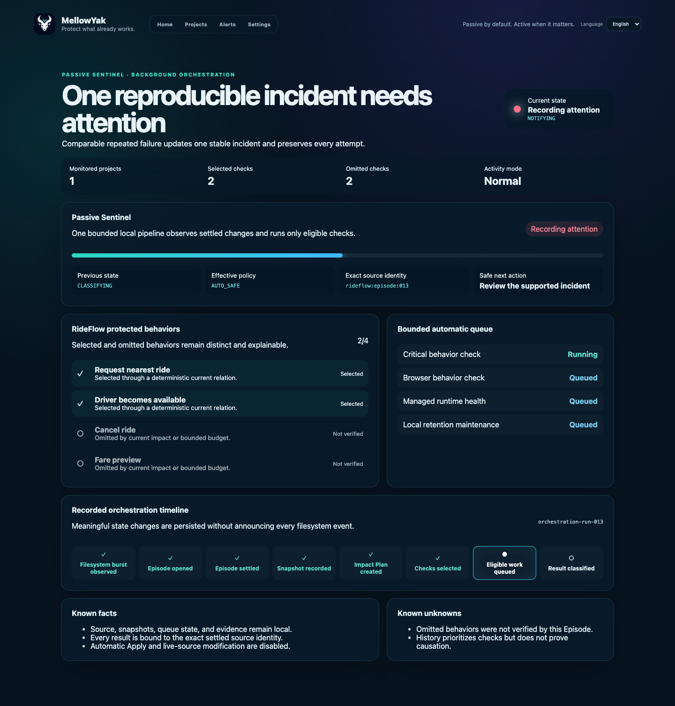

Backing entity: Regression Finding, Alert, dedup record. Previous → current: `CLASSIFYING → NEEDS_ATTENTION`; allowed next: `MONITORING`, repair workflow, manual resolve; policy: `AUTO_SAFE`; selected/omitted: 2/2. Known: reproducible comparable failure. Unknown: causation outside evidence. Source modification: none. Safe action: open supported incident.

### 17 — Tray needs attention

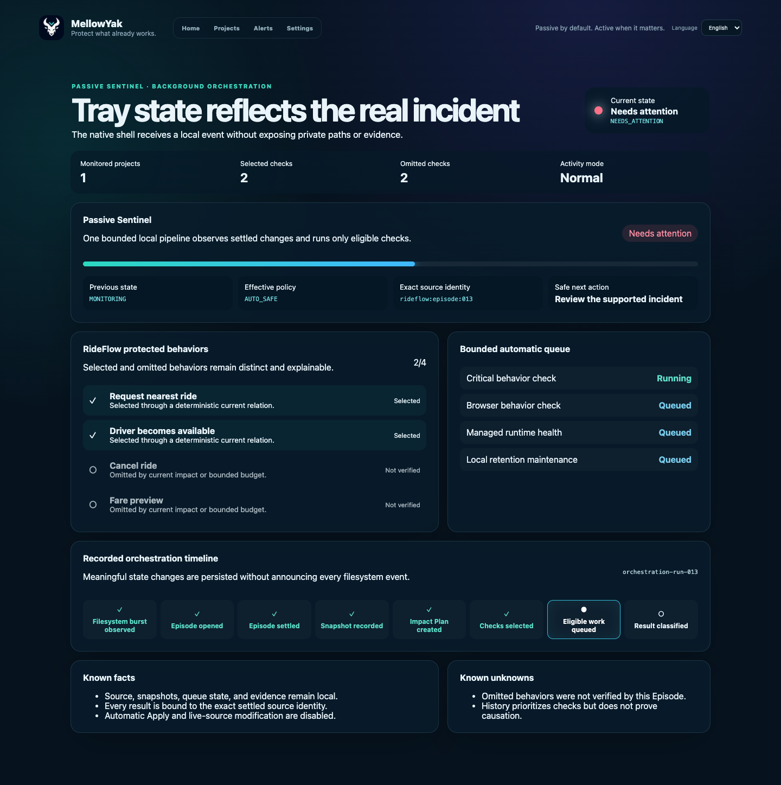

Backing entity: persisted alert/tray aggregate. Previous → current: `MONITORING → NEEDS_ATTENTION`; allowed next: open incident, Quiet Mode, resolve after comparable pass; policy: `AUTO_SAFE`; selected/omitted: 2/2. Known: one real incident. Unknown: physical notification interaction. Source modification: none. Safe action: open project incident.

### 18 — Flaky check detected

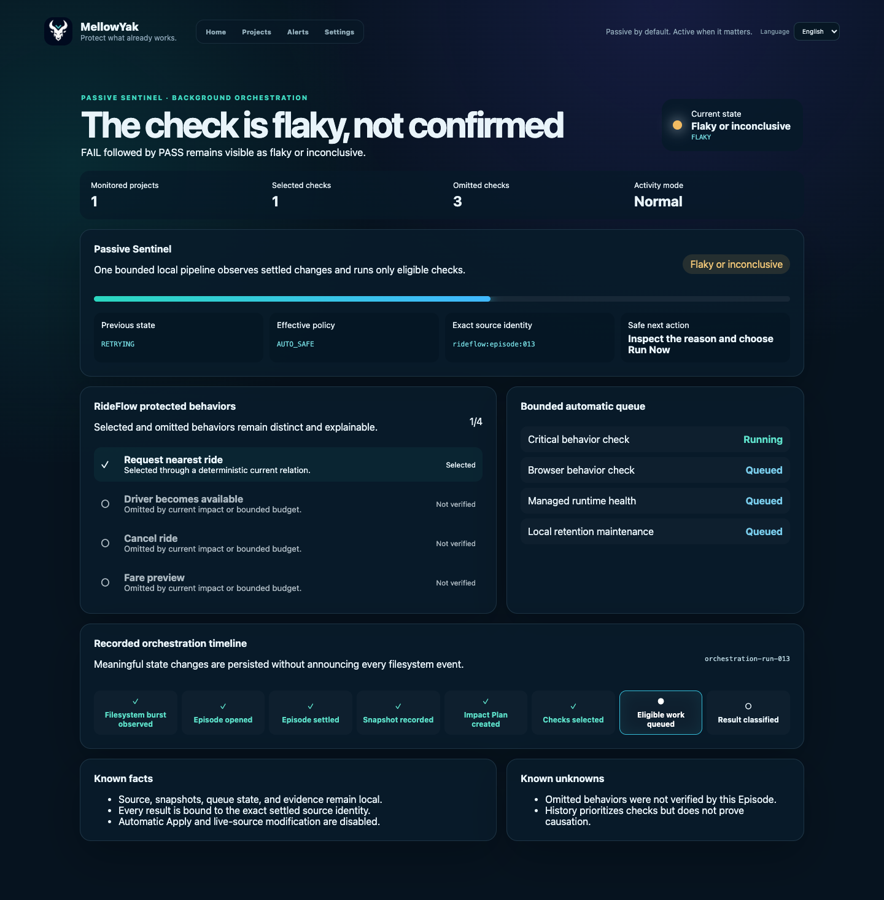

Backing entity: flakiness record/attempts. Previous → current: `RETRYING → FLAKY`; allowed next: manual rerun, quarantine, monitor; policy: `AUTO_SAFE`; selected/omitted: 2/2. Known: fail then pass. Unknown: stable defect. Source modification: none. Safe action: inspect without claiming regression.

### 19 — Runtime unavailable

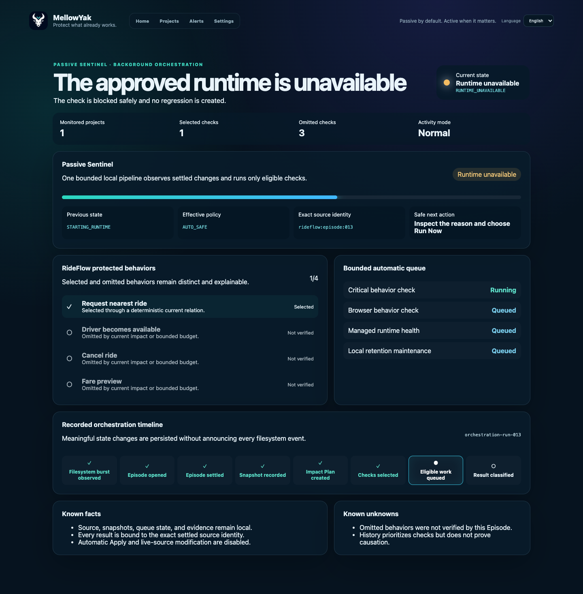

Backing entity: blocked/inconclusive job. Previous → current: `STARTING_RUNTIME → RUNTIME_UNAVAILABLE`; allowed next: retry after approval/repair, cancel; policy: `AUTO_SAFE`; selected/omitted: 2/2. Known: check did not run successfully. Unknown: behavior outcome. Source modification: none. Safe action: inspect approved runtime.

### 20 — Rapid writes, one Episode

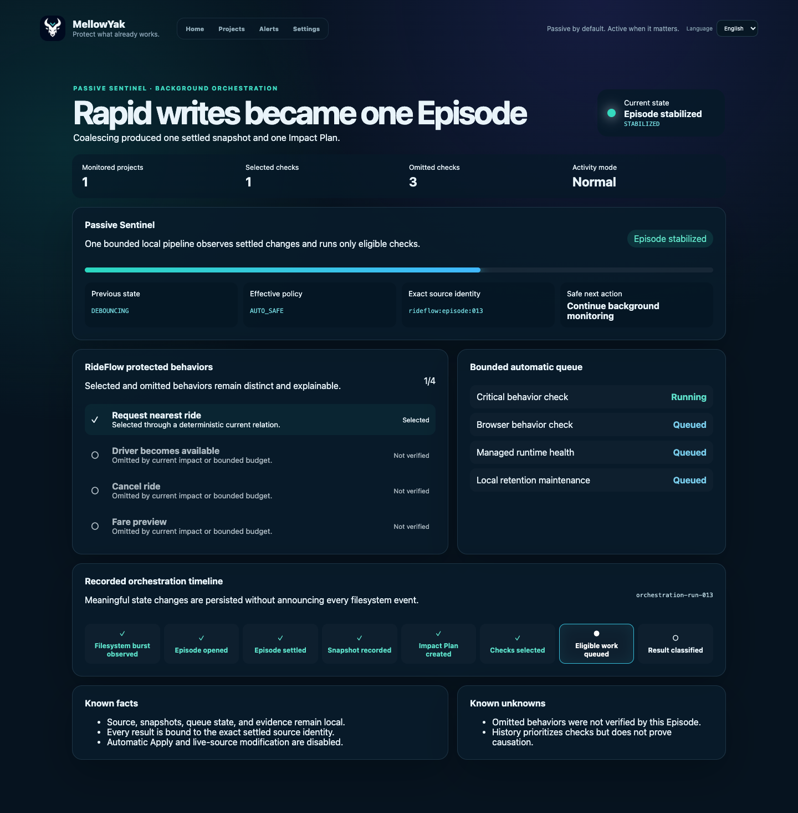

Backing entity: coalesced Episode. Previous → current: `OBSERVING → STABILIZED`; allowed next: `SNAPSHOTTING`, `ANALYZING_IMPACT`; policy: `AUTO_SAFE`; selected/omitted: 2/2. Known: burst became one stable unit. Unknown: unchecked behaviors. Source modification: observed only. Safe action: allow one plan.

### 21 — Large fan-out sentinel selection

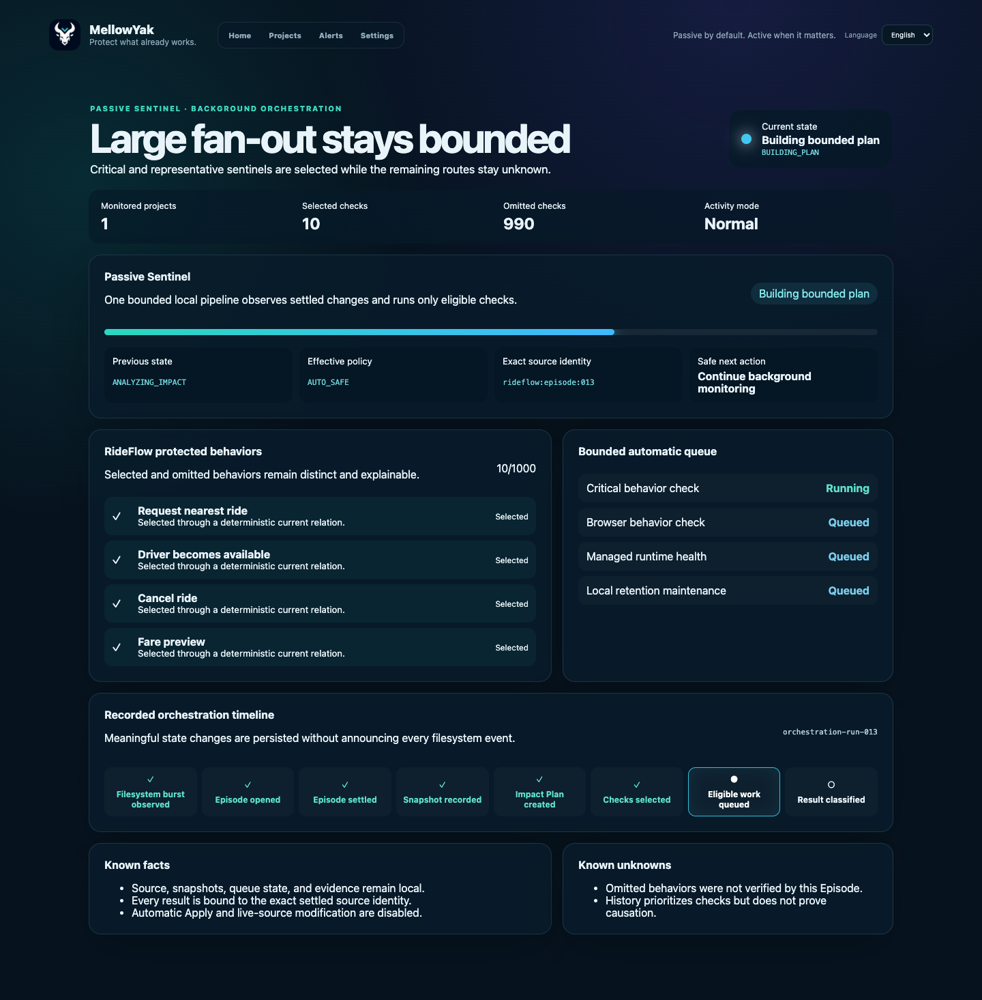

Backing entity: bounded Impact Plan. Previous → current: `ANALYZING_IMPACT → BUILDING_PLAN`; allowed next: `QUEUED`, manual expansion; policy: `AUTO_SAFE`; selected/omitted: 2/2. Known: representative critical checks selected. Unknown: omitted routes. Source modification: none. Safe action: inspect reasons; expand manually if needed.

### 22 — Lockfile change plan

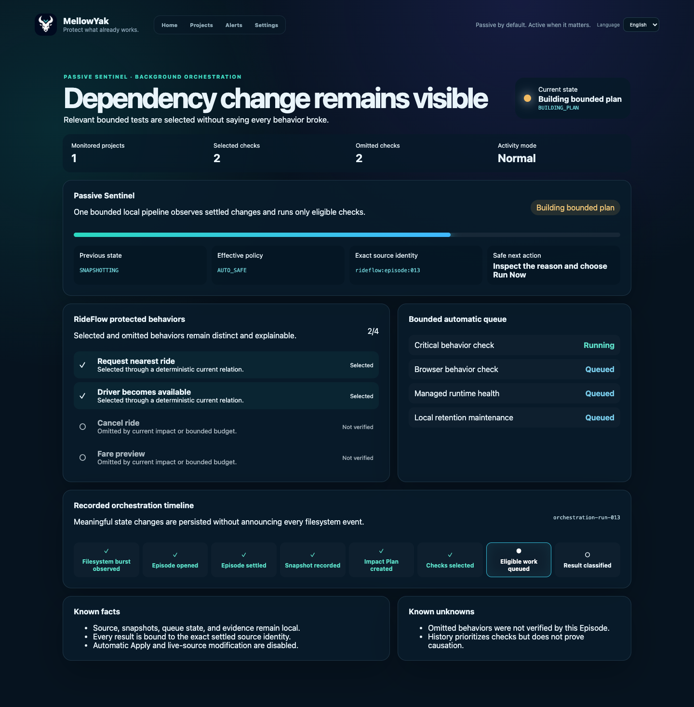

Backing entity: dependency-aware Impact Plan. Previous → current: `ANALYZING_IMPACT → BUILDING_PLAN`; allowed next: `QUEUED`, `WAITING_FOR_POLICY`; policy: `AUTO_SAFE`; selected/omitted: 2/2. Known: lockfile change is visible. Unknown: broad dependency consequences. Source modification: observed only. Safe action: run bounded relevant checks.

### 23 — Superseded job stale

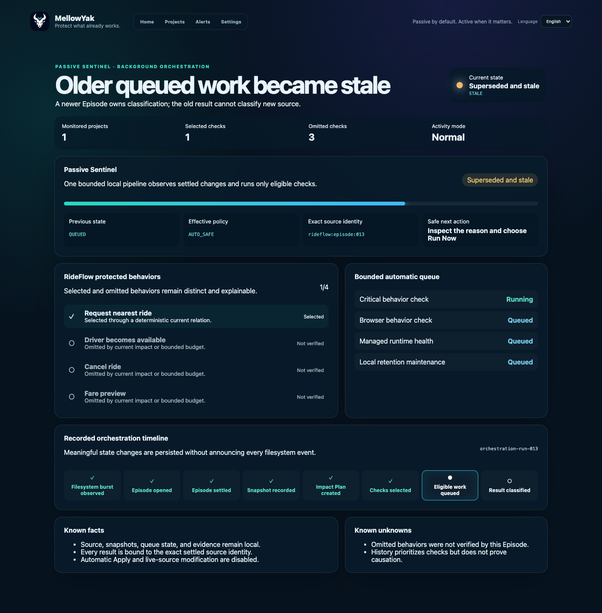

Backing entity: stale queue job. Previous → current: `QUEUED → STALE`; allowed next: terminal only; latest source receives a new job. Policy: `AUTO_SAFE`; selected/omitted: 2/2. Known: digest no longer current. Unknown: old result relevance. Source modification: none. Safe action: inspect latest Episode.

### 24 — Scheduler recovered

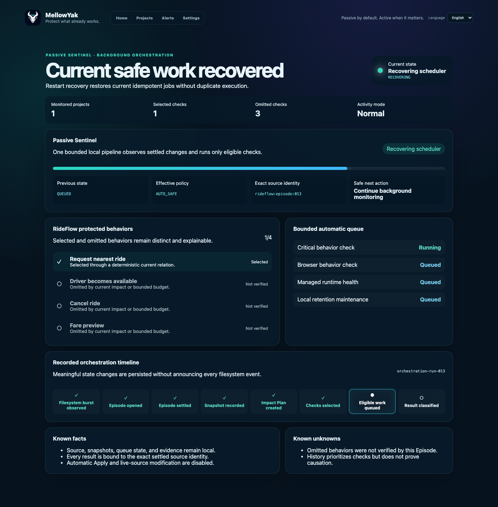

Backing entity: recovery record/current jobs. Previous → current: `QUEUED → RECOVERING`; allowed next: `QUEUED`, `STALE`, `BLOCKED`; policy: `AUTO_SAFE`; selected/omitted: 2/2. Known: only current idempotent work recovers. Unknown: interrupted external runtime state. Source modification: none. Safe action: review recovered counts.

### 25 — Battery Saver deferred

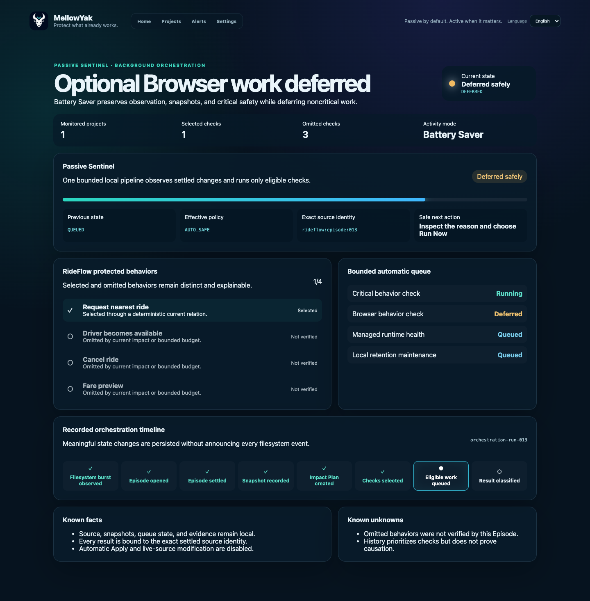

Backing entity: activity preference/deferred Browser job. Previous → current: `QUEUED → DEFERRED`; allowed next: `QUEUED` in Normal, `STALE`, `CANCELLED`; policy: `AUTO_SAFE`; selected/omitted: 2/2. Known: optional Browser work did not start. Unknown: behavior result. Source modification: none. Safe action: return to Normal or run manually.

### 26 — Normal mode resumed

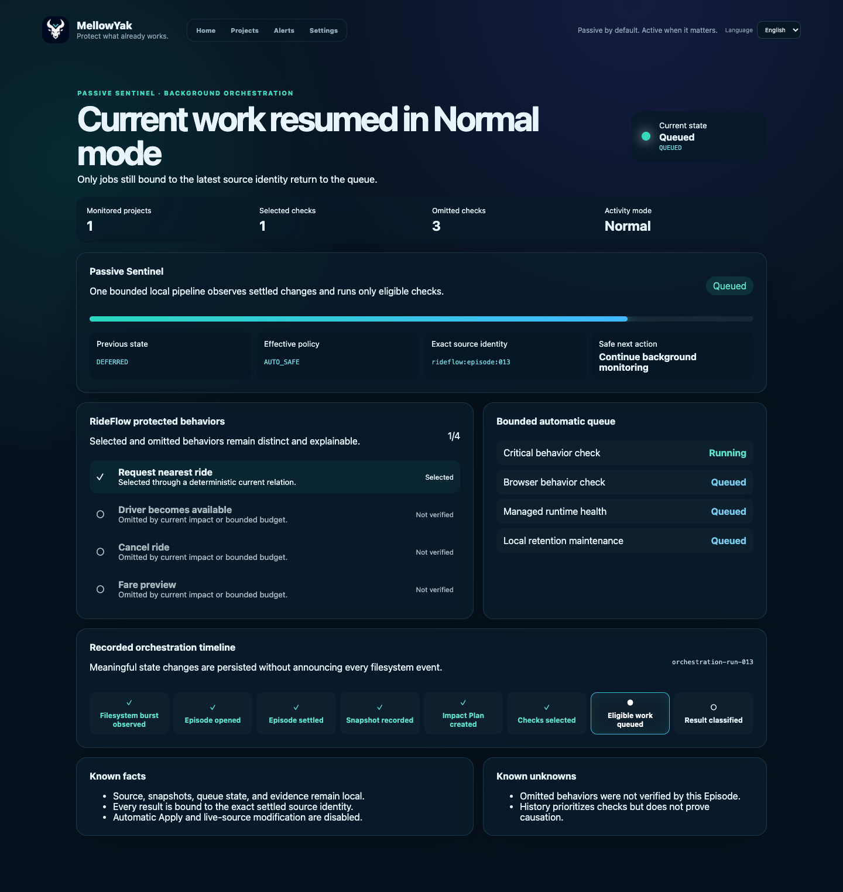

Backing entity: current deferred job/activity mode. Previous → current: `DEFERRED → QUEUED`; allowed next: `STARTING_RUNTIME`, `STALE`, `CANCELLED`; policy: `AUTO_SAFE`; selected/omitted: 2/2. Known: source identity is still current. Unknown: result. Source modification: none. Safe action: allow bounded execution.

### 27 — Quiet Mode alert persisted

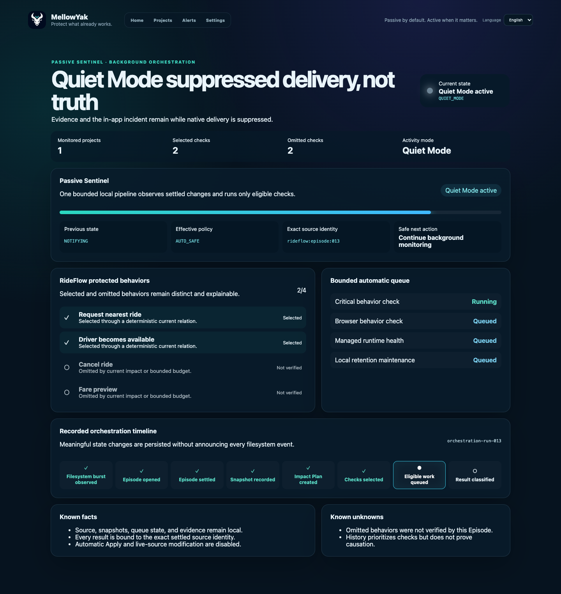

Backing entity: alert plus Quiet Mode state. Previous → current: `NOTIFYING → QUIET_MODE`; allowed next: remain in-app, deliver after policy, resolve; policy: `AUTO_SAFE`; selected/omitted: 2/2. Known: evidence and incident persist. Unknown: native delivery while suppressed. Source modification: none. Safe action: inspect in app.

### 28 — Home background monitoring

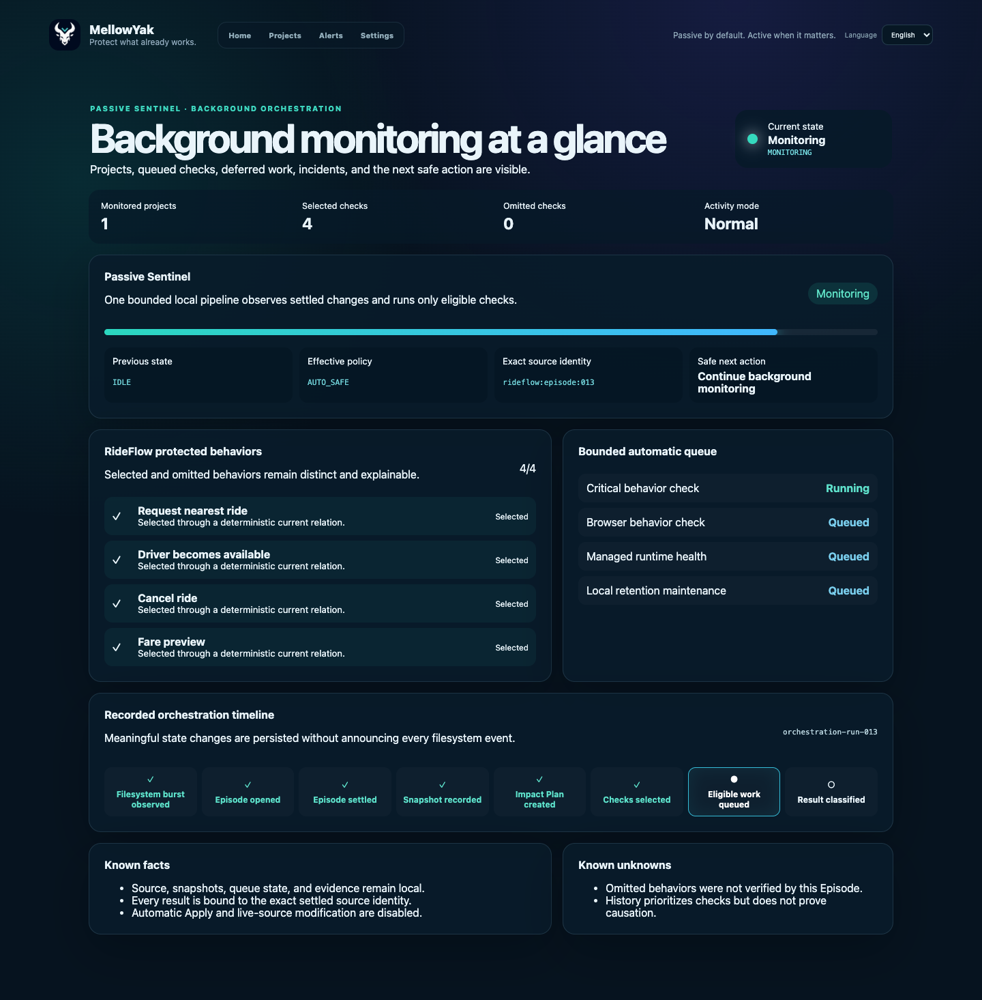

Backing entity: home orchestration aggregate. Previous → current: `IDLE → MONITORING`; allowed next: any meaningful Sentinel state; policy: `AUTO_SAFE`; selected/omitted: 4/0. Known: one project and bounded queue status. Unknown: future edits. Source modification: none. Safe action: continue work or open the project.

### 29 — Project overview background result

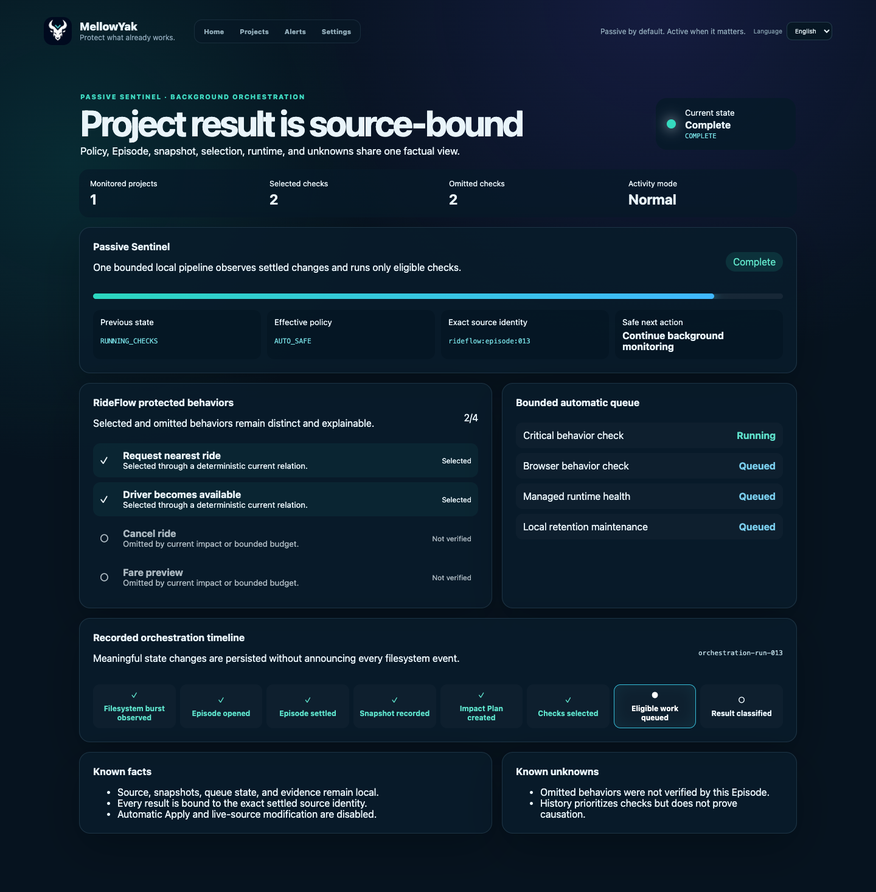

Backing entity: project/run/source aggregate. Previous → current: `CLASSIFYING → COMPLETE`; allowed next: `MONITORING`, open evidence; policy: `AUTO_SAFE`; selected/omitted: 4/0. Known: exact policy, Episode, snapshot, runtime, and results. Unknown: nonselected external conditions. Source modification: none. Safe action: review evidence or continue.

### 30 — Activity orchestration timeline

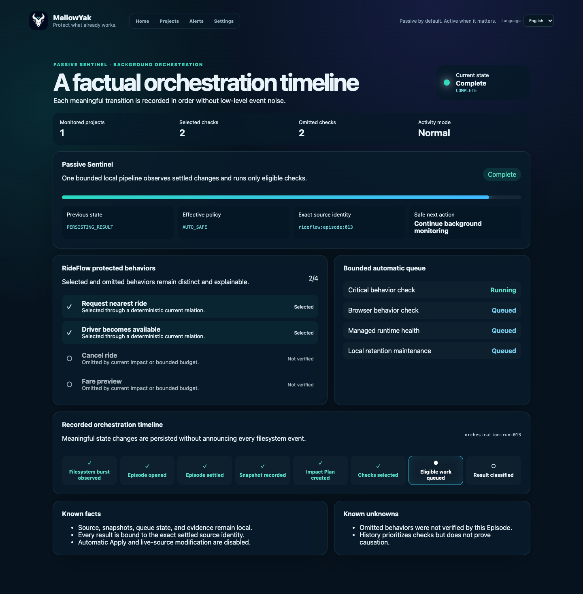

Backing entity: ordered local events/orchestration run. Previous → current: `PERSISTING_RESULT → CLASSIFYING`; allowed next: `COMPLETE`, `NEEDS_ATTENTION`, `FLAKY`; policy: `AUTO_SAFE`; selected/omitted: 4/0. Known: meaningful transition order. Unknown: low-level event noise intentionally omitted. Source modification: none. Safe action: inspect current step.

### 31 — Advanced queue

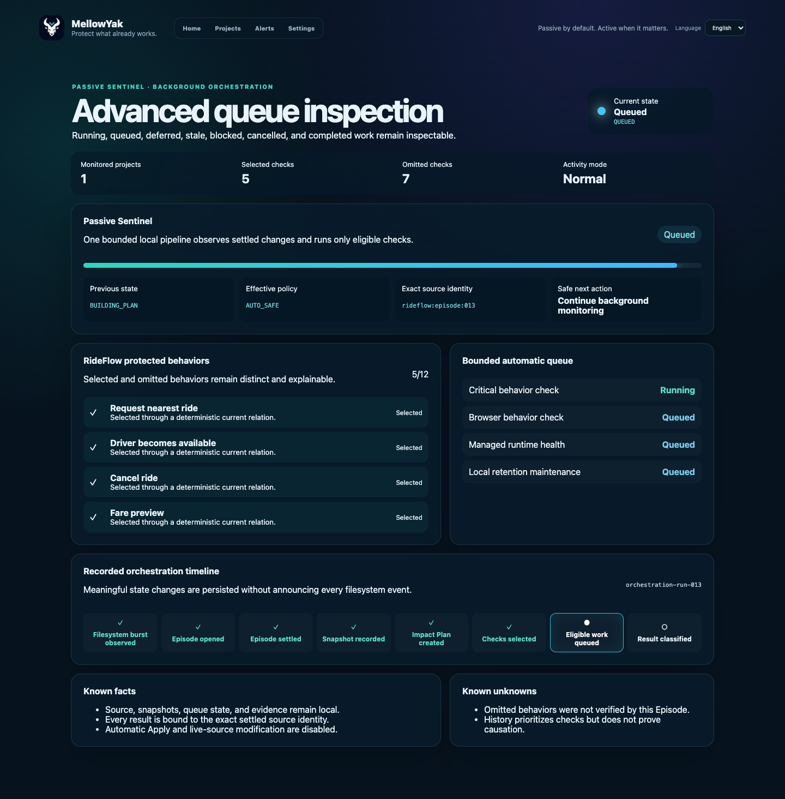

Backing entity: persisted jobs/attempts. Previous → current: `QUEUED → RUNNING_CHECKS`; allowed next: completed, failed, deferred, stale, blocked, cancelled; policy: `AUTO_SAFE`; selected/omitted: 4/0. Known: job IDs, states, reasons, source. Unknown: future result. Source modification: none. Safe action: inspect/cancel only when needed.

### 32 — Impact Memory

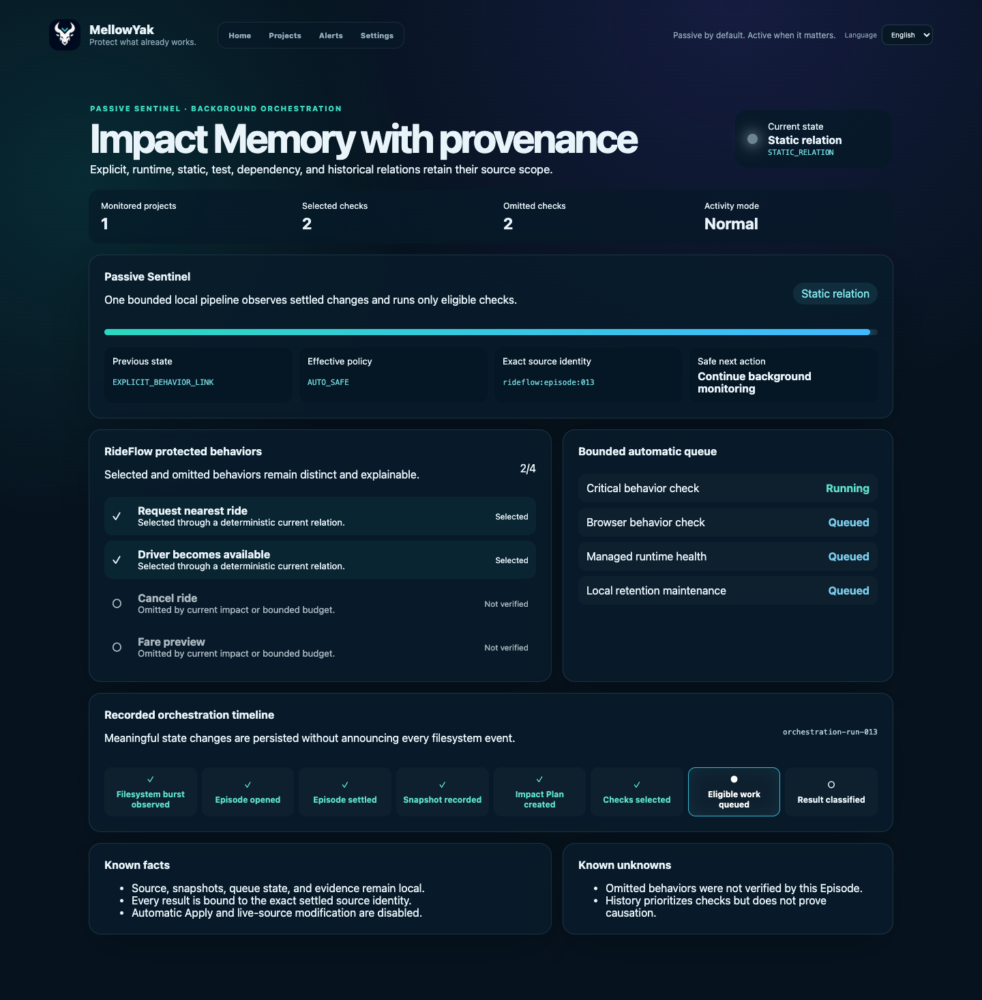

Backing entity: Impact Memory relation. Previous → current: `STATIC_RELATION → EXPLICIT_BEHAVIOR_LINK`; allowed next: new scoped relation, stale marker, historical observation; policy: `AUTO_SAFE`; selected/omitted: 4/0. Known: provenance and source scope. Unknown: causation. Source modification: none. Safe action: use as prioritization evidence only.

### 33 — Monitoring settings

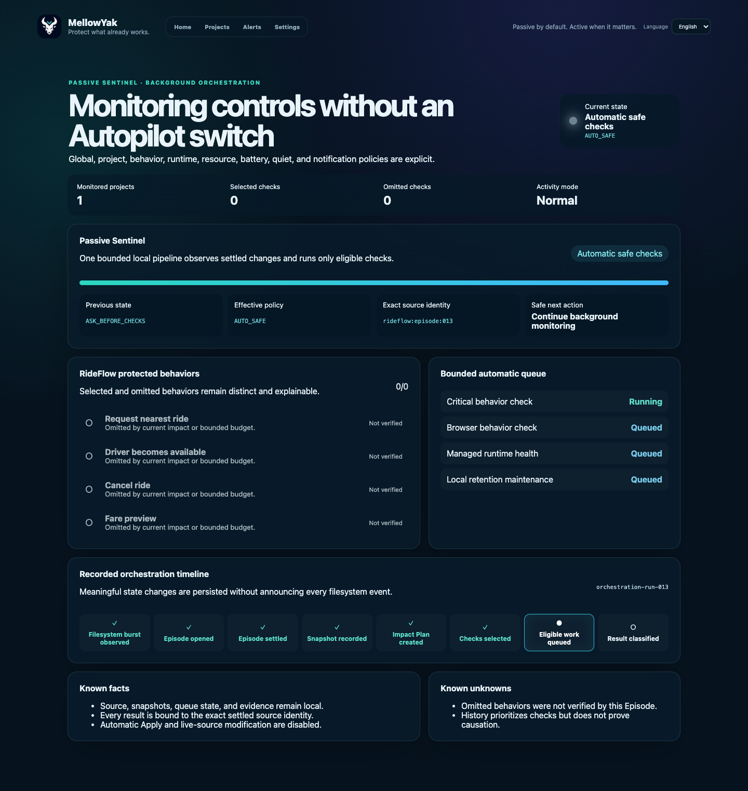

Backing entity: immutable policy revisions. Previous → current: `ASK_BEFORE_CHECKS → AUTO_SAFE`; allowed next: ask, observe-only, manual-only, paused; policy: explicit layered controls; selected/omitted: 0/4. Known: permissions and limits. Unknown: outcomes until a check runs. Source modification: none. Safe action: change only the narrow policy intended.

## 39. Manual macOS Boundaries

Not physically performed or claimed: Notification Center click routing, real login-session launch, sleep/wake, lock/unlock, sustained battery transition, Finder drag/install interaction, Developer ID signing, notarization, Gatekeeper distribution, or launch from a downloaded quarantined DMG. The screenshots are deterministic webview captures, not native interaction proof.

## 40. Limitations

- Final source and packaged automated acceptance were intentionally not run after implementation.
- No Phase 13M package/install evidence exists yet.
- Runtime unavailable is fail-open and may need more granular adapter-specific human copy.
- Impact Memory records and exposes relations but does not yet feed a weighted learning algorithm; selection remains deterministic.
- Daily runtime budget and allowed-hours fields are persisted but enforcement is not fully wired into scheduling.
- Native notification suppression/delivery relies on existing Phase 9 preferences and still needs physical OS validation.
- No Apple Silicon, Windows, or Linux acceptance is claimed.

## 41. Next-Phase Readiness

Before Phase 14M, the operator should run the full source suite, migration upgrade matrix, Phase 8/9/10/11M/12M/13M packaged validators, performance bounds, package build, isolated install/lifecycle, and manual macOS boundaries. If all mandatory gates pass, synchronize every version surface to `0.3.0-preview.2`, rebuild, install, record hashes, create the verified annotated tag, and only then begin any next phase with explicit approval.

## 42. Local Commit and Tag

The implementation is prepared for one local commit with message `feat: add passive sentinel orchestration and impact memory`. No push is authorized. The requested verified tag is `phase-13m-passive-sentinel-verified-2026-08-26`, but it must not be created while mandatory acceptance remains operator-deferred. Final commit identity and tag status are updated in the operator handoff after the commit is created.
