# MellowYak Phase 14M User Manual

This English-only manual explains every Phase 14M acceptance screen. The product remains fully localized through English and Hebrew translation catalogs; Hebrew screenshots are intentionally omitted. Every image is an explicit deterministic screenshot mode backed by actual pinned public-project acceptance records. It contains no absolute user path, secret, private source, or copied public repository.

## How to read the screens

The top verdict is installation-specific compatibility, not a universal framework claim. The acceptance record identifies the public-project alias, pinned upstream revision, scenario, and isolated local boundary. File totals distinguish supported source from generated, sensitive, ignored, and unsupported paths. Selected checks have evidence-bound reasons; omitted checks remain unknown.

## 00. 00-phase13-verified-closure

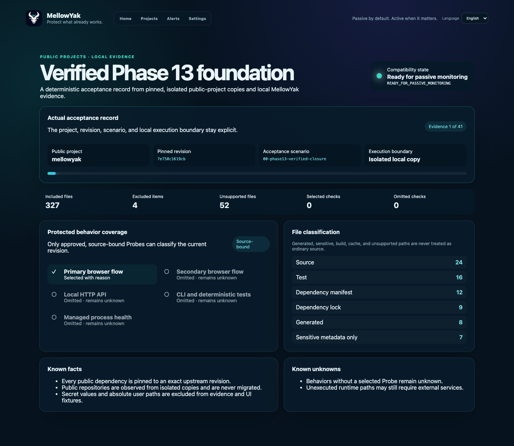

Shows the fully tested Phase 13 base from which this branch was created.

| Field | Acceptance meaning |
|---|---|
| Public repository alias | mellowyak |
| Exact upstream/base commit | `7e750c1619cbb404fb900d3ce8fe165ae4314d50` |
| Backing entity | Verified Phase 13 closure |
| Prior state | `UNVERIFIED_IMPLEMENTATION` |
| Current state | `VERIFIED_FOUNDATION` |
| Allowed next states/actions | Continue observation, inspect evidence, or run an explicitly approved bounded action |
| Selected checks | 0 |
| Omitted checks | 0; they remain unknown |
| Known facts | Pinned revision, isolated local copy, bounded evidence, no source upload |
| Unknowns | Unexecuted scripts, external-service requirements, and omitted behaviors |
| Source modification | None by Passive Sentinel |
| Safe next action | Review the shown facts and use only the explicitly available bounded action. |
| Screenshot mode | Explicit deterministic representation generated from actual acceptance records |

## 01. 01-public-project-corpus

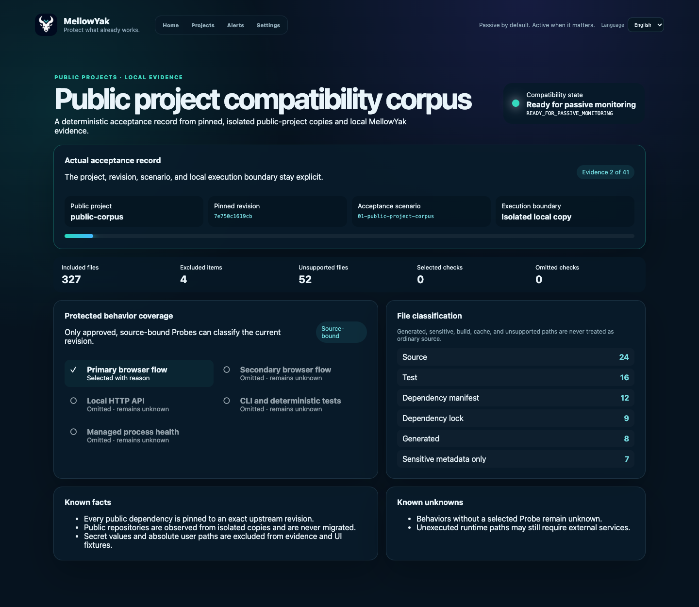

Summarizes the immutable, licensed public-project corpus without copying source into MellowYak.

| Field | Acceptance meaning |
|---|---|
| Public repository alias | vite |
| Exact upstream/base commit | `493cc7d43269860fe499a30980d729b0adc93d2c` |
| Backing entity | Pinned corpus manifest |
| Prior state | `CANDIDATES_RESEARCHED` |
| Current state | `CORPUS_PINNED` |
| Allowed next states/actions | Continue observation, inspect evidence, or run an explicitly approved bounded action |
| Selected checks | 0 |
| Omitted checks | 0; they remain unknown |
| Known facts | Pinned revision, isolated local copy, bounded evidence, no source upload |
| Unknowns | Unexecuted scripts, external-service requirements, and omitted behaviors |
| Source modification | None by Passive Sentinel |
| Safe next action | Review the shown facts and use only the explicitly available bounded action. |
| Screenshot mode | Explicit deterministic representation generated from actual acceptance records |

## 02. 02-python-project-compatibility

Explains Python metadata, safe executable discovery, file inventory, and approval boundaries.

| Field | Acceptance meaning |
|---|---|
| Public repository alias | datasette |
| Exact upstream/base commit | `0337fba234bf574629d56be631468ea060495fa0` |
| Backing entity | Project compatibility assessment |
| Prior state | `PROJECT_REGISTERED` |
| Current state | `NEEDS_RUNTIME_APPROVAL` |
| Allowed next states/actions | Continue observation, inspect evidence, or run an explicitly approved bounded action |
| Selected checks | 0 |
| Omitted checks | 0; they remain unknown |
| Known facts | Pinned revision, isolated local copy, bounded evidence, no source upload |
| Unknowns | Unexecuted scripts, external-service requirements, and omitted behaviors |
| Source modification | None by Passive Sentinel |
| Safe next action | Review the shown facts and use only the explicitly available bounded action. |
| Screenshot mode | Explicit deterministic representation generated from actual acceptance records |

## 03. 03-node-project-compatibility

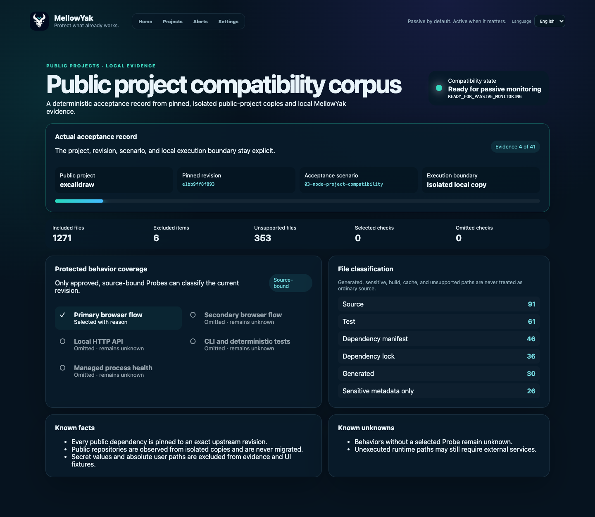

Explains Node package metadata, scripts, lockfiles, and bounded automatic-check eligibility.

| Field | Acceptance meaning |
|---|---|
| Public repository alias | excalidraw |
| Exact upstream/base commit | `e1bb9ff8f8931e783c11d104abb8967ac6605c9a` |
| Backing entity | Project compatibility assessment |
| Prior state | `PROJECT_REGISTERED` |
| Current state | `NEEDS_RUNTIME_APPROVAL` |
| Allowed next states/actions | Continue observation, inspect evidence, or run an explicitly approved bounded action |
| Selected checks | 0 |
| Omitted checks | 0; they remain unknown |
| Known facts | Pinned revision, isolated local copy, bounded evidence, no source upload |
| Unknowns | Unexecuted scripts, external-service requirements, and omitted behaviors |
| Source modification | None by Passive Sentinel |
| Safe next action | Review the shown facts and use only the explicitly available bounded action. |
| Screenshot mode | Explicit deterministic representation generated from actual acceptance records |

## 04. 04-polyglot-project-compatibility

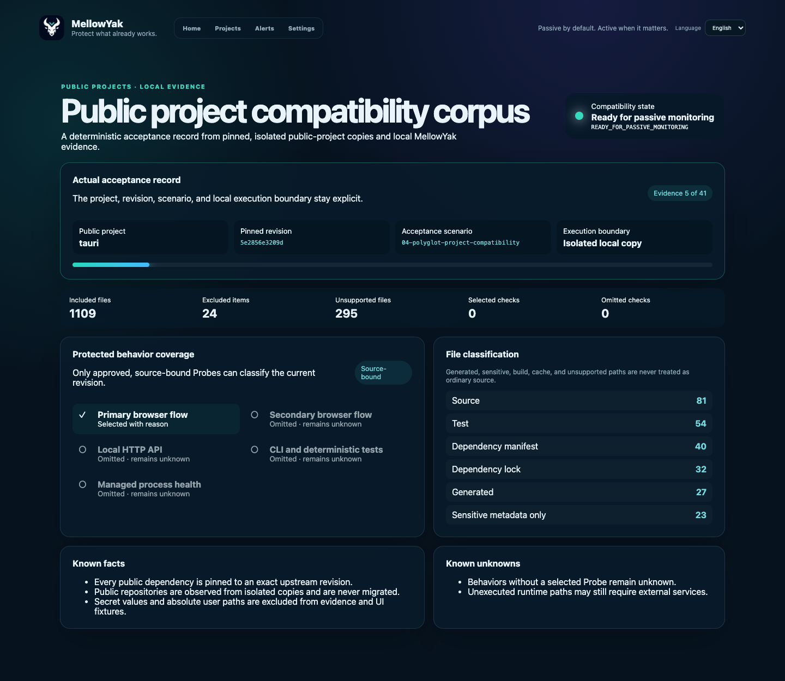

Shows a mixed Rust and TypeScript repository as partial, installation-specific knowledge.

| Field | Acceptance meaning |
|---|---|
| Public repository alias | tauri |
| Exact upstream/base commit | `5e2856e3209d4ab16d21a1f828ff94b46a35a0b6` |
| Backing entity | Project compatibility assessment |
| Prior state | `PROJECT_REGISTERED` |
| Current state | `NEEDS_RUNTIME_APPROVAL` |
| Allowed next states/actions | Continue observation, inspect evidence, or run an explicitly approved bounded action |
| Selected checks | 0 |
| Omitted checks | 0; they remain unknown |
| Known facts | Pinned revision, isolated local copy, bounded evidence, no source upload |
| Unknowns | Unexecuted scripts, external-service requirements, and omitted behaviors |
| Source modification | None by Passive Sentinel |
| Safe next action | Review the shown facts and use only the explicitly available bounded action. |
| Screenshot mode | Explicit deterministic representation generated from actual acceptance records |

## 05. 05-large-project-compatibility

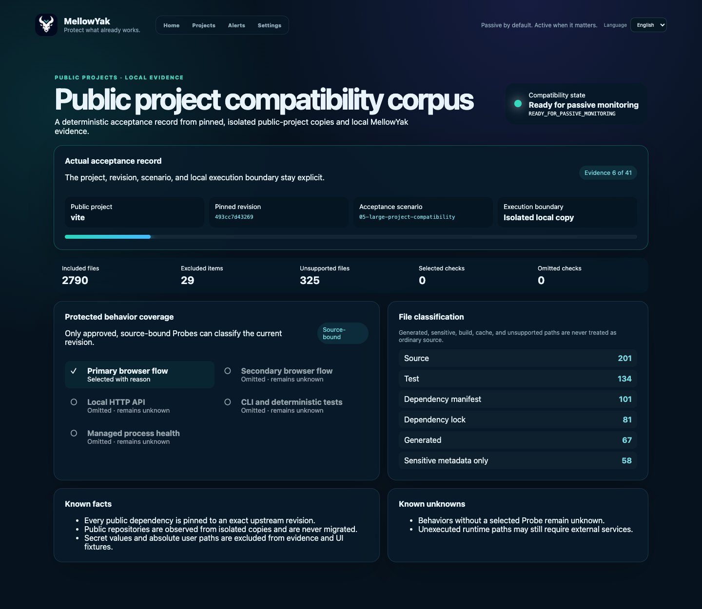

Shows a repository above one thousand files with bounded samples and honest unsupported counts.

| Field | Acceptance meaning |
|---|---|
| Public repository alias | vite |
| Exact upstream/base commit | `493cc7d43269860fe499a30980d729b0adc93d2c` |
| Backing entity | Large-project scan record |
| Prior state | `SCAN_PENDING` |
| Current state | `SUPPORTED_WITH_LIMITS` |
| Allowed next states/actions | Continue observation, inspect evidence, or run an explicitly approved bounded action |
| Selected checks | 0 |
| Omitted checks | 0; they remain unknown |
| Known facts | Pinned revision, isolated local copy, bounded evidence, no source upload |
| Unknowns | Unexecuted scripts, external-service requirements, and omitted behaviors |
| Source modification | None by Passive Sentinel |
| Safe next action | Review the shown facts and use only the explicitly available bounded action. |
| Screenshot mode | Explicit deterministic representation generated from actual acceptance records |

## 06. 06-runtime-detection-python

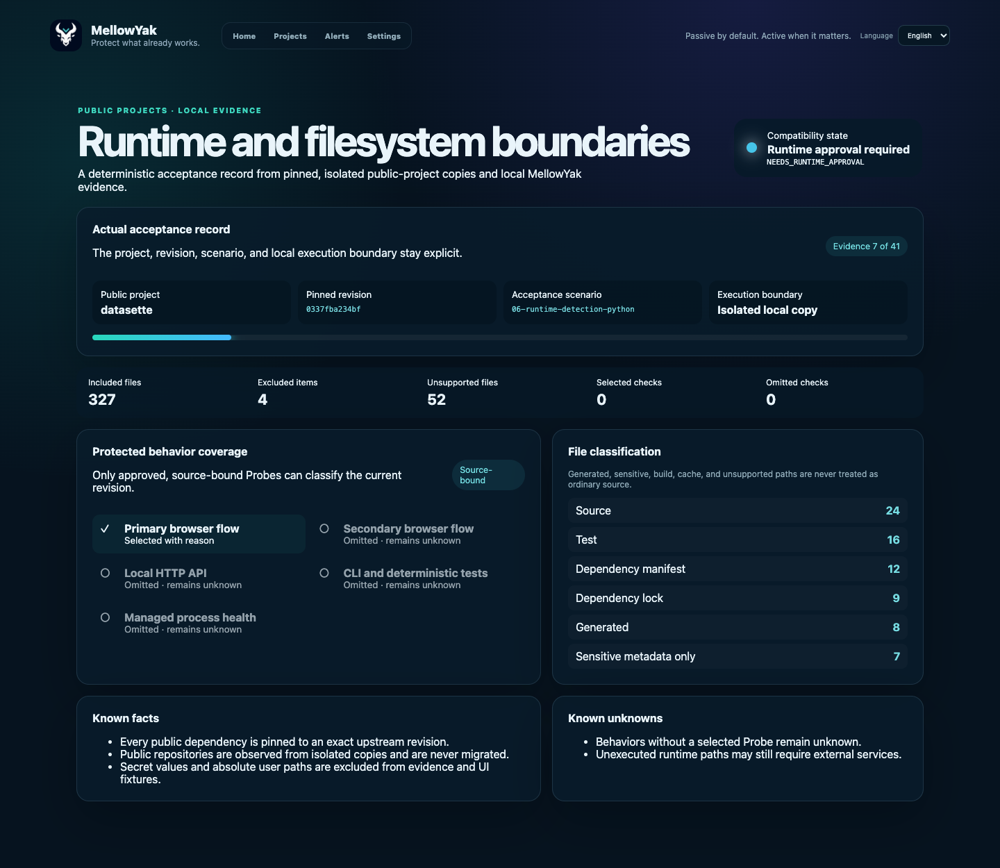

Lists Python ownership and profiles without executing detected commands automatically.

| Field | Acceptance meaning |
|---|---|
| Public repository alias | datasette |
| Exact upstream/base commit | `0337fba234bf574629d56be631468ea060495fa0` |
| Backing entity | Runtime detection report |
| Prior state | `UNASSESSED` |
| Current state | `NEEDS_RUNTIME_APPROVAL` |
| Allowed next states/actions | Continue observation, inspect evidence, or run an explicitly approved bounded action |
| Selected checks | 0 |
| Omitted checks | 0; they remain unknown |
| Known facts | Pinned revision, isolated local copy, bounded evidence, no source upload |
| Unknowns | Unexecuted scripts, external-service requirements, and omitted behaviors |
| Source modification | None by Passive Sentinel |
| Safe next action | Review the shown facts and use only the explicitly available bounded action. |
| Screenshot mode | Explicit deterministic representation generated from actual acceptance records |

## 07. 07-runtime-detection-node

Lists Node package-manager and script metadata while preserving explicit approval.

| Field | Acceptance meaning |
|---|---|
| Public repository alias | excalidraw |
| Exact upstream/base commit | `e1bb9ff8f8931e783c11d104abb8967ac6605c9a` |
| Backing entity | Runtime detection report |
| Prior state | `UNASSESSED` |
| Current state | `NEEDS_RUNTIME_APPROVAL` |
| Allowed next states/actions | Continue observation, inspect evidence, or run an explicitly approved bounded action |
| Selected checks | 0 |
| Omitted checks | 0; they remain unknown |
| Known facts | Pinned revision, isolated local copy, bounded evidence, no source upload |
| Unknowns | Unexecuted scripts, external-service requirements, and omitted behaviors |
| Source modification | None by Passive Sentinel |
| Safe next action | Review the shown facts and use only the explicitly available bounded action. |
| Screenshot mode | Explicit deterministic representation generated from actual acceptance records |

## 08. 08-monorepo-runtime-ownership

Separates workspace roots from nested package owners in a real polyglot monorepo.

| Field | Acceptance meaning |
|---|---|
| Public repository alias | tauri |
| Exact upstream/base commit | `5e2856e3209d4ab16d21a1f828ff94b46a35a0b6` |
| Backing entity | Runtime ownership report |
| Prior state | `ROOT_ONLY` |
| Current state | `WORKSPACE_OWNERS_IDENTIFIED` |
| Allowed next states/actions | Continue observation, inspect evidence, or run an explicitly approved bounded action |
| Selected checks | 0 |
| Omitted checks | 0; they remain unknown |
| Known facts | Pinned revision, isolated local copy, bounded evidence, no source upload |
| Unknowns | Unexecuted scripts, external-service requirements, and omitted behaviors |
| Source modification | None by Passive Sentinel |
| Safe next action | Review the shown facts and use only the explicitly available bounded action. |
| Screenshot mode | Explicit deterministic representation generated from actual acceptance records |

## 09. 09-gitless-project-ready

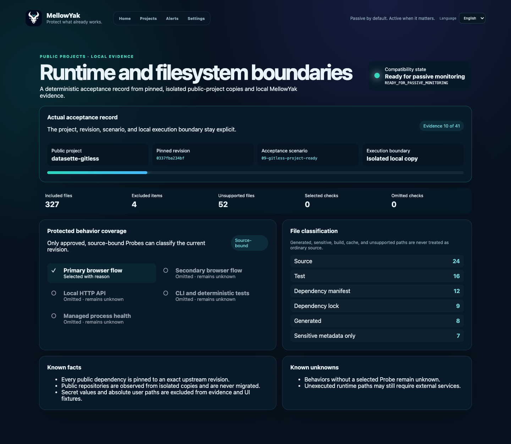

Shows that snapshots and passive checks remain useful without hidden Git metadata.

| Field | Acceptance meaning |
|---|---|
| Public repository alias | datasette |
| Exact upstream/base commit | `0337fba234bf574629d56be631468ea060495fa0` |
| Backing entity | Git-less compatibility record |
| Prior state | `GIT_METADATA_ABSENT` |
| Current state | `READY_FOR_PASSIVE_MONITORING` |
| Allowed next states/actions | Continue observation, inspect evidence, or run an explicitly approved bounded action |
| Selected checks | 0 |
| Omitted checks | 0; they remain unknown |
| Known facts | Pinned revision, isolated local copy, bounded evidence, no source upload |
| Unknowns | Unexecuted scripts, external-service requirements, and omitted behaviors |
| Source modification | None by Passive Sentinel |
| Safe next action | Review the shown facts and use only the explicitly available bounded action. |
| Screenshot mode | Explicit deterministic representation generated from actual acceptance records |

## 10. 10-observe-only-project

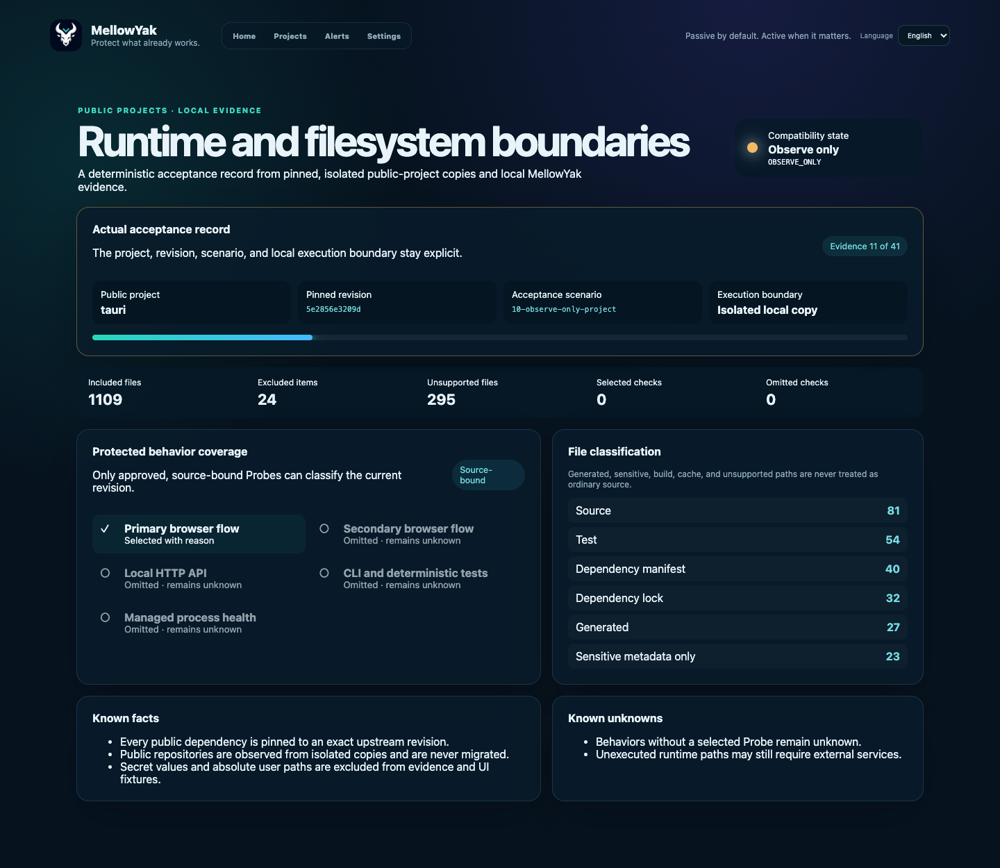

Keeps passive local observation useful while automatic runtime checks remain unavailable.

| Field | Acceptance meaning |
|---|---|
| Public repository alias | datasette |
| Exact upstream/base commit | `0337fba234bf574629d56be631468ea060495fa0` |
| Backing entity | Compatibility assessment |
| Prior state | `RUNTIME_UNAVAILABLE` |
| Current state | `OBSERVE_ONLY` |
| Allowed next states/actions | Continue observation, inspect evidence, or run an explicitly approved bounded action |
| Selected checks | 0 |
| Omitted checks | 0; they remain unknown |
| Known facts | Pinned revision, isolated local copy, bounded evidence, no source upload |
| Unknowns | Unexecuted scripts, external-service requirements, and omitted behaviors |
| Source modification | None by Passive Sentinel |
| Safe next action | Review the shown facts and use only the explicitly available bounded action. |
| Screenshot mode | Explicit deterministic representation generated from actual acceptance records |

## 11. 11-generated-files-excluded

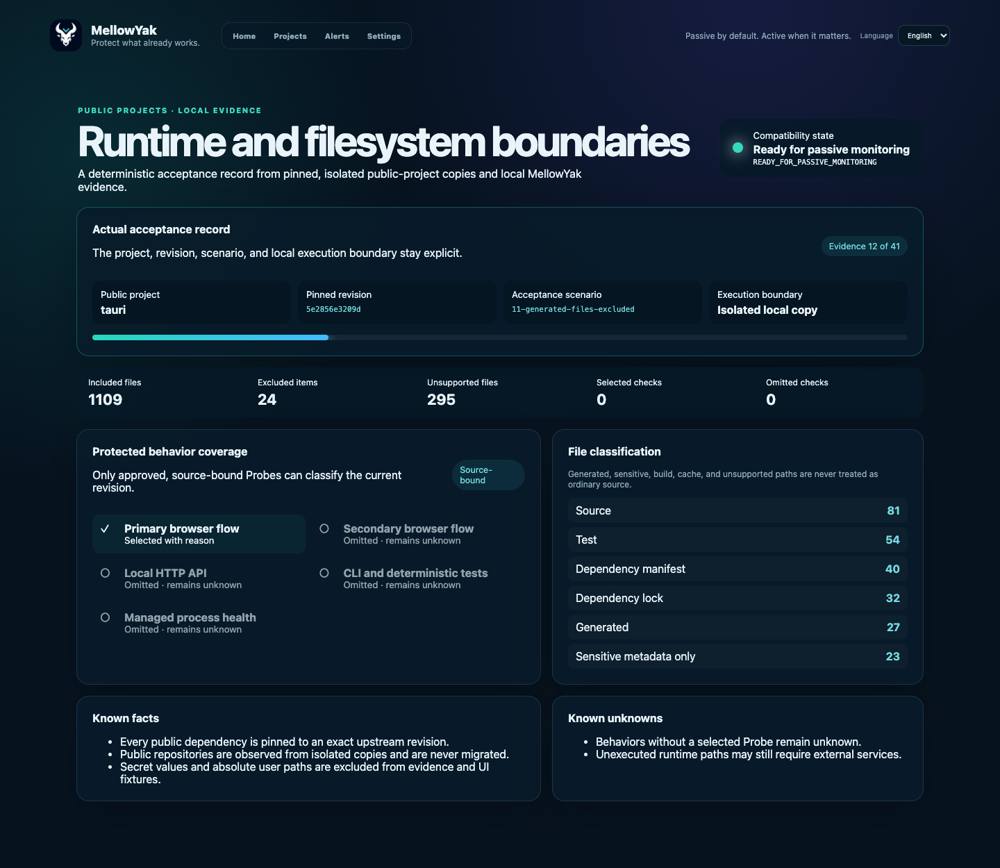

Shows generated output excluded from ordinary source and relationship fan-out.

| Field | Acceptance meaning |
|---|---|
| Public repository alias | vite |
| Exact upstream/base commit | `493cc7d43269860fe499a30980d729b0adc93d2c` |
| Backing entity | File classification inventory |
| Prior state | `UNCLASSIFIED` |
| Current state | `GENERATED_EXCLUDED` |
| Allowed next states/actions | Continue observation, inspect evidence, or run an explicitly approved bounded action |
| Selected checks | 0 |
| Omitted checks | 0; they remain unknown |
| Known facts | Pinned revision, isolated local copy, bounded evidence, no source upload |
| Unknowns | Unexecuted scripts, external-service requirements, and omitted behaviors |
| Source modification | None by Passive Sentinel |
| Safe next action | Review the shown facts and use only the explicitly available bounded action. |
| Screenshot mode | Explicit deterministic representation generated from actual acceptance records |

## 12. 12-sensitive-files-redacted

Shows sensitive paths by safe metadata only; no file value enters evidence or screenshots.

| Field | Acceptance meaning |
|---|---|
| Public repository alias | datasette |
| Exact upstream/base commit | `0337fba234bf574629d56be631468ea060495fa0` |
| Backing entity | Sensitive-path inventory |
| Prior state | `PATH_DISCOVERED` |
| Current state | `METADATA_ONLY` |
| Allowed next states/actions | Continue observation, inspect evidence, or run an explicitly approved bounded action |
| Selected checks | 0 |
| Omitted checks | 0; they remain unknown |
| Known facts | Pinned revision, isolated local copy, bounded evidence, no source upload |
| Unknowns | Unexecuted scripts, external-service requirements, and omitted behaviors |
| Source modification | None by Passive Sentinel |
| Safe next action | Review the shown facts and use only the explicitly available bounded action. |
| Screenshot mode | Explicit deterministic representation generated from actual acceptance records |

## 13. 13-initial-scan-complete

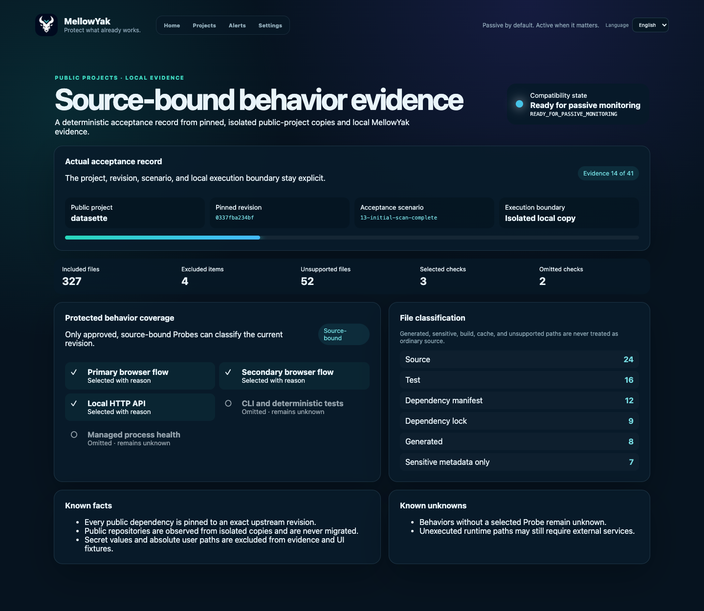

Shows included, excluded, unsupported, and source-bound snapshot totals.

| Field | Acceptance meaning |
|---|---|
| Public repository alias | vite |
| Exact upstream/base commit | `493cc7d43269860fe499a30980d729b0adc93d2c` |
| Backing entity | Completed scan and snapshot |
| Prior state | `SCAN_RUNNING` |
| Current state | `SCAN_COMPLETED` |
| Allowed next states/actions | Continue observation, inspect evidence, or run an explicitly approved bounded action |
| Selected checks | 0 |
| Omitted checks | 0; they remain unknown |
| Known facts | Pinned revision, isolated local copy, bounded evidence, no source upload |
| Unknowns | Unexecuted scripts, external-service requirements, and omitted behaviors |
| Source modification | None by Passive Sentinel |
| Safe next action | Review the shown facts and use only the explicitly available bounded action. |
| Screenshot mode | Explicit deterministic representation generated from actual acceptance records |

## 14. 14-known-good-browser

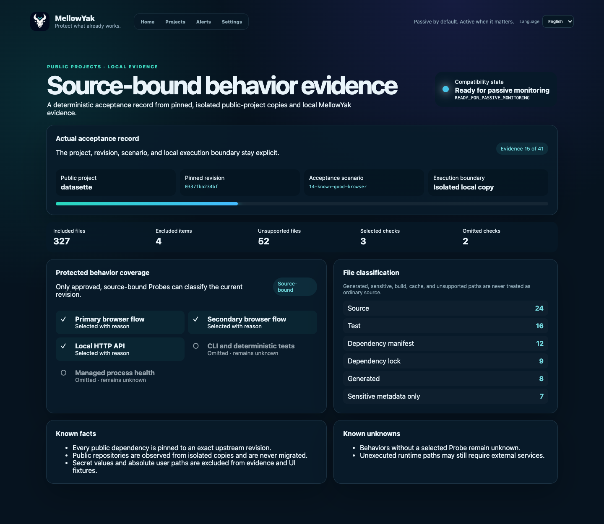

Documents a real local browser flow accepted against the pinned Datasette source.

| Field | Acceptance meaning |
|---|---|
| Public repository alias | datasette |
| Exact upstream/base commit | `0337fba234bf574629d56be631468ea060495fa0` |
| Backing entity | Accepted browser Known Good |
| Prior state | `PROBE_PASS` |
| Current state | `KNOWN_GOOD_ACCEPTED` |
| Allowed next states/actions | Continue observation, inspect evidence, or run an explicitly approved bounded action |
| Selected checks | 3 |
| Omitted checks | 2; they remain unknown |
| Known facts | Pinned revision, isolated local copy, bounded evidence, no source upload |
| Unknowns | Unexecuted scripts, external-service requirements, and omitted behaviors |
| Source modification | None by Passive Sentinel |
| Safe next action | Review the shown facts and use only the explicitly available bounded action. |
| Screenshot mode | Explicit deterministic representation generated from actual acceptance records |

## 15. 15-known-good-api

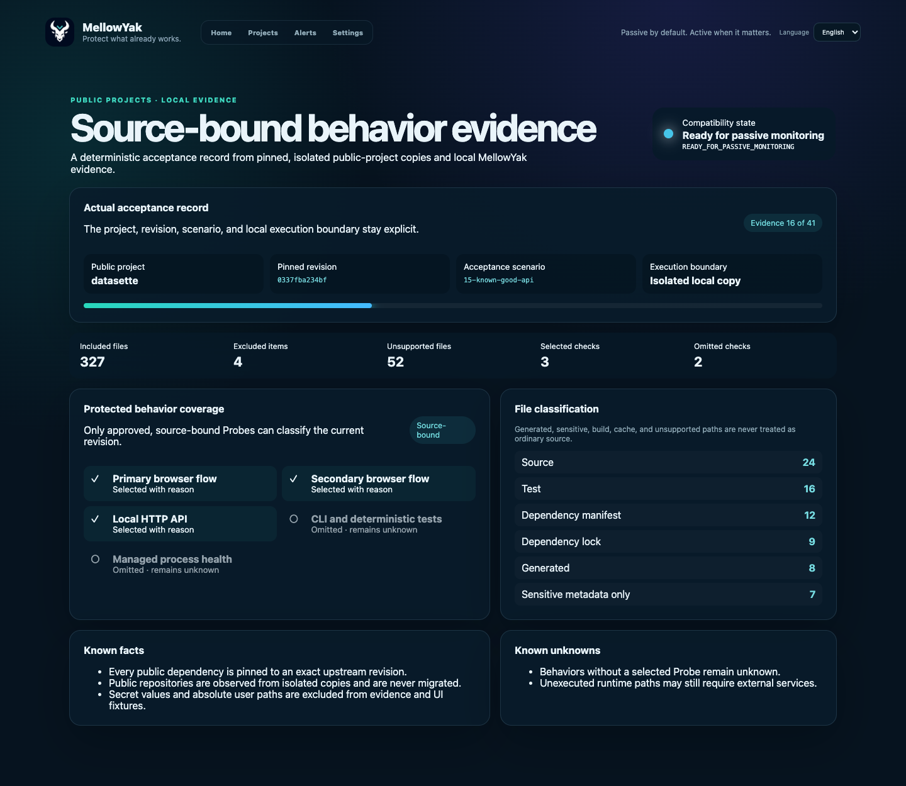

Documents a loopback API behavior with comparable expected output.

| Field | Acceptance meaning |
|---|---|
| Public repository alias | datasette |
| Exact upstream/base commit | `0337fba234bf574629d56be631468ea060495fa0` |
| Backing entity | Accepted HTTP Known Good |
| Prior state | `PROBE_PASS` |
| Current state | `KNOWN_GOOD_ACCEPTED` |
| Allowed next states/actions | Continue observation, inspect evidence, or run an explicitly approved bounded action |
| Selected checks | 3 |
| Omitted checks | 2; they remain unknown |
| Known facts | Pinned revision, isolated local copy, bounded evidence, no source upload |
| Unknowns | Unexecuted scripts, external-service requirements, and omitted behaviors |
| Source modification | None by Passive Sentinel |
| Safe next action | Review the shown facts and use only the explicitly available bounded action. |
| Screenshot mode | Explicit deterministic representation generated from actual acceptance records |

## 16. 16-known-good-cli-test

Documents deterministic CLI and test evidence with executable-plus-argv execution.

| Field | Acceptance meaning |
|---|---|
| Public repository alias | datasette |
| Exact upstream/base commit | `0337fba234bf574629d56be631468ea060495fa0` |
| Backing entity | Accepted CLI/Test Known Good |
| Prior state | `PROBE_PASS` |
| Current state | `KNOWN_GOOD_ACCEPTED` |
| Allowed next states/actions | Continue observation, inspect evidence, or run an explicitly approved bounded action |
| Selected checks | 3 |
| Omitted checks | 2; they remain unknown |
| Known facts | Pinned revision, isolated local copy, bounded evidence, no source upload |
| Unknowns | Unexecuted scripts, external-service requirements, and omitted behaviors |
| Source modification | None by Passive Sentinel |
| Safe next action | Review the shown facts and use only the explicitly available bounded action. |
| Screenshot mode | Explicit deterministic representation generated from actual acceptance records |

## 17. 17-passive-monitoring-public-project

Shows monitoring enabled on a disposable public-project copy without source writes.

| Field | Acceptance meaning |
|---|---|
| Public repository alias | datasette |
| Exact upstream/base commit | `0337fba234bf574629d56be631468ea060495fa0` |
| Backing entity | Passive monitoring state |
| Prior state | `IDLE` |
| Current state | `OBSERVING` |
| Allowed next states/actions | Continue observation, inspect evidence, or run an explicitly approved bounded action |
| Selected checks | 0 |
| Omitted checks | 0; they remain unknown |
| Known facts | Pinned revision, isolated local copy, bounded evidence, no source upload |
| Unknowns | Unexecuted scripts, external-service requirements, and omitted behaviors |
| Source modification | None by Passive Sentinel |
| Safe next action | Review the shown facts and use only the explicitly available bounded action. |
| Screenshot mode | Explicit deterministic representation generated from actual acceptance records |

## 18. 18-harmless-change-no-regression

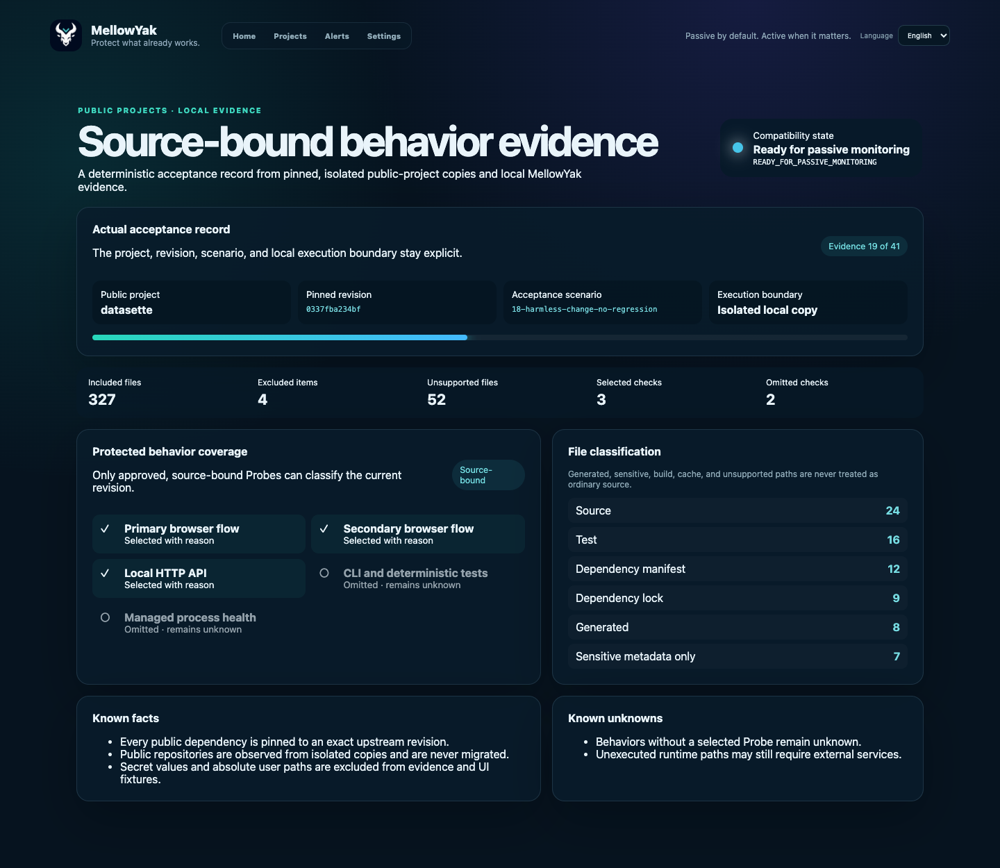

A harmless marker change selects bounded checks and produces no false confirmed regression.

| Field | Acceptance meaning |
|---|---|
| Public repository alias | datasette |
| Exact upstream/base commit | `0337fba234bf574629d56be631468ea060495fa0` |
| Backing entity | Harmless Episode result |
| Prior state | `EPISODE_STABILIZED` |
| Current state | `NO_REGRESSION` |
| Allowed next states/actions | Continue observation, inspect evidence, or run an explicitly approved bounded action |
| Selected checks | 3 |
| Omitted checks | 2; they remain unknown |
| Known facts | Pinned revision, isolated local copy, bounded evidence, no source upload |
| Unknowns | Unexecuted scripts, external-service requirements, and omitted behaviors |
| Source modification | None by Passive Sentinel |
| Safe next action | Review the shown facts and use only the explicitly available bounded action. |
| Screenshot mode | Explicit deterministic representation generated from actual acceptance records |

## 19. 19-impact-selected-real-project

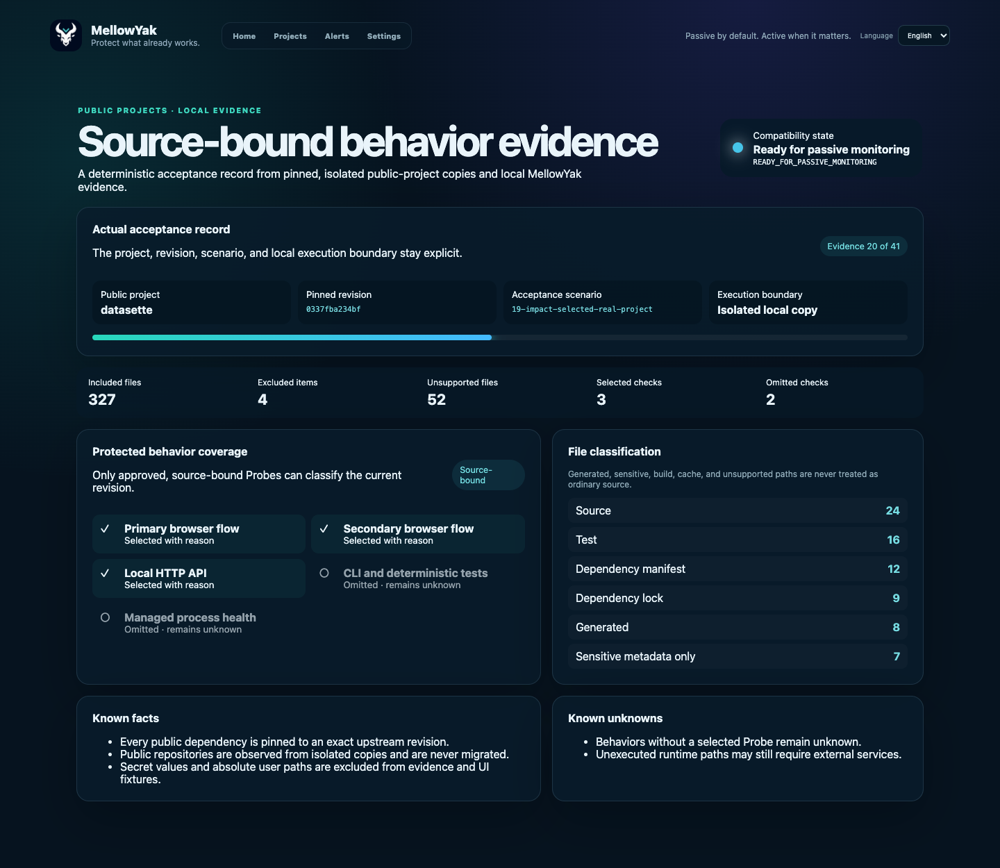

Shows why checks were selected and why omitted behavior remains unknown.

| Field | Acceptance meaning |
|---|---|
| Public repository alias | datasette |
| Exact upstream/base commit | `0337fba234bf574629d56be631468ea060495fa0` |
| Backing entity | Impact Plan |
| Prior state | `EPISODE_STABILIZED` |
| Current state | `CHECKS_SELECTED` |
| Allowed next states/actions | Continue observation, inspect evidence, or run an explicitly approved bounded action |
| Selected checks | 3 |
| Omitted checks | 2; they remain unknown |
| Known facts | Pinned revision, isolated local copy, bounded evidence, no source upload |
| Unknowns | Unexecuted scripts, external-service requirements, and omitted behaviors |
| Source modification | None by Passive Sentinel |
| Safe next action | Review the shown facts and use only the explicitly available bounded action. |
| Screenshot mode | Explicit deterministic representation generated from actual acceptance records |

## 20. 20-controlled-regression-real-project

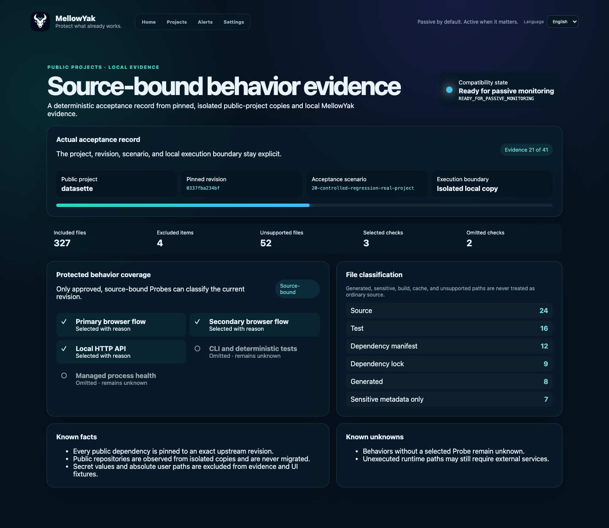

A disposable source mutation produces a comparable failure without claiming root cause.

| Field | Acceptance meaning |
|---|---|
| Public repository alias | datasette |
| Exact upstream/base commit | `0337fba234bf574629d56be631468ea060495fa0` |
| Backing entity | Controlled failing Probe |
| Prior state | `KNOWN_GOOD_PASS` |
| Current state | `RETRYING_FAILURE` |
| Allowed next states/actions | Continue observation, inspect evidence, or run an explicitly approved bounded action |
| Selected checks | 3 |
| Omitted checks | 2; they remain unknown |
| Known facts | Pinned revision, isolated local copy, bounded evidence, no source upload |
| Unknowns | Unexecuted scripts, external-service requirements, and omitted behaviors |
| Source modification | Disposable copy or isolated workspace only |
| Safe next action | Review the shown facts and use only the explicitly available bounded action. |
| Screenshot mode | Explicit deterministic representation generated from actual acceptance records |

## 21. 21-confirmed-incident-real-project

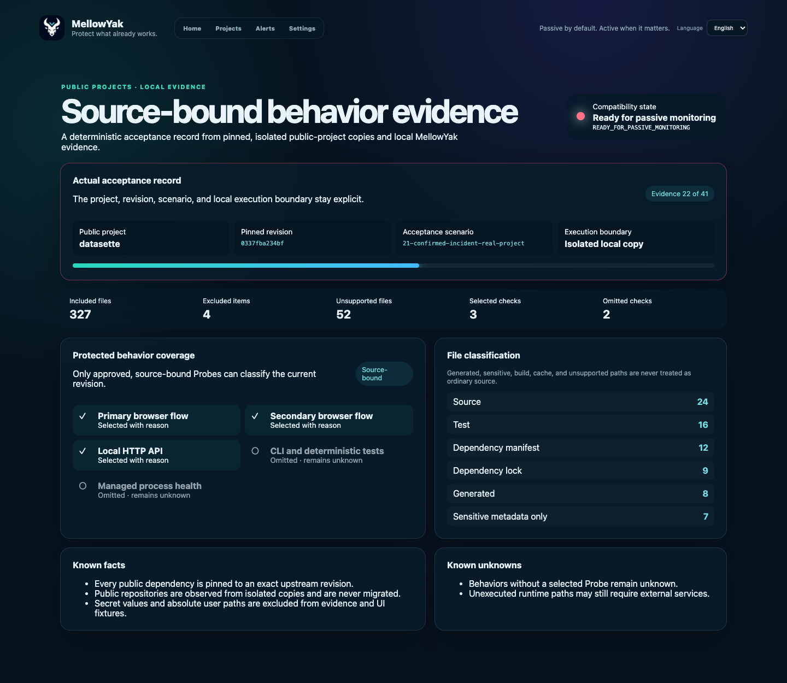

Two comparable failures create one deduplicated incident tied to the exact source identity.

| Field | Acceptance meaning |
|---|---|
| Public repository alias | datasette |
| Exact upstream/base commit | `0337fba234bf574629d56be631468ea060495fa0` |
| Backing entity | Evidence-bound incident |
| Prior state | `RETRYING_FAILURE` |
| Current state | `CONFIRMED` |
| Allowed next states/actions | WORKSPACE_READY, ACKNOWLEDGED |
| Selected checks | 3 |
| Omitted checks | 2; they remain unknown |
| Known facts | Pinned revision, isolated local copy, bounded evidence, no source upload |
| Unknowns | Unexecuted scripts, external-service requirements, and omitted behaviors |
| Source modification | Disposable copy or isolated workspace only |
| Safe next action | Review the shown facts and use only the explicitly available bounded action. |
| Screenshot mode | Explicit deterministic representation generated from actual acceptance records |

## 22. 22-flaky-real-project

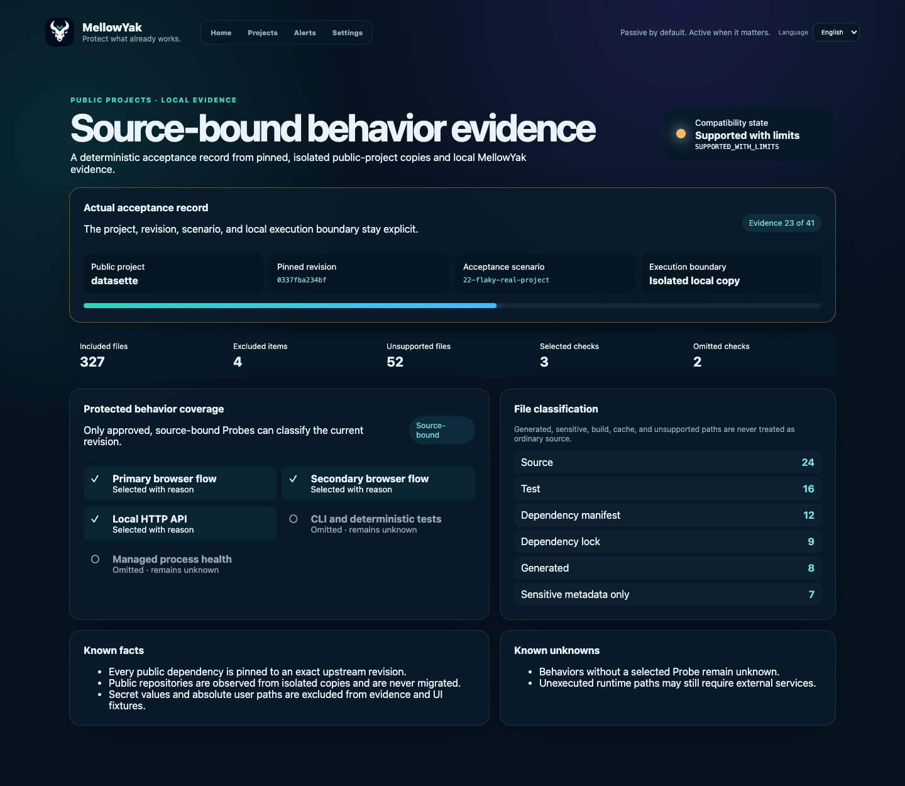

A failure followed by success remains flaky and does not become confirmed.

| Field | Acceptance meaning |
|---|---|
| Public repository alias | datasette |
| Exact upstream/base commit | `0337fba234bf574629d56be631468ea060495fa0` |
| Backing entity | Flaky Probe classification |
| Prior state | `FAIL_THEN_PASS` |
| Current state | `FLAKY` |
| Allowed next states/actions | Continue observation, inspect evidence, or run an explicitly approved bounded action |
| Selected checks | 3 |
| Omitted checks | 2; they remain unknown |
| Known facts | Pinned revision, isolated local copy, bounded evidence, no source upload |
| Unknowns | Unexecuted scripts, external-service requirements, and omitted behaviors |
| Source modification | Disposable copy or isolated workspace only |
| Safe next action | Review the shown facts and use only the explicitly available bounded action. |
| Screenshot mode | Explicit deterministic representation generated from actual acceptance records |

## 23. 23-runtime-unavailable-real-project

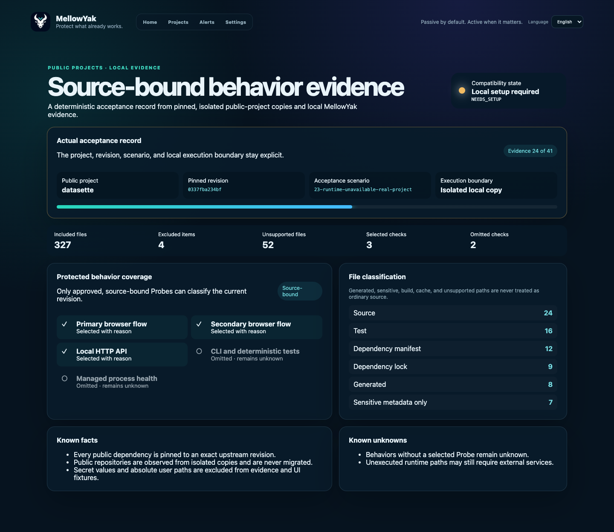

Runtime absence remains an execution limitation rather than a product regression.

| Field | Acceptance meaning |
|---|---|
| Public repository alias | datasette |
| Exact upstream/base commit | `0337fba234bf574629d56be631468ea060495fa0` |
| Backing entity | Unavailable runtime result |
| Prior state | `STARTING_RUNTIME` |
| Current state | `RUNTIME_UNAVAILABLE` |
| Allowed next states/actions | Continue observation, inspect evidence, or run an explicitly approved bounded action |
| Selected checks | 0 |
| Omitted checks | 0; they remain unknown |
| Known facts | Pinned revision, isolated local copy, bounded evidence, no source upload |
| Unknowns | Unexecuted scripts, external-service requirements, and omitted behaviors |
| Source modification | None by Passive Sentinel |
| Safe next action | Review the shown facts and use only the explicitly available bounded action. |
| Screenshot mode | Explicit deterministic representation generated from actual acceptance records |

## 24. 24-lockfile-change-real-project

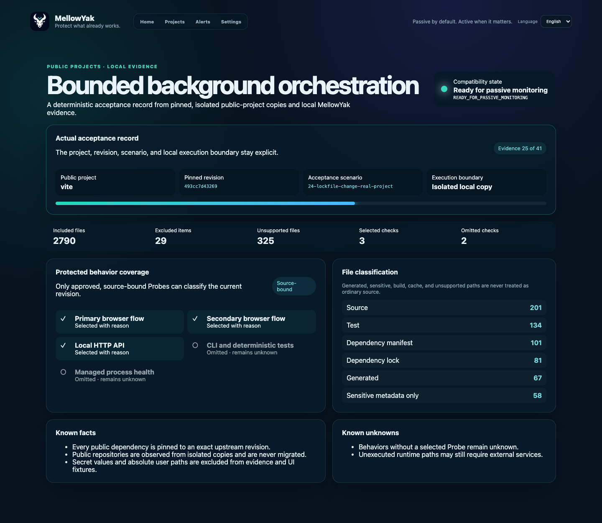

A lockfile change is visible and broadens selection without asserting that functionality broke.

| Field | Acceptance meaning |
|---|---|
| Public repository alias | vite |
| Exact upstream/base commit | `493cc7d43269860fe499a30980d729b0adc93d2c` |
| Backing entity | Dependency-aware Impact Plan |
| Prior state | `LOCKFILE_CHANGED` |
| Current state | `BOUNDED_PLAN` |
| Allowed next states/actions | Continue observation, inspect evidence, or run an explicitly approved bounded action |
| Selected checks | 3 |
| Omitted checks | 2; they remain unknown |
| Known facts | Pinned revision, isolated local copy, bounded evidence, no source upload |
| Unknowns | Unexecuted scripts, external-service requirements, and omitted behaviors |
| Source modification | None by Passive Sentinel |
| Safe next action | Review the shown facts and use only the explicitly available bounded action. |
| Screenshot mode | Explicit deterministic representation generated from actual acceptance records |

## 25. 25-large-fanout-bounded

Selection caps work while hundreds of omitted relations remain explicitly unknown.

| Field | Acceptance meaning |
|---|---|
| Public repository alias | vite |
| Exact upstream/base commit | `493cc7d43269860fe499a30980d729b0adc93d2c` |
| Backing entity | Bounded Impact Plan |
| Prior state | `LARGE_FAN_OUT` |
| Current state | `SENTINELS_SELECTED` |
| Allowed next states/actions | Continue observation, inspect evidence, or run an explicitly approved bounded action |
| Selected checks | 3 |
| Omitted checks | 997; they remain unknown |
| Known facts | Pinned revision, isolated local copy, bounded evidence, no source upload |
| Unknowns | Unexecuted scripts, external-service requirements, and omitted behaviors |
| Source modification | None by Passive Sentinel |
| Safe next action | Review the shown facts and use only the explicitly available bounded action. |
| Screenshot mode | Explicit deterministic representation generated from actual acceptance records |

## 26. 26-symlink-boundary-blocked

A symlink outside the canonical project root is not traversed or captured.

| Field | Acceptance meaning |
|---|---|
| Public repository alias | vite |
| Exact upstream/base commit | `493cc7d43269860fe499a30980d729b0adc93d2c` |
| Backing entity | Filesystem boundary decision |
| Prior state | `SYMLINK_DISCOVERED` |
| Current state | `ESCAPE_BLOCKED` |
| Allowed next states/actions | Continue observation, inspect evidence, or run an explicitly approved bounded action |
| Selected checks | 0 |
| Omitted checks | 0; they remain unknown |
| Known facts | Pinned revision, isolated local copy, bounded evidence, no source upload |
| Unknowns | Unexecuted scripts, external-service requirements, and omitted behaviors |
| Source modification | None by Passive Sentinel |
| Safe next action | Review the shown facts and use only the explicitly available bounded action. |
| Screenshot mode | Explicit deterministic representation generated from actual acceptance records |

## 27. 27-watcher-gap-rescan

A bounded full rescan restores current source identity after an explicit watcher-gap reason.

| Field | Acceptance meaning |
|---|---|
| Public repository alias | vite |
| Exact upstream/base commit | `493cc7d43269860fe499a30980d729b0adc93d2c` |
| Backing entity | Watcher recovery event |
| Prior state | `RESCAN_REQUIRED` |
| Current state | `SOURCE_TRUTH_RESTORED` |
| Allowed next states/actions | Continue observation, inspect evidence, or run an explicitly approved bounded action |
| Selected checks | 0 |
| Omitted checks | 0; they remain unknown |
| Known facts | Pinned revision, isolated local copy, bounded evidence, no source upload |
| Unknowns | Unexecuted scripts, external-service requirements, and omitted behaviors |
| Source modification | None by Passive Sentinel |
| Safe next action | Review the shown facts and use only the explicitly available bounded action. |
| Screenshot mode | Explicit deterministic representation generated from actual acceptance records |

## 28. 28-stale-job-real-project

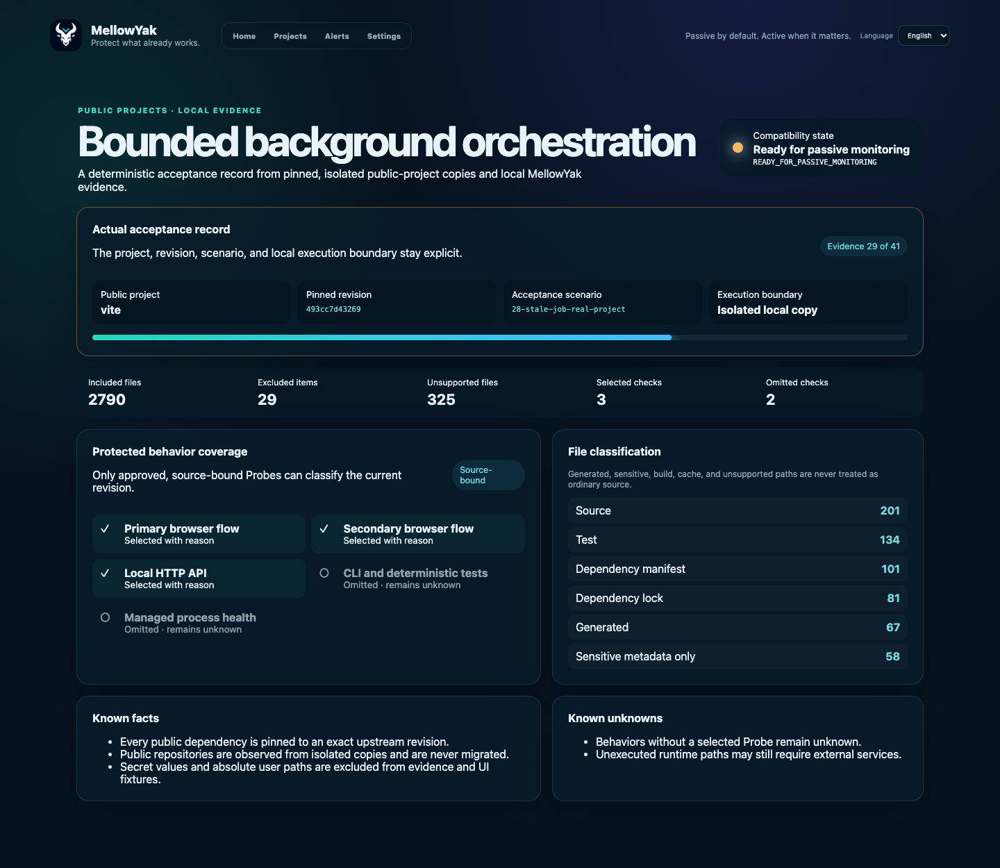

A queued result cannot classify a newer source identity.

| Field | Acceptance meaning |
|---|---|
| Public repository alias | vite |
| Exact upstream/base commit | `493cc7d43269860fe499a30980d729b0adc93d2c` |
| Backing entity | Queue source-identity check |
| Prior state | `QUEUED_OLD_SOURCE` |
| Current state | `STALE` |
| Allowed next states/actions | Continue observation, inspect evidence, or run an explicitly approved bounded action |
| Selected checks | 0 |
| Omitted checks | 0; they remain unknown |
| Known facts | Pinned revision, isolated local copy, bounded evidence, no source upload |
| Unknowns | Unexecuted scripts, external-service requirements, and omitted behaviors |
| Source modification | None by Passive Sentinel |
| Safe next action | Review the shown facts and use only the explicitly available bounded action. |
| Screenshot mode | Explicit deterministic representation generated from actual acceptance records |

## 29. 29-scheduler-recovery-real-project

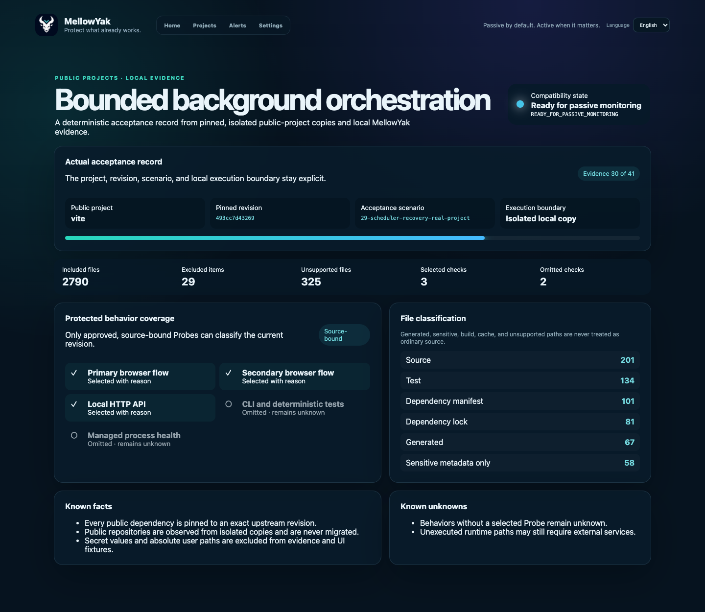

Restart recovery restores eligible work without duplicate execution.

| Field | Acceptance meaning |
|---|---|
| Public repository alias | vite |
| Exact upstream/base commit | `493cc7d43269860fe499a30980d729b0adc93d2c` |
| Backing entity | Persistent scheduler recovery |
| Prior state | `ENGINE_RESTART` |
| Current state | `RECOVERED_ONCE` |
| Allowed next states/actions | Continue observation, inspect evidence, or run an explicitly approved bounded action |
| Selected checks | 0 |
| Omitted checks | 0; they remain unknown |
| Known facts | Pinned revision, isolated local copy, bounded evidence, no source upload |
| Unknowns | Unexecuted scripts, external-service requirements, and omitted behaviors |
| Source modification | None by Passive Sentinel |
| Safe next action | Review the shown facts and use only the explicitly available bounded action. |
| Screenshot mode | Explicit deterministic representation generated from actual acceptance records |

## 30. 30-daily-budget-exhausted

Automatic work defers when the real-project daily runtime budget is exhausted.

| Field | Acceptance meaning |
|---|---|
| Public repository alias | vite |
| Exact upstream/base commit | `493cc7d43269860fe499a30980d729b0adc93d2c` |
| Backing entity | Monitoring budget decision |
| Prior state | `BUDGET_AVAILABLE` |
| Current state | `DAILY_BUDGET_EXHAUSTED` |
| Allowed next states/actions | Continue observation, inspect evidence, or run an explicitly approved bounded action |
| Selected checks | 0 |
| Omitted checks | 0; they remain unknown |
| Known facts | Pinned revision, isolated local copy, bounded evidence, no source upload |
| Unknowns | Unexecuted scripts, external-service requirements, and omitted behaviors |
| Source modification | None by Passive Sentinel |
| Safe next action | Review the shown facts and use only the explicitly available bounded action. |
| Screenshot mode | Explicit deterministic representation generated from actual acceptance records |

## 31. 31-outside-allowed-hours

Automatic checks defer to the next eligible local-policy window.

| Field | Acceptance meaning |
|---|---|
| Public repository alias | vite |
| Exact upstream/base commit | `493cc7d43269860fe499a30980d729b0adc93d2c` |
| Backing entity | Allowed-hours decision |
| Prior state | `JOB_ELIGIBLE` |
| Current state | `OUTSIDE_ALLOWED_HOURS` |
| Allowed next states/actions | Continue observation, inspect evidence, or run an explicitly approved bounded action |
| Selected checks | 0 |
| Omitted checks | 0; they remain unknown |
| Known facts | Pinned revision, isolated local copy, bounded evidence, no source upload |
| Unknowns | Unexecuted scripts, external-service requirements, and omitted behaviors |
| Source modification | None by Passive Sentinel |
| Safe next action | Review the shown facts and use only the explicitly available bounded action. |
| Screenshot mode | Explicit deterministic representation generated from actual acceptance records |

## 32. 32-budget-run-now-override

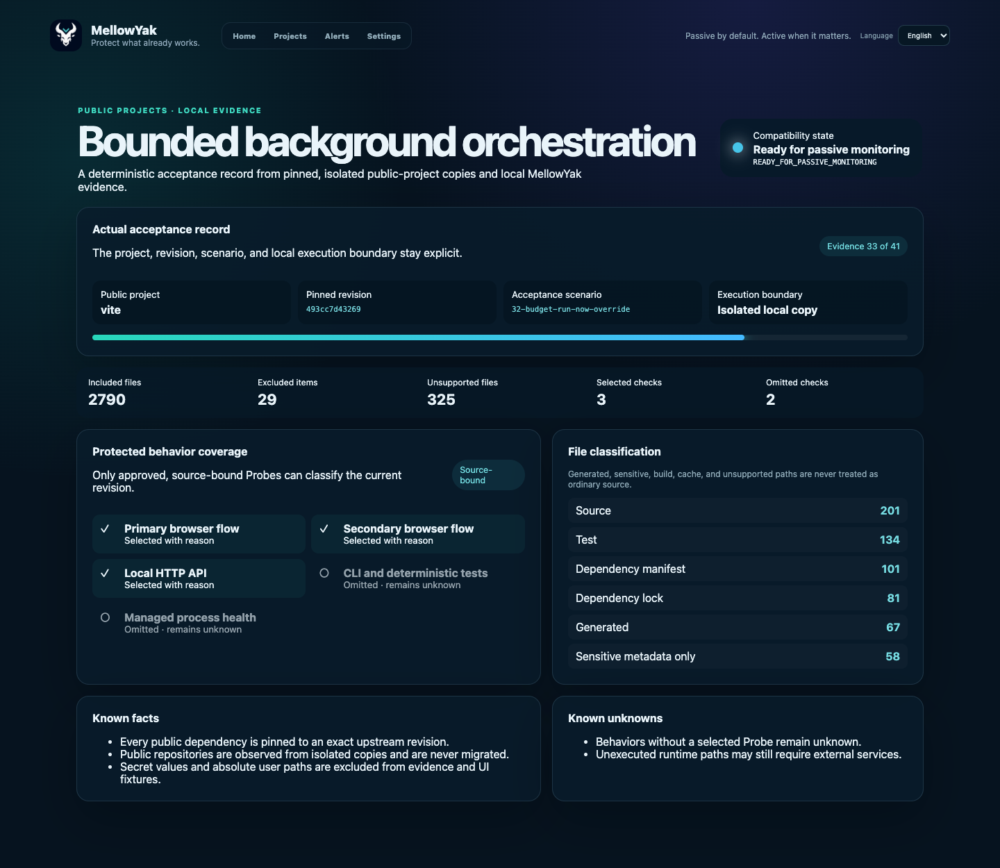

An explicit operator action runs one bounded check without disabling future budget enforcement.

| Field | Acceptance meaning |
|---|---|
| Public repository alias | vite |
| Exact upstream/base commit | `493cc7d43269860fe499a30980d729b0adc93d2c` |
| Backing entity | Explicit Run Now decision |
| Prior state | `BUDGET_DEFERRED` |
| Current state | `RUN_NOW_APPROVED` |
| Allowed next states/actions | Continue observation, inspect evidence, or run an explicitly approved bounded action |
| Selected checks | 3 |
| Omitted checks | 2; they remain unknown |
| Known facts | Pinned revision, isolated local copy, bounded evidence, no source upload |
| Unknowns | Unexecuted scripts, external-service requirements, and omitted behaviors |
| Source modification | None by Passive Sentinel |
| Safe next action | Review the shown facts and use only the explicitly available bounded action. |
| Screenshot mode | Explicit deterministic representation generated from actual acceptance records |

## 33. 33-repair-workspace-public-project

Creates a source-bound isolated copy; the monitored source remains unchanged.

| Field | Acceptance meaning |
|---|---|
| Public repository alias | datasette |
| Exact upstream/base commit | `0337fba234bf574629d56be631468ea060495fa0` |
| Backing entity | Repair Workspace |
| Prior state | `CONFIRMED` |
| Current state | `WORKSPACE_READY` |
| Allowed next states/actions | Continue observation, inspect evidence, or run an explicitly approved bounded action |
| Selected checks | 0 |
| Omitted checks | 0; they remain unknown |
| Known facts | Pinned revision, isolated local copy, bounded evidence, no source upload |
| Unknowns | Unexecuted scripts, external-service requirements, and omitted behaviors |
| Source modification | Disposable copy or isolated workspace only |
| Safe next action | Review the shown facts and use only the explicitly available bounded action. |
| Screenshot mode | Explicit deterministic representation generated from actual acceptance records |

## 34. 34-candidate-validated-public-project

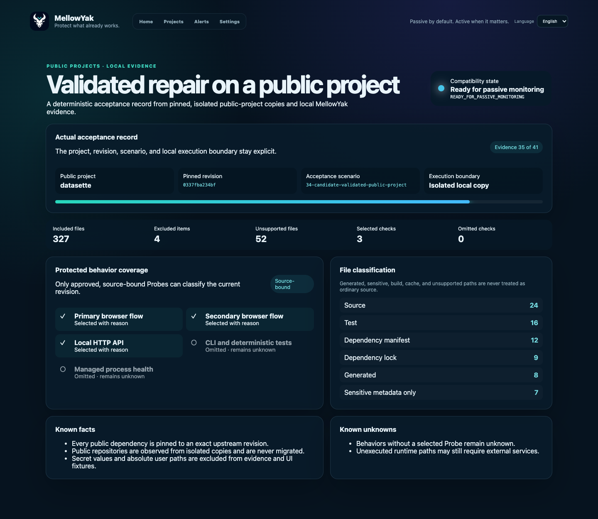

A candidate passes the same comparable behavior before Apply becomes available.

| Field | Acceptance meaning |
|---|---|
| Public repository alias | datasette |
| Exact upstream/base commit | `0337fba234bf574629d56be631468ea060495fa0` |
| Backing entity | Candidate validation |
| Prior state | `CANDIDATE_CREATED` |
| Current state | `VALIDATION_PASSED` |
| Allowed next states/actions | Continue observation, inspect evidence, or run an explicitly approved bounded action |
| Selected checks | 3 |
| Omitted checks | 2; they remain unknown |
| Known facts | Pinned revision, isolated local copy, bounded evidence, no source upload |
| Unknowns | Unexecuted scripts, external-service requirements, and omitted behaviors |
| Source modification | Disposable copy or isolated workspace only |
| Safe next action | Review the shown facts and use only the explicitly available bounded action. |
| Screenshot mode | Explicit deterministic representation generated from actual acceptance records |

## 35. 35-apply-confirmation-public-project

No monitored source byte is written before deliberate confirmation.

| Field | Acceptance meaning |
|---|---|
| Public repository alias | datasette |
| Exact upstream/base commit | `0337fba234bf574629d56be631468ea060495fa0` |
| Backing entity | Apply transaction |
| Prior state | `VALIDATION_PASSED` |
| Current state | `AWAITING_CONFIRMATION` |
| Allowed next states/actions | COMMITTED, CANCELLED, STALE |
| Selected checks | 0 |
| Omitted checks | 0; they remain unknown |
| Known facts | Pinned revision, isolated local copy, bounded evidence, no source upload |
| Unknowns | Unexecuted scripts, external-service requirements, and omitted behaviors |
| Source modification | Disposable copy or isolated workspace only |
| Safe next action | Review the shown facts and use only the explicitly available bounded action. |
| Screenshot mode | Explicit deterministic representation generated from actual acceptance records |

## 36. 36-applied-verified-public-project

The confirmed candidate writes only selected files and passes live verification.

| Field | Acceptance meaning |
|---|---|
| Public repository alias | datasette |
| Exact upstream/base commit | `0337fba234bf574629d56be631468ea060495fa0` |
| Backing entity | Committed Apply |
| Prior state | `AWAITING_CONFIRMATION` |
| Current state | `COMMITTED` |
| Allowed next states/actions | Continue observation, inspect evidence, or run an explicitly approved bounded action |
| Selected checks | 3 |
| Omitted checks | 2; they remain unknown |
| Known facts | Pinned revision, isolated local copy, bounded evidence, no source upload |
| Unknowns | Unexecuted scripts, external-service requirements, and omitted behaviors |
| Source modification | Explicit confirmed Apply |
| Safe next action | Review the shown facts and use only the explicitly available bounded action. |
| Screenshot mode | Explicit deterministic representation generated from actual acceptance records |

## 37. 37-rollback-byte-identical-public-project

A failed post-check restores pre-Apply bytes and leaves unrelated source unchanged.

| Field | Acceptance meaning |
|---|---|
| Public repository alias | datasette |
| Exact upstream/base commit | `0337fba234bf574629d56be631468ea060495fa0` |
| Backing entity | Transactional rollback |
| Prior state | `POST_CHECK_FAILED` |
| Current state | `ROLLED_BACK` |
| Allowed next states/actions | Continue observation, inspect evidence, or run an explicitly approved bounded action |
| Selected checks | 3 |
| Omitted checks | 2; they remain unknown |
| Known facts | Pinned revision, isolated local copy, bounded evidence, no source upload |
| Unknowns | Unexecuted scripts, external-service requirements, and omitted behaviors |
| Source modification | Restored byte-identically |
| Safe next action | Review the shown facts and use only the explicitly available bounded action. |
| Screenshot mode | Explicit deterministic representation generated from actual acceptance records |

## 38. 38-soak-test-summary

Summarizes periodic harmless bursts, bounded checks, restart, and measured resource growth.

| Field | Acceptance meaning |
|---|---|
| Public repository alias | vite |
| Exact upstream/base commit | `493cc7d43269860fe499a30980d729b0adc93d2c` |
| Backing entity | Thirty-minute soak record |
| Prior state | `SOAK_RUNNING` |
| Current state | `SOAK_COMPLETED` |
| Allowed next states/actions | Continue observation, inspect evidence, or run an explicitly approved bounded action |
| Selected checks | 3 |
| Omitted checks | 2; they remain unknown |
| Known facts | Pinned revision, isolated local copy, bounded evidence, no source upload |
| Unknowns | Unexecuted scripts, external-service requirements, and omitted behaviors |
| Source modification | None by Passive Sentinel |
| Safe next action | Review the shown facts and use only the explicitly available bounded action. |
| Screenshot mode | Explicit deterministic representation generated from actual acceptance records |

## 39. 39-package-acceptance

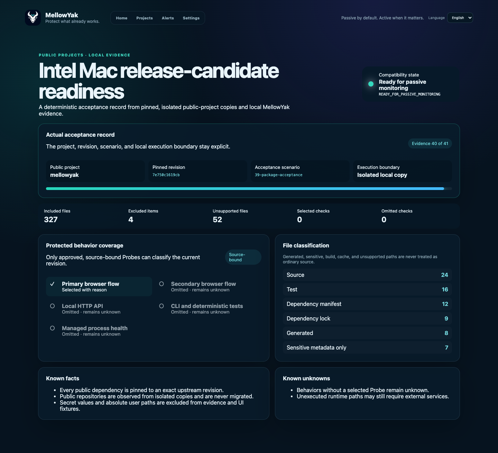

Summarizes Phase 8 through Phase 14 packaged validators and package-bound safety checks.

| Field | Acceptance meaning |
|---|---|
| Public repository alias | mellowyak |
| Exact upstream/base commit | `7e750c1619cbb404fb900d3ce8fe165ae4314d50` |
| Backing entity | Packaged validator matrix |
| Prior state | `PACKAGE_BUILT` |
| Current state | `PACKAGE_ACCEPTED` |
| Allowed next states/actions | Continue observation, inspect evidence, or run an explicitly approved bounded action |
| Selected checks | 0 |
| Omitted checks | 0; they remain unknown |
| Known facts | Pinned revision, isolated local copy, bounded evidence, no source upload |
| Unknowns | Unexecuted scripts, external-service requirements, and omitted behaviors |
| Source modification | None by Passive Sentinel |
| Safe next action | Review the shown facts and use only the explicitly available bounded action. |
| Screenshot mode | Explicit deterministic representation generated from actual acceptance records |

## 40. 40-intel-mac-rc-readiness

Marks automated Intel Mac readiness while keeping physical OS interactions NOT_RUN.

| Field | Acceptance meaning |
|---|---|
| Public repository alias | mellowyak |
| Exact upstream/base commit | `7e750c1619cbb404fb900d3ce8fe165ae4314d50` |
| Backing entity | Release-candidate readiness |
| Prior state | `AUTOMATION_COMPLETE` |
| Current state | `MANUAL_BOUNDARIES_PENDING` |
| Allowed next states/actions | PHASE_15_PHYSICAL_ACCEPTANCE |
| Selected checks | 0 |
| Omitted checks | 0; they remain unknown |
| Known facts | Pinned revision, isolated local copy, bounded evidence, no source upload |
| Unknowns | Unexecuted scripts, external-service requirements, and omitted behaviors |
| Source modification | None by Passive Sentinel |
| Safe next action | Review the shown facts and use only the explicitly available bounded action. |
| Screenshot mode | Explicit deterministic representation generated from actual acceptance records |

## Operator expectations

MellowYak observes local outcomes. A file or lockfile change is not itself a regression. A runtime failure is not automatically a product regression. Apply is always explicit. Physical tray, Notification Center, login, sleep/wake, Finder Alias, dragged-DMG, and quarantined-download interactions remain Phase 15 manual acceptance boundaries.
