# MellowYak Phase 16M — Visual Manual and Human Checklist

## How to use this manual

This English manual explains every represented page and state in the Phase 16M evidence set. Product GUI text is translation-key driven; English is the base catalog and Hebrew has matching RTL translations. Documentation is intentionally captured in English only.

Each image is followed by what the page represents, what the operator can do, what to expect, and its evidence class. Images marked deterministic describe the product UI but do not prove a human physical macOS action.

## Core operator flow

1. Open MellowYak from Applications or the menu-bar icon.
2. Home summarizes connected projects and the current local monitoring state.
3. Projects adds, reconnects, pauses, disconnects, archives, or opens a project.
4. Alerts is the durable inbox for regressions, warnings, blocked gates, verification results, and project errors.
5. Settings controls native notifications, Quiet Mode, close-to-tray, Start at Login, activity mode, schedules, and privacy detail.
6. Project pages provide overview, activity, protected behaviors, regressions, repair workspace, Apply confirmation, rollback, diagnostics, and update status.

## Safety expectations

- MellowYak observes locally and does not silently apply source changes.
- Git is optional.
- Native banners are a convenience; Alerts is the durable record.
- Quiet Mode suppresses eligible native delivery but does not delete in-app evidence.
- Reconnect must prove project identity before retaining history.
- Gatekeeper rejection of an ad-hoc build is expected until public distribution is signed and notarized.

## Evidence catalog

### 1. Gatekeeper Quarantined Adhoc Build

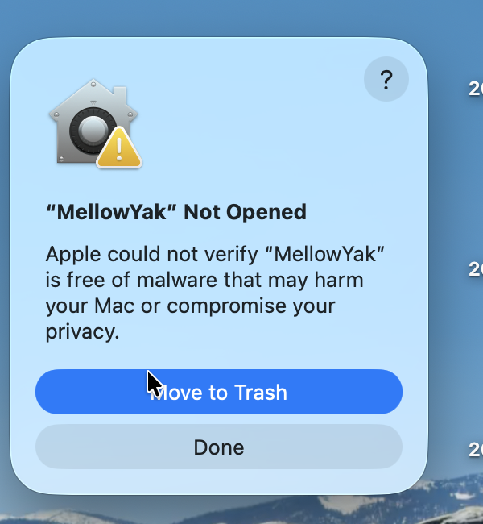

Blocked distribution example. Gatekeeper correctly rejects the quarantined ad-hoc technical-preview build. This is a release-boundary result, not a troubleshooting instruction.

Evidence class: `BLOCKED_DISTRIBUTION_BOUNDARY`.

### 2. First Run Welcome

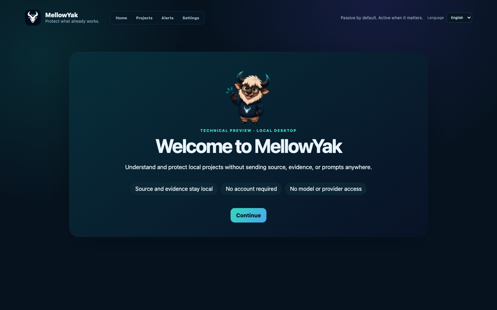

Deterministic product view for first run welcome. Use this page to understand the represented product state and available controls. This image is not human physical evidence.

Evidence class: `DETERMINISTIC_PRODUCT_VIEW — NOT HUMAN PHYSICAL EVIDENCE`.

### 3. First Run Choice Unselected

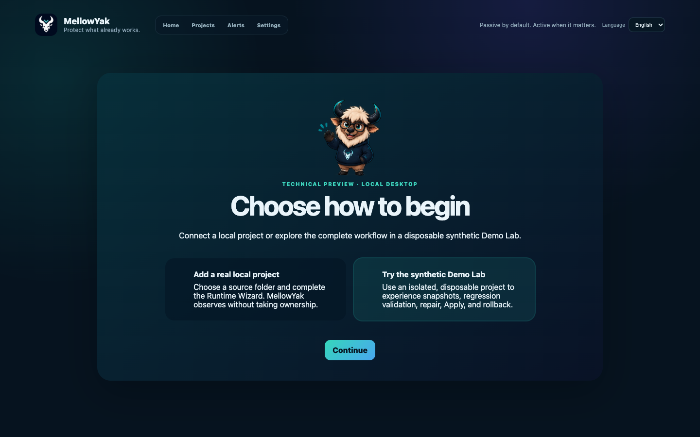

Deterministic product view for first run choice unselected. Use this page to understand the represented product state and available controls. This image is not human physical evidence.

Evidence class: `DETERMINISTIC_PRODUCT_VIEW — NOT HUMAN PHYSICAL EVIDENCE`.

### 4. First Run Demo Selected

Deterministic product view for first run demo selected. Use this page to understand the represented product state and available controls. This image is not human physical evidence.

Evidence class: `DETERMINISTIC_PRODUCT_VIEW — NOT HUMAN PHYSICAL EVIDENCE`.

### 5. First Run Background Settings

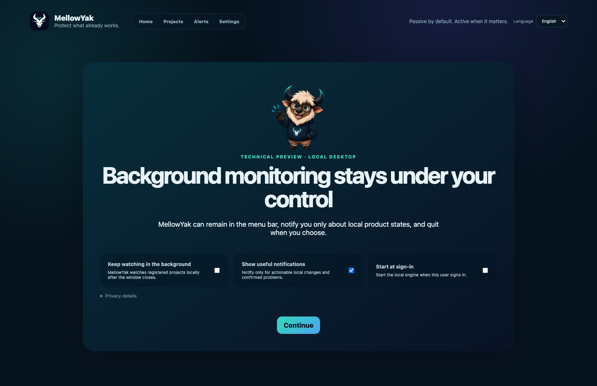

Deterministic product view for first run background settings. Use this page to understand the represented product state and available controls. This image is not human physical evidence.

Evidence class: `DETERMINISTIC_PRODUCT_VIEW — NOT HUMAN PHYSICAL EVIDENCE`.

### 6. First Run Complete Demo

Deterministic product view for first run complete demo. Use this page to understand the represented product state and available controls. This image is not human physical evidence.

Evidence class: `DETERMINISTIC_PRODUCT_VIEW — NOT HUMAN PHYSICAL EVIDENCE`.

### 7. Home No Confirmed Issue

Deterministic product view for home no confirmed issue. Use this page to understand the represented product state and available controls. This image is not human physical evidence.

Evidence class: `DETERMINISTIC_PRODUCT_VIEW — NOT HUMAN PHYSICAL EVIDENCE`.

### 8. Home Needs Attention

Deterministic product view for home needs attention. Use this page to understand the represented product state and available controls. This image is not human physical evidence.

Evidence class: `DETERMINISTIC_PRODUCT_VIEW — NOT HUMAN PHYSICAL EVIDENCE`.

### 9. Project Overview Healthy

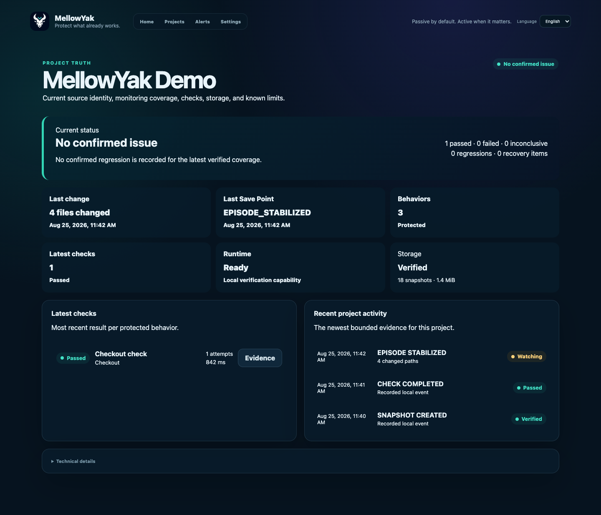

Deterministic product view for project overview healthy. Use this page to understand the represented product state and available controls. This image is not human physical evidence.

Evidence class: `DETERMINISTIC_PRODUCT_VIEW — NOT HUMAN PHYSICAL EVIDENCE`.

### 10. Project Overview Ready With Limits

Deterministic product view for project overview ready with limits. Use this page to understand the represented product state and available controls. This image is not human physical evidence.

Evidence class: `DETERMINISTIC_PRODUCT_VIEW — NOT HUMAN PHYSICAL EVIDENCE`.

### 11. Project Activity Timeline

Deterministic product view for project activity timeline. Use this page to understand the represented product state and available controls. This image is not human physical evidence.

Evidence class: `DETERMINISTIC_PRODUCT_VIEW — NOT HUMAN PHYSICAL EVIDENCE`.

### 12. Episode Detail

Deterministic product view for episode detail. Use this page to understand the represented product state and available controls. This image is not human physical evidence.

Evidence class: `DETERMINISTIC_PRODUCT_VIEW — NOT HUMAN PHYSICAL EVIDENCE`.

### 13. Check Passed No Regression

Deterministic product view for check passed no regression. Use this page to understand the represented product state and available controls. This image is not human physical evidence.

Evidence class: `DETERMINISTIC_PRODUCT_VIEW — NOT HUMAN PHYSICAL EVIDENCE`.

### 14. Behaviors Known Good

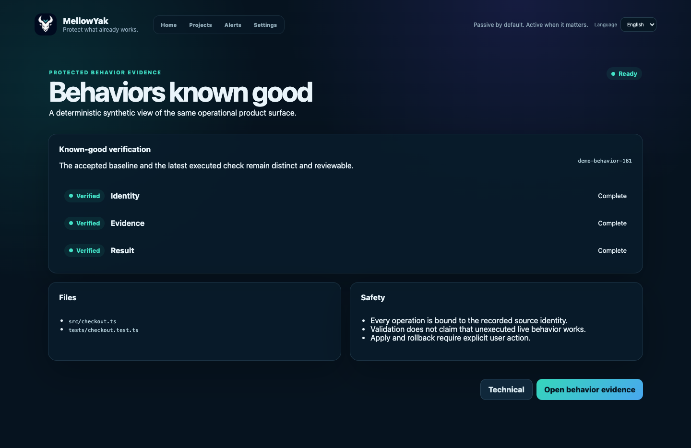

Deterministic product view for behaviors known good. Use this page to understand the represented product state and available controls. This image is not human physical evidence.

Evidence class: `DETERMINISTIC_PRODUCT_VIEW — NOT HUMAN PHYSICAL EVIDENCE`.

### 15. Regression Friendly

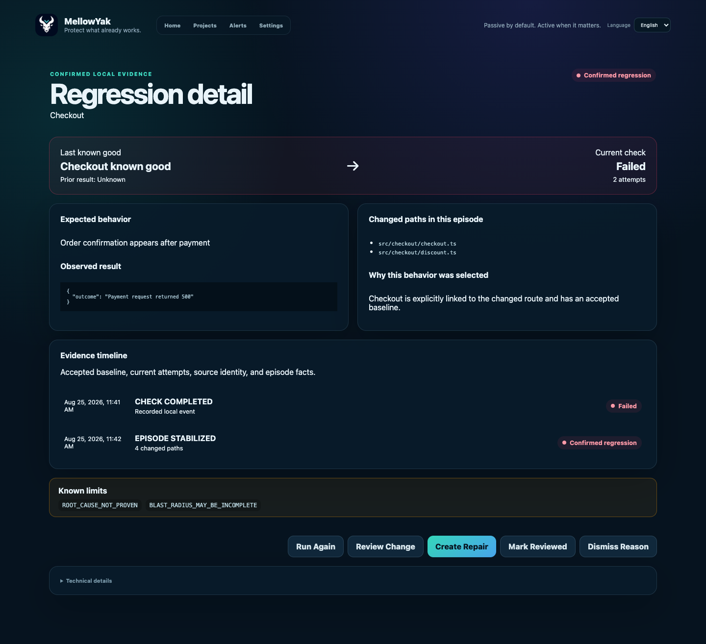

Deterministic product view for regression friendly. Use this page to understand the represented product state and available controls. This image is not human physical evidence.

Evidence class: `DETERMINISTIC_PRODUCT_VIEW — NOT HUMAN PHYSICAL EVIDENCE`.

### 16. Regression Technical

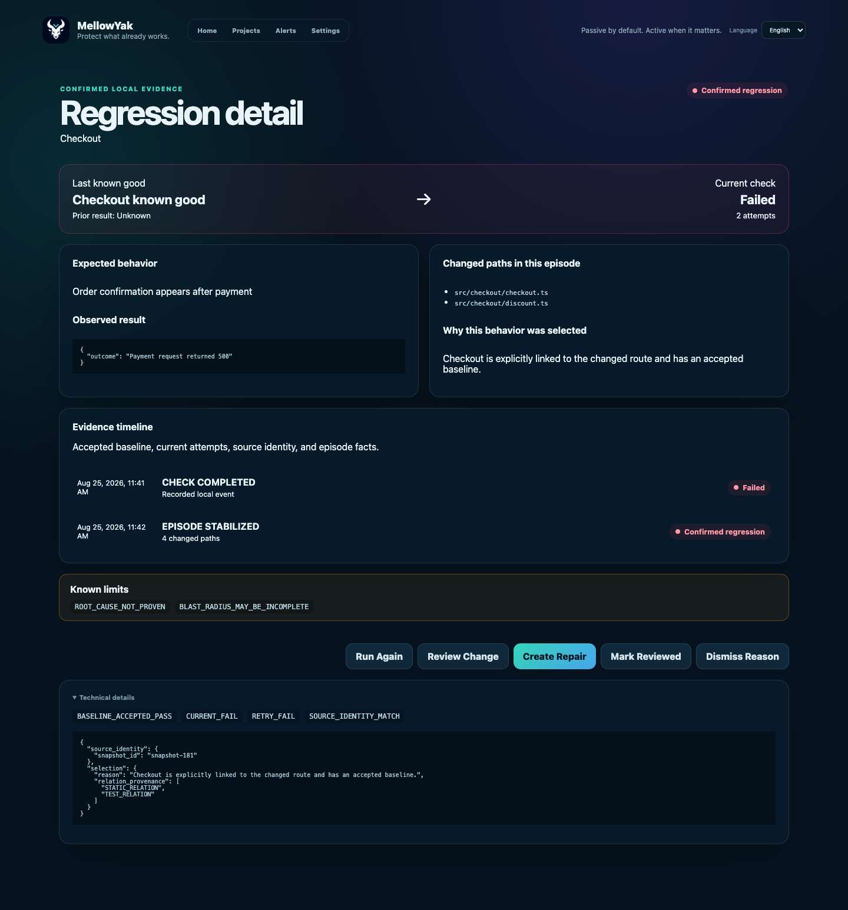

Deterministic product view for regression technical. Use this page to understand the represented product state and available controls. This image is not human physical evidence.

Evidence class: `DETERMINISTIC_PRODUCT_VIEW — NOT HUMAN PHYSICAL EVIDENCE`.

### 17. Repair Workspace Operational

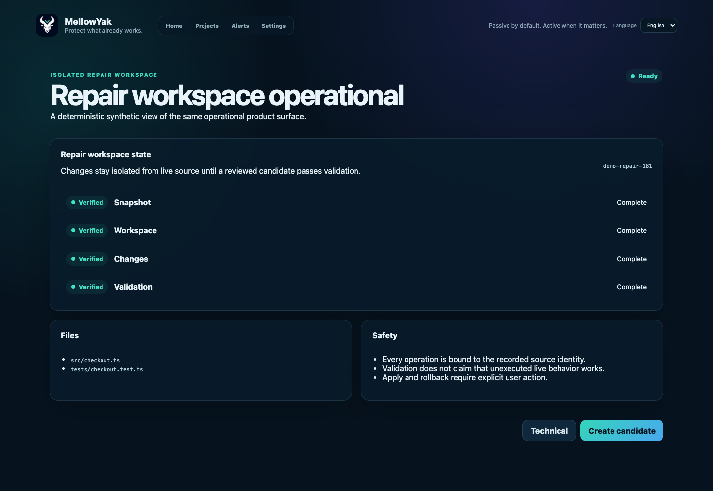

Deterministic product view for repair workspace operational. Use this page to understand the represented product state and available controls. This image is not human physical evidence.

Evidence class: `DETERMINISTIC_PRODUCT_VIEW — NOT HUMAN PHYSICAL EVIDENCE`.

### 18. Candidate Validation Progress

Deterministic product view for candidate validation progress. Use this page to understand the represented product state and available controls. This image is not human physical evidence.

Evidence class: `DETERMINISTIC_PRODUCT_VIEW — NOT HUMAN PHYSICAL EVIDENCE`.

### 19. Candidate Validated

Deterministic product view for candidate validated. Use this page to understand the represented product state and available controls. This image is not human physical evidence.

Evidence class: `DETERMINISTIC_PRODUCT_VIEW — NOT HUMAN PHYSICAL EVIDENCE`.

### 20. Apply Confirmation

Deterministic product view for apply confirmation. Use this page to understand the represented product state and available controls. This image is not human physical evidence.

Evidence class: `DETERMINISTIC_PRODUCT_VIEW — NOT HUMAN PHYSICAL EVIDENCE`.

### 21. Apply Transaction Progress

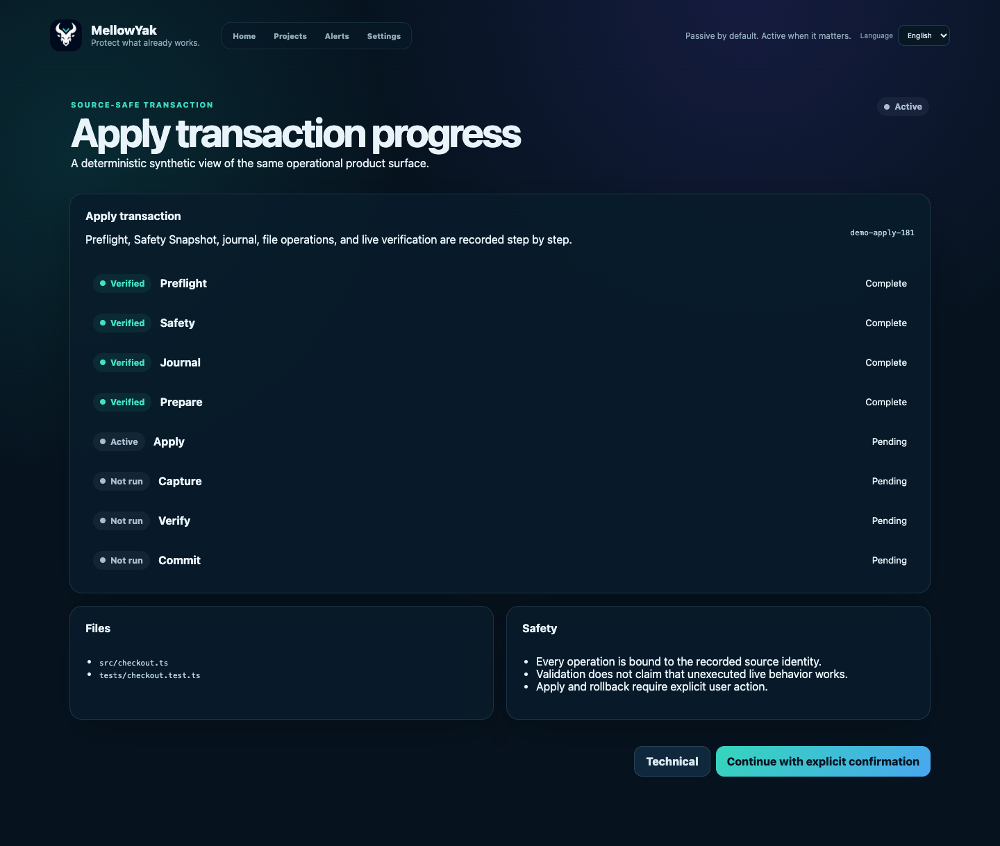

Deterministic product view for apply transaction progress. Use this page to understand the represented product state and available controls. This image is not human physical evidence.

Evidence class: `DETERMINISTIC_PRODUCT_VIEW — NOT HUMAN PHYSICAL EVIDENCE`.

### 22. Applied And Verified

Deterministic product view for applied and verified. Use this page to understand the represented product state and available controls. This image is not human physical evidence.

Evidence class: `DETERMINISTIC_PRODUCT_VIEW — NOT HUMAN PHYSICAL EVIDENCE`.

### 23. Rolled Back Safely

Deterministic product view for rolled back safely. Use this page to understand the represented product state and available controls. This image is not human physical evidence.

Evidence class: `DETERMINISTIC_PRODUCT_VIEW — NOT HUMAN PHYSICAL EVIDENCE`.

### 24. Disconnected Projects

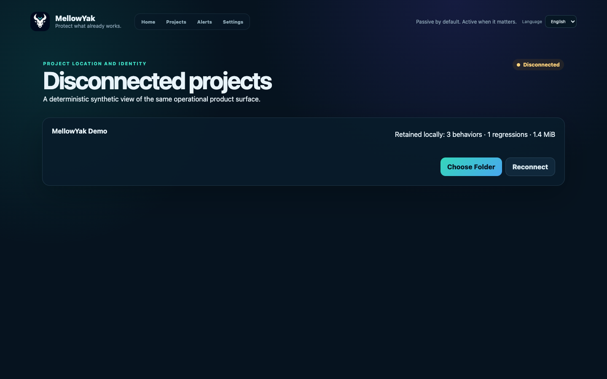

Deterministic product view for disconnected projects. Use this page to understand the represented product state and available controls. This image is not human physical evidence.

Evidence class: `DETERMINISTIC_PRODUCT_VIEW — NOT HUMAN PHYSICAL EVIDENCE`.

### 25. Reconnect Identity Preview

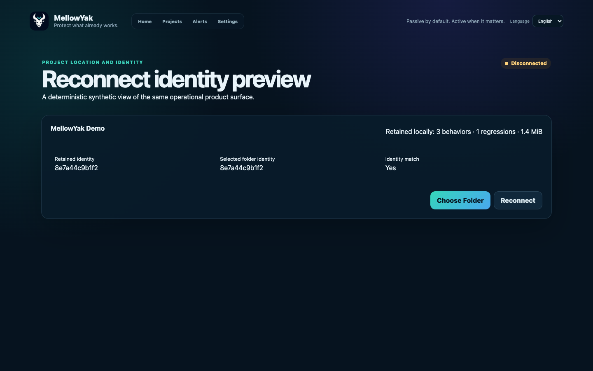

Deterministic product view for reconnect identity preview. Use this page to understand the represented product state and available controls. This image is not human physical evidence.

Evidence class: `DETERMINISTIC_PRODUCT_VIEW — NOT HUMAN PHYSICAL EVIDENCE`.

### 26. Project Mismatch Alert

Deterministic product view for project mismatch alert. Use this page to understand the represented product state and available controls. This image is not human physical evidence.

Evidence class: `DETERMINISTIC_PRODUCT_VIEW — NOT HUMAN PHYSICAL EVIDENCE`.

### 27. Diagnostics Real Data

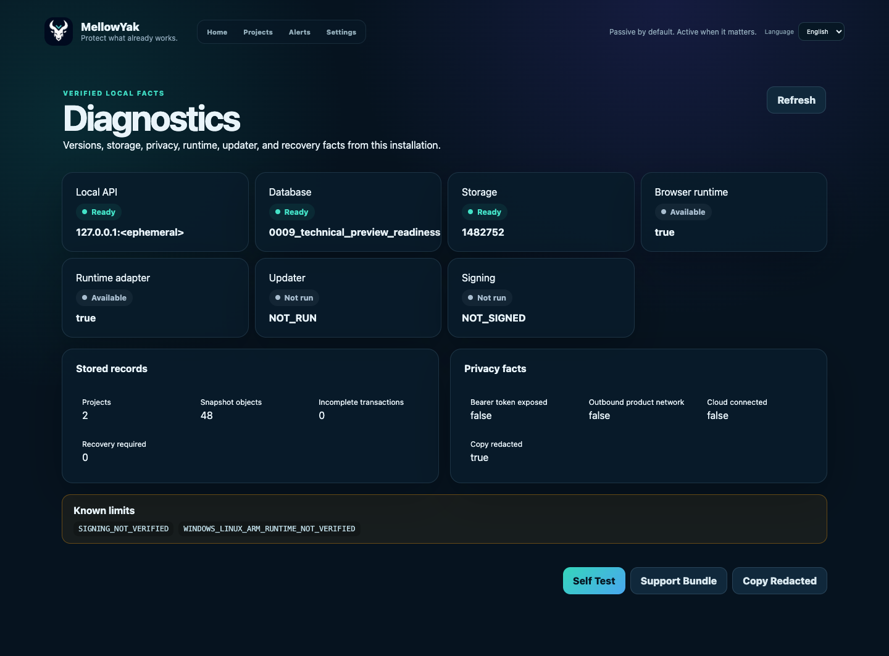

Deterministic product view for diagnostics real data. Use this page to understand the represented product state and available controls. This image is not human physical evidence.

Evidence class: `DETERMINISTIC_PRODUCT_VIEW — NOT HUMAN PHYSICAL EVIDENCE`.

### 28. Self Test Running

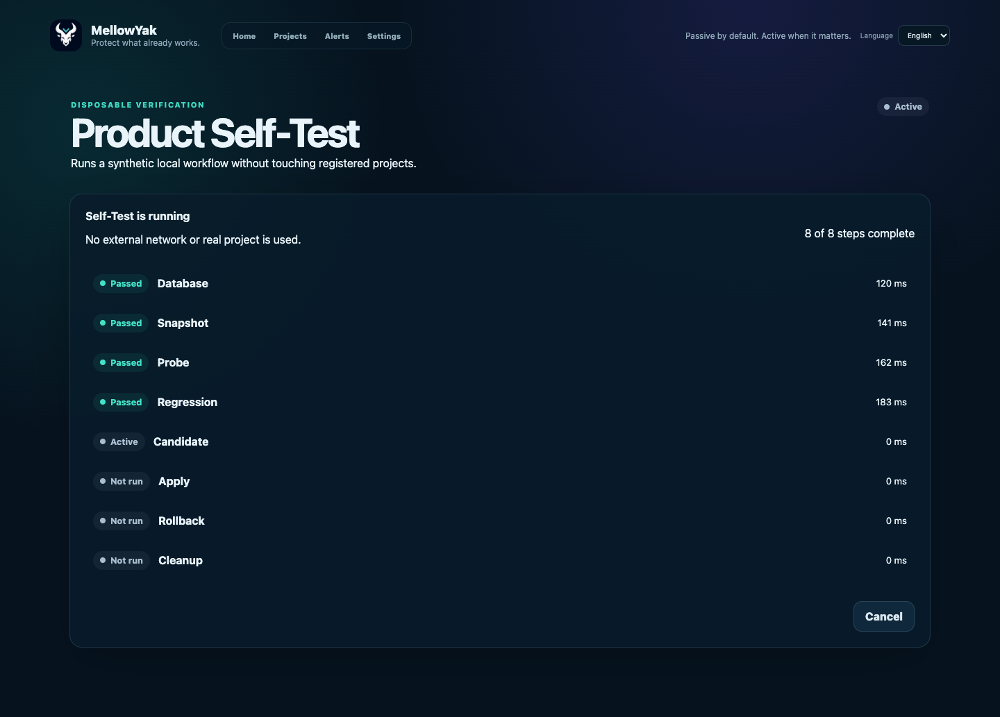

Deterministic product view for self test running. Use this page to understand the represented product state and available controls. This image is not human physical evidence.

Evidence class: `DETERMINISTIC_PRODUCT_VIEW — NOT HUMAN PHYSICAL EVIDENCE`.

### 29. Self Test Passed

Deterministic product view for self test passed. Use this page to understand the represented product state and available controls. This image is not human physical evidence.

Evidence class: `DETERMINISTIC_PRODUCT_VIEW — NOT HUMAN PHYSICAL EVIDENCE`.

### 30. Support Bundle Manifest

Deterministic product view for support bundle manifest. Use this page to understand the represented product state and available controls. This image is not human physical evidence.

Evidence class: `DETERMINISTIC_PRODUCT_VIEW — NOT HUMAN PHYSICAL EVIDENCE`.

### 31. Update Status

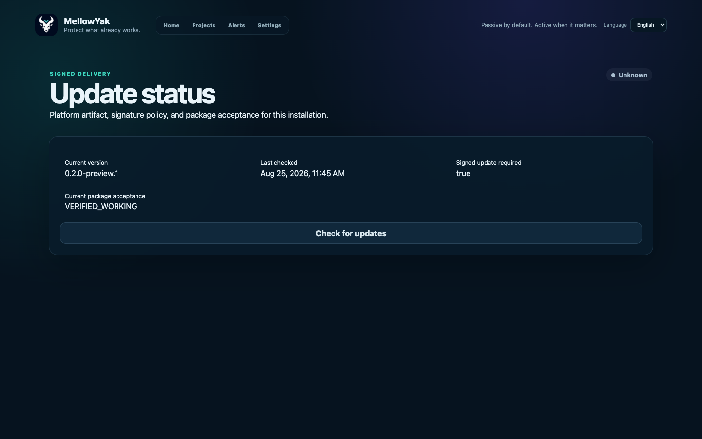

Deterministic product view for update status. Use this page to understand the represented product state and available controls. This image is not human physical evidence.

Evidence class: `DETERMINISTIC_PRODUCT_VIEW — NOT HUMAN PHYSICAL EVIDENCE`.

### 32. Activity Mode Settings

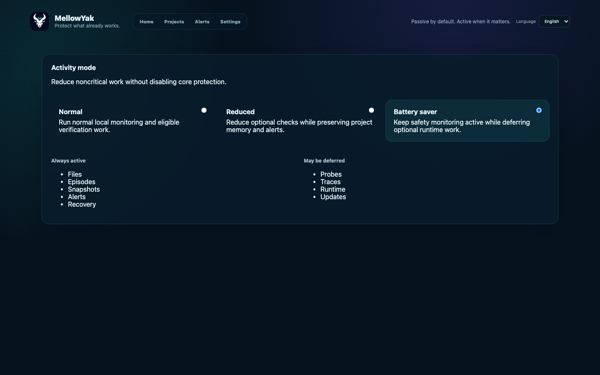

Deterministic product view for activity mode settings. Use this page to understand the represented product state and available controls. This image is not human physical evidence.

Evidence class: `DETERMINISTIC_PRODUCT_VIEW — NOT HUMAN PHYSICAL EVIDENCE`.

### 33. Native Tray Preview

Deterministic product view for native tray preview. Use this page to understand the represented product state and available controls. This image is not human physical evidence.

Evidence class: `DETERMINISTIC_PRODUCT_VIEW — NOT HUMAN PHYSICAL EVIDENCE`.

### 34. Hebrew Home

Deterministic product view for hebrew home. Use this page to understand the represented product state and available controls. This image is not human physical evidence.

Evidence class: `DETERMINISTIC_PRODUCT_VIEW — NOT HUMAN PHYSICAL EVIDENCE`.

### 35. Hebrew Project Overview

Deterministic product view for hebrew project overview. Use this page to understand the represented product state and available controls. This image is not human physical evidence.

Evidence class: `DETERMINISTIC_PRODUCT_VIEW — NOT HUMAN PHYSICAL EVIDENCE`.

### 36. Hebrew Regression

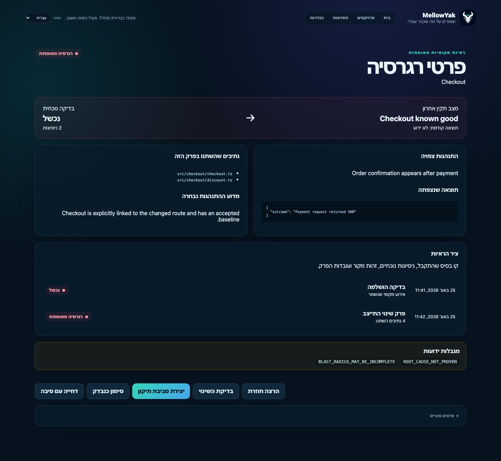

Deterministic product view for hebrew regression. Use this page to understand the represented product state and available controls. This image is not human physical evidence.

Evidence class: `DETERMINISTIC_PRODUCT_VIEW — NOT HUMAN PHYSICAL EVIDENCE`.

### 37. Hebrew Diagnostics

Deterministic product view for hebrew diagnostics. Use this page to understand the represented product state and available controls. This image is not human physical evidence.

Evidence class: `DETERMINISTIC_PRODUCT_VIEW — NOT HUMAN PHYSICAL EVIDENCE`.

### 38. Native Tray Part 01

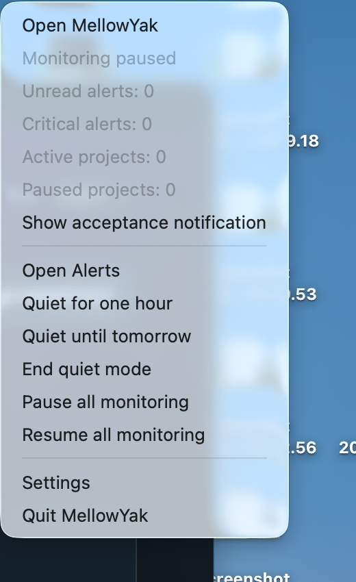

Native menu-bar control surface. Use it to open MellowYak, inspect monitoring truth, enter or end Quiet Mode, pause/resume monitoring, and Quit completely.

Evidence class: `NATIVE_VISUAL_EVIDENCE`.

### 39. Notification Permission Enabled Privacy Crop

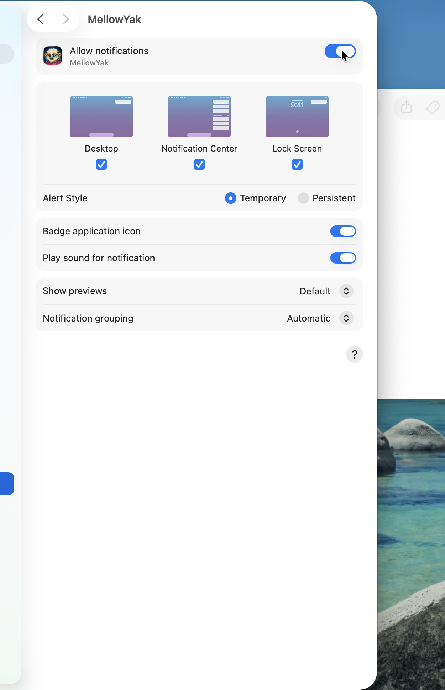

Privacy-safe macOS Notifications pane with MellowYak enabled. The crop intentionally excludes account and unrelated sidebar details.

Evidence class: `NATIVE_VISUAL_EVIDENCE`.

### 40. Notification Permission Disabled Privacy Crop

Privacy-safe macOS Notifications pane with MellowYak disabled. In-app alerts remain durable even when native delivery is unavailable.

Evidence class: `NATIVE_VISUAL_EVIDENCE`.

### 41. Finder Alias Canonical Resolution

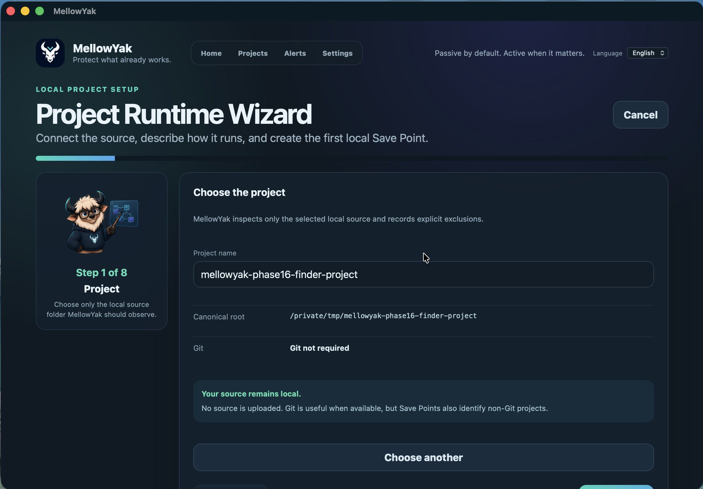

Native Finder Alias selection and canonical project resolution evidence. Reconnect must retain the existing identity rather than create a duplicate.

Evidence class: `NATIVE_VISUAL_EVIDENCE`.

### 42. 01 Information

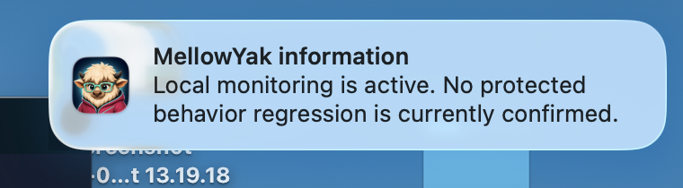

Native informational notification. It communicates a low-risk local event and opens safe product context.

Evidence class: `GENUINE_NATIVE_NOTIFICATION_VISUAL`.

### 43. 02 Warning

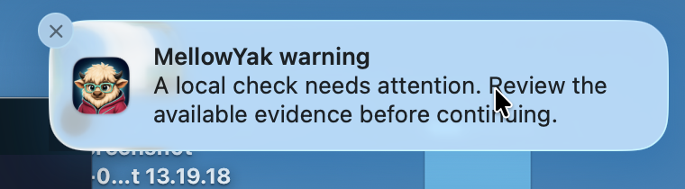

Native warning notification. It calls attention to a condition that should be reviewed without claiming a critical failure.

Evidence class: `GENUINE_NATIVE_NOTIFICATION_VISUAL`.

### 44. 03 High Priority

Native high-priority notification. It represents an actionable local finding with stronger prominence.

Evidence class: `GENUINE_NATIVE_NOTIFICATION_VISUAL`.

### 45. 04 Critical Regression

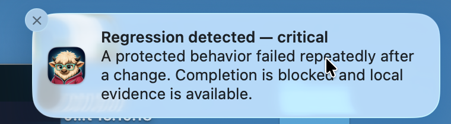

Native critical regression notification. It is reserved for a confirmed protected-behavior regression.

Evidence class: `GENUINE_NATIVE_NOTIFICATION_VISUAL`.

### 46. 05 Critical Recovery

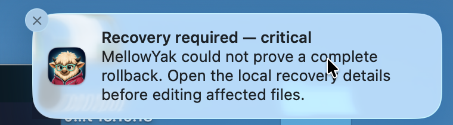

Native critical recovery-required notification. It means complete restoration could not be proven and local recovery or manual review is required. It does not claim recovery already succeeded and does not imply that MellowYak silently changed source.

Evidence class: `GENUINE_NATIVE_NOTIFICATION_VISUAL`.

### 47. 06 Engine Error

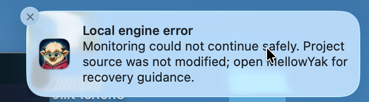

Native engine-error notification. The in-app alert remains the durable source of detail and recovery actions.

Evidence class: `GENUINE_NATIVE_NOTIFICATION_VISUAL`.

### 48. 07 Regression Resolved

Native resolution notification. It means the protected behavior passed again with current evidence. The original incident remains in history, and the state does not imply that MellowYak silently changed source.

Evidence class: `GENUINE_NATIVE_NOTIFICATION_VISUAL`.

### 49. Notification Click Routes Alerts

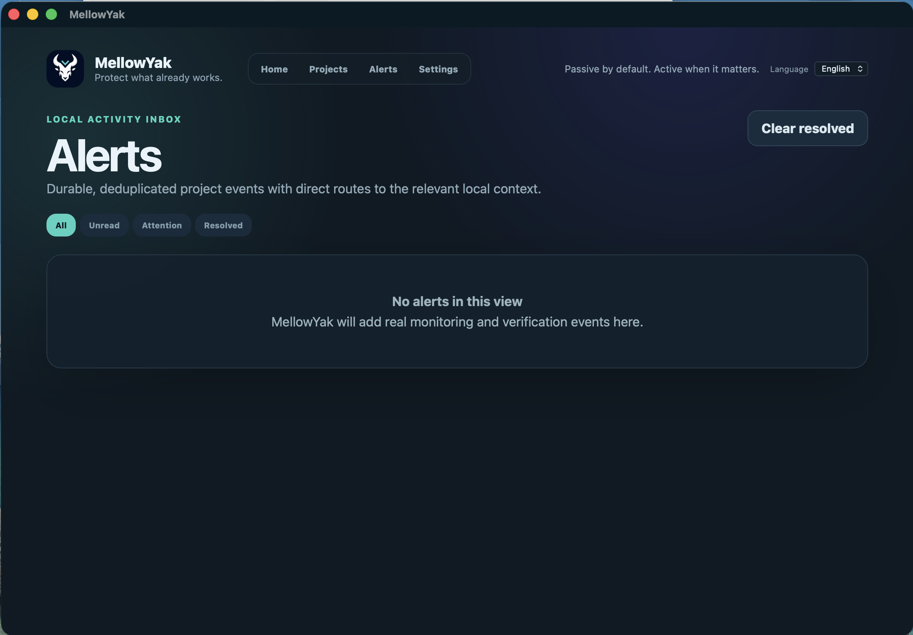

Installed product Alerts destination after notification activation. The destination is revalidated at click time and stale routes fall back here safely.

Evidence class: `INSTALLED_PRODUCT_VISUAL`.

### 50. Installed Projects Actions

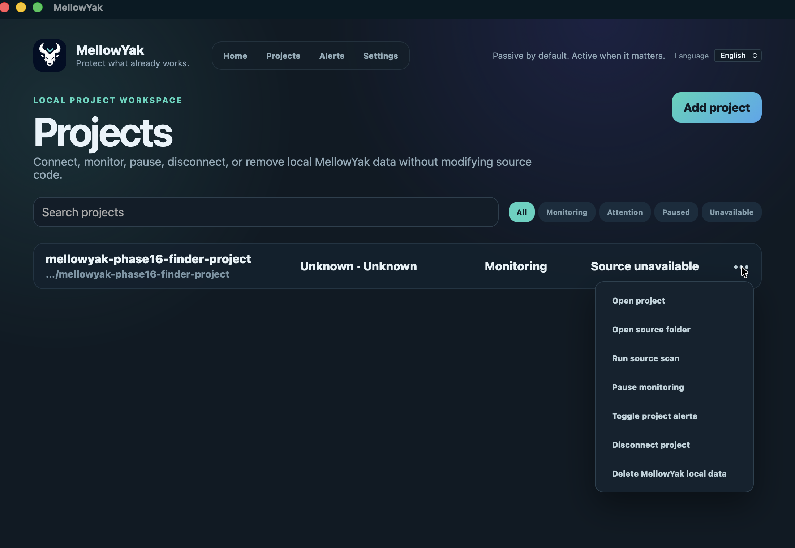

Installed Projects page with the project actions menu. The acceptance project is disposable; this screenshot demonstrates available project controls without customer source.

Evidence class: `INSTALLED_PRODUCT_VISUAL`.

## Human completion checklist

The following actions still require a person at the exact Intel Mac:

- Perform logout/login with Start at Login enabled, then restore it disabled and repeat.
- Perform lock/unlock and confirm one coherent app/engine.
- Perform idle sleep/wake and controlled queued-work sleep/wake.
- Restart macOS and verify the documented startup policy.
- Disconnect AC power for a genuine battery transition, then restore the original power state.
- Activate a delivered notification only after making its destination stale and confirm safe Alerts fallback.
- Compare a real eligible native banner before, during, and after Quiet Mode.

Record each result on its independent evidence axes. Do not convert a deterministic screenshot or Accessibility action into human physical PASS.

## Closure verdict

Product: `INTEL_MAC_TECHNICAL_PREVIEW_ACCEPTED_WITH_LIMITS`. Human physical acceptance: `HUMAN_PHYSICAL_ACCEPTANCE_PENDING`. Public macOS distribution: `PUBLIC_MAC_DISTRIBUTION_BLOCKED`. Phase 17 is not authorized by this manual.

## Complete human workbook status matrix

Write future physical confirmation only after performing the stated real action. The authoritative expected/actual/action text is in `PHASE_16M_PHYSICAL_ACCEPTANCE.md`.

| Test ID | Native automation | Human physical | Visual | Functional | Cleanup |
|---|---|---|---|---|---|
| P15-PHYS-101 | NATIVE_AUTOMATION_PASS | HUMAN_PHYSICAL_NOT_RUN | VISUAL_PASS | PASS | PASS |
| P15-PHYS-102 | NATIVE_AUTOMATION_PASS | HUMAN_PHYSICAL_NOT_RUN | NOT_RUN | PASS | PASS |
| P15-PHYS-103 | NATIVE_AUTOMATION_PASS | HUMAN_PHYSICAL_NOT_RUN | NO_VISUAL_EVIDENCE_REQUIRED | PASS | PASS |
| P15-PHYS-104 | NATIVE_AUTOMATION_PASS | HUMAN_PHYSICAL_NOT_RUN | NOT_RUN | PASS | PASS |
| P15-PHYS-105 | NATIVE_AUTOMATION_PASS | HUMAN_PHYSICAL_NOT_RUN | NOT_RUN | PASS | PASS |
| P15-PHYS-106 | NATIVE_AUTOMATION_PASS | HUMAN_PHYSICAL_NOT_RUN | NOT_RUN | PASS | PASS |
| P15-PHYS-107 | NATIVE_AUTOMATION_PASS | HUMAN_PHYSICAL_NOT_RUN | NOT_RUN | PASS | PASS |
| P15-PHYS-108 | NATIVE_AUTOMATION_PASS | HUMAN_PHYSICAL_NOT_RUN | VISUAL_PASS | PASS | PASS |
| P15-PHYS-109 | NATIVE_AUTOMATION_PASS | HUMAN_PHYSICAL_NOT_RUN | VISUAL_PASS | PASS | PASS |
| P15-PHYS-110 | NATIVE_AUTOMATION_PASS | HUMAN_PHYSICAL_NOT_RUN | VISUAL_PASS | PASS | PASS |
| P15-PHYS-111 | NATIVE_AUTOMATION_PASS | HUMAN_PHYSICAL_NOT_RUN | VISUAL_PASS | PASS | PASS |
| P15-PHYS-112 | BLOCKED | HUMAN_PHYSICAL_NOT_RUN | NOT_RUN | PASS | PASS |
| P15-PHYS-113 | NATIVE_AUTOMATION_PASS | HUMAN_PHYSICAL_NOT_RUN | NOT_RUN | PASS | PASS |
| P15-PHYS-114 | NOT_RUN | HUMAN_PHYSICAL_NOT_RUN | NOT_RUN | NOT_RUN | PASS |
| P15-PHYS-115 | NATIVE_AUTOMATION_PASS | HUMAN_PHYSICAL_NOT_RUN | NOT_RUN | PASS | PASS |
| P15-PHYS-115B | NOT_RUN | HUMAN_PHYSICAL_NOT_RUN | NOT_RUN | NOT_RUN | PASS |
| P15-PHYS-116 | NOT_RUN | HUMAN_PHYSICAL_NOT_RUN | NOT_RUN | NOT_RUN | PASS |
| P15-PHYS-117 | NOT_RUN | HUMAN_PHYSICAL_NOT_RUN | NOT_RUN | NOT_RUN | PASS |
| P15-PHYS-118 | NOT_RUN | HUMAN_PHYSICAL_NOT_RUN | NOT_RUN | NOT_RUN | PASS |
| P15-PHYS-119 | NATIVE_AUTOMATION_PASS | HUMAN_PHYSICAL_NOT_RUN | VISUAL_PASS | PASS | PASS |
| P15-PHYS-120 | NATIVE_AUTOMATION_PASS | HUMAN_PHYSICAL_NOT_RUN | VISUAL_PASS | PASS | PASS |
| P15-PHYS-121 | NATIVE_AUTOMATION_PASS | HUMAN_PHYSICAL_NOT_RUN | NOT_RUN | PASS | PASS |
| P15-PHYS-122 | NATIVE_AUTOMATION_PASS | HUMAN_PHYSICAL_NOT_RUN | NOT_RUN | PASS | PASS |
| P15-PHYS-123 | NATIVE_AUTOMATION_PASS | HUMAN_PHYSICAL_NOT_RUN | NOT_RUN | PASS | PASS |
| P15-PHYS-124 | NATIVE_AUTOMATION_PASS | HUMAN_PHYSICAL_NOT_RUN | NOT_RUN | PASS | PASS |
| P15-PHYS-125 | NATIVE_AUTOMATION_PASS | HUMAN_PHYSICAL_NOT_RUN | NOT_RUN | PASS | PASS |
| P15-PHYS-126 | NOT_RUN | HUMAN_PHYSICAL_NOT_RUN | NOT_RUN | NOT_RUN | PASS |
| P15-PHYS-127 | BLOCKED | HUMAN_PHYSICAL_NOT_RUN | VISUAL_PASS | PASS | PASS |
| P15-PHYS-128 | NOT_RUN | HUMAN_PHYSICAL_NOT_RUN | NOT_RUN | NOT_RUN | PASS |

## Expected, actual, evidence, cleanup, and remaining action

| Test ID | Native automation | Human physical | Visual | Functional | Expected | Actual | Evidence | Cleanup | Remaining human action |
|---|---|---|---|---|---|---|---|---|---|
| P15-PHYS-101 | NATIVE_AUTOMATION_PASS | HUMAN_PHYSICAL_NOT_RUN | VISUAL_PASS | PASS | One translated menu and truthful counters | Native menu inspected; one app/engine | Native tray capture and lifecycle log | PASS | Physically open and confirm |
| P15-PHYS-102 | NATIVE_AUTOMATION_PASS | HUMAN_PHYSICAL_NOT_RUN | NOT_RUN | PASS | Existing window focuses safely | Same window/process restored | Installed lifecycle log | PASS | Physically select Open |
| P15-PHYS-103 | NATIVE_AUTOMATION_PASS | HUMAN_PHYSICAL_NOT_RUN | NO_VISUAL_EVIDENCE_REQUIRED | PASS | No duplicate app or engine | Second instance exited; one app/engine | Lifecycle validator | PASS | Launch from Finder/Spotlight |
| P15-PHYS-104 | NATIVE_AUTOMATION_PASS | HUMAN_PHYSICAL_NOT_RUN | NOT_RUN | PASS | Window hides; monitoring continues | Existing identity remained active | Lifecycle validator | PASS | Physically click red close |
| P15-PHYS-105 | NATIVE_AUTOMATION_PASS | HUMAN_PHYSICAL_NOT_RUN | NOT_RUN | PASS | Disabled close-to-tray exits app and engine | Defect reproduced, fixed, rebuilt; installed retest ended at 0 desktop and 0 engine | Accessibility run, Rust regression, process inspection | PASS | Physically repeat with setting off |
| P15-PHYS-106 | NATIVE_AUTOMATION_PASS | HUMAN_PHYSICAL_NOT_RUN | NOT_RUN | PASS | All owned processes exit | Desktop, engine and children exited | Process evidence | PASS | Physically choose tray Quit |
| P15-PHYS-107 | NATIVE_AUTOMATION_PASS | HUMAN_PHYSICAL_NOT_RUN | NOT_RUN | PASS | Cmd+Q/menu Quit cleans all children | Shutdown defect fixed; cleanup passed | Process evidence | PASS | Physically use application-menu Quit |
| P15-PHYS-108 | NATIVE_AUTOMATION_PASS | HUMAN_PHYSICAL_NOT_RUN | VISUAL_PASS | PASS | OS and product permission agree | MellowYak permission enabled | Privacy-safe Settings crop | PASS | None |
| P15-PHYS-109 | NATIVE_AUTOMATION_PASS | HUMAN_PHYSICAL_NOT_RUN | VISUAL_PASS | PASS | In-app evidence persists; no false claim | Denied state observed and restored | Privacy-safe Settings crop | PASS | None |
| P15-PHYS-110 | NATIVE_AUTOMATION_PASS | HUMAN_PHYSICAL_NOT_RUN | VISUAL_PASS | PASS | Exactly one redacted native banner | Seven genuine banner scenarios captured | Native notification images | PASS | Trigger and observe a fresh banner |
| P15-PHYS-111 | NATIVE_AUTOMATION_PASS | HUMAN_PHYSICAL_NOT_RUN | VISUAL_PASS | PASS | Existing app opens safe destination | Alerts destination opened without duplicate | Installed product capture | PASS | Physically click delivered banner |
| P15-PHYS-112 | BLOCKED | HUMAN_PHYSICAL_NOT_RUN | NOT_RUN | PASS | Revalidate and fall back to Alerts | Click-time code/test passes; real stale delivered-banner activation not completed | Source test and build commit | PASS | Perform exact stale delivered-banner click |
| P15-PHYS-113 | NATIVE_AUTOMATION_PASS | HUMAN_PHYSICAL_NOT_RUN | NOT_RUN | PASS | Exactly one valid registration | One LaunchAgent registered | LaunchAgent inspection | PASS | Enable physically |
| P15-PHYS-114 | NOT_RUN | HUMAN_PHYSICAL_NOT_RUN | NOT_RUN | NOT_RUN | One app/tray/engine after login | Real login boundary not performed | None | PASS | Logout/login with startup enabled |
| P15-PHYS-115 | NATIVE_AUTOMATION_PASS | HUMAN_PHYSICAL_NOT_RUN | NOT_RUN | PASS | Registration removed | LaunchAgent removed and setting restored | LaunchAgent inspection | PASS | Disable physically |
| P15-PHYS-115B | NOT_RUN | HUMAN_PHYSICAL_NOT_RUN | NOT_RUN | NOT_RUN | No automatic process after login | Real login boundary not performed | None | PASS | Logout/login with startup disabled |
| P15-PHYS-116 | NOT_RUN | HUMAN_PHYSICAL_NOT_RUN | NOT_RUN | NOT_RUN | One coherent process set after unlock | Authentication boundary not performed | None | PASS | Lock 30 seconds and unlock |
| P15-PHYS-117 | NOT_RUN | HUMAN_PHYSICAL_NOT_RUN | NOT_RUN | NOT_RUN | Watcher resumes without duplicate | Physical sleep cycle not performed | None | PASS | Perform real idle sleep/wake |
| P15-PHYS-118 | NOT_RUN | HUMAN_PHYSICAL_NOT_RUN | NOT_RUN | NOT_RUN | Queued work resumes or invalidates safely | Controlled sleep cycle not performed | None | PASS | Sleep/wake with approved queued check |
| P15-PHYS-119 | NATIVE_AUTOMATION_PASS | HUMAN_PHYSICAL_NOT_RUN | VISUAL_PASS | PASS | Alias resolves to canonical project root | Native chooser resolved disposable Alias | Canonical-resolution capture | PASS | Physically repeat selection |
| P15-PHYS-120 | NATIVE_AUTOMATION_PASS | HUMAN_PHYSICAL_NOT_RUN | VISUAL_PASS | PASS | Same identity/history; mismatch rejected | Same ID retained; one record; foreign fixture rejected; valid source restored | Installed AX, database evidence, canonical/deterministic images | PASS | Physically repeat both choices |
| P15-PHYS-121 | NATIVE_AUTOMATION_PASS | HUMAN_PHYSICAL_NOT_RUN | NOT_RUN | PASS | Exact app installs from read-only DMG | Mounted, verified, installed and detached | Phase 11M validator | PASS | Physically drag app to Applications |
| P15-PHYS-122 | NATIVE_AUTOMATION_PASS | HUMAN_PHYSICAL_NOT_RUN | NOT_RUN | PASS | Cold launch produces one app/engine | Installed hashes matched; lifecycle passed | Hash and process evidence | PASS | Physically launch from Finder |
| P15-PHYS-123 | NATIVE_AUTOMATION_PASS | HUMAN_PHYSICAL_NOT_RUN | NOT_RUN | PASS | No duplicate identity or process | Reinstall passed with one app/engine | Package/lifecycle evidence | PASS | Physically reinstall same DMG |
| P15-PHYS-124 | NATIVE_AUTOMATION_PASS | HUMAN_PHYSICAL_NOT_RUN | NOT_RUN | PASS | No processes/startup item/source mutation | App removal preserved isolated data | Package evidence | PASS | Physically move app to Trash |
| P15-PHYS-125 | NATIVE_AUTOMATION_PASS | HUMAN_PHYSICAL_NOT_RUN | NOT_RUN | PASS | Retained data opens without corruption | Reinstall passed; one process set | Package evidence | PASS | Physically reinstall and open |
| P15-PHYS-126 | NOT_RUN | HUMAN_PHYSICAL_NOT_RUN | NOT_RUN | NOT_RUN | Documented startup; no duplicate recovery | Real restart not performed | None | PASS | Restart the Intel Mac |
| P15-PHYS-127 | BLOCKED | HUMAN_PHYSICAL_NOT_RUN | VISUAL_PASS | PASS | In-app alert persists; native delivery suppressed, then resumes | Real alert persisted while quiet and state restored; post-quiet native banner was not physically observed | Installed DB/UI evidence plus deterministic Settings view | PASS | Observe before/during/after native banners |
| P15-PHYS-128 | NOT_RUN | HUMAN_PHYSICAL_NOT_RUN | NOT_RUN | NOT_RUN | Optional work defers on real battery state | Host remained on AC; no simulation claimed | Power-state observation | PASS | Disconnect AC and restore it |
