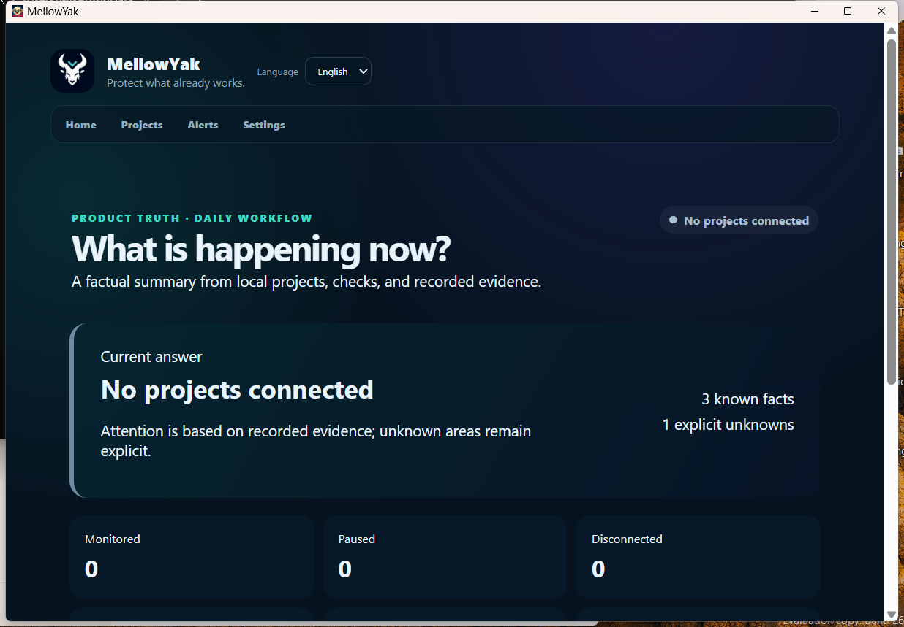
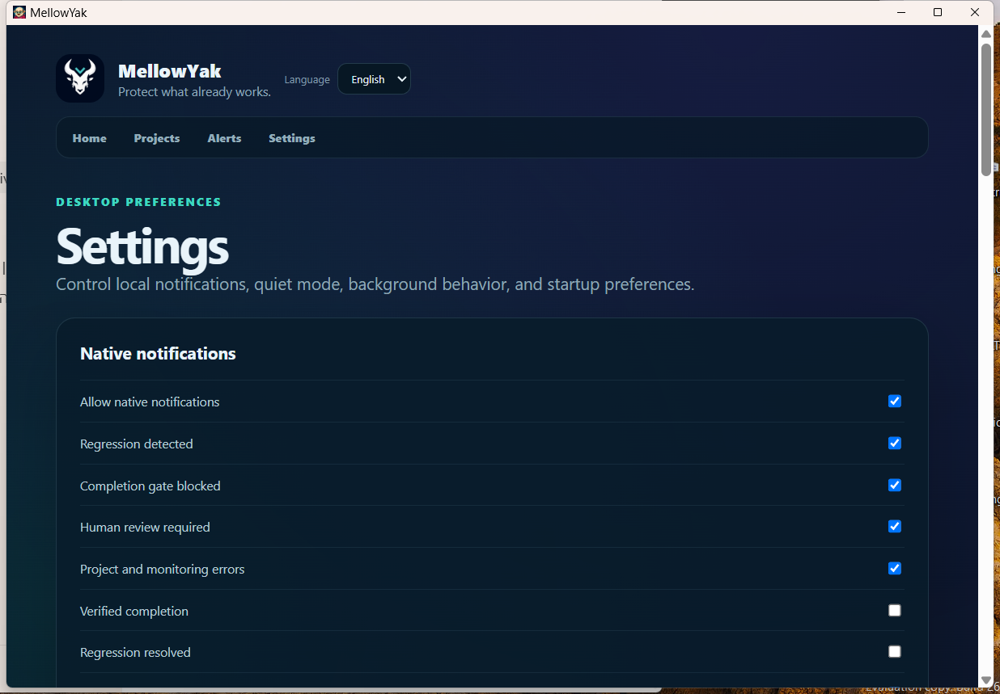
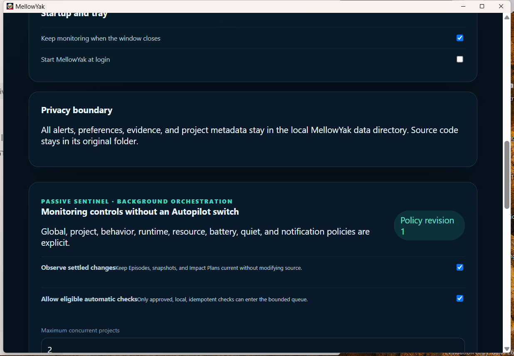
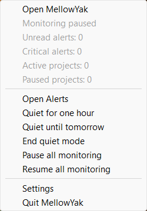
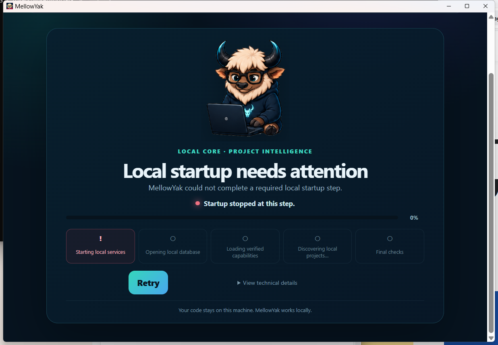

# MellowYak Windows x64 Cumulative Product Manual

## What MellowYak is

MellowYak is a local-first desktop technical preview for understanding and protecting software projects. It observes project state, explains change impact, records protected behaviors and Known Good baselines, runs approved local checks, captures local browser/API/CLI evidence, detects regressions, validates repair candidates, applies confirmed changes transactionally, rolls back failed post-checks, and emits local Yak Receipts. Source and evidence remain on the machine.

The Windows product uses a Tauri/WebView2 desktop shell, a packaged Python/FastAPI engine sidecar, SQLite under a separate local data root, and managed Chromium for browser evidence. No account or model-provider connection is required.

## Where it is installed

The NSIS technical-preview package is per-user:

- Application: `%LOCALAPPDATA%\MellowYak\mellowyak-desktop.exe`.
- Engine: `%LOCALAPPDATA%\MellowYak\mellowyak-engine.exe`.
- Managed browser: `%LOCALAPPDATA%\MellowYak\browser`.
- Uninstaller: `%LOCALAPPDATA%\MellowYak\uninstall.exe`.
- Persistent data: `%LOCALAPPDATA%\com.mellowyak.desktop\engine`.

The data root is intentionally outside the installation directory, so reinstall or uninstall can preserve local product state. Back up the data root before destructive maintenance.

## Start and verify

Launch MellowYak from the Start menu or run:

```powershell
Start-Process "$env:LOCALAPPDATA\MellowYak\mellowyak-desktop.exe"
```

A healthy launch advances past `Starting local services` and renders Home. The engine chooses an ephemeral local port, binds only to `127.0.0.1`, and requires a random bearer token known to the desktop process. Do not disable authentication, expose the port, or store the token.



Acceptance workbook: `17W-NATIVE-01`. Preconditions were a clean per-user NSIS install and no owned processes. The automated operator launched the installed executable. Expected and actual results were live Home content, one desktop, the expected two-process PyInstaller engine pair, one authenticated loopback listener, and 401 responses without or with the wrong token. Visual, functional, and privacy results were PASS; evidence class is installed native app; build identity is package commit `babfab9ac0aa6e50544f0cd62f7477f70748d0e1`. Cleanup used native tray Quit and reached zero owned processes/listeners.

## Daily workflow

1. Open Projects and add a local project folder.
2. Review detected language, framework, Git state, runtime profiles, and scan boundaries.
3. Create or approve protected behaviors and their local evidence links.
4. Capture a Known Good baseline only after the behavior is genuinely passing.
5. Let passive monitoring record settled changes; run approved checks when needed.
6. Review impact and regression evidence. Unknown or stale boundaries remain explicit.
7. Generate a repair candidate only in an isolated workspace.
8. Validate the candidate. Apply only after reviewing the manifest and confirmation boundary.
9. Require post-apply verification. If it fails, use the recorded rollback/recovery path.
10. Review the local Yak Receipt and lineage instead of relying on an unsupported success claim.

## Settings, privacy, and background behavior

Settings controls native-notification categories, Quiet Mode, close-to-tray, start-at-login, privacy, and Passive Sentinel policies.



`Keep monitoring when the window closes` leaves the application and engine in the tray after the window closes. `Start MellowYak at login` creates a per-user Run entry; disabling it removes that entry. Phase 17W tested the toggle and restored it to off.



Acceptance workbook: `17W-NATIVE-02`. Preconditions were a healthy installed session. The automated operator opened Settings from the native tray menu, enabled start-at-login, verified `HKCU\Software\Microsoft\Windows\CurrentVersion\Run\MellowYak` pointed to the installed executable, then disabled it. Expected and actual authoritative state was disabled with the registry entry absent. Visual, functional, and privacy results were PASS; evidence class is installed native app/native OS integration. Cleanup/restoration was completed.

The privacy boundary means alerts, preferences, evidence, and project metadata stay in the local MellowYak data directory while source remains in its original folder. Support and diagnostics exports are redacted but should still be reviewed before sharing.

## Tray operation and clean exit

Closing the window normally hides it when background monitoring is enabled. Launching MellowYak again reopens the existing instance rather than starting another engine. The native tray menu exposes monitoring state and private aggregate counts, plus Open, Alerts, Quiet Mode, monitoring controls, Settings, and Quit.



Use `Quit MellowYak` for a clean explicit exit. Phase 17W verified that it removes the desktop process, both PyInstaller engine processes, and the loopback listener.

Acceptance workbook: `17W-NATIVE-03`. With close-to-tray enabled, window close hid the window while one desktop and the engine pair stayed alive. Relaunch opened the existing instance without duplication. The operator opened the actual notification-area menu and selected `Quit MellowYak`. Expected and actual state after six seconds was zero desktop processes, zero engine processes, and zero owned listeners. Visual, functional, privacy, and cleanup results were PASS; evidence class is native Windows lifecycle automation.

## Protection workflow acceptance workbook

| Test ID | Operator action | Expected/actual authoritative state | Evidence and verdict | Cleanup |
| --- | --- | --- | --- | --- |
| `17W-PKG-08` | Run installed Phase 8 validator | nine Demo Labs, 22 self-test steps, Known Good, regression, candidate, Apply/rollback, stale-source block | packaged deterministic; `VERIFIED_WORKING` | no network/orphan |
| `17W-PKG-09` | Run install/upgrade/storage validator | clean and 0008→0011 preservation, diagnostics redaction, updater boundary | packaged deterministic; `VERIFIED_WORKING` | disposable DB removed |
| `17W-PKG-10` | Run Product Truth validator | candidate/apply/rollback and zero pending recovery | packaged deterministic; `VERIFIED_WORKING` | no outbound product traffic |
| `17W-PKG-12M` | Run bundled-browser acceptance | real Chromium capture, Known Good, controlled regression, evidence, repair, valid/invalid candidates, Apply, post-check rollback | installed browser/runtime; `VERIFIED_WORKING` | byte-identical restoration, no orphan |
| `17W-PKG-13M` | Persist/restart policy workflow | policy revisions and budgets retained; malformed policy rejected | packaged deterministic; `VERIFIED_WORKING` | clean exit |
| `17W-PKG-15M` | Exercise authenticated product-lock routes | schema/version/local-only/self-test/Yak Receipt/Baseline Lock contract | packaged deterministic; `VERIFIED_WORKING` | clean exit |

All package-workflow fixtures were disposable and outside the repository. No real project was modified. Candidate validation never authorized Apply; Apply remained explicit and source-bound; failed post-check rollback restored only owned paths byte-identically. Unknown/unavailable states were not converted to green.

## Troubleshooting startup

If the UI remains at `Starting local services`:

1. Confirm `%LOCALAPPDATA%\MellowYak\mellowyak-engine.exe` exists.
2. Check for one desktop process and the PyInstaller engine pair with `Get-Process`.
3. Check engine logs under `%LOCALAPPDATA%\com.mellowyak.desktop\engine\logs`.
4. Confirm the install directory does not contain `database`, `logs`, `runtime`, or other data directories.
5. Confirm the engine listener, if present, is `127.0.0.1` only.
6. Do not repeatedly click Retry; preserve the error detail and logs, then use the packaged validators or rebuild from the documented source checkpoint.

The image below is the superseded Phase 17W failure that led to the Windows parent-watchdog and data-root fixes. It is intentionally separated from accepted evidence.



## Local validation for developers and Codex

```powershell
$Install = "$env:LOCALAPPDATA\MellowYak"
$Engine = Join-Path $Install "mellowyak-engine.exe"
$Temp = Join-Path $env:TEMP "mellowyak-installed-validation"

python .\scripts\validate_packaged_phase15m.py $Engine `
  --output .\phase15-installed.json --temp-root $Temp
python .\scripts\validate_packaged_phase12m.py $Engine `
  --app $Install --output .\phase12-installed.json --temp-root $Temp
```

Keep disposable fixture roots outside the source repository so project discovery does not intentionally attach them to the parent repository. The machine-local ignored `WINDOWS README\README.md` records exact paths and commands for future Codex tasks.

## Build from source

Use `docs/platform-handoff/WINDOWS_COMPILATION_GUIDE.md`. In summary: install the pinned Windows toolchain, run `scripts/bootstrap-windows.ps1`, pass Python/React/TypeScript/Rust/migration/contract gates, then run `scripts/build-platform.ps1 -Platform windows-x64 -Bundle nsis` and `scripts/validate-windows.ps1` against the exact source commit.

## Signing and release limitations

This accepted technical-preview installer is unsigned because no trusted code-signing certificate/private key was available. Do not publish it as a trusted Windows release. A public release needs Authenticode signatures and RFC 3161 timestamps for embedded binaries and the outer installer, verified certificate chains, SmartScreen/reputation evidence, protected updater keys, and a trusted update channel.

The operator-provided website name is `https://mellowyak.com`; it did not resolve in DNS during Phase 17W, so this manual does not claim verified website content.

## Uninstall and recovery

Quit MellowYak first, then run `%LOCALAPPDATA%\MellowYak\uninstall.exe` or use Windows Installed apps. Verify no MellowYak processes/listeners remain. The separated data root may remain by design; preserve it for reinstall/recovery or remove it only after confirming a backup and the exact path. Reinstalling the same technical preview should recreate only the application files under the install root and continue using the separate data root.
