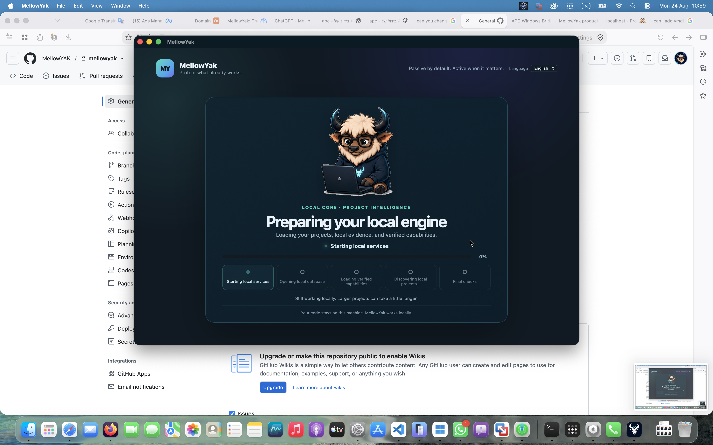
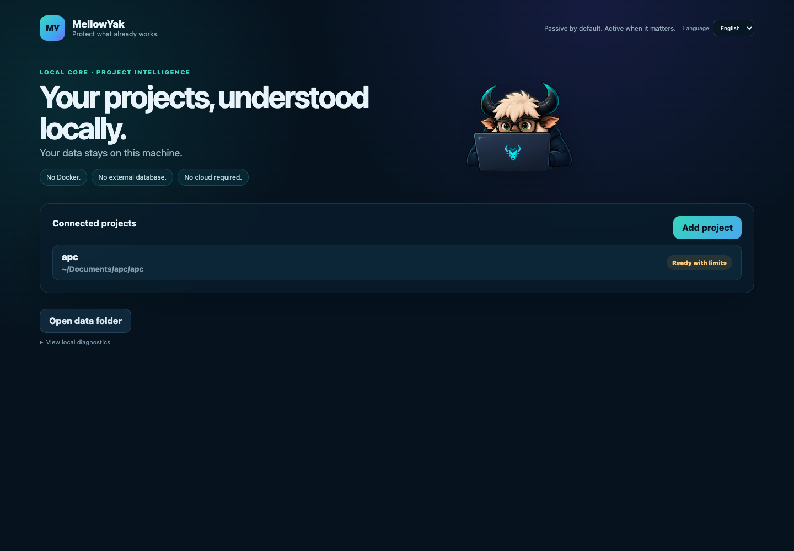
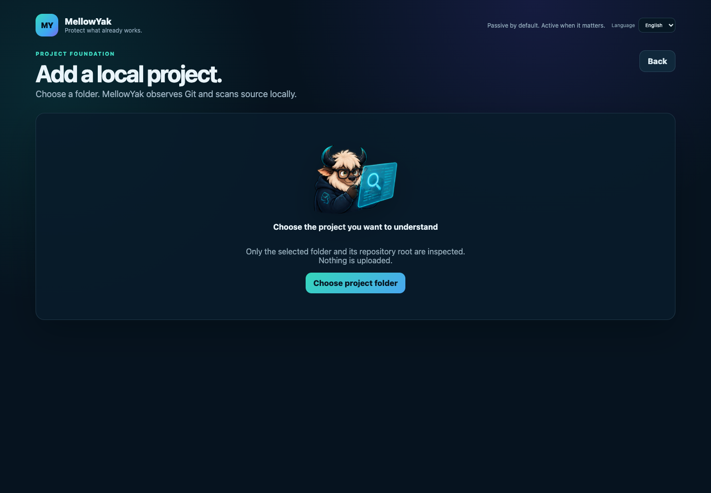
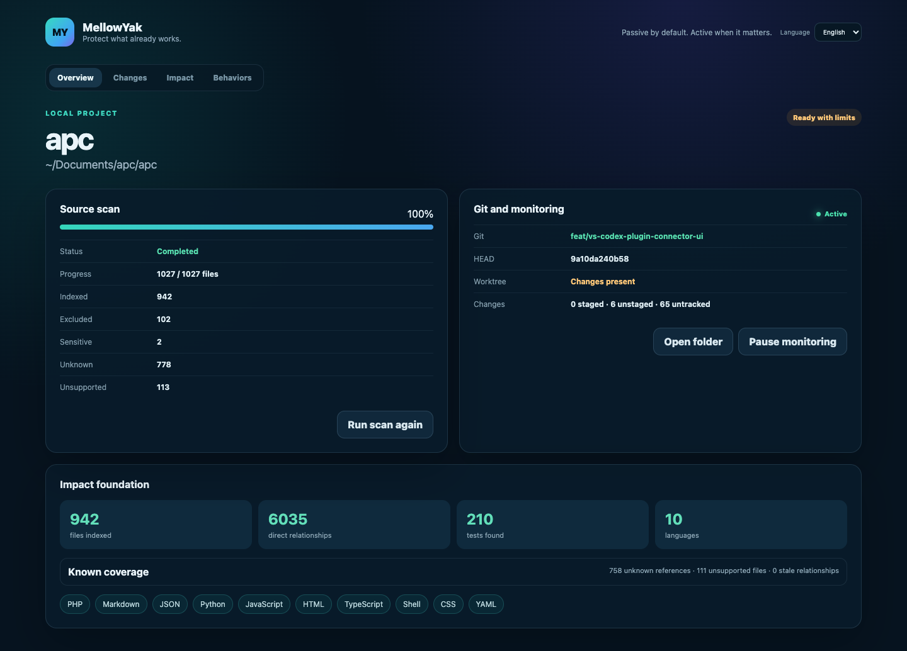
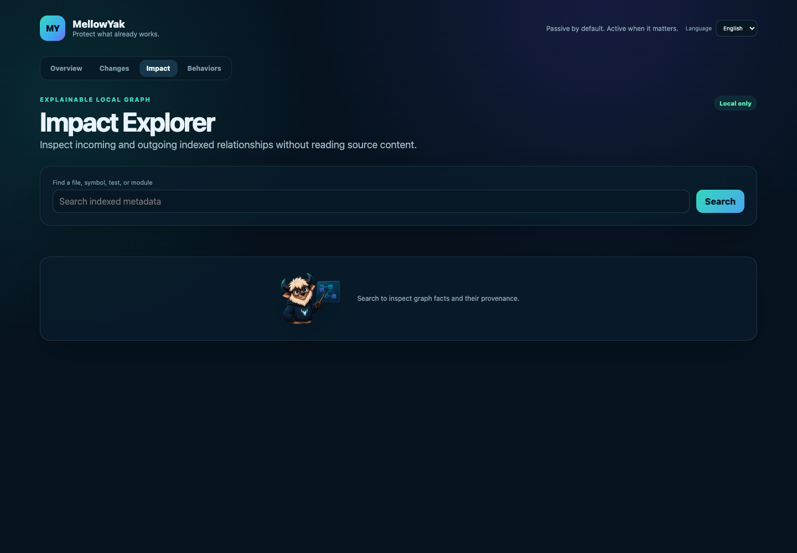
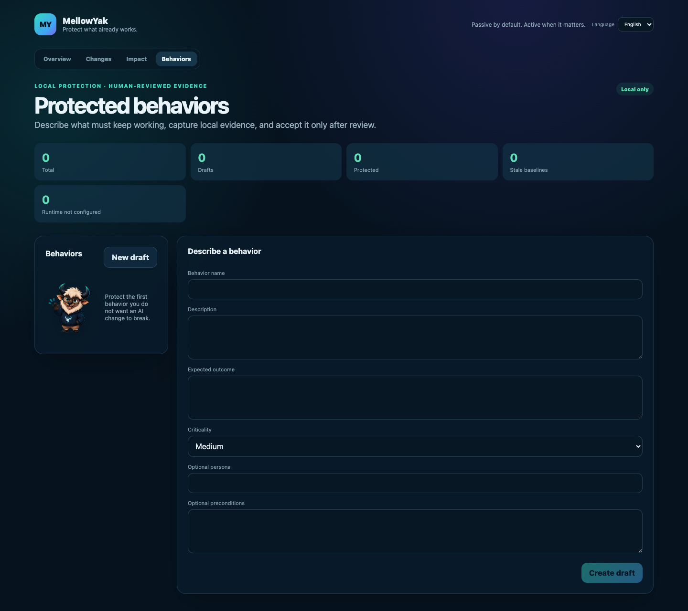
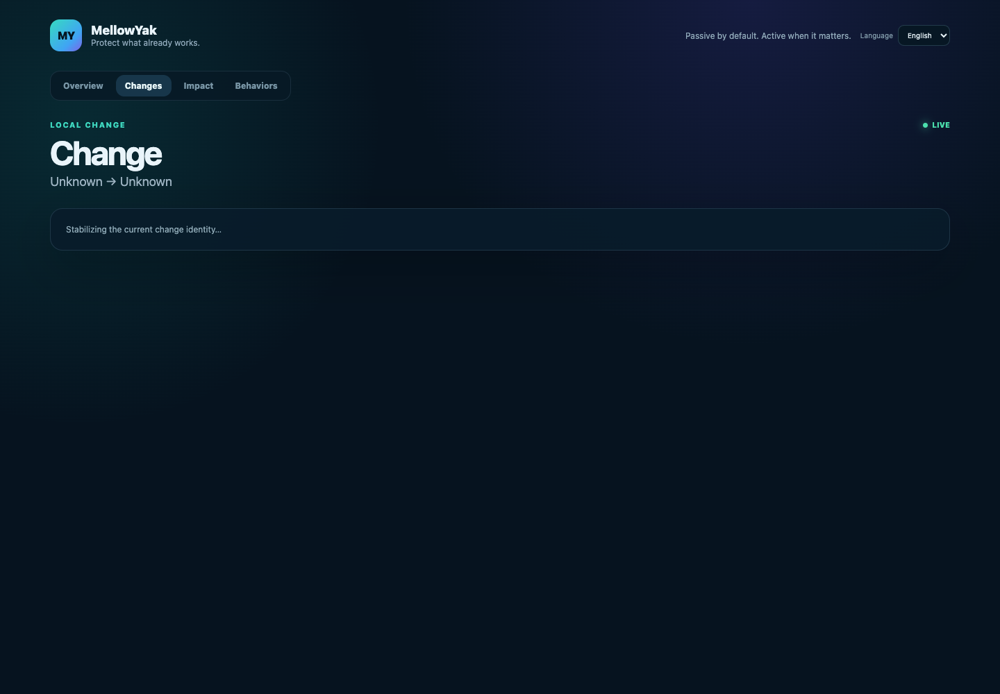
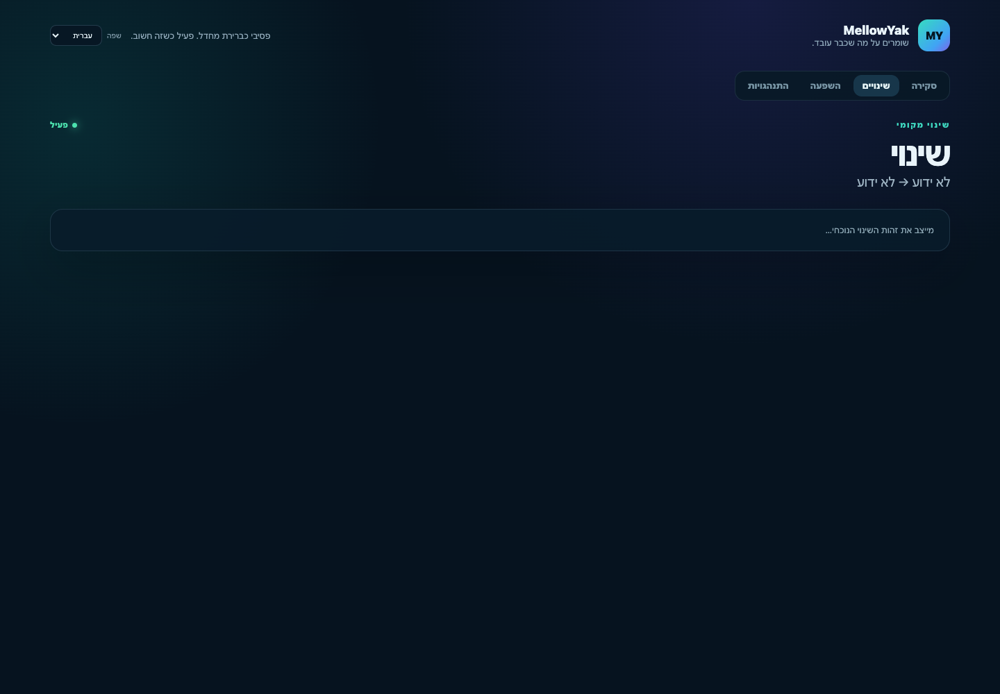

# MellowYak Phase 5 — Complete Report and Screen Guide

Date: 2026-08-24  
Phase: 5 — Selective verification, regression gate, and repair context  
Branch: `product/verification-regression-gate`  
Base commit: `408375978194c48180e5cc1c0885031dcaaf7b7b`  
Database migration: `0005_verification_regression_gate`

## What Phase 5 delivered

Phase 5 turns MellowYak's known project relationships and accepted behavior baselines into a bounded verification workflow. It creates a Protection Plan for a specific source identity, selects required checks, runs only those checks, stores current evidence separately from Last Known Good evidence, records supported regressions, blocks completion when required evidence fails or is stale, and creates a deterministic local Repair Context. After the source changes, MellowYak requires a new plan and re-verification before it can record `VERIFIED_COMPLETE`.

The implementation includes:

- deterministic Protection Plan selection with `REQUIRED`, `SUGGESTED`, `SKIPPED`, `NEEDS_REVIEW`, and `UNKNOWN` classifications;
- Browser Replay and explicit Human Attestation verification adapters;
- assertion execution with expected and observed values;
- cancellation, retry, run-one, run-all-required, evidence opening, and explicit human outcomes;
- regression records tied to exact source, plan, baseline, run, assertion, and evidence identities;
- an immutable local completion decision with stale-source and stale-evidence checks;
- local Repair Context creation, copy, save, and open-project-files controls;
- re-verification and regression resolution without replacing the accepted baseline automatically;
- a 12-section Change Cockpit, English translation source, Hebrew translation source, and full Hebrew RTL layout;
- schema migration, API contracts, automated coverage, packaged runtime validation, macOS app and DMG packaging, and CI matrix updates.

## What was extracted from APC

APC was inspected read-only. MellowYak reused product concepts, not APC implementation files or APC data. The extracted concepts were:

- changed-source identity and bounded impact context;
- protected behavior and accepted-evidence separation;
- explicit verification status and evidence history;
- regression-oriented work context;
- completion blocking when required proof is missing.

They were rebuilt as MellowYak-owned local modules, schema, API contracts, and desktop UI. No APC source file, credential, account, database, route, deployment configuration, user record, or stored evidence was copied. APC was not modified.

## Safety and privacy result

MellowYak remains local-first. The engine binds to loopback, requires an ephemeral session token, keeps source and evidence on the machine, redacts secret-like values from Repair Context output, limits artifact sizes and run durations, and does not send Repair Context, project source, evidence, analytics, or telemetry anywhere. The public repository excludes local data roots, evidence, captures, browser profiles, screenshots generated during runtime, repair-context output, installers, and user-specific state.

## Screen map

The primary navigation inside a project is: **Overview → Changes → Impact → Behaviors**. The language selector is always available in the header. Choosing Hebrew changes the complete document direction to RTL.

### 1. Startup and local-engine preparation

**Purpose:** Starts the bundled local engine, opens the local SQLite database, loads verified capabilities, discovers local projects, and performs final readiness checks.

**What to expect:** The progress bar and five status cards advance as real startup work completes. The mascot animation is decorative status feedback. If startup takes longer, the screen explains that larger local projects may take more time. On failure, the screen provides Retry and expandable technical details instead of pretending the app is ready.

**Available options:** Language selection, Retry after failure, and technical details when an error exists. There is no cloud login and no source upload.

### 2. Home and connected projects

**Purpose:** Shows every locally connected project and its honest readiness state.

**What to expect:** Each project card displays its name, local path, and readiness such as Ready, Ready with limits, scan incomplete, or Git unavailable. Selecting a card opens the project Overview.

**Available options:** Add project, select a connected project, open the local data folder, expand local diagnostics, return Home by selecting the MellowYak mark, and switch English/Hebrew.

### 3. Add a local project

**Purpose:** Connects an existing local folder to MellowYak without uploading it.

**What to expect:** Select a folder, review detected repository root, language/framework/runtime/test hints, candidate and ignored-file counts, Git state, and the source-local guarantee. The user can change the display name and choose passive or paused monitoring before confirming.

**Available options:** Choose folder, inspect another folder, edit project name, select monitoring mode, connect the project, or go Back. The folder chooser is a native desktop action and is intentionally absent from browser-only documentation capture.

### 4. Project Overview

**Purpose:** Provides the operational summary of one connected project.

**What to expect:** Source scan progress and counts, Git branch/HEAD/worktree state, monitoring state, indexed files, direct relationships, tests, languages, unknown references, unsupported files, and stale relationships.

**Available options:** Run or cancel a source scan, pause or resume monitoring, open the local project folder, and use the four project navigation tabs. A warning state means limited knowledge, not that the project is broken.

### 5. Impact Explorer

**Purpose:** Explores currently known relationships around a file, symbol, behavior, or search term.

**What to expect:** Results identify known direct or heuristic relationships and retain unknown/stale boundaries. The screen does not claim that absent results prove no impact.

**Available options:** Enter a search query, run local search, inspect ranked results and relationship provenance, and move to another project tab.

### 6. Protected Behaviors

**Purpose:** Defines the user-visible outcomes that must continue working and manages their accepted local evidence.

**What to expect:** Summary metrics show total behaviors, drafts, protected behaviors, stale baselines, and missing runtime configurations. The form records a behavior name, description, expected outcome, criticality, optional persona, and optional preconditions.

**Available options:** Create a new draft, select an existing behavior, edit its definition, configure runtime information, capture a flow, review captured steps, add assertions, accept a baseline after human review, and inspect evidence history. MellowYak never silently replaces Last Known Good evidence.

### 7. Change and Change Cockpit entry

**Purpose:** Stabilizes the current Git/worktree identity and then hosts the complete Phase 5 Change Cockpit.

**What to expect:** While the source identity is changing, the page explicitly shows “Stabilizing the current change identity.” Once stable, it shows the current changed paths, task intent, impact analysis, behavior candidates, context receipt, and the Phase 5 cockpit below them.

**Change Cockpit sections and controls:**

1. **Changed Files** — bounded current source identity; no invented root cause.
2. **Impact Summary** — whether a fresh impact analysis exists.
3. **Protection Plan** — Create Plan and counts for every selection class.
4. **Required Checks** — each behavior, criticality, adapter, selection reason, and Run This Check.
5. **Suggested Checks** — visible recommendations that are not run automatically.
6. **Skipped Behaviors** — “No current known relation selected this behavior,” never “unaffected.”
7. **Unknown / Stale Boundaries** — unresolved coverage that remains visible.
8. **Verification Runner** — Run All Required, Run One, Cancel, Retry, Open Evidence, Works, Does Not Work, and Unable to Determine.
9. **Regression Detail** — supported result and exact source identity, without guessing a cause.
10. **Repair Context** — Create, Copy, Save Local JSON, and Open Project Files.
11. **Evidence Timeline** — separate Last Known Good and current verification evidence.
12. **Gate Decision** — `BLOCKED`, `RECHECK_REQUIRED`, `NEEDS_REVIEW`, `STALE`, `IN_PROGRESS`, or `VERIFIED_COMPLETE`, plus the scope limitation.

**Recommended workflow:** Wait for source identity to stabilize, run impact analysis, create the Protection Plan, inspect required/unknown items, run required checks, inspect failures and evidence, create a Repair Context for a supported regression, repair the source, create a fresh plan, and re-run verification. Treat `VERIFIED_COMPLETE` only as proof for the current required plan, not as proof that every possible behavior is safe.

### 8. Hebrew RTL mode

**Purpose:** Demonstrates that Hebrew is a first-class translation and layout mode.

**What to expect:** The document direction, page structure, alignment, navigation, fields, status copy, buttons, empty states, and accessible names switch to RTL. English remains the base translation source. No visible product sentence is hardcoded in a React component.

**Available options:** Select עברית from the Language menu at any point; select English to return to LTR. Project data and source identifiers remain unchanged when the display language changes.

## Verification and packaging record

The final packaged-engine scenario completed baseline capture, a seeded `14:00` versus `15:00 IDT` regression, blocked gate, deterministic Repair Context, repaired source, stale old gate, fresh plan, passing re-verification, resolved regression, `VERIFIED_COMPLETE`, restart, and persisted-history reload. Source upload, evidence upload, and Repair Context transmission remained false; no orphan browser or engine child remained after shutdown.

The final local artifacts are:

- app: `apps/desktop/src-tauri/target/release/bundle/macos/MellowYak.app`;
- DMG: `apps/desktop/src-tauri/target/release/bundle/dmg/MellowYak_0.1.0_x64.dmg`;
- installed app: `/Applications/MellowYak.app`;
- recoverable previous app: `/Applications/MellowYak-previous-20260824-184747-03fdb4.app`.

The package is currently unsigned and unnotarized. Windows, Linux, Apple Silicon, signed updater installation, and GitHub Actions execution were not runtime verified in this local task. No public release was created and no Git push was performed.

## Honest Phase 5 boundary

Browser Replay is the implemented automated adapter; Human Attestation is explicit. General local command execution, arbitrary AI visual comparison, cloud connectors, automatic repair, automatic baseline replacement, deployment-safety guarantees, accounts, cloud synchronization, analytics, source upload, evidence upload, token-saving claims, and financial claims are not implemented. Phase 6 should build on this verified local boundary rather than imply those capabilities already exist.
