# MellowYak Phase 6 screen guide

All screenshots use synthetic public fixture data. No private repository path, credential, source content, or user data is included.

## 1. Command Center — English

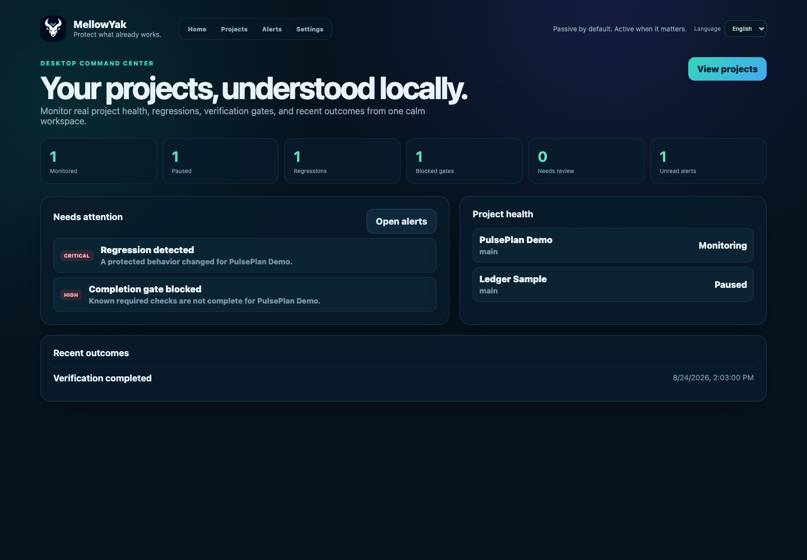

- What is shown: Global project metrics, actionable alerts, project health, and recent verified outcomes.
- Available actions: Open a project, all projects, or the alerts inbox.

## 2. Projects — English

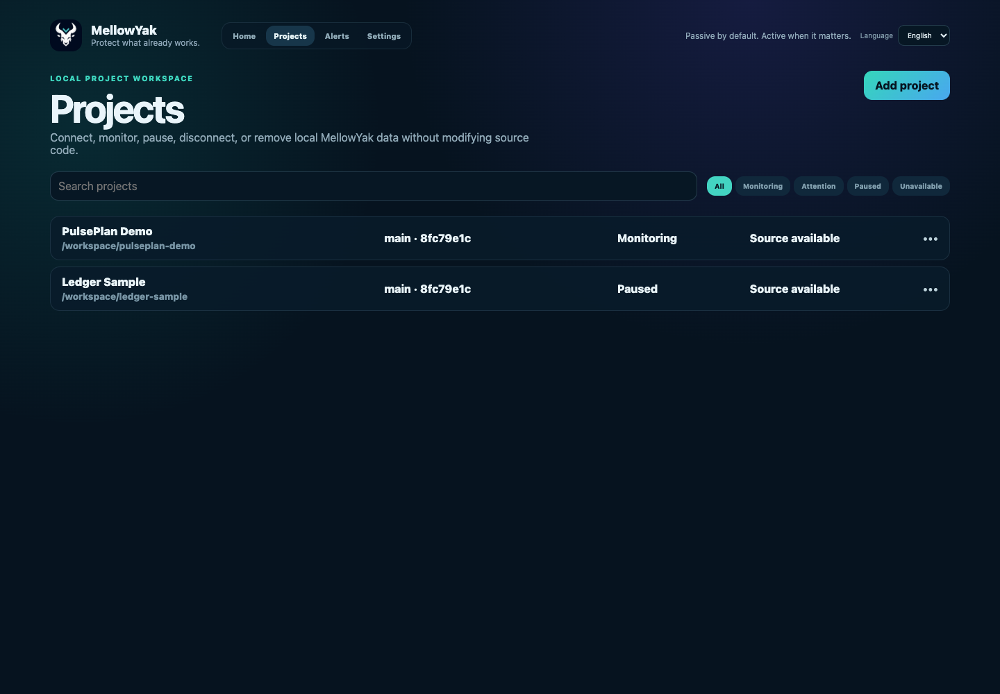

- What is shown: Searchable and filterable project lifecycle table.
- Available actions: Search, filter, add, open, or reveal project actions.

## 3. Project action menu — English

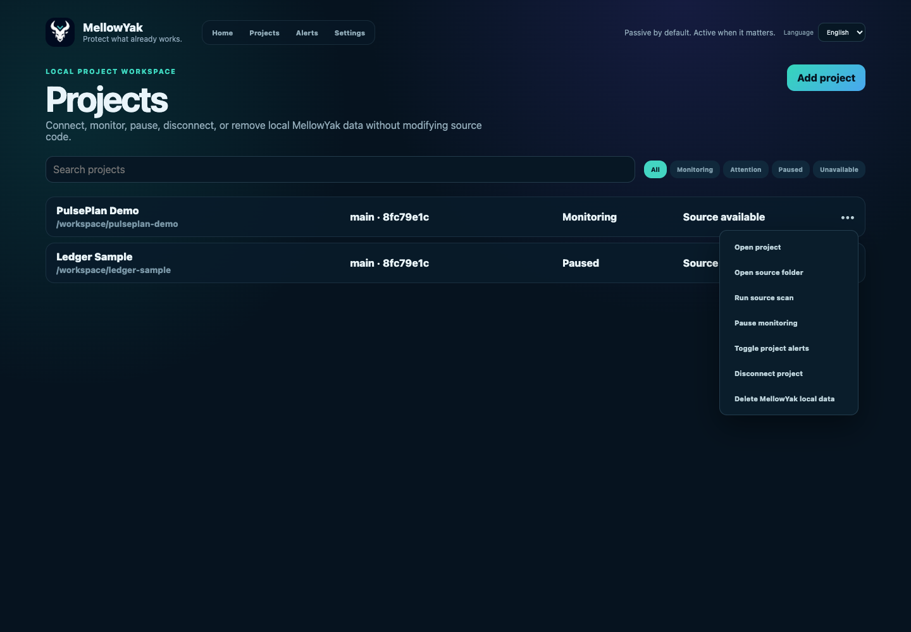

- What is shown: Bounded project operations with destructive actions visually separated.
- Available actions: Open, reveal source, scan, pause, mute, disconnect, or delete local data.

## 4. Disconnect confirmation — English

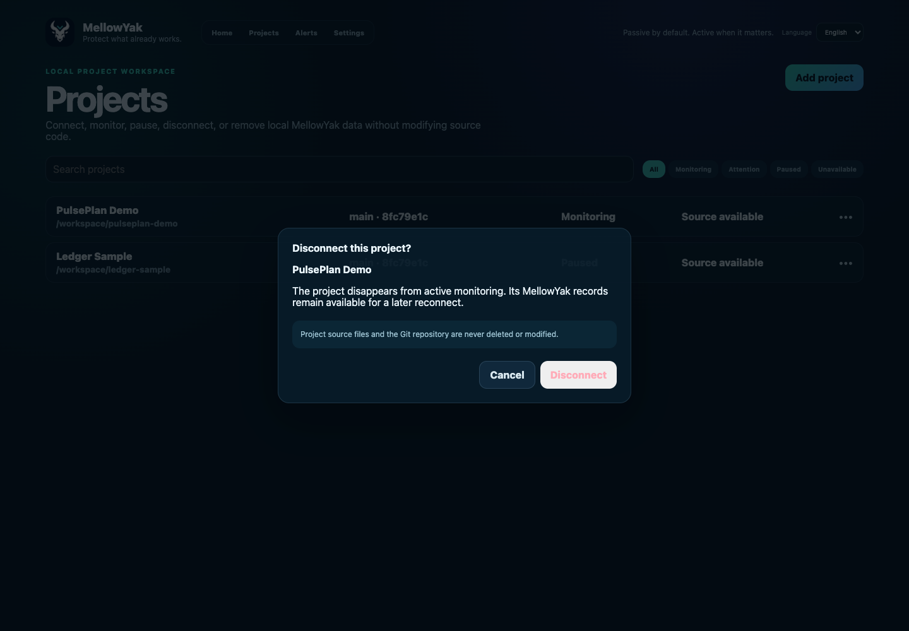

- What is shown: Explains that monitoring stops while MellowYak records and source remain safe.
- Available actions: Cancel or disconnect.

## 5. Delete local data confirmation — English

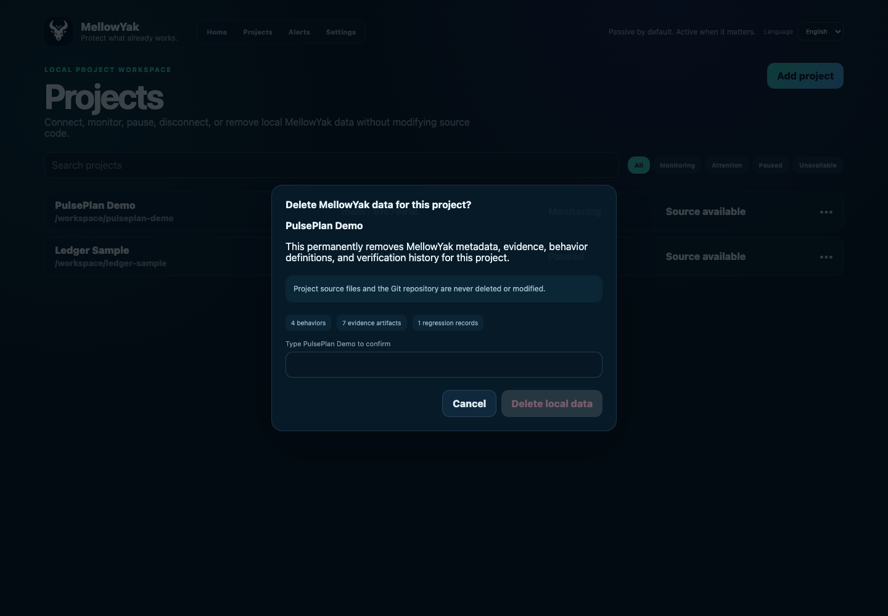

- What is shown: Shows the local records affected and requires the exact project name.
- Available actions: Cancel or permanently delete only MellowYak project data.

## 6. Alerts Center — English

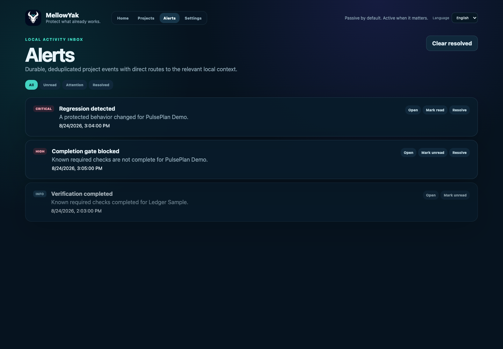

- What is shown: Persistent regression, gate, and resolved outcome records.
- Available actions: Filter, open context, mark read or unread, resolve, and clear resolved.

## 7. Settings — English

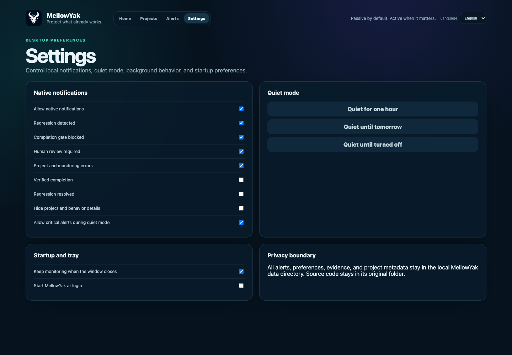

- What is shown: Native notification categories, privacy detail controls, quiet mode, background close, and login startup.
- Available actions: Toggle alert categories, quiet mode, background lifecycle, and start at login.

## 8. Quiet Mode active — English

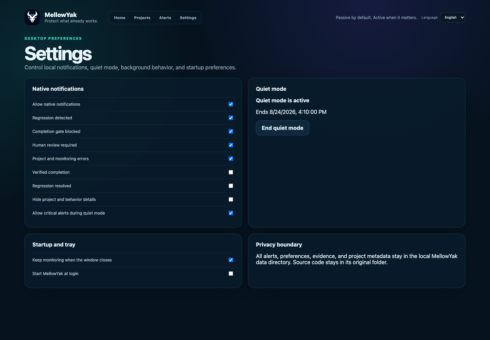

- What is shown: Persistent time-bounded suppression state with an explicit end action.
- Available actions: End quiet mode.

## 9. Project capabilities — English

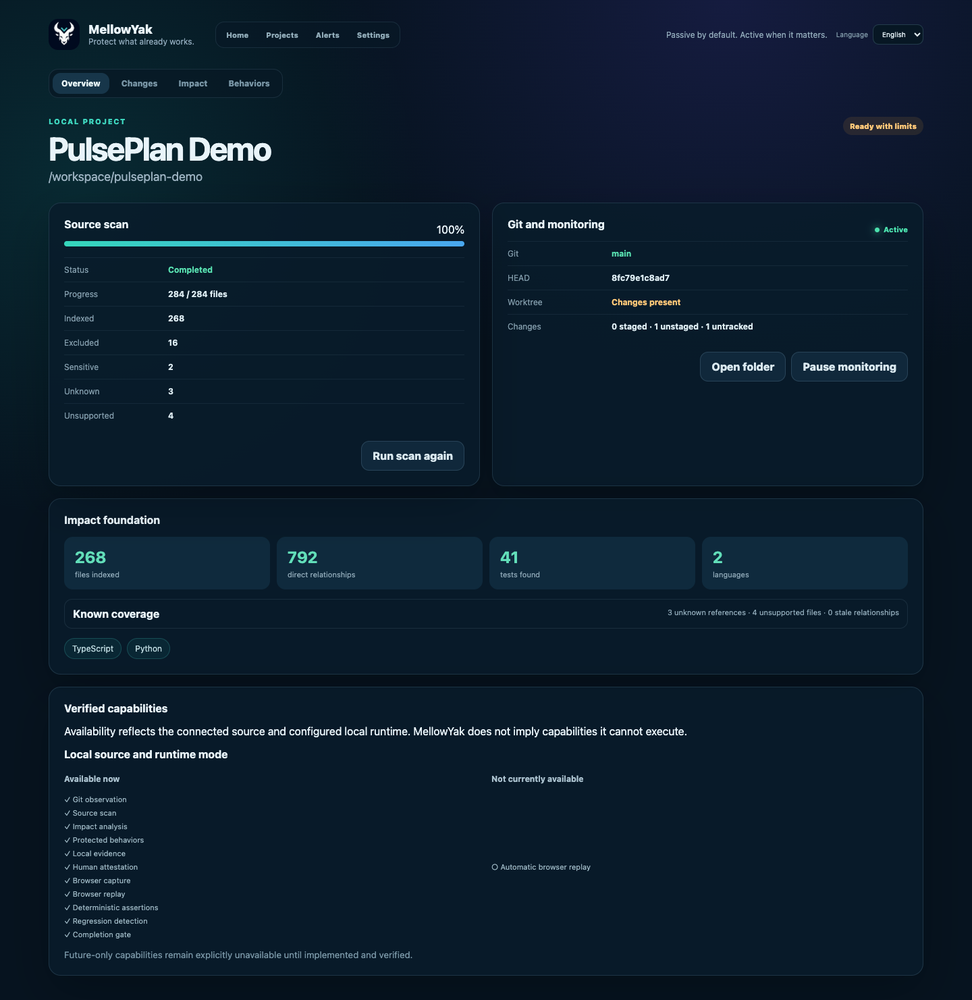

- What is shown: Truthful available and unavailable features for a local source plus runtime.
- Available actions: Review source scan, Git, impact, evidence, replay, regression, and gate availability.

## 10. Command Center — Hebrew RTL

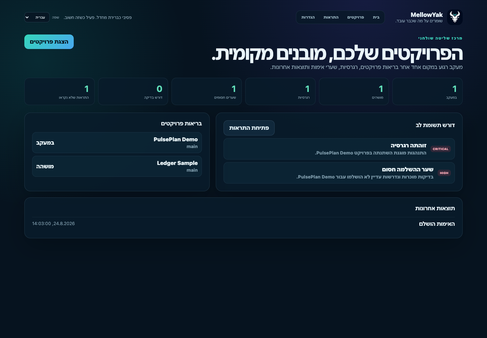

- What is shown: The complete command center mirrored and translated right-to-left.
- Available actions: Open projects, alerts, and project context.

## 11. Projects — Hebrew RTL

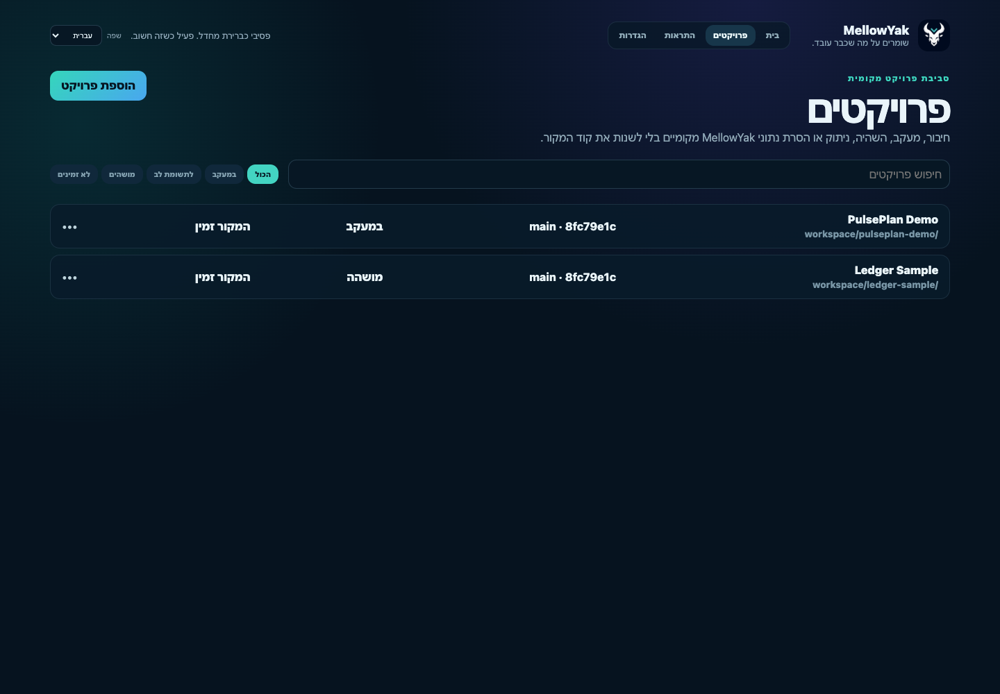

- What is shown: Project search, filters, states, and actions in full RTL.
- Available actions: Search, filter, add, open, and manage projects.

## 12. Settings — Hebrew RTL

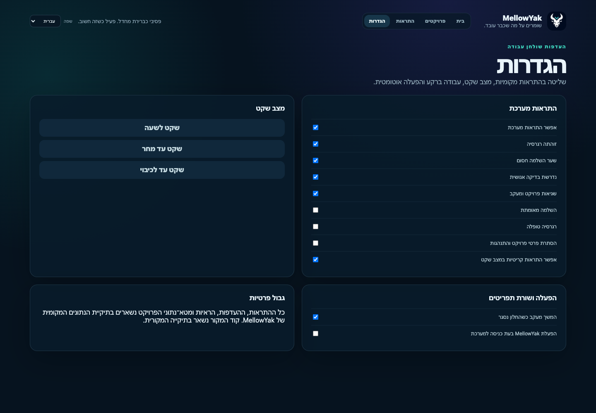

- What is shown: Notification, quiet mode, startup, and privacy settings in full RTL.
- Available actions: Control all desktop preferences.

