# MellowYak Phase 7 Screen Guide

All screenshots use deterministic synthetic public fixture data. They contain no private repository path, credential, source content, prompt history, provider data, or user data.

## 1. Runtime Wizard — project type

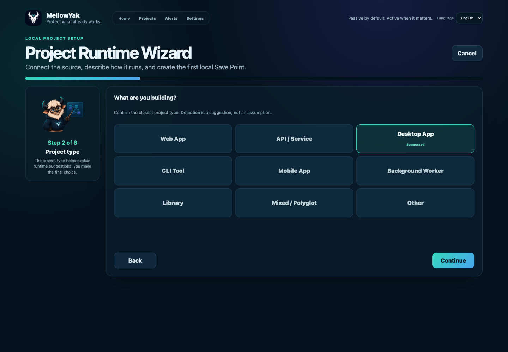

- Purpose: Review the confirmed project-type choice before runtime setup.
- Displayed state: A local non-Git source folder was detected and Web App is suggested.
- Source of data: Deterministic synthetic Phase 7 fixture data intercepted on the authenticated loopback API boundary.
- Available actions: Choose any project type, continue, go back, or cancel.
- What is known: Canonical local folder metadata, detected languages, frameworks, and source-local policy.
- What is not known: The primary runtime and executable are not selected yet.
- Expected next step: Confirm the project type and continue to runtime detection.

## 2. Runtime Wizard — detected runtimes

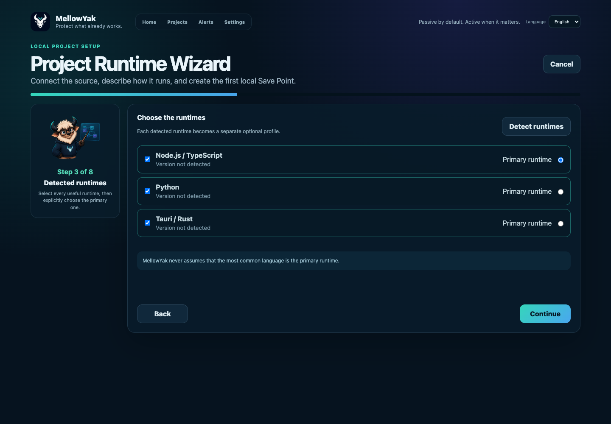

- Purpose: Review every detected runtime independently and choose primary/secondary roles.
- Displayed state: Node.js, Python, and Tauri/Rust are suggested from public fixture metadata.
- Source of data: Deterministic synthetic Phase 7 fixture data intercepted on the authenticated loopback API boundary.
- Available actions: Select runtimes, choose exactly one primary runtime, re-run detection, continue, or go back.
- What is known: Runtime candidates and available version hints.
- What is not known: No start command has been approved yet.
- Expected next step: Confirm the selected runtimes and describe how each one runs.

## 3. Runtime Wizard — profile configuration

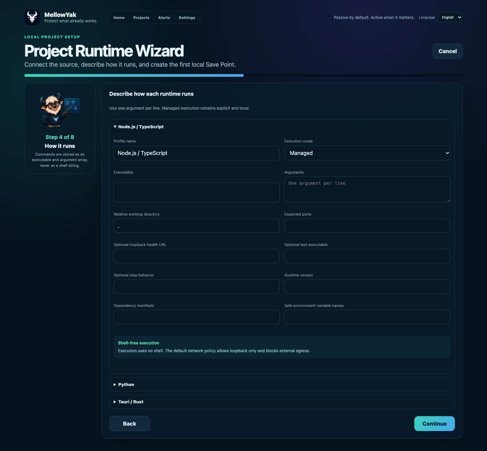

- Purpose: Configure one approved runtime profile without a shell command string.
- Displayed state: The primary profile is expanded; secondary profiles remain available but collapsed for legibility.
- Source of data: Deterministic synthetic Phase 7 fixture data intercepted on the authenticated loopback API boundary.
- Available actions: Set mode, executable, argv, working folder, ports, health URL, tests, and safe environment names.
- What is known: Executable and argv are persisted separately with loopback-only policy.
- What is not known: Availability is not claimed until profile validation succeeds.
- Expected next step: Review test suggestions and monitoring/privacy settings.

## 4. Runtime Wizard — initial Save Point

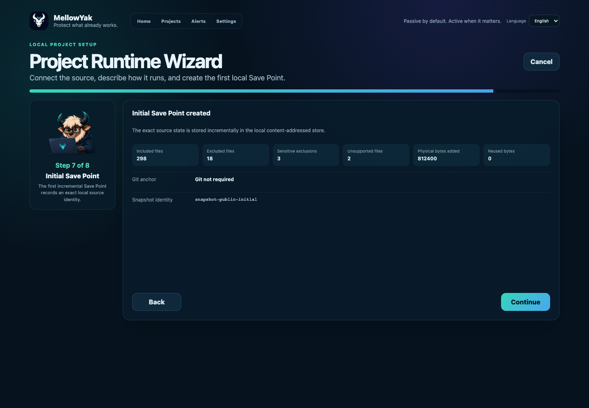

- Purpose: Confirm the first content-addressed local source snapshot.
- Displayed state: The initial snapshot reports included, excluded, sensitive, unsupported, physical, and reused bytes.
- Source of data: Deterministic synthetic Phase 7 fixture data intercepted on the authenticated loopback API boundary.
- Available actions: Continue to the readiness summary or go back.
- What is known: Exact snapshot identity and bounded capture counts.
- What is not known: Unsupported files remain outside verified coverage.
- Expected next step: Review readiness and every remaining limitation.

## 5. Ready with limits — actionable details

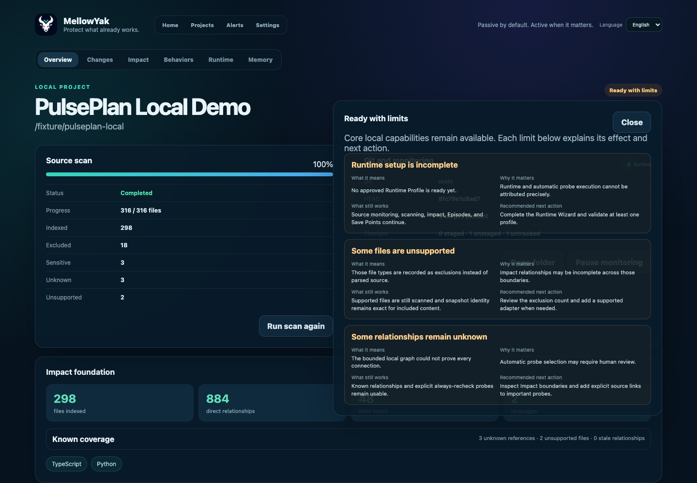

- Purpose: Replace a vague readiness badge with an actionable explanation.
- Displayed state: Runtime setup, unsupported files, and unknown relationships are explained.
- Source of data: Deterministic synthetic Phase 7 fixture data intercepted on the authenticated loopback API boundary.
- Available actions: Close the explanation or follow the recommended setup actions.
- What is known: Source scanning and local monitoring remain operational.
- What is not known: Automatic runtime checks and unsupported relationships are not fully covered.
- Expected next step: Complete runtime setup and review unsupported or unknown boundaries.

## 6. Runtime Profiles

- Purpose: Inspect primary and secondary local runtime profiles.
- Displayed state: Node.js and Python profiles are configured but no managed process is currently running.
- Source of data: Deterministic synthetic Phase 7 fixture data intercepted on the authenticated loopback API boundary.
- Available actions: Detect, validate, start, stop, inspect evidence, add a profile, or add a probe.
- What is known: Approved executable/argv, ports, tests, health policy, and profile versions.
- What is not known: Current process health is unknown until a runtime starts.
- Expected next step: Validate and start the intended primary runtime.

## 7. Runtime Profile — running

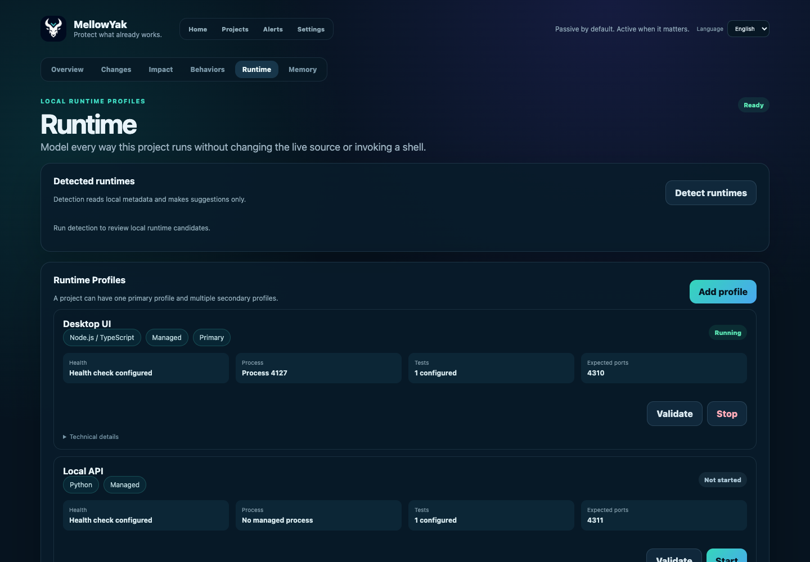

- Purpose: Show bounded runtime process and health observation.
- Displayed state: The primary Node.js profile is running on its expected loopback port.
- Source of data: Deterministic synthetic Phase 7 fixture data intercepted on the authenticated loopback API boundary.
- Available actions: Stop, validate, inspect technical details, or run an approved probe.
- What is known: Process ID, local port, health state, uptime, and profile version.
- What is not known: MellowYak does not inspect unrelated process memory or environment values.
- Expected next step: Run the relevant approved probe or continue passive monitoring.

## 8. Memory — Episodes and Save Points

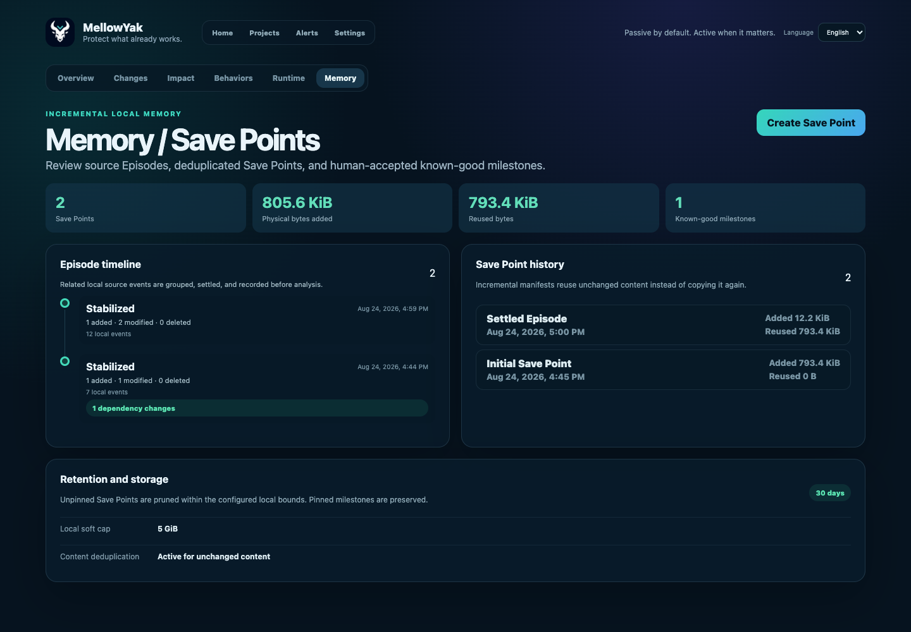

- Purpose: Review grouped change Episodes and deduplicated local Save Point history.
- Displayed state: Two stabilized Episodes produced two Save Points with reused-byte evidence.
- Source of data: Deterministic synthetic Phase 7 fixture data intercepted on the authenticated loopback API boundary.
- Available actions: Create a Save Point, select history, inspect retention, or open snapshot details.
- What is known: Episode counts, changed-path summaries, physical bytes, reused bytes, and pinned milestones.
- What is not known: A Save Point alone does not prove a behavior still works.
- Expected next step: Select a Save Point to inspect or bind it to a passing probe as known good.

## 9. Snapshot detail

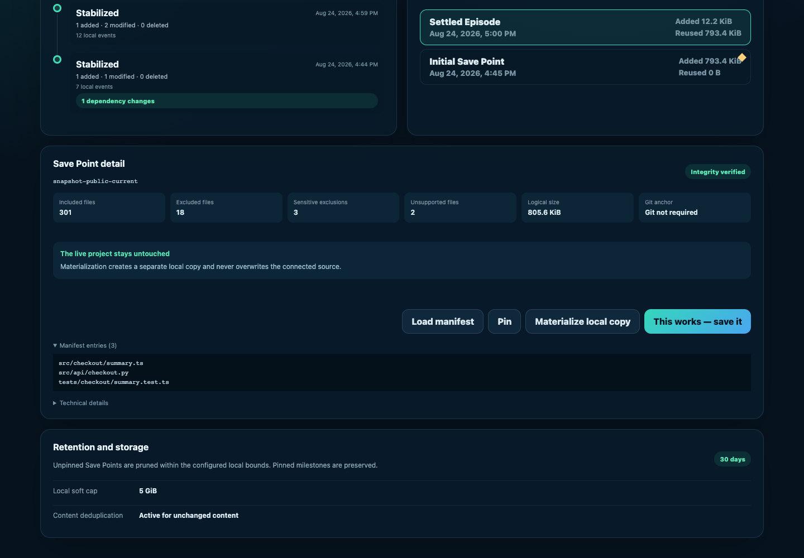

- Purpose: Inspect exact snapshot identity, integrity, exclusions, and materialization safety.
- Displayed state: The current incremental snapshot is verified and its bounded manifest entries are visible.
- Source of data: Deterministic synthetic Phase 7 fixture data intercepted on the authenticated loopback API boundary.
- Available actions: Load manifest, pin, materialize, or begin a known-good milestone.
- What is known: Manifest digest, source identity, included entries, sizes, and Git-optional anchor.
- What is not known: Behavioral correctness is not inferred from files alone.
- Expected next step: Materialize for inspection or validate a behavior before marking known good.

## 10. This works — save it

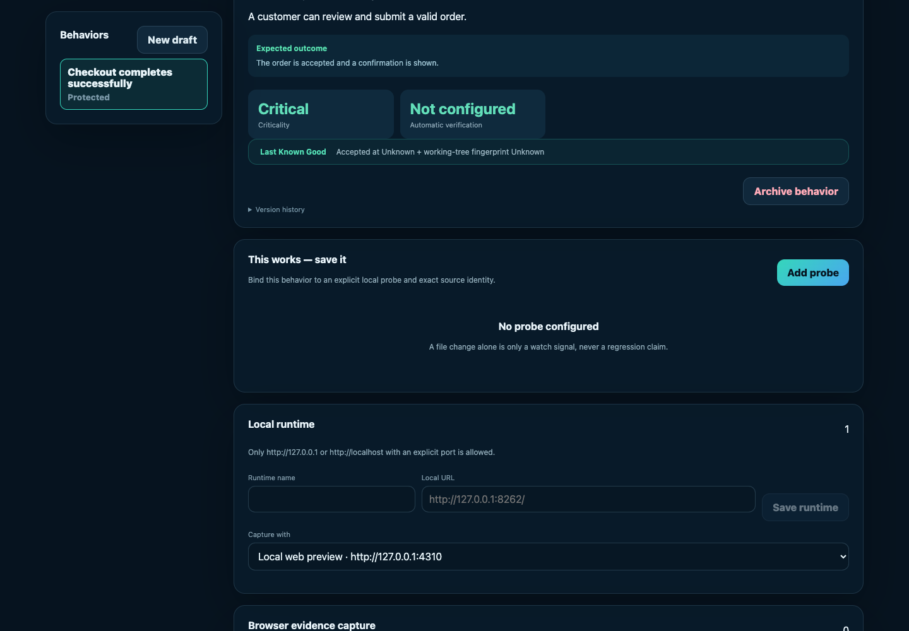

- Purpose: Start the friendly known-good workflow from a protected behavior.
- Displayed state: Checkout has an explicit expected outcome but no Phase 7 probe has been configured.
- Source of data: Deterministic synthetic Phase 7 fixture data intercepted on the authenticated loopback API boundary.
- Available actions: Add a Browser, API, CLI, Process, Test, or Manual probe.
- What is known: Behavior version, expected outcome, criticality, and prior accepted baseline.
- What is not known: No comparable current automated result exists yet.
- Expected next step: Choose a probe type and record its exact expected result.

## 11. Probe type selection

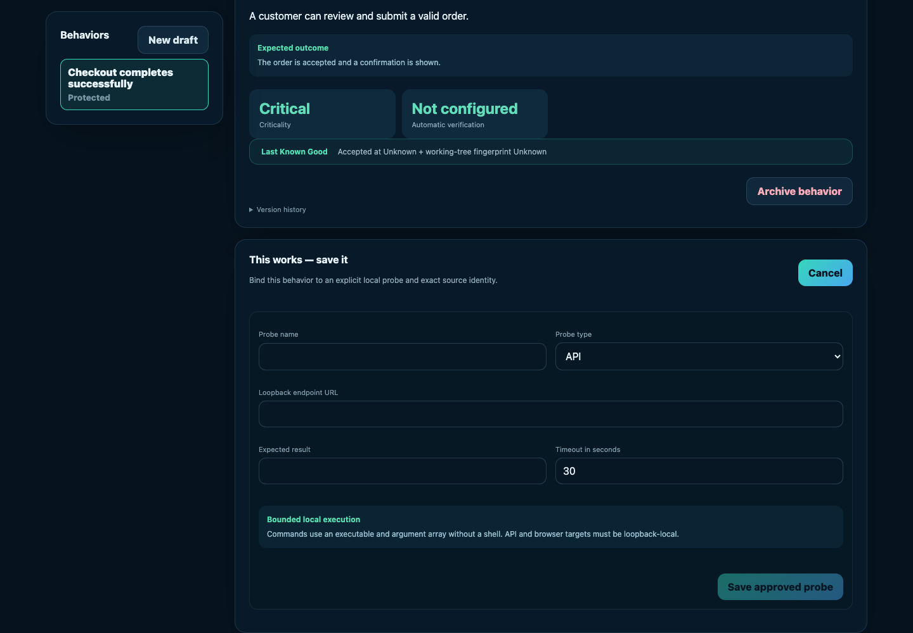

- Purpose: Choose one universal Probe contract for the behavior.
- Displayed state: The probe builder exposes the approved type selector and bounded execution policy.
- Source of data: Deterministic synthetic Phase 7 fixture data intercepted on the authenticated loopback API boundary.
- Available actions: Choose Browser, API, CLI, Process, Test, or Manual; cancel or save after required fields are complete.
- What is known: All probe types bind to source identity and use bounded local evidence.
- What is not known: No type or expected result is accepted until the user saves it.
- Expected next step: Select the probe matching the behavior and fill its expected result.

## 12. HTTP/API Probe

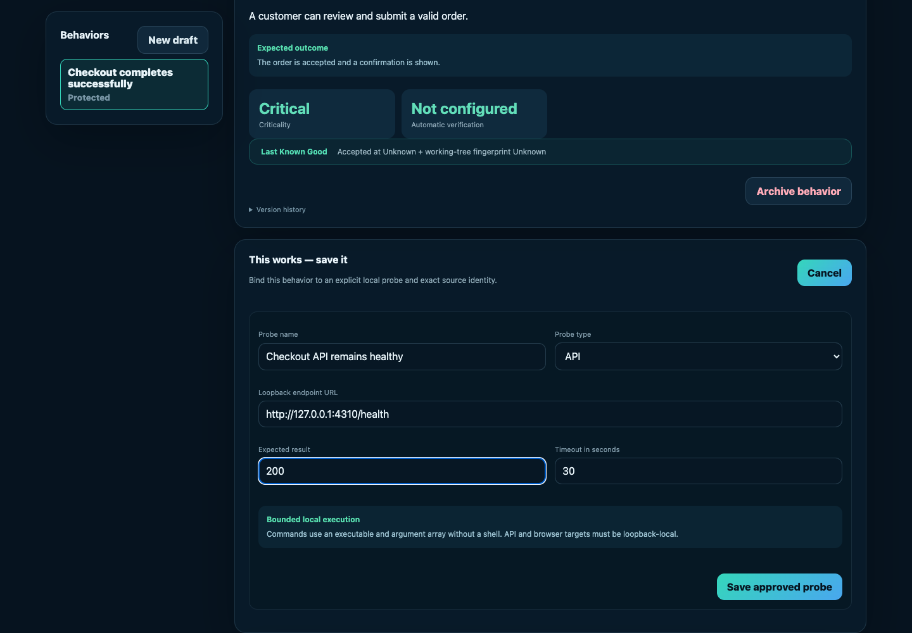

- Purpose: Configure a loopback-only API health assertion.
- Displayed state: A GET request targets a synthetic loopback health endpoint and expects status 200.
- Source of data: Deterministic synthetic Phase 7 fixture data intercepted on the authenticated loopback API boundary.
- Available actions: Edit target, expected status, timeout, runtime binding, save, or cancel.
- What is known: External egress is disabled and bodies are not retained by default.
- What is not known: The endpoint has not run in this configuration yet.
- Expected next step: Save the approved probe and execute it against the exact Save Point.

## 13. CLI Probe

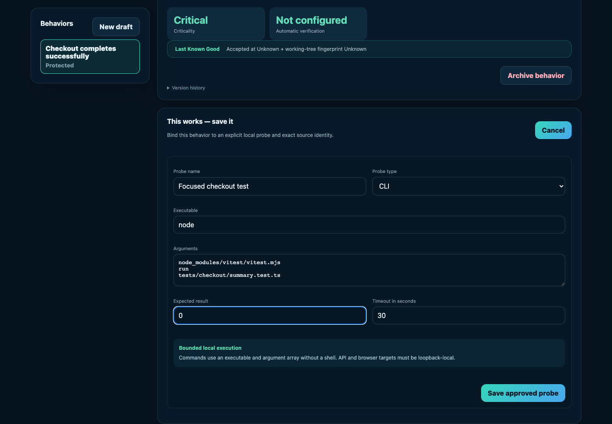

- Purpose: Configure a bounded local CLI check without invoking a shell.
- Displayed state: Executable and argv are separate and the expected exit code is zero.
- Source of data: Deterministic synthetic Phase 7 fixture data intercepted on the authenticated loopback API boundary.
- Available actions: Edit executable, one argument per line, timeout, expected exit code, save, or cancel.
- What is known: No shell syntax is evaluated and the working scope is local.
- What is not known: The executable has not been validated on this fixture screen.
- Expected next step: Save, validate availability, then run the probe.

## 14. Known-Good Milestone

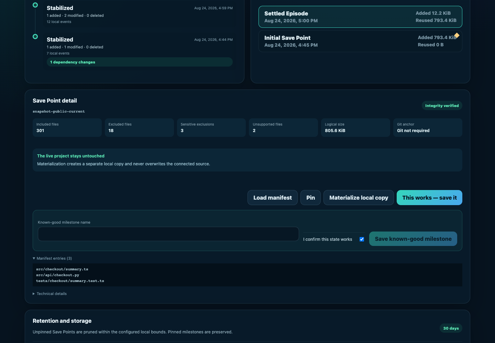

- Purpose: Bind a friendly milestone name to an exact Save Point and explicit attestation.
- Displayed state: A current snapshot is selected and the known-good milestone form is open.
- Source of data: Deterministic synthetic Phase 7 fixture data intercepted on the authenticated loopback API boundary.
- Available actions: Name and save the milestone, or keep inspecting snapshot evidence.
- What is known: Exact snapshot, pinned prior milestone count, runtime fingerprints, and attestation mode.
- What is not known: Human attestation does not become automated probe evidence.
- Expected next step: Save only after the behavior is observed working or its approved probe passes.

## 15. WATCH — file change only

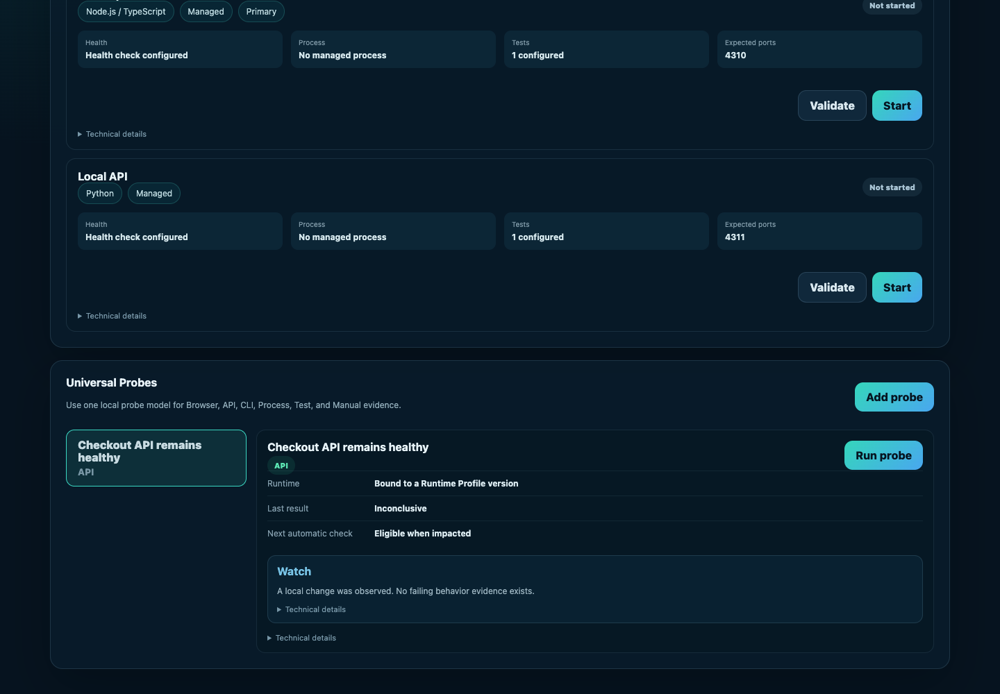

- Purpose: Show that a source change alone is not called a regression.
- Displayed state: The local API probe has no observed behavior failure; the deterministic signal remains WATCH.
- Source of data: Deterministic synthetic Phase 7 fixture data intercepted on the authenticated loopback API boundary.
- Available actions: Run the probe, inspect technical details, or continue monitoring.
- What is known: Three files changed in one Episode and no comparable failure was observed.
- What is not known: Whether the affected behavior still works has not been proven.
- Expected next step: Run the relevant comparable probe before making a regression claim.

## 16. Confirmed regression — friendly view

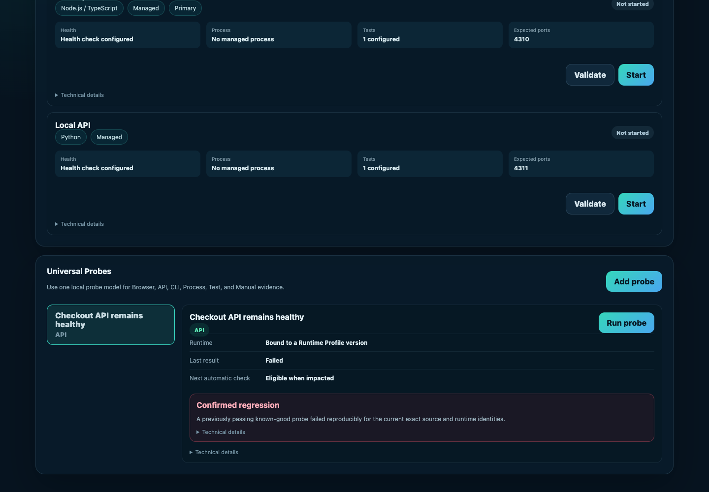

- Purpose: Explain a reproducible prior-pass to current-fail transition in novice language.
- Displayed state: A probe that passed at an accepted milestone failed twice at the current comparable source identity.
- Source of data: Deterministic synthetic Phase 7 fixture data intercepted on the authenticated loopback API boundary.
- Available actions: Inspect technical details, rerun the probe, or open change context.
- What is known: Prior accepted pass, current comparable fail, and retry reproduction.
- What is not known: Root cause is not claimed.
- Expected next step: Inspect technical evidence and create an isolated Repair Workspace if needed.

## 17. Confirmed regression — technical evidence

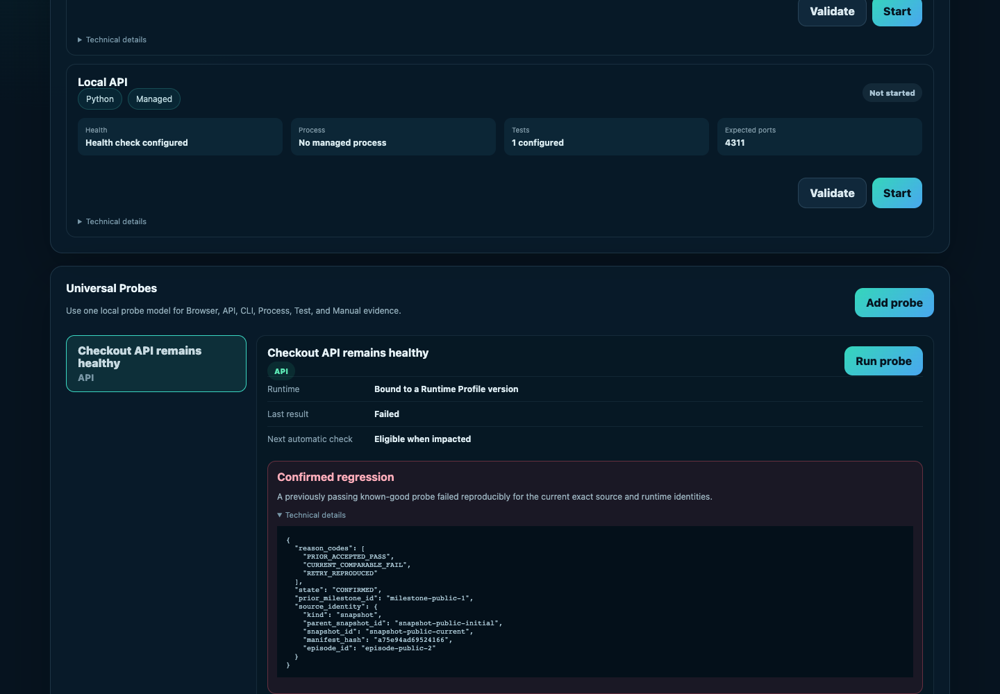

- Purpose: Expose deterministic reason codes and exact source identity.
- Displayed state: The technical disclosure shows prior milestone, current snapshot identity, and reproducibility reasons.
- Source of data: Deterministic synthetic Phase 7 fixture data intercepted on the authenticated loopback API boundary.
- Available actions: Review structured evidence or collapse the technical disclosure.
- What is known: Exact reason codes, prior accepted baseline, attempts, expected result, and observed result.
- What is not known: No automatic root-cause or repair claim is made.
- Expected next step: Use the evidence to scope a local isolated Repair Workspace.

## 18. Repair Workspace

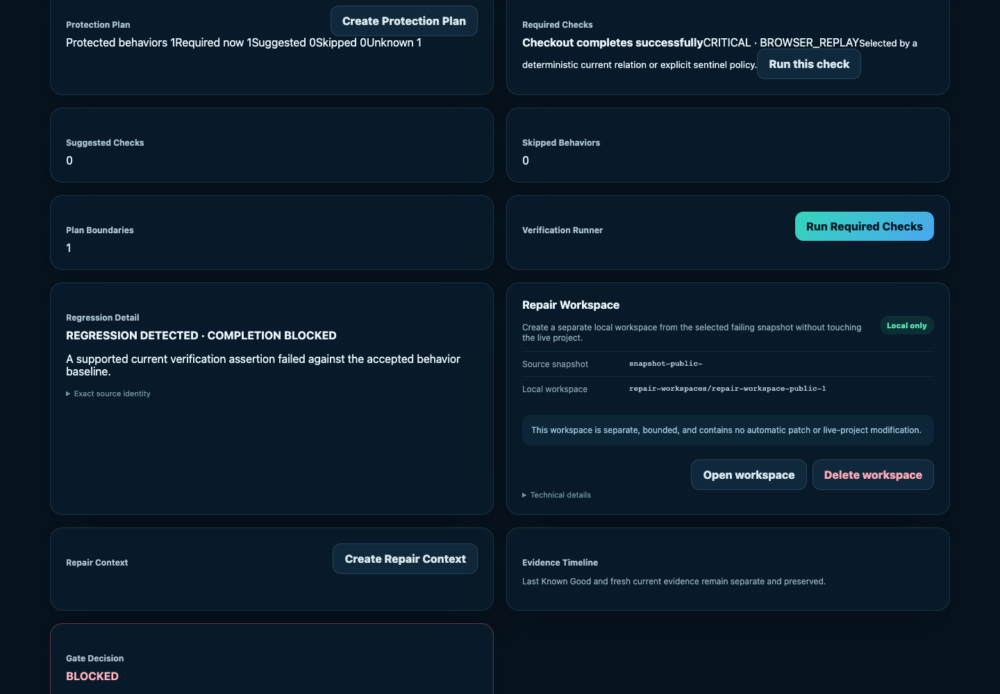

- Purpose: Create an isolated local materialization for manual repair work.
- Displayed state: The workspace is ready outside the live project with current source, evidence, and validation plan references.
- Source of data: Deterministic synthetic Phase 7 fixture data intercepted on the authenticated loopback API boundary.
- Available actions: Open or delete the Repair Workspace and inspect its technical manifest.
- What is known: Snapshot digest, bounded workspace location, included item classes, and live-project safety.
- What is not known: MellowYak has not generated or applied a patch.
- Expected next step: Open the isolated workspace manually and follow the required rechecks.

## 19. Non-Git project

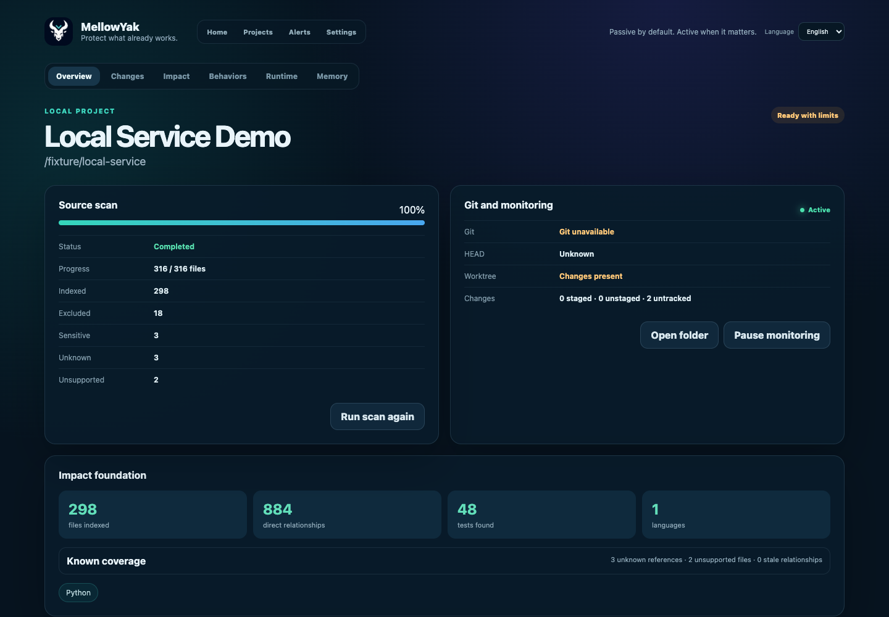

- Purpose: Show full local operation without requiring a Git repository.
- Displayed state: Source scan and monitoring are ready with snapshot-backed identity.
- Source of data: Deterministic synthetic Phase 7 fixture data intercepted on the authenticated loopback API boundary.
- Available actions: Open Runtime, Memory, Changes, Impact, Behaviors, scan, or source folder.
- What is known: Local source metadata, snapshot identity support, scan coverage, and monitoring status.
- What is not known: Git branch and commit anchors do not exist for this project.
- Expected next step: Use Save Points and Episodes as the source-history vocabulary.

## 20. Polyglot project

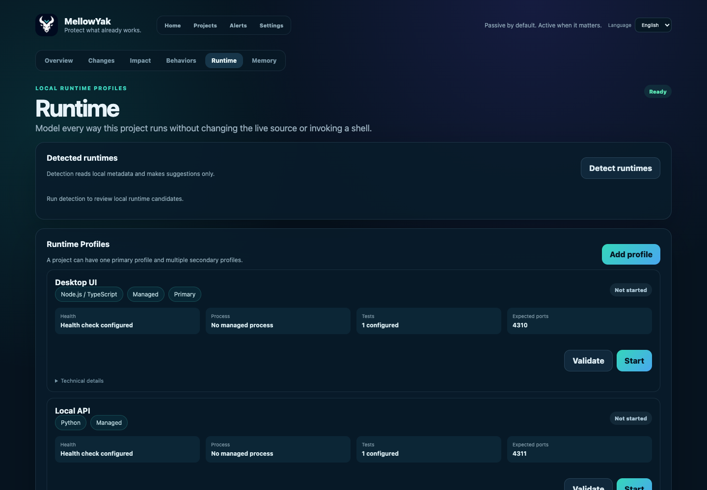

- Purpose: Show multiple runtime profiles with an explicit primary and secondary selection.
- Displayed state: Node.js is primary and Python is secondary; both retain independent versions and tests.
- Source of data: Deterministic synthetic Phase 7 fixture data intercepted on the authenticated loopback API boundary.
- Available actions: Detect, validate, start either approved profile, inspect limitations, or configure probes.
- What is known: Per-runtime executable, health, tests, ports, and primary role.
- What is not known: Neither runtime process is currently running.
- Expected next step: Start only the profile needed for the next relevant probe.

## 21. Runtime Wizard — Hebrew RTL

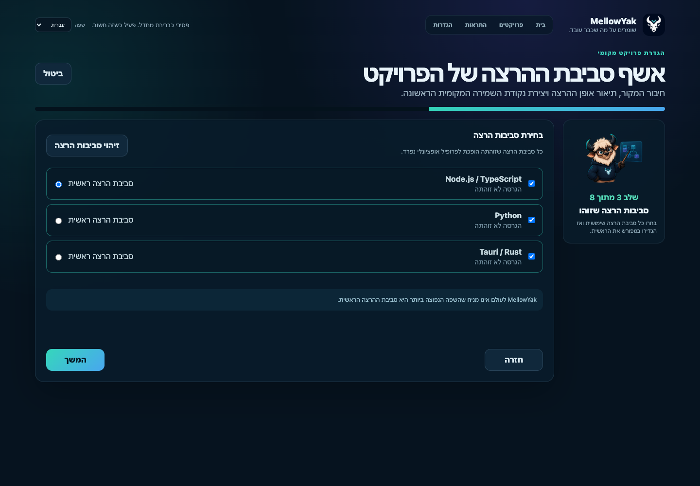

- Purpose: Verify the runtime-selection step in complete Hebrew RTL layout.
- Displayed state: Detected runtimes, checkboxes, version hints, and primary selection are mirrored correctly.
- Source of data: Deterministic synthetic Phase 7 fixture data intercepted on the authenticated loopback API boundary.
- Available actions: Select runtimes, choose the primary profile, detect again, continue, or go back.
- What is known: The same synthetic runtime metadata used by the English screen.
- What is not known: Execution remains unapproved until the later configuration step.
- Expected next step: Continue in Hebrew to configure executable and argv separately.

## 22. Known-Good Milestone — Hebrew RTL

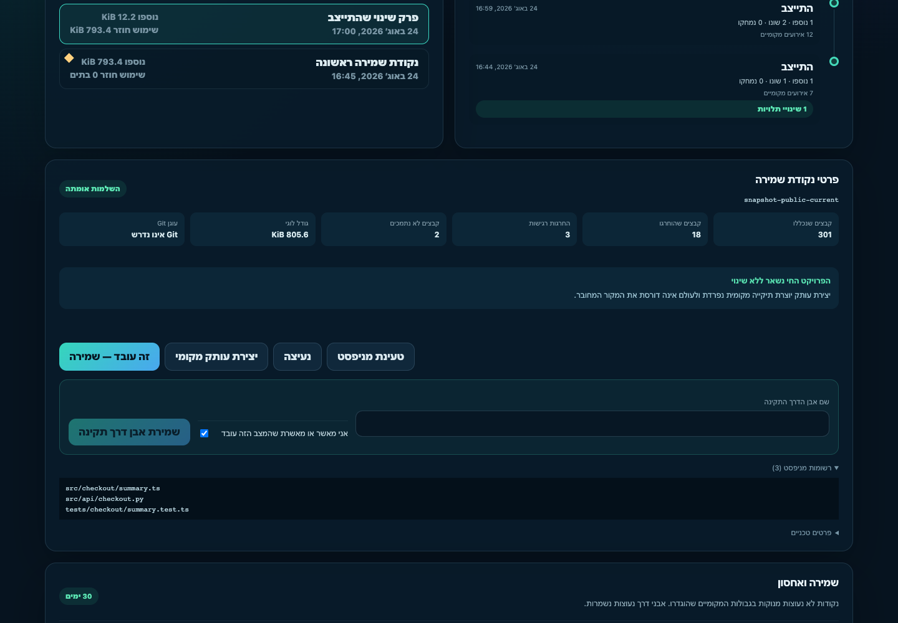

- Purpose: Verify the known-good workflow, data direction, and controls in Hebrew.
- Displayed state: The selected Save Point and milestone form are fully translated and right-to-left.
- Source of data: Deterministic synthetic Phase 7 fixture data intercepted on the authenticated loopback API boundary.
- Available actions: Name and save an attested milestone or inspect snapshot evidence.
- What is known: Exact local snapshot and existing pinned milestone count.
- What is not known: Attestation remains manual until a supported probe passes.
- Expected next step: Save the milestone only after explicit verification.

## 23. Confirmed regression — Hebrew RTL

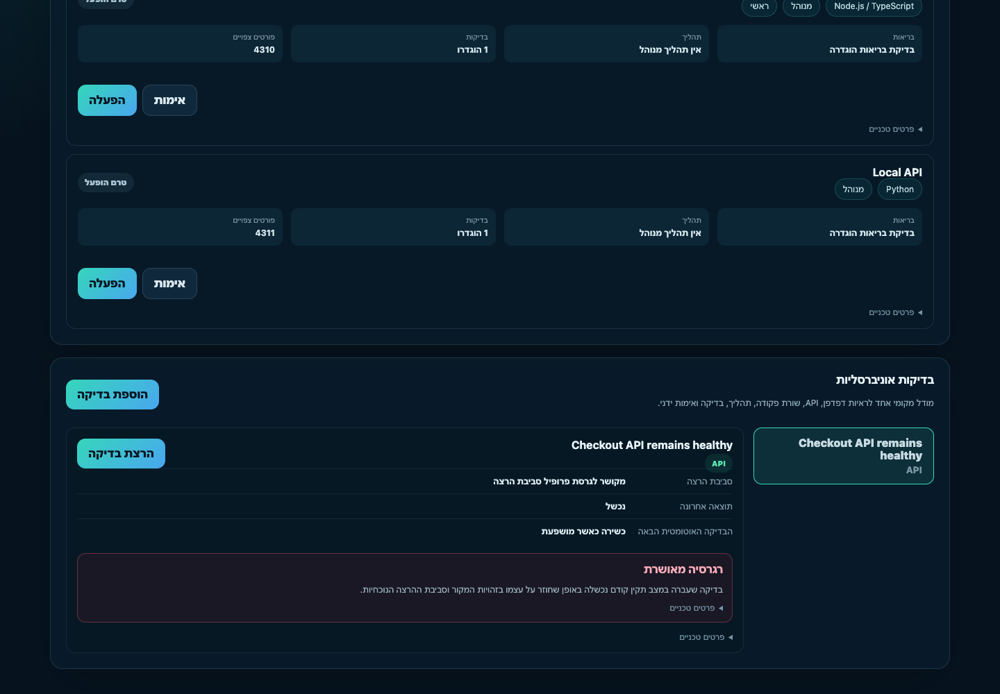

- Purpose: Verify friendly confirmed-regression copy in Hebrew while technical identifiers remain LTR.
- Displayed state: The reproducible prior-pass to current-fail transition is translated and mirrored.
- Source of data: Deterministic synthetic Phase 7 fixture data intercepted on the authenticated loopback API boundary.
- Available actions: Run again or expand technical details.
- What is known: Accepted prior pass, comparable current failures, and retry evidence.
- What is not known: Root cause and automatic repair remain out of scope.
- Expected next step: Review evidence and create a separate Repair Workspace when needed.
