# MellowYak Phase 8 Screen Guide

All screens use deterministic synthetic data. No private source, user path, credentials, prompt history, provider data, runtime evidence, or real project content is included.

## 1. Repair Workspace ready

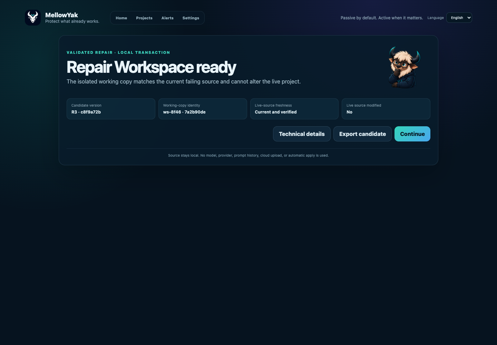

- Purpose: Review an isolated working copy before edits.
- Displayed state: Workspace is materialized from the exact failing source identity.
- Source of data: deterministic synthetic Phase 8 review fixture rendered locally by the desktop UI.
- Available actions: Open, inspect, refresh, export, or abandon the working copy.
- Known facts: Workspace and base manifest identities are known.
- Unknowns: No repair has been validated.
- Expected next step: Edit only the isolated working copy.
- Live source modified: No.

## 2. Workspace changes

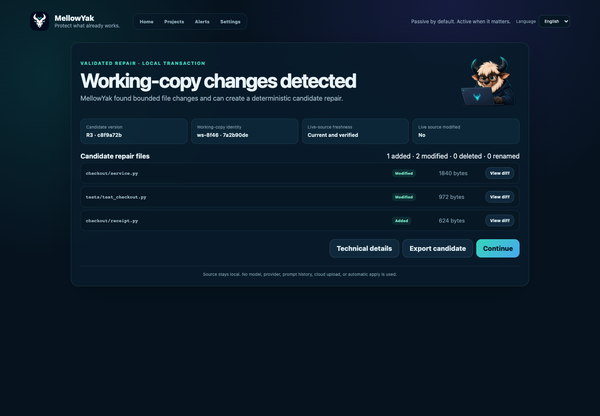

- Purpose: Review detected changes without touching live source.
- Displayed state: Three deterministic synthetic file changes are detected.
- Source of data: deterministic synthetic Phase 8 review fixture rendered locally by the desktop UI.
- Available actions: Refresh, inspect files, restore a workspace file, or create a candidate.
- Known facts: Paths, operations, sizes, and workspace identity are known.
- Unknowns: Behavioral correctness is not yet known.
- Expected next step: Create and review a bounded candidate repair.
- Live source modified: No.

## 3. Candidate patch preview

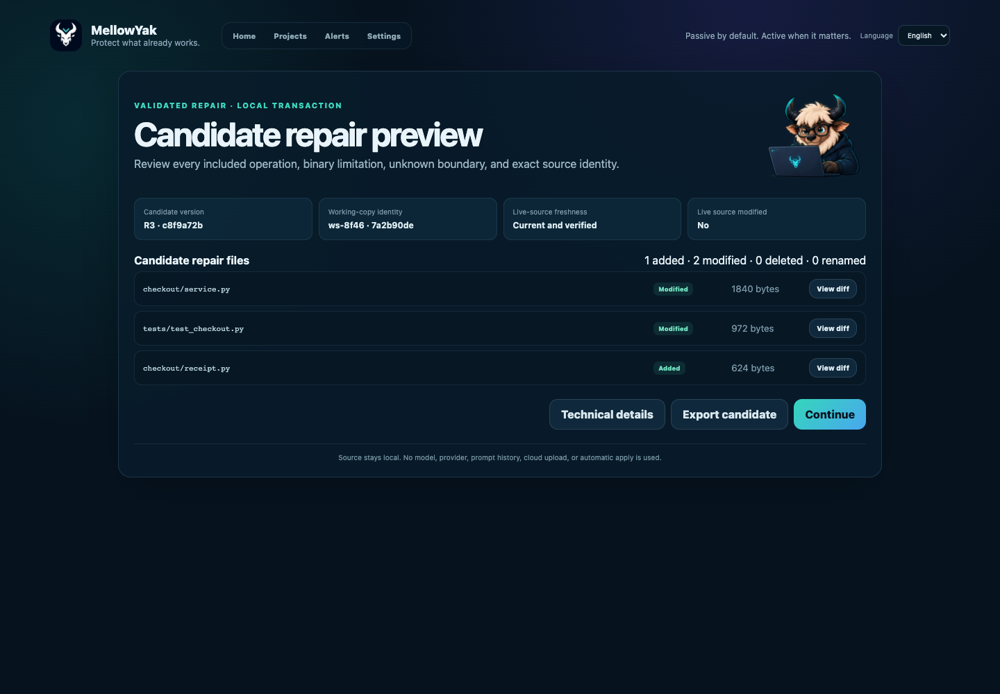

- Purpose: Summarize the bounded candidate manifest.
- Displayed state: One add and two modifications form candidate revision R3.
- Source of data: deterministic synthetic Phase 8 review fixture rendered locally by the desktop UI.
- Available actions: View files/diffs, export, exclude, validate, or abandon.
- Known facts: Exact candidate and expected live digests are bound.
- Unknowns: Live success is not implied.
- Expected next step: Review warnings and start workspace validation.
- Live source modified: No.

## 4. Candidate diff

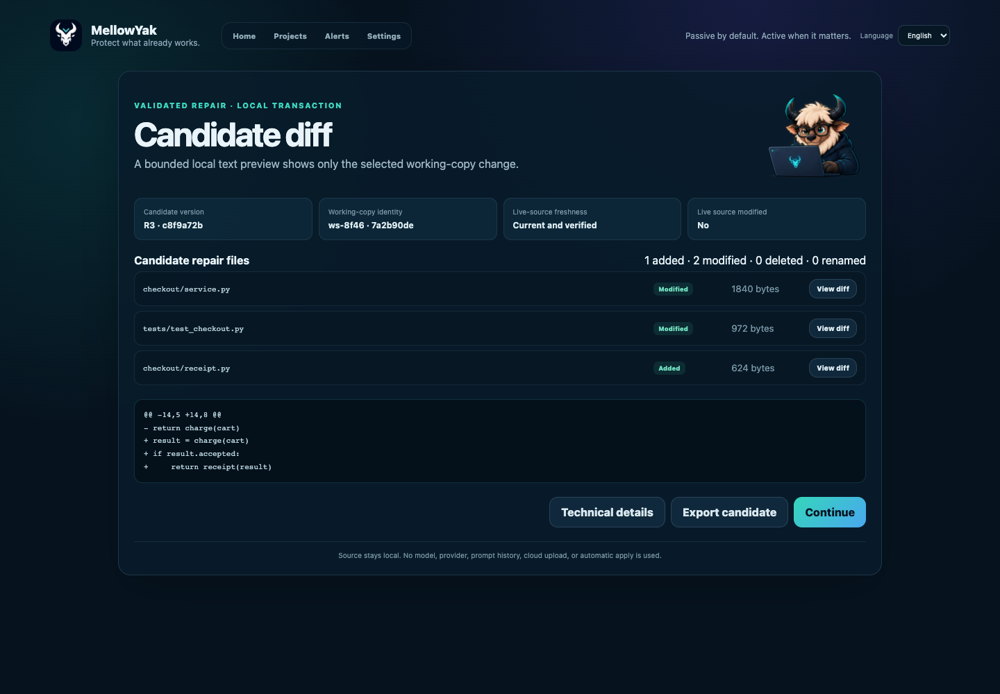

- Purpose: Inspect a bounded text diff.
- Displayed state: A synthetic checkout repair diff is visible.
- Source of data: deterministic synthetic Phase 8 review fixture rendered locally by the desktop UI.
- Available actions: Review the diff or return to the candidate summary.
- Known facts: The preview is candidate-bound and size-bounded.
- Unknowns: Binary content and omitted lines are not inferred.
- Expected next step: Validate the exact candidate revision.
- Live source modified: No.

## 5. Candidate validation plan

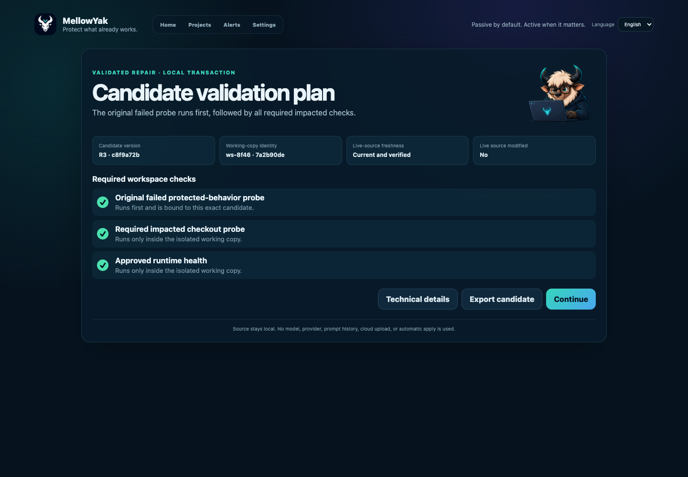

- Purpose: Show required checks before execution.
- Displayed state: Original failed probe is ordered first, followed by impacted and runtime checks.
- Source of data: deterministic synthetic Phase 8 review fixture rendered locally by the desktop UI.
- Available actions: Start validation or inspect technical bindings.
- Known facts: Required order, runtime identity, and policy are known.
- Unknowns: Unsupported external state may still require review.
- Expected next step: Run validation in the isolated workspace.
- Live source modified: No.

## 6. Candidate validating

- Purpose: Show bounded workspace verification in progress.
- Displayed state: Required checks are running against the candidate-bound working copy.
- Source of data: deterministic synthetic Phase 8 review fixture rendered locally by the desktop UI.
- Available actions: Inspect progress or cancel validation.
- Known facts: Workspace processes and exact candidate identity are tracked.
- Unknowns: Final validation outcome is not known yet.
- Expected next step: Wait for all required checks to finish.
- Live source modified: No.

## 7. Validation failed

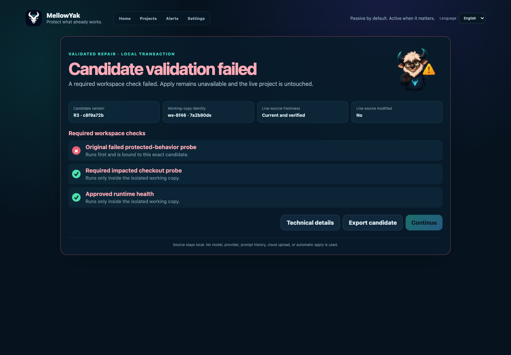

- Purpose: Block Apply when any required check fails.
- Displayed state: The original protected-behavior probe failed in the working copy.
- Source of data: deterministic synthetic Phase 8 review fixture rendered locally by the desktop UI.
- Available actions: Inspect evidence, edit the workspace, refresh, or export.
- Known facts: Failure is preserved and Apply is disabled.
- Unknowns: Root cause is not claimed.
- Expected next step: Make a smaller relevant edit and validate a new revision.
- Live source modified: No.

## 8. Candidate validated

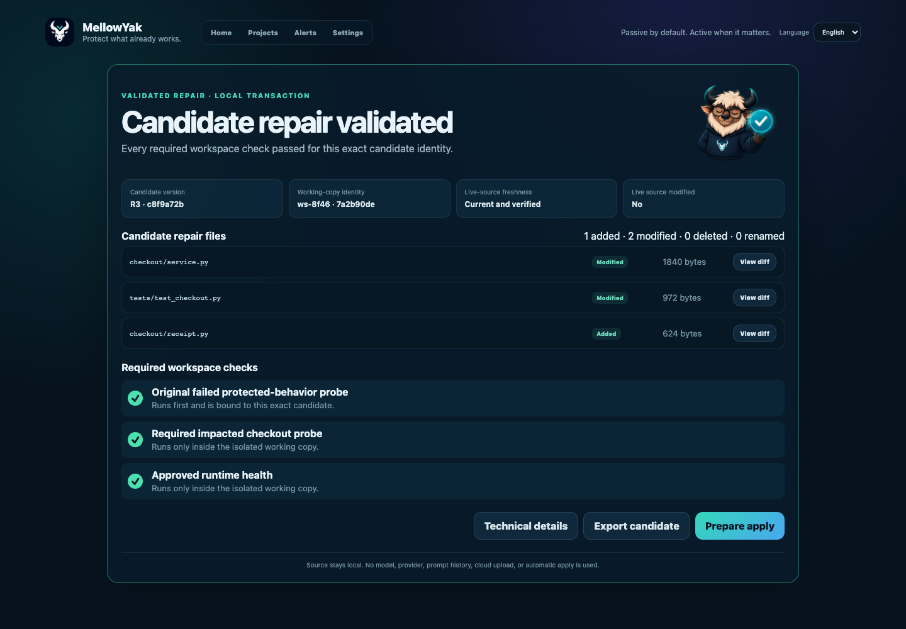

- Purpose: Present a candidate that passed every required workspace check.
- Displayed state: Candidate R3 is validated against exact workspace/runtime identities.
- Source of data: deterministic synthetic Phase 8 review fixture rendered locally by the desktop UI.
- Available actions: Prepare Apply, export, or inspect technical evidence.
- Known facts: All required workspace checks passed.
- Unknowns: The live project has not yet been verified.
- Expected next step: Prepare a fresh live-source preflight.
- Live source modified: No.

## 9. Apply blocked — live project changed

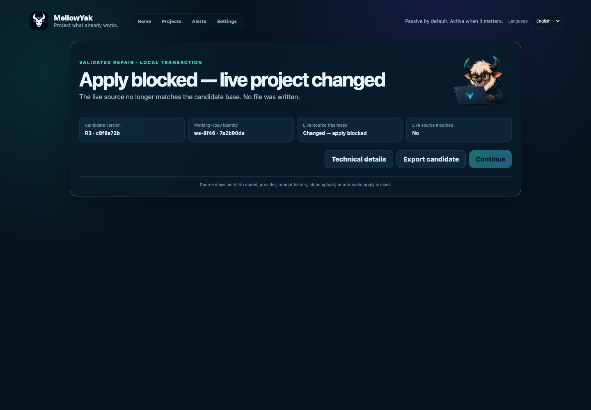

- Purpose: Prevent writes when live source no longer matches.
- Displayed state: Preflight found a stale live source identity.
- Source of data: deterministic synthetic Phase 8 review fixture rendered locally by the desktop UI.
- Available actions: Recreate the workspace, export the candidate, or cancel.
- Known facts: No live path was written.
- Unknowns: No automatic merge is attempted.
- Expected next step: Start again from the latest live source.
- Live source modified: No.

## 10. Apply confirmation

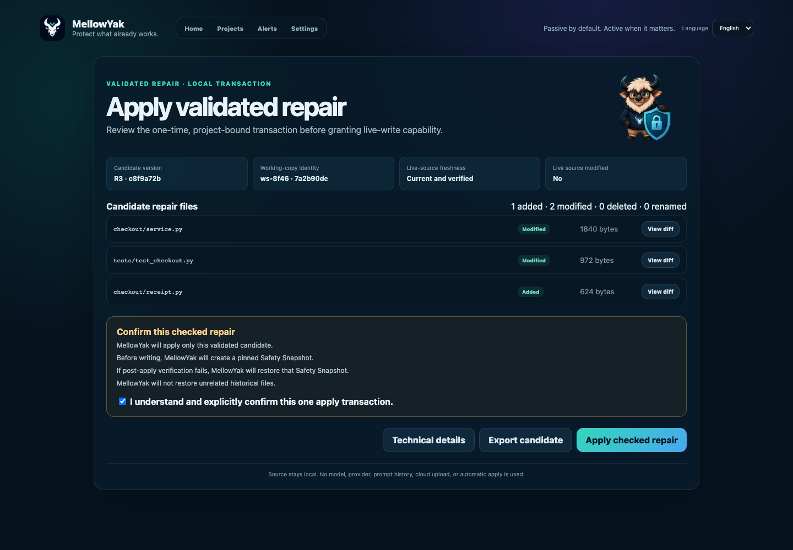

- Purpose: Require deliberate confirmation for one exact validated candidate.
- Displayed state: Candidate, source identity, safety point, checks, and rollback behavior are shown.
- Source of data: deterministic synthetic Phase 8 review fixture rendered locally by the desktop UI.
- Available actions: Confirm once, inspect details, export, or cancel.
- Known facts: Nonce is candidate/project/source-bound and short-lived.
- Unknowns: Cross-platform atomicity is not claimed.
- Expected next step: Confirm only after reviewing affected paths.
- Live source modified: No.

## 11. Safety snapshot created

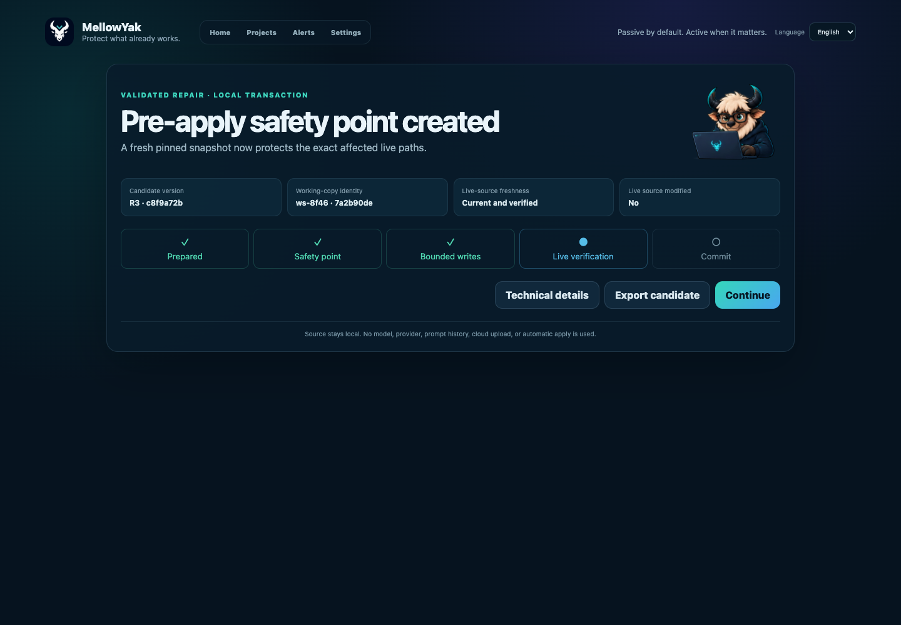

- Purpose: Show the fresh pinned pre-apply safety point.
- Displayed state: Safety snapshot and durable transaction journal exist before writes.
- Source of data: deterministic synthetic Phase 8 review fixture rendered locally by the desktop UI.
- Available actions: Inspect journal or continue the confirmed transaction.
- Known facts: Exact affected-path digests are captured.
- Unknowns: Post-apply success is not yet known.
- Expected next step: Proceed with hash-preconditioned writes.
- Live source modified: No.

## 12. Applying changes

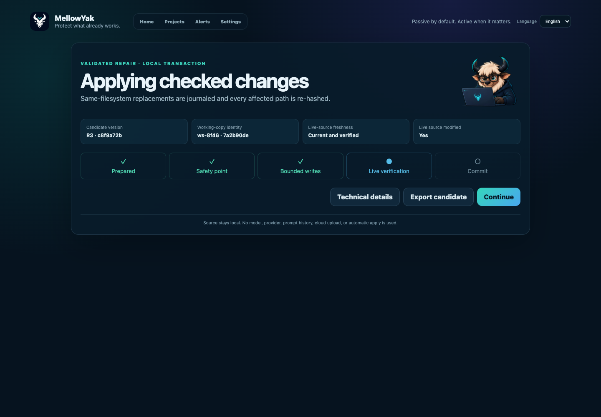

- Purpose: Show bounded journaled writes in progress.
- Displayed state: Prepared temporary files and atomic replacements are being journaled.
- Source of data: deterministic synthetic Phase 8 review fixture rendered locally by the desktop UI.
- Available actions: Inspect technical progress.
- Known facts: The transaction is bound to the confirmed candidate.
- Unknowns: A final live verification has not run.
- Expected next step: Complete writes, then run fresh live verification.
- Live source modified: Yes — only within the synthetic transaction shown.

## 13. Post-apply verification

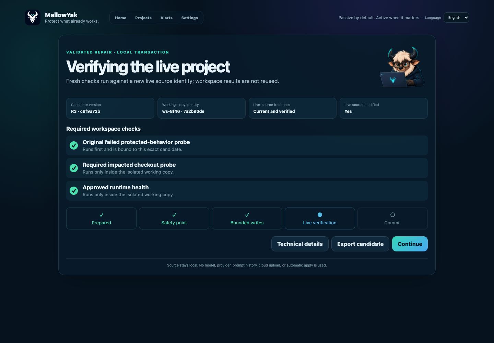

- Purpose: Separate workspace PASS from fresh live verification.
- Displayed state: A new live source identity and fresh required checks are running.
- Source of data: deterministic synthetic Phase 8 review fixture rendered locally by the desktop UI.
- Available actions: Inspect checks and transaction evidence.
- Known facts: Workspace evidence is not reused as live evidence.
- Unknowns: Commit outcome remains pending.
- Expected next step: Commit only if the live Completion Gate passes.
- Live source modified: Yes — only within the synthetic transaction shown.

## 14. Applied and verified

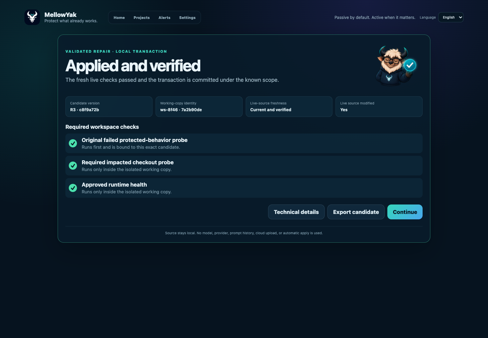

- Purpose: Show a committed repair after fresh live verification.
- Displayed state: Required live checks passed and the transaction committed.
- Source of data: deterministic synthetic Phase 8 review fixture rendered locally by the desktop UI.
- Available actions: Inspect evidence or optionally create a new known-good milestone.
- Known facts: Original failure, candidate validation, and live evidence remain distinct.
- Unknowns: No milestone was created automatically.
- Expected next step: Decide whether to save a new known-good milestone.
- Live source modified: Yes — only within the synthetic transaction shown.

## 15. Post-apply verification failed

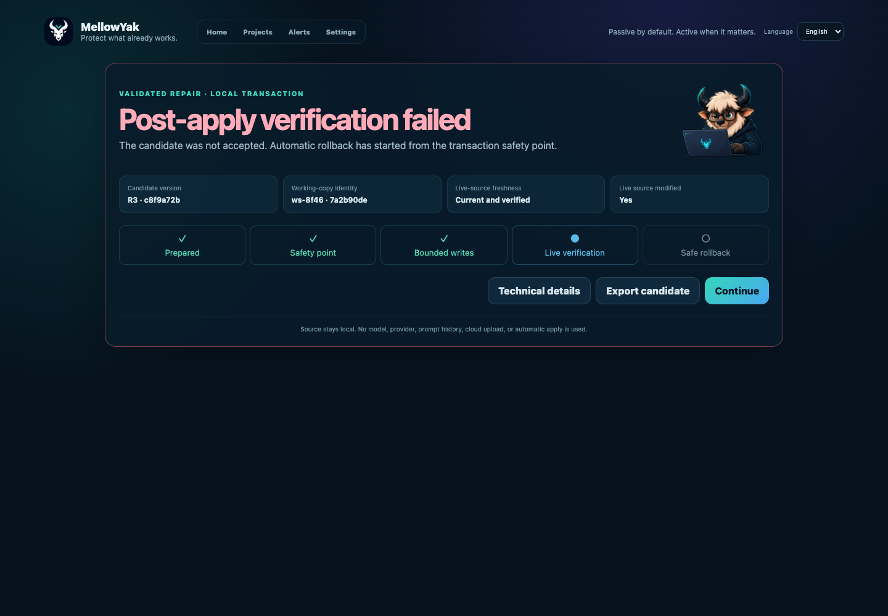

- Purpose: Explain why a written candidate cannot remain applied.
- Displayed state: A required live check failed after Apply.
- Source of data: deterministic synthetic Phase 8 review fixture rendered locally by the desktop UI.
- Available actions: Inspect evidence while automatic rollback begins.
- Known facts: The failure is transaction-bound and preserved.
- Unknowns: Repair success is not claimed.
- Expected next step: Wait for byte-verified rollback.
- Live source modified: Yes — only within the synthetic transaction shown.

## 16. Rolled back safely

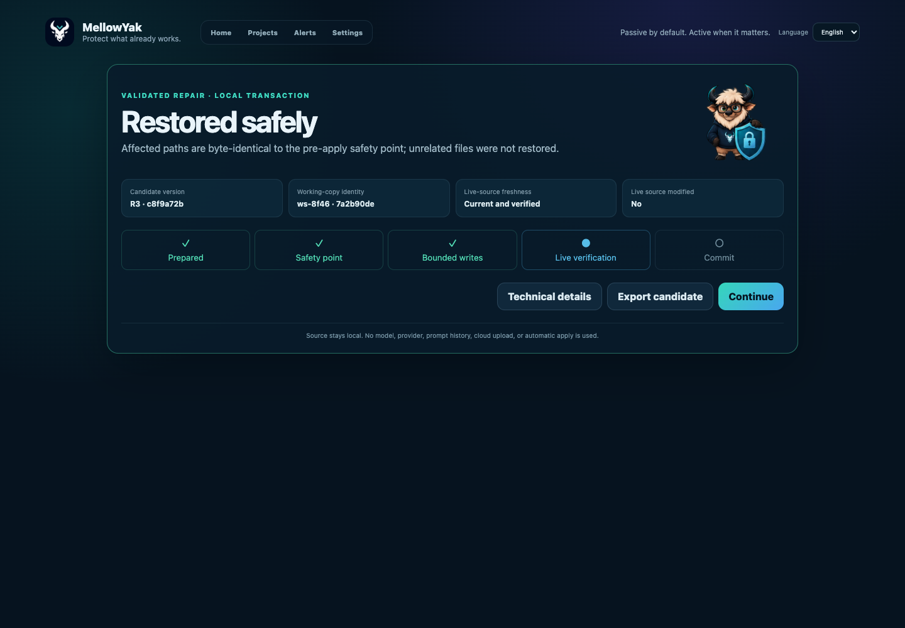

- Purpose: Confirm byte-identical transaction rollback.
- Displayed state: Only paths changed by this Apply were restored from its safety snapshot.
- Source of data: deterministic synthetic Phase 8 review fixture rendered locally by the desktop UI.
- Available actions: Inspect rollback evidence or keep/export the candidate.
- Known facts: Affected bytes match the pre-apply safety point.
- Unknowns: The original regression remains unresolved.
- Expected next step: Revise the candidate in an isolated workspace.
- Live source modified: No.

## 17. Recovery required

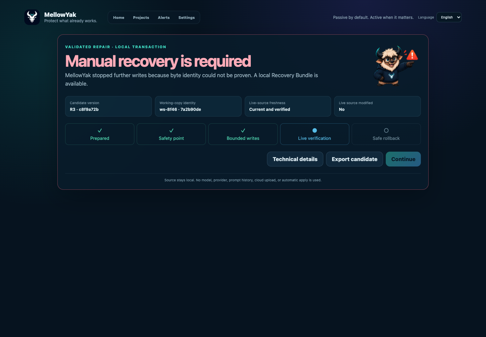

- Purpose: Stop writes when recovery safety cannot be proven.
- Displayed state: An incomplete transaction needs manual recovery.
- Source of data: deterministic synthetic Phase 8 review fixture rendered locally by the desktop UI.
- Available actions: Create/open a Recovery Bundle or inspect exact unresolved paths.
- Known facts: Further writes are blocked and a critical local state is raised.
- Unknowns: Automatic recovery success is not claimed.
- Expected next step: Follow the Recovery Bundle instructions.
- Live source modified: No.

## 18. Portable Repair Package

- Purpose: Export bounded local context for a human or external tool.
- Displayed state: Selected files, evidence references, validation plan, and unknowns are ready.
- Source of data: deterministic synthetic Phase 8 review fixture rendered locally by the desktop UI.
- Available actions: Review the manifest and export locally.
- Known facts: Secrets, absolute paths, provider data, and full-project dumps are excluded.
- Unknowns: The package may not be independently runnable.
- Expected next step: Return edits to the isolated Repair Workspace.
- Live source modified: No.

## 19. Demo Lab

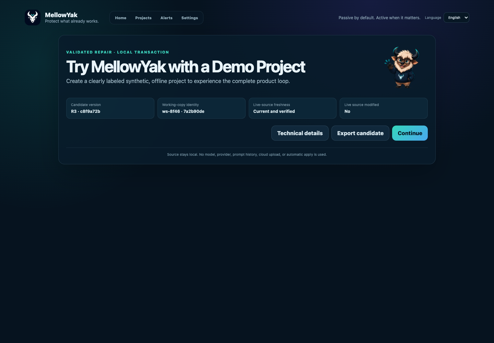

- Purpose: Create a disposable synthetic project for guided review.
- Displayed state: The local-only demo is ready to be created in a selected folder.
- Source of data: deterministic synthetic Phase 8 review fixture rendered locally by the desktop UI.
- Available actions: Create, reset, inject scenarios, or run the self-test.
- Known facts: The fixture is offline, dependency-light, and explicitly synthetic.
- Unknowns: No real project is selected or mutated.
- Expected next step: Create the disposable demo project.
- Live source modified: No.

## 20. Demo confirmed regression

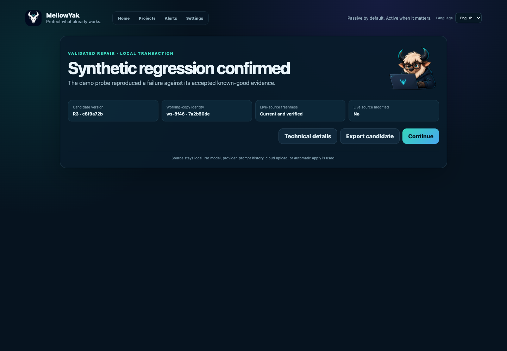

- Purpose: Demonstrate deterministic prior-pass/current-fail confirmation.
- Displayed state: The synthetic checkout behavior fails reproducibly.
- Source of data: deterministic synthetic Phase 8 review fixture rendered locally by the desktop UI.
- Available actions: Create bad/valid candidates, inspect evidence, or reset.
- Known facts: The regression is synthetic and source-bound.
- Unknowns: Root cause is not inferred by AI.
- Expected next step: Create an isolated demo Repair Workspace.
- Live source modified: No.

## 21. Demo valid repair

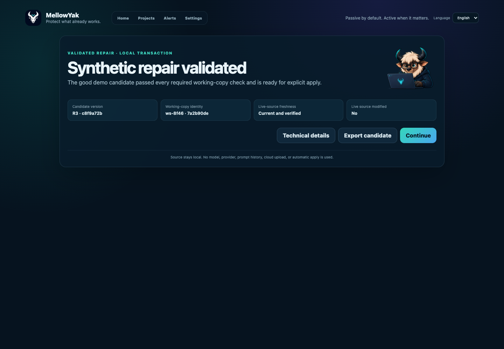

- Purpose: Demonstrate a candidate that passed workspace validation.
- Displayed state: The synthetic good candidate is eligible for Apply preparation.
- Source of data: deterministic synthetic Phase 8 review fixture rendered locally by the desktop UI.
- Available actions: Prepare Apply, simulate stale source, or reset.
- Known facts: All required workspace checks passed.
- Unknowns: Live verification has not yet run.
- Expected next step: Confirm a disposable demo Apply.
- Live source modified: No.

## 22. Product Self-Test running

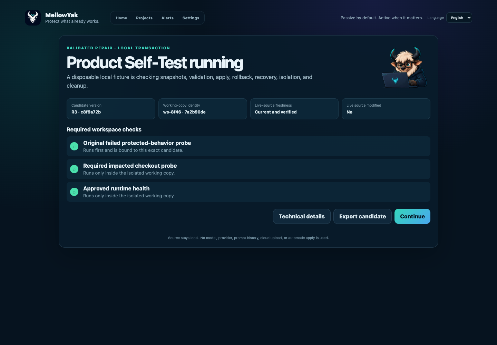

- Purpose: Exercise the product loop only in disposable storage.
- Displayed state: Deterministic self-test steps are running locally.
- Source of data: deterministic synthetic Phase 8 review fixture rendered locally by the desktop UI.
- Available actions: Inspect step progress or wait for completion.
- Known facts: Real projects and external network are excluded.
- Unknowns: Final status is not known until every executed step finishes.
- Expected next step: Wait for PASS, PARTIAL, or FAILED.
- Live source modified: No.

## 23. Product Self-Test passed

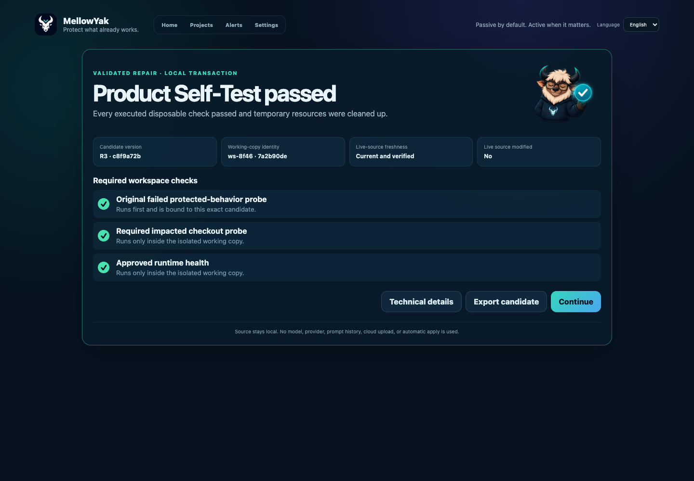

- Purpose: Show completed disposable end-to-end evidence.
- Displayed state: All executed deterministic self-test steps passed.
- Source of data: deterministic synthetic Phase 8 review fixture rendered locally by the desktop UI.
- Available actions: Export the report or open local diagnostics.
- Known facts: Apply, rollback, journal, hash, cleanup, and no-network checks ran.
- Unknowns: This does not certify every operating system.
- Expected next step: Use the morning guide for manual product acceptance.
- Live source modified: No.

## 24. Hebrew RTL — validated candidate

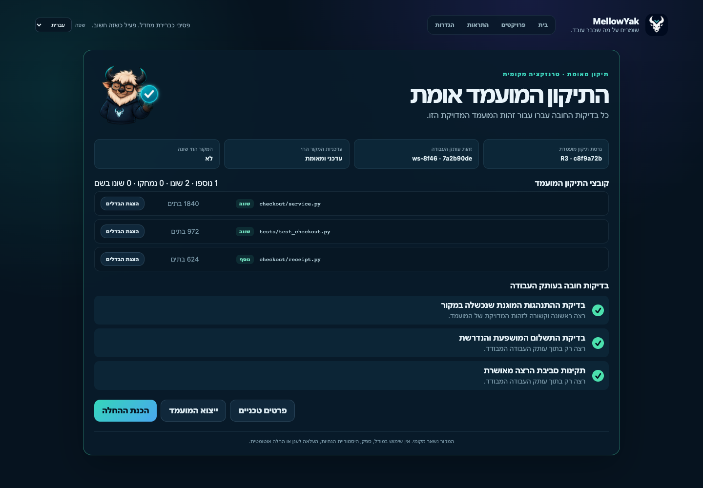

- Purpose: Verify the validated-candidate surface in Hebrew RTL.
- Displayed state: The same deterministic candidate is displayed with mirrored layout.
- Source of data: deterministic synthetic Phase 8 review fixture rendered locally by the desktop UI.
- Available actions: Prepare Apply, export, or inspect evidence.
- Known facts: Translation-key-only UI and technical LTR identifiers coexist.
- Unknowns: Live success remains unverified.
- Expected next step: Continue to deliberate confirmation.
- Live source modified: No.

## 25. Hebrew RTL — Apply confirmation

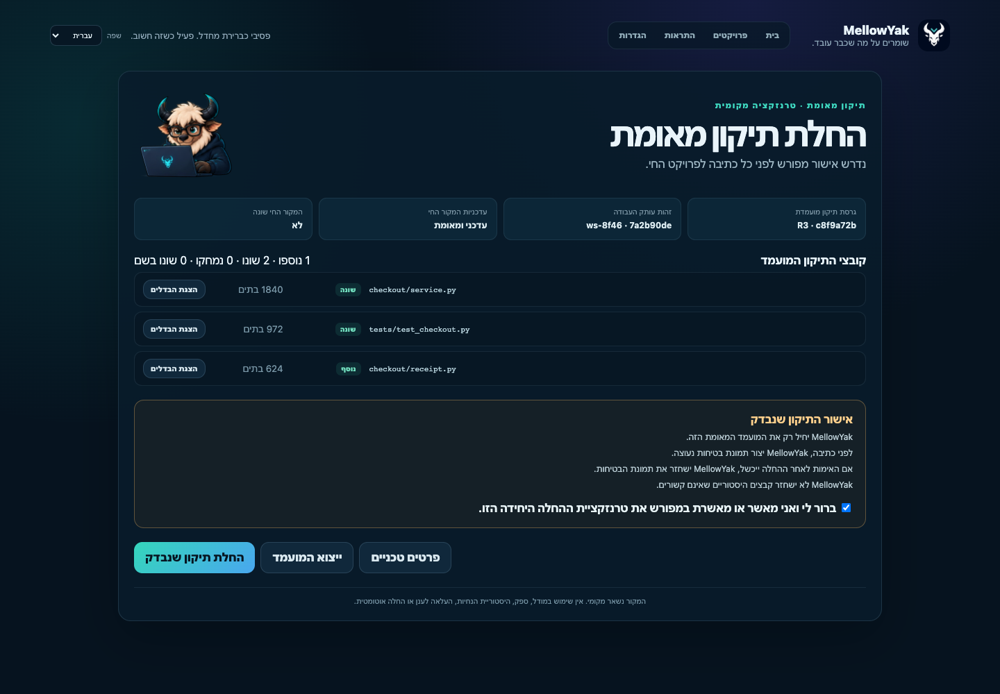

- Purpose: Verify deliberate confirmation in Hebrew RTL.
- Displayed state: Safety, rollback, and affected-path copy is translated and mirrored.
- Source of data: deterministic synthetic Phase 8 review fixture rendered locally by the desktop UI.
- Available actions: Confirm once, inspect, export, or cancel.
- Known facts: The confirmation remains candidate/source bound.
- Unknowns: Cross-platform guarantees remain limited.
- Expected next step: Confirm only after path review.
- Live source modified: No.

## 26. Hebrew RTL — rolled back safely

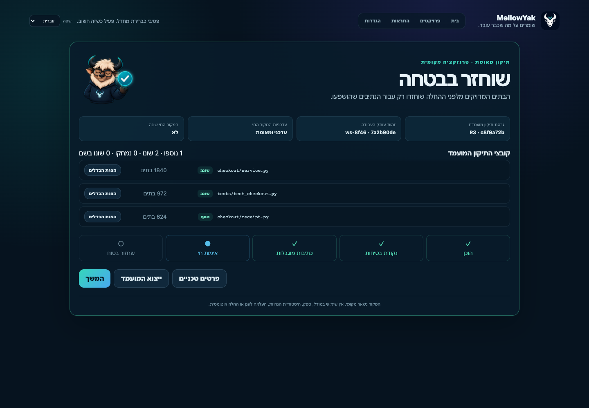

- Purpose: Verify the safe rollback result in Hebrew RTL.
- Displayed state: Affected demo bytes were restored to the safety point.
- Source of data: deterministic synthetic Phase 8 review fixture rendered locally by the desktop UI.
- Available actions: Inspect evidence or revise the candidate.
- Known facts: Only transaction paths were restored.
- Unknowns: The original regression remains unresolved.
- Expected next step: Return to the isolated workspace.
- Live source modified: No.
