# MellowYak Phase 9 Screen Guide

All screens use deterministic synthetic data. No real project, private source, user path, credential, prompt, provider data, or evidence bytes are included.

## 00. First-run welcome

- Purpose: Introduce the local-first Technical Preview.
- Displayed state: A fresh isolated installation has not completed onboarding.
- Data source: deterministic synthetic Phase 9 capture fixture rendered locally.
- Available actions: Continue to project choice.
- Known facts: No account, model, Docker, or cloud is required.
- Unknowns: No project has been selected.
- Expected next step: Review the choices.
- Privacy: no source, evidence bytes, secrets, provider data, or absolute user paths.
- Source modified: No.

## 01. Choose project or Demo Lab

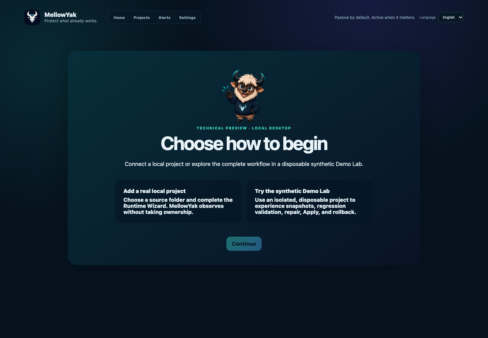

- Purpose: Offer a real local folder or a synthetic disposable demo.
- Displayed state: No selection is persisted yet.
- Data source: deterministic synthetic Phase 9 capture fixture rendered locally.
- Available actions: Select a real project or Demo Lab.
- Known facts: Both choices remain local.
- Unknowns: A real project is intentionally not used in this capture.
- Expected next step: Choose Demo Lab for safe evaluation.
- Privacy: no source, evidence bytes, secrets, provider data, or absolute user paths.
- Source modified: No.

## 02. Background and privacy

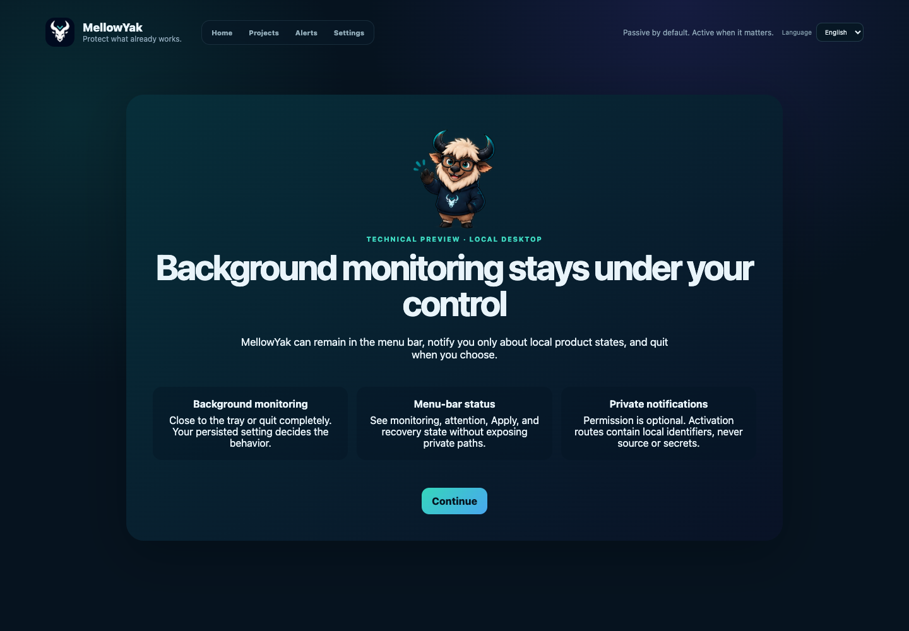

- Purpose: Explain close-to-tray and optional local notifications.
- Displayed state: Background behavior awaits confirmation.
- Data source: deterministic synthetic Phase 9 capture fixture rendered locally.
- Available actions: Continue after reviewing privacy behavior.
- Known facts: Routes contain identifiers, not source or paths.
- Unknowns: OS notification permission is not granted by this screenshot.
- Expected next step: Continue to summary.
- Privacy: no source, evidence bytes, secrets, provider data, or absolute user paths.
- Source modified: No.

## 03. First-run complete

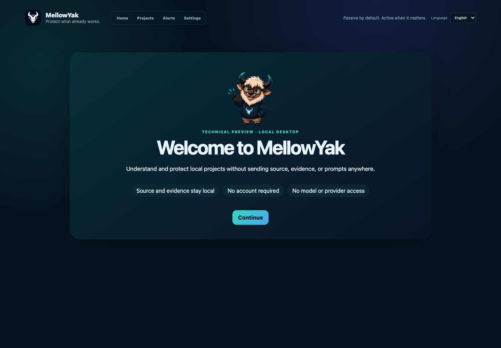

- Purpose: Confirm saved first-run choices.
- Displayed state: Synthetic Demo Lab is selected.
- Data source: deterministic synthetic Phase 9 capture fixture rendered locally.
- Available actions: Finish setup.
- Known facts: The choice persists and can be replayed from Settings.
- Unknowns: No real project is attached.
- Expected next step: Open the disposable Demo Lab.
- Privacy: no source, evidence bytes, secrets, provider data, or absolute user paths.
- Source modified: No.

## 04. Disconnected projects

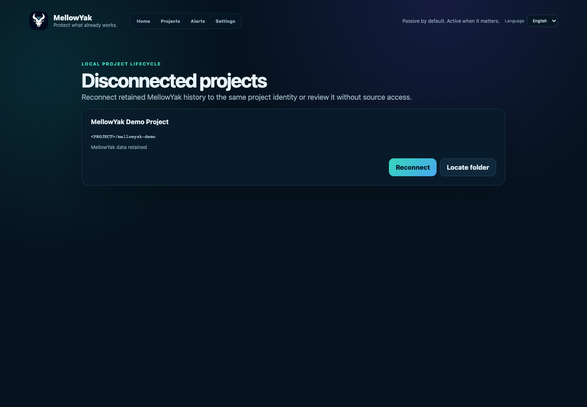

- Purpose: Review retained MellowYak history for unavailable source folders.
- Displayed state: A synthetic project is disconnected.
- Data source: deterministic synthetic Phase 9 capture fixture rendered locally.
- Available actions: Reconnect, locate, review history, or delete MellowYak data.
- Known facts: Source is not moved or copied.
- Unknowns: The correct replacement folder is not yet selected.
- Expected next step: Locate the original project identity.
- Privacy: no source, evidence bytes, secrets, provider data, or absolute user paths.
- Source modified: No.

## 05. Reconnect project

- Purpose: Reconnect after exact identity validation.
- Displayed state: The prior project remains retained locally.
- Data source: deterministic synthetic Phase 9 capture fixture rendered locally.
- Available actions: Choose a candidate source folder.
- Known facts: History remains project-bound.
- Unknowns: Identity has not yet been accepted.
- Expected next step: Validate the folder.
- Privacy: no source, evidence bytes, secrets, provider data, or absolute user paths.
- Source modified: No.

## 06. Relocate project

- Purpose: Attach retained history to the same project at a new path.
- Displayed state: A safe relocation is being reviewed.
- Data source: deterministic synthetic Phase 9 capture fixture rendered locally.
- Available actions: Locate the matching folder.
- Known facts: MellowYak never moves or deletes source.
- Unknowns: The final identity decision is not shown.
- Expected next step: Complete identity comparison.
- Privacy: no source, evidence bytes, secrets, provider data, or absolute user paths.
- Source modified: No.

## 07. Relocation mismatch

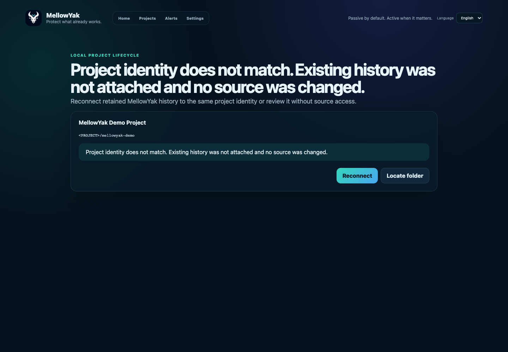

- Purpose: Stop cross-project evidence attachment.
- Displayed state: Selected folder does not match retained project identity.
- Data source: deterministic synthetic Phase 9 capture fixture rendered locally.
- Available actions: Choose another folder or create a new project.
- Known facts: Old evidence remains untouched.
- Unknowns: The user may still explicitly add the folder as new.
- Expected next step: Return to folder selection.
- Privacy: no source, evidence bytes, secrets, provider data, or absolute user paths.
- Source modified: No.

## 08. Tray monitoring

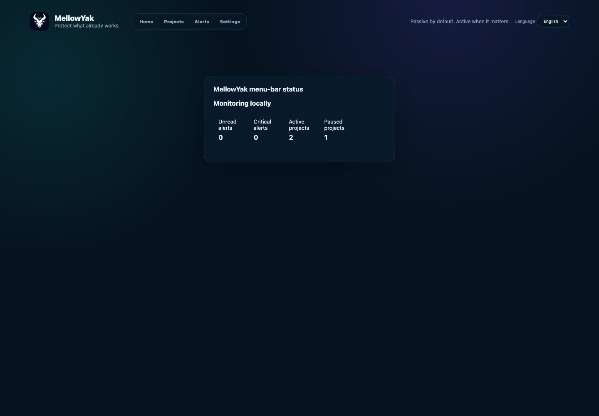

- Purpose: Show privacy-safe global monitoring status.
- Displayed state: Two active projects, one paused, no alerts.
- Data source: deterministic synthetic Phase 9 capture fixture rendered locally.
- Available actions: Open MellowYak, alerts, or project actions.
- Known facts: No full paths or source content are shown.
- Unknowns: Native menu rendering differs by OS.
- Expected next step: Continue monitoring.
- Privacy: no source, evidence bytes, secrets, provider data, or absolute user paths.
- Source modified: No.

## 09. Tray attention

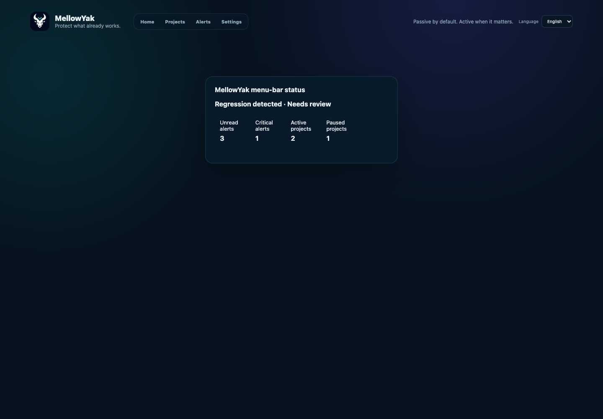

- Purpose: Surface critical local attention without private detail.
- Displayed state: Three unread alerts include one critical alert.
- Data source: deterministic synthetic Phase 9 capture fixture rendered locally.
- Available actions: Open Alerts for exact local context.
- Known facts: Only counts and severity are exposed.
- Unknowns: The root cause is not claimed.
- Expected next step: Review the local alert.
- Privacy: no source, evidence bytes, secrets, provider data, or absolute user paths.
- Source modified: No.

## 10. Tray project menu

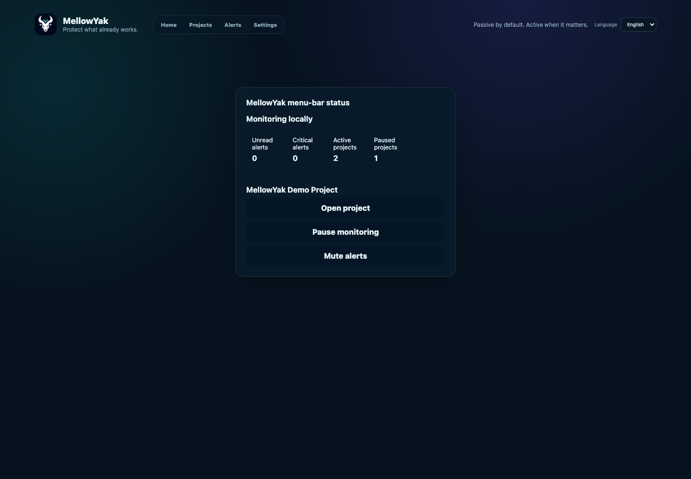

- Purpose: Expose bounded per-project controls.
- Displayed state: Synthetic project submenu is open.
- Data source: deterministic synthetic Phase 9 capture fixture rendered locally.
- Available actions: Open, pause/resume, or mute/unmute.
- Known facts: The menu uses project identity only.
- Unknowns: Native submenu appearance is platform-specific.
- Expected next step: Choose a project action.
- Privacy: no source, evidence bytes, secrets, provider data, or absolute user paths.
- Source modified: No.

## 11. Notification context

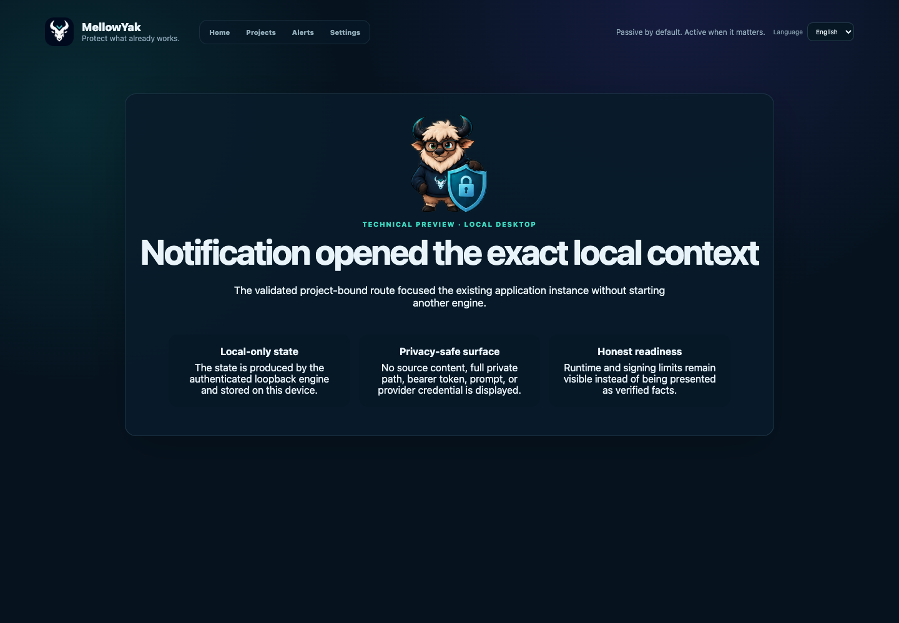

- Purpose: Show safe routing to exact local context.
- Displayed state: A validated project-bound route opened in the existing instance.
- Data source: deterministic synthetic Phase 9 capture fixture rendered locally.
- Available actions: Review the destination or return to Alerts.
- Known facts: No token, source, or full path is in the route.
- Unknowns: A real macOS click still requires OS permission.
- Expected next step: Review the local state.
- Privacy: no source, evidence bytes, secrets, provider data, or absolute user paths.
- Source modified: No.

## 12. Diagnostics Center

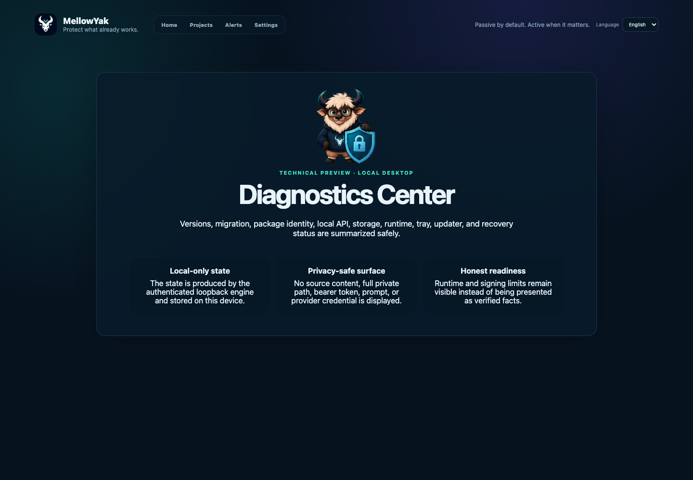

- Purpose: Inspect safe desktop, engine, storage, and platform health.
- Displayed state: Local diagnostics are available.
- Data source: deterministic synthetic Phase 9 capture fixture rendered locally.
- Available actions: Run Self-Test, storage integrity, support export, or copy safe data.
- Known facts: Bearer token and data-root path are redacted.
- Unknowns: External platform signing is not inferred.
- Expected next step: Run a chosen diagnostic.
- Privacy: no source, evidence bytes, secrets, provider data, or absolute user paths.
- Source modified: No.

## 13. Redacted support bundle

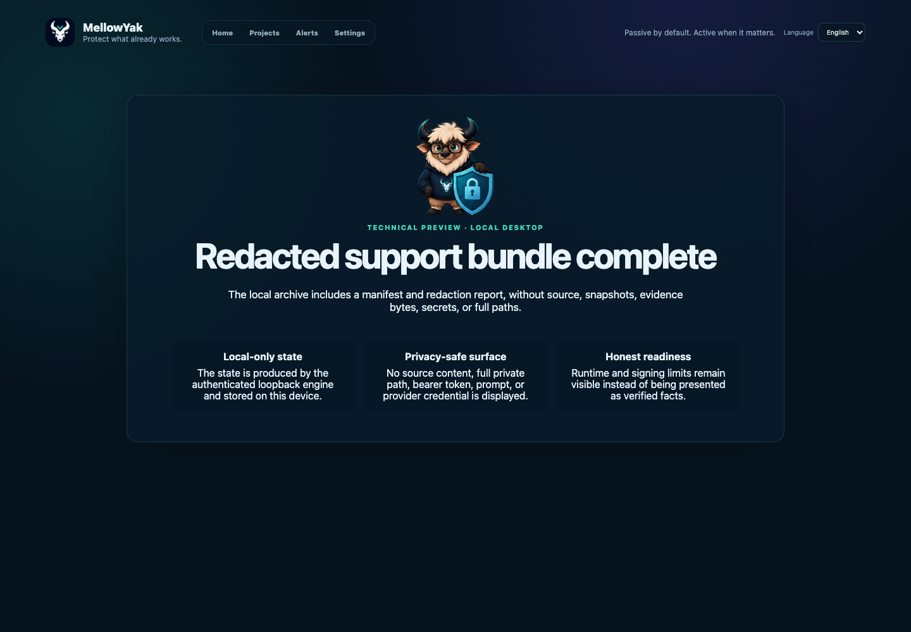

- Purpose: Export bounded local diagnostics.
- Displayed state: A redacted bundle is ready.
- Data source: deterministic synthetic Phase 9 capture fixture rendered locally.
- Available actions: Export or inspect the manifest.
- Known facts: Source, evidence bytes, secrets, and absolute paths are excluded.
- Unknowns: The bundle does not diagnose every OS issue.
- Expected next step: Share only after reviewing the manifest.
- Privacy: no source, evidence bytes, secrets, provider data, or absolute user paths.
- Source modified: No.

## 14. Product Self-Test

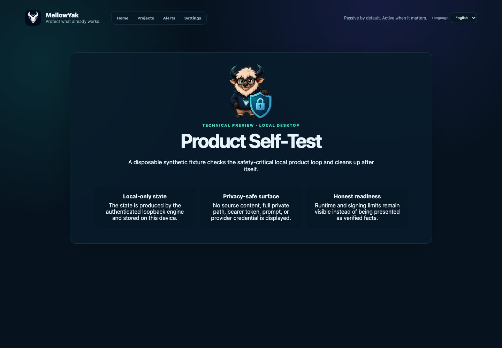

- Purpose: Run the synthetic core acceptance loop.
- Displayed state: Disposable local validation is available.
- Data source: deterministic synthetic Phase 9 capture fixture rendered locally.
- Available actions: Run and export the result.
- Known facts: Executed steps are reported truthfully.
- Unknowns: It does not certify untested platforms.
- Expected next step: Run the packaged test.
- Privacy: no source, evidence bytes, secrets, provider data, or absolute user paths.
- Source modified: No.

## 15. Update check

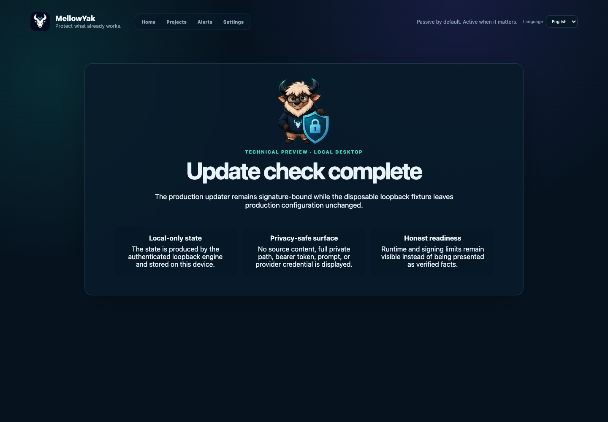

- Purpose: Show the signed updater status surface.
- Displayed state: A local check can be requested.
- Data source: deterministic synthetic Phase 9 capture fixture rendered locally.
- Available actions: Check for an update.
- Known facts: Production public-key verification remains configured.
- Unknowns: No public higher release is available in this run.
- Expected next step: Use the local signed fixture.
- Privacy: no source, evidence bytes, secrets, provider data, or absolute user paths.
- Source modified: No.

## 16. Update signature rejected

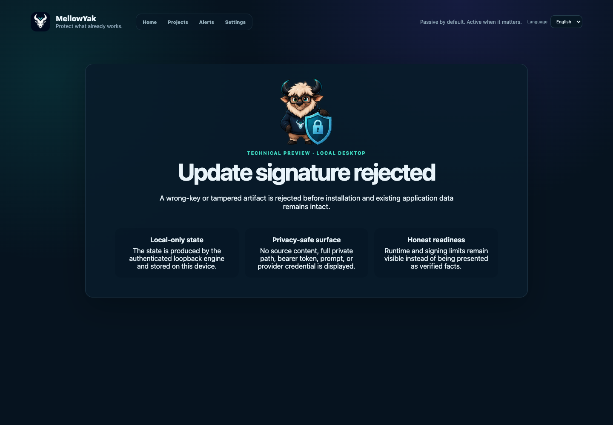

- Purpose: Explain a cryptographic rejection safely.
- Displayed state: Tampered or wrongly signed fixture is blocked.
- Data source: deterministic synthetic Phase 9 capture fixture rendered locally.
- Available actions: Return to current version or retry later.
- Known facts: Current application and data are preserved.
- Unknowns: Production update remains untested without a real release.
- Expected next step: Keep the installed version.
- Privacy: no source, evidence bytes, secrets, provider data, or absolute user paths.
- Source modified: No.

## 17. Package acceptance

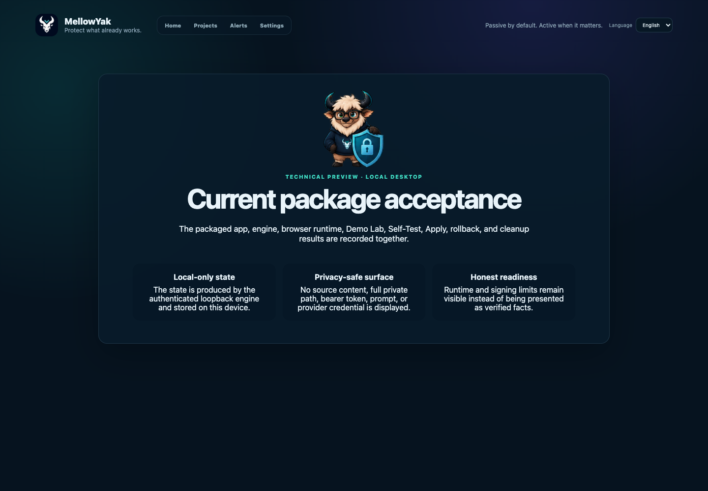

- Purpose: Summarize current packaged validation.
- Displayed state: Package checks have deterministic local evidence.
- Data source: deterministic synthetic Phase 9 capture fixture rendered locally.
- Available actions: Inspect the evidence report.
- Known facts: Phase 8 repair safety is rerun against the package.
- Unknowns: Unsupported platforms remain unverified.
- Expected next step: Review exact statuses.
- Privacy: no source, evidence bytes, secrets, provider data, or absolute user paths.
- Source modified: No.

## 18. Battery saver

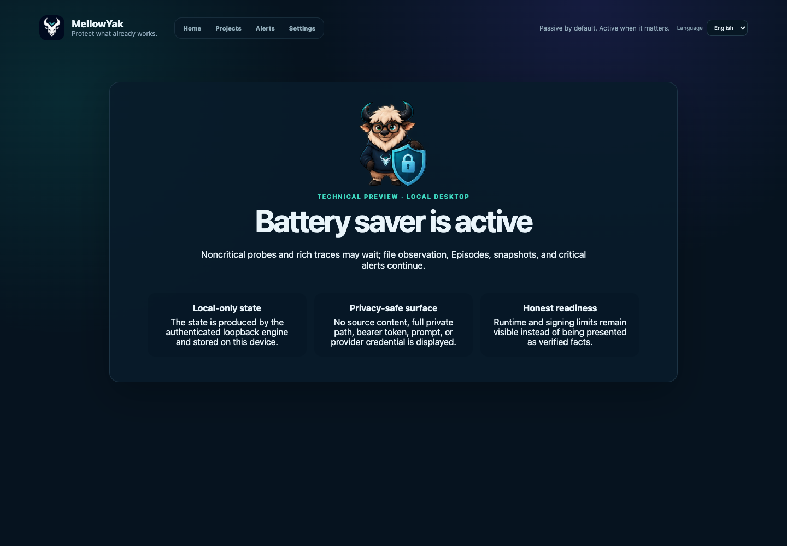

- Purpose: Reduce optional activity without weakening core snapshot correctness.
- Displayed state: Battery saver is selected.
- Data source: deterministic synthetic Phase 9 capture fixture rendered locally.
- Available actions: Return to Normal or Reduced activity.
- Known facts: File observation, snapshots, and critical alerts remain active.
- Unknowns: Deep runtime work may be deferred.
- Expected next step: Review listed limitations.
- Privacy: no source, evidence bytes, secrets, provider data, or absolute user paths.
- Source modified: No.

## 19. Technical Preview readiness

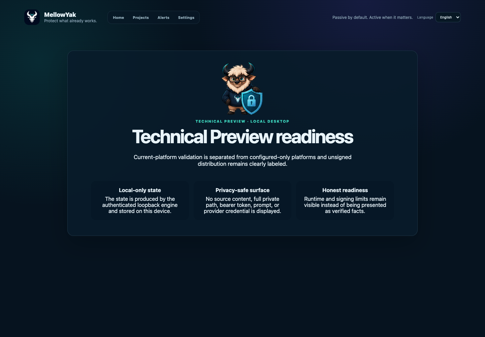

- Purpose: Show release-readiness boundaries.
- Displayed state: Current-platform evidence is assembled.
- Data source: deterministic synthetic Phase 9 capture fixture rendered locally.
- Available actions: Review checklist and known limitations.
- Known facts: No public release or push occurred.
- Unknowns: Signing and other platforms remain externally dependent.
- Expected next step: Follow the real-project guide later.
- Privacy: no source, evidence bytes, secrets, provider data, or absolute user paths.
- Source modified: No.

## 20. Hebrew RTL first run

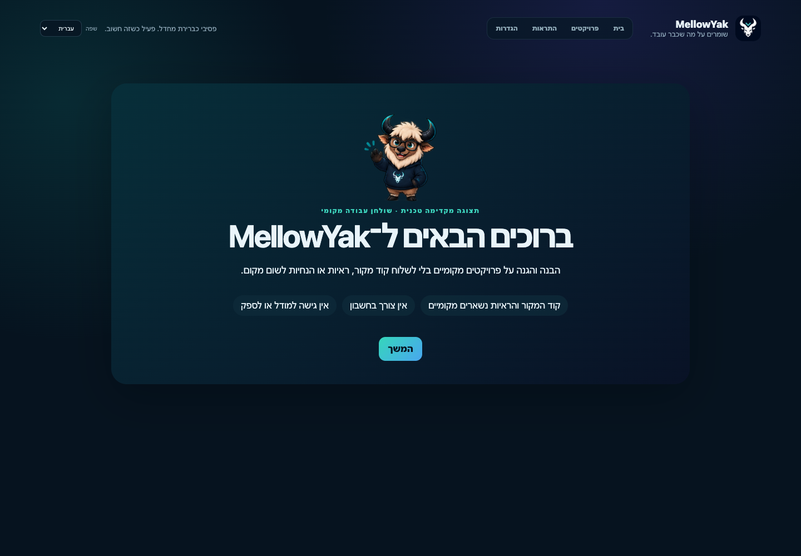

- Purpose: Verify first-run copy and layout in Hebrew RTL.
- Displayed state: Synthetic onboarding is shown in Hebrew.
- Data source: deterministic synthetic Phase 9 capture fixture rendered locally.
- Available actions: Continue through the same local flow.
- Known facts: Translation keys drive the visible text.
- Unknowns: No native OS permission is implied.
- Expected next step: Continue in RTL.
- Privacy: no source, evidence bytes, secrets, provider data, or absolute user paths.
- Source modified: No.

## 21. Hebrew RTL disconnected projects

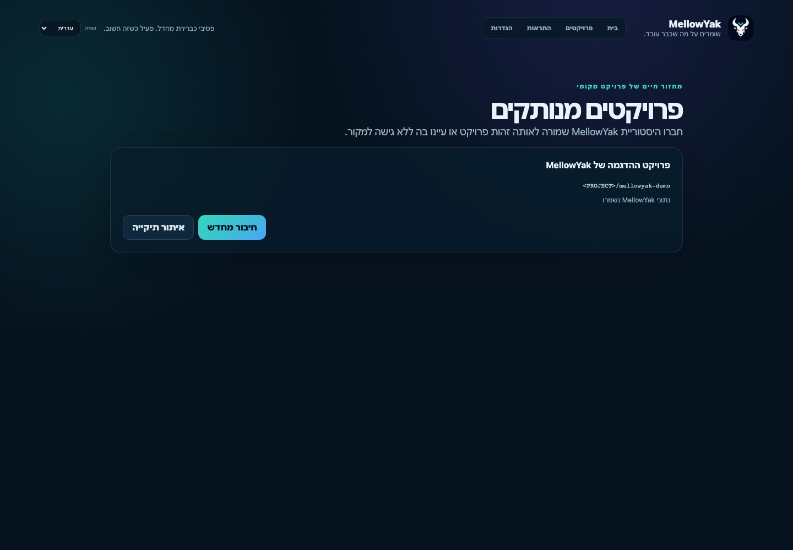

- Purpose: Verify retained-project controls in Hebrew RTL.
- Displayed state: A synthetic disconnected project is shown.
- Data source: deterministic synthetic Phase 9 capture fixture rendered locally.
- Available actions: Reconnect or locate the folder.
- Known facts: Technical identifiers remain LTR.
- Unknowns: Identity is not silently assumed.
- Expected next step: Validate the selected folder.
- Privacy: no source, evidence bytes, secrets, provider data, or absolute user paths.
- Source modified: No.

## 22. Hebrew RTL diagnostics

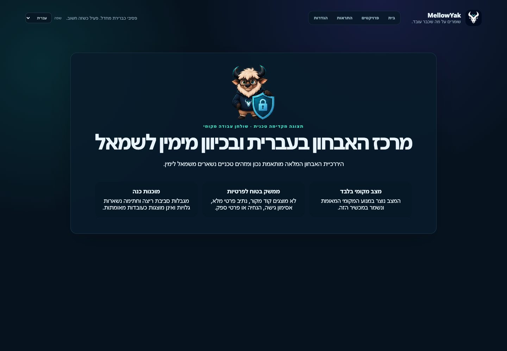

- Purpose: Verify safe diagnostics in Hebrew RTL.
- Displayed state: Synthetic diagnostic readiness is shown.
- Data source: deterministic synthetic Phase 9 capture fixture rendered locally.
- Available actions: Run local diagnostic actions.
- Known facts: Visible copy comes from Hebrew translation keys.
- Unknowns: Signing cannot be inferred from UI.
- Expected next step: Review the evidence.
- Privacy: no source, evidence bytes, secrets, provider data, or absolute user paths.
- Source modified: No.

## 23. Hebrew RTL notification context

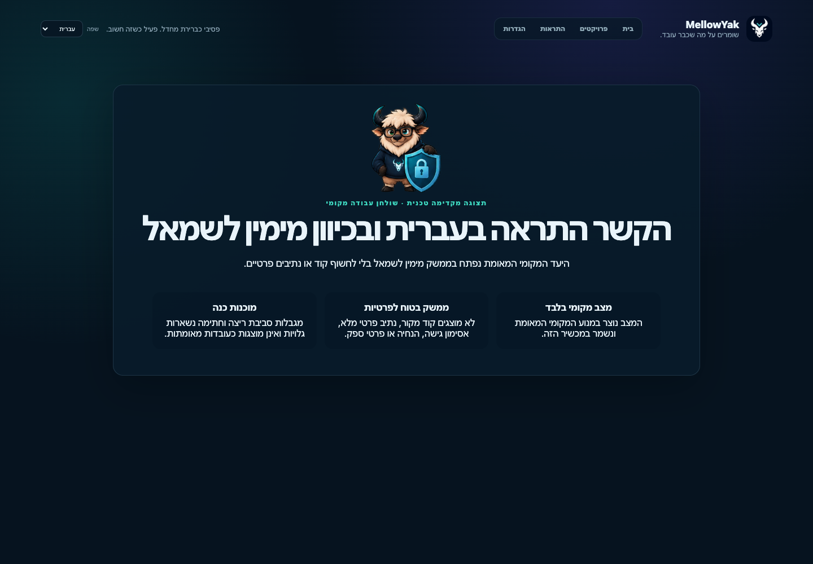

- Purpose: Verify safe activation context in Hebrew RTL.
- Displayed state: A synthetic validated route is shown.
- Data source: deterministic synthetic Phase 9 capture fixture rendered locally.
- Available actions: Open the local destination.
- Known facts: Identifiers remain bounded and LTR.
- Unknowns: A real OS click is not visually automated.
- Expected next step: Review the destination.
- Privacy: no source, evidence bytes, secrets, provider data, or absolute user paths.
- Source modified: No.
