# MellowYak Phase 3 UI review

All screenshots use synthetic public fixture data. No private repository path, credential, source content, or user data is included.

## 1. Home — empty state (English)

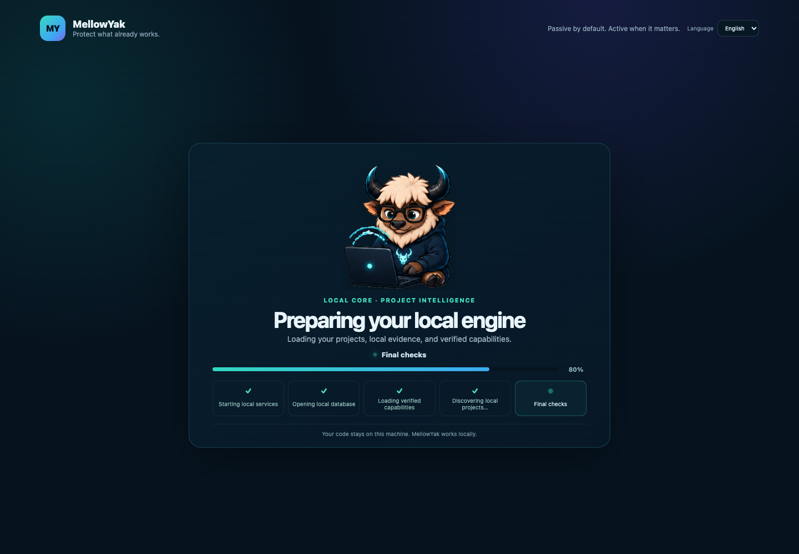

- What is shown: Local engine readiness, privacy promises, versions, and the first-project action.
- Available actions: Add project, open data folder, inspect diagnostics.
- Design review focus: Hero hierarchy, mascot scale, density of privacy/status cards.

## 2. Home — connected project (English)

- What is shown: Connected project list with truthful readiness status and passive-monitoring mascot.
- Available actions: Open a project or add another project.
- Design review focus: Project-card prominence, readiness badge, spacing for multiple projects.

## 3. Add Project — choose folder (English)

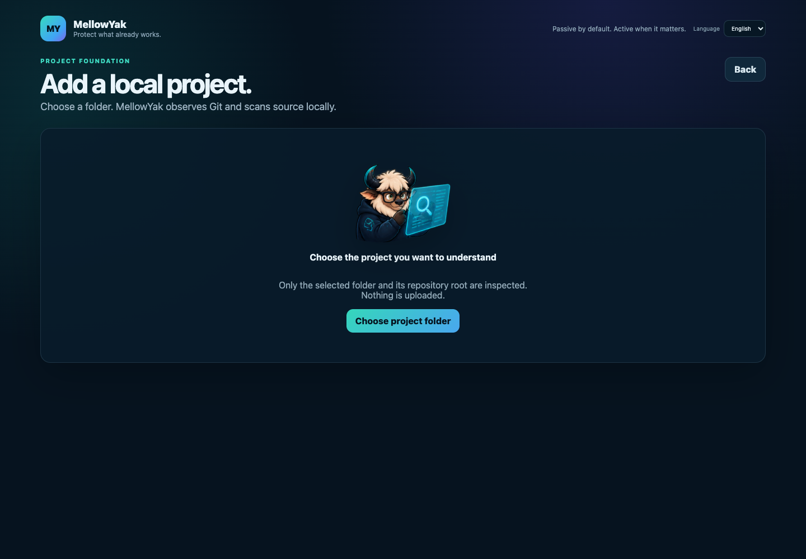

- What is shown: Sparse native-folder-picker entry state with source-local reassurance.
- Available actions: Choose a project folder or return home.
- Design review focus: Illustration size, button prominence, explanation width.

## 4. Add Project — detected repository (English)

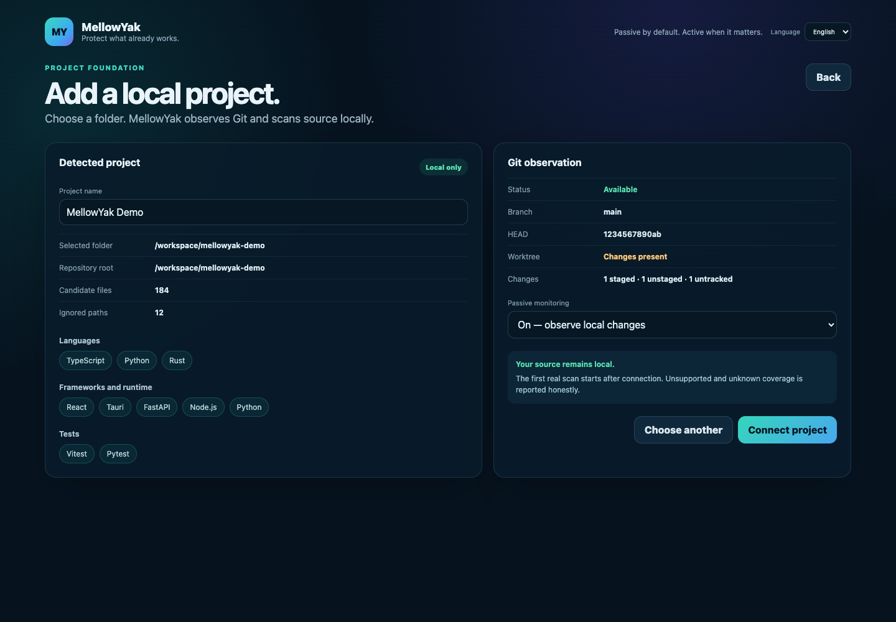

- What is shown: Detected project metadata, Git state, runtime hints, tests, and monitoring selection.
- Available actions: Rename, choose another folder, select monitoring mode, connect.
- Design review focus: Two-column balance, metadata scanability, privacy note placement.

## 5. Project Overview — ready with limits (English)

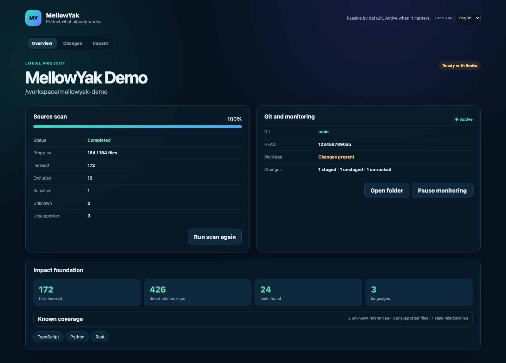

- What is shown: Source-scan metrics, Git monitoring controls, and bounded impact foundation.
- Available actions: Run scan, open folder, pause monitoring, switch to Change or Impact.
- Design review focus: Metric hierarchy, warning/readiness tone, technical density.

## 6. Project Overview — scanning (English)

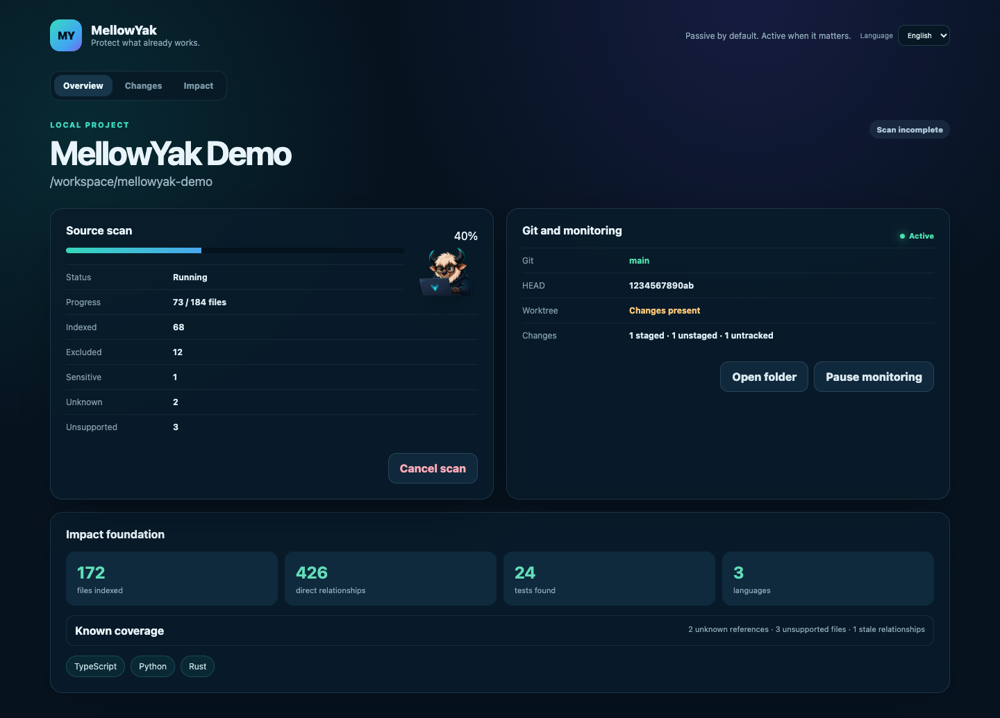

- What is shown: In-progress scan with mascot, progress, partial counts, and cancellation action.
- Available actions: Cancel scan, open folder, pause monitoring.
- Design review focus: Progress visibility, animation opportunity, mascot restraint.

## 7. Change Cockpit — before analysis (English)

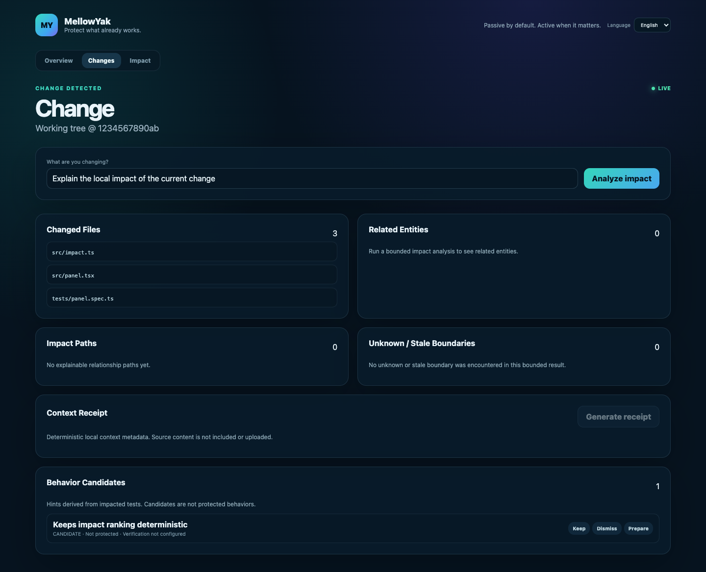

- What is shown: Exact working-tree identity and changed files before bounded impact is run.
- Available actions: Edit optional intent and analyze impact.
- Design review focus: Command bar focus, empty-state guidance, changed-file list density.

## 8. Change Cockpit — analyzed (English)

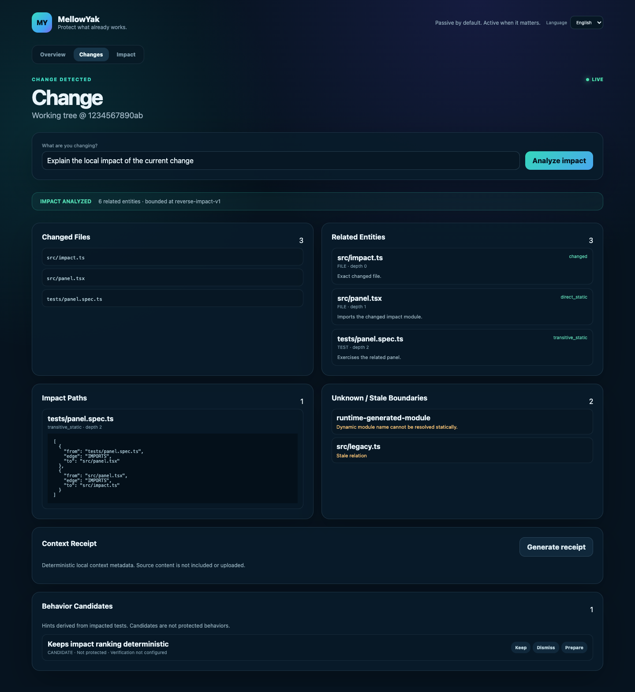

- What is shown: Related entities, explainable paths, unknown/stale boundaries, and behavior candidates.
- Available actions: Rerun analysis, generate receipt, keep/dismiss/prepare candidates.
- Design review focus: Information hierarchy, card grouping, boundary severity.

## 9. Context Receipt — expanded (English)

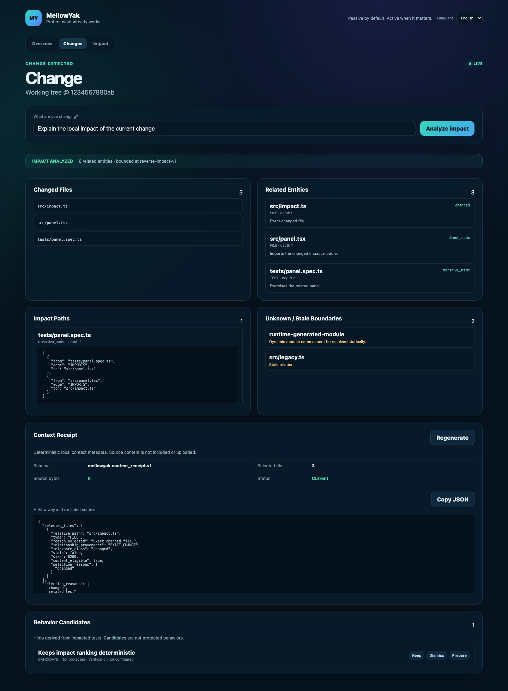

- What is shown: Metadata-only receipt summary and inspectable selected/excluded context.
- Available actions: Copy JSON, regenerate, expand or collapse details.
- Design review focus: JSON readability, zero-source proof, disclosure control.

## 10. Impact Explorer — empty query (English)

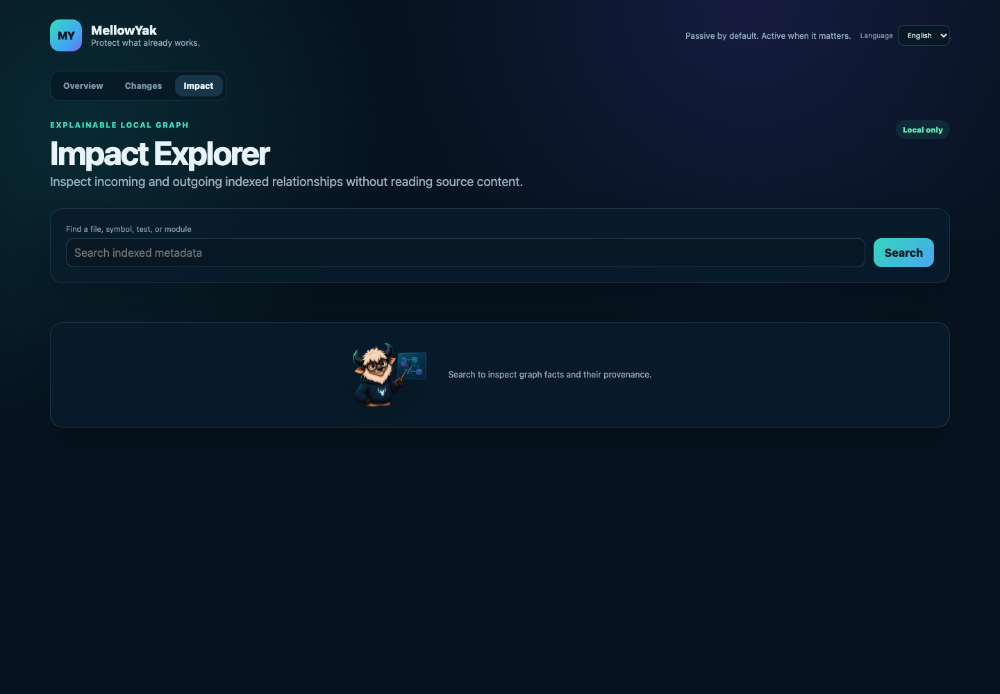

- What is shown: Search entry and calm helper illustration before a graph query.
- Available actions: Enter a metadata query and search.
- Design review focus: Search prominence, helper-card size, empty-state clarity.

## 11. Impact Explorer — results (English)

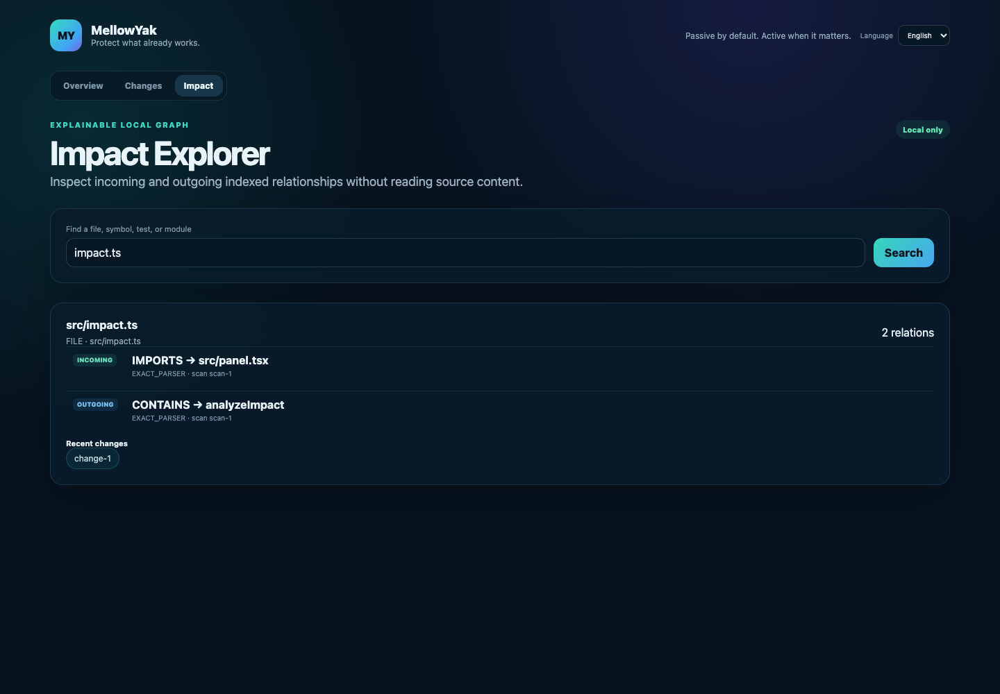

- What is shown: Incoming/outgoing relationships with parser provenance, scan revision, and recent changes.
- Available actions: Refine and rerun search; inspect relationship facts.
- Design review focus: Direction labels, provenance legibility, long-path wrapping.

## 12. Signed update available (English)

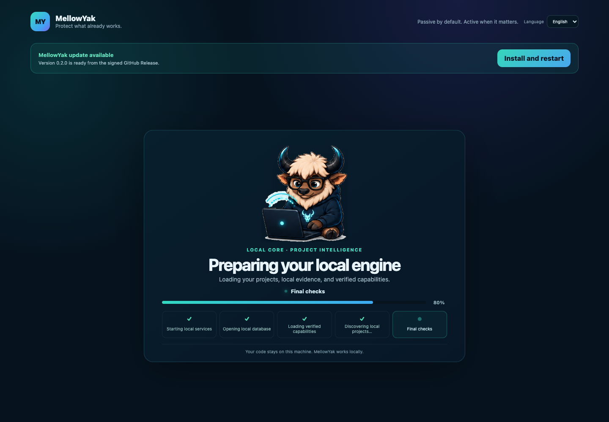

- What is shown: Non-blocking signed GitHub Release notification in the global shell.
- Available actions: Install the signed update and restart.
- Design review focus: Banner urgency, trust language, primary-action strength.

## 13. Local Engine unavailable (English)

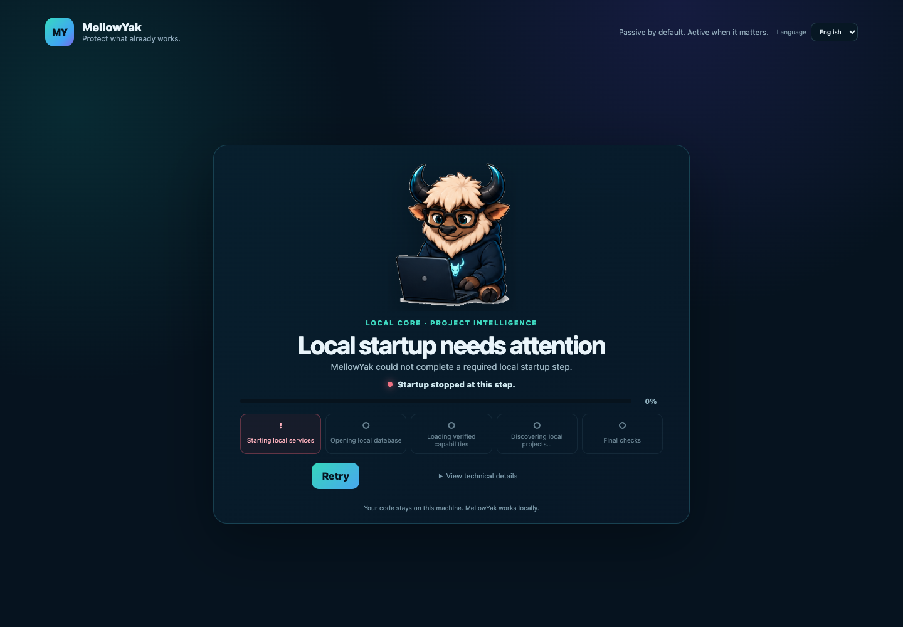

- What is shown: Honest local startup failure without pretending that project data is ready.
- Available actions: Retry the authoritative startup pipeline or inspect translated technical details.
- Design review focus: Recovery guidance, failed-step clarity, error severity.

## 14. דף הבית — מצב ריק (עברית RTL)

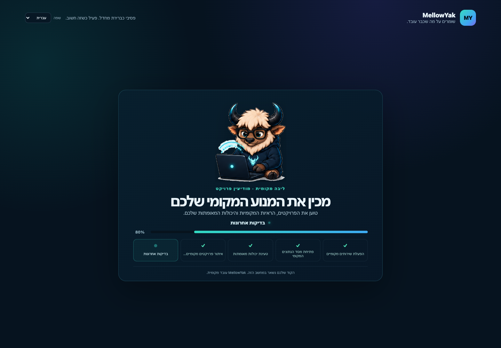

- What is shown: אותו מצב מנוע ופרטיות בפריסה מלאה מימין לשמאל.
- Available actions: הוספת פרויקט, פתיחת תיקיית נתונים והצגת אבחון.
- Design review focus: יישור RTL, סדר הכרטיסים, ריווח והיררכיית כותרות.

## 15. הוספת פרויקט — בחירת תיקייה (עברית RTL)

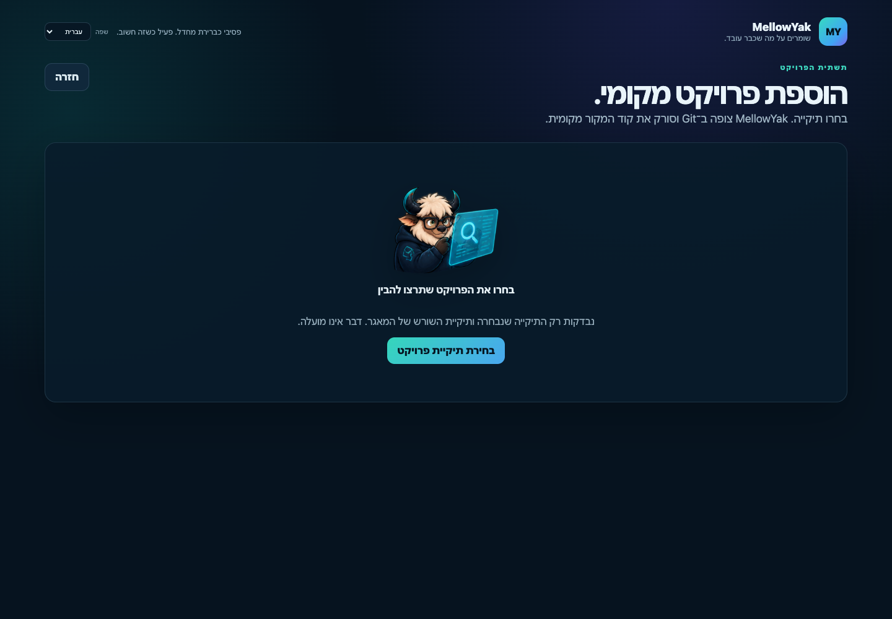

- What is shown: מסך בחירה מקומי עם mascot וטקסט מתורגם בלבד.
- Available actions: בחירת תיקייה או חזרה.
- Design review focus: מיקום האיור מול כיוון הקריאה וכפתור הפעולה.

## 16. הוספת פרויקט — זיהוי מאגר (עברית RTL)

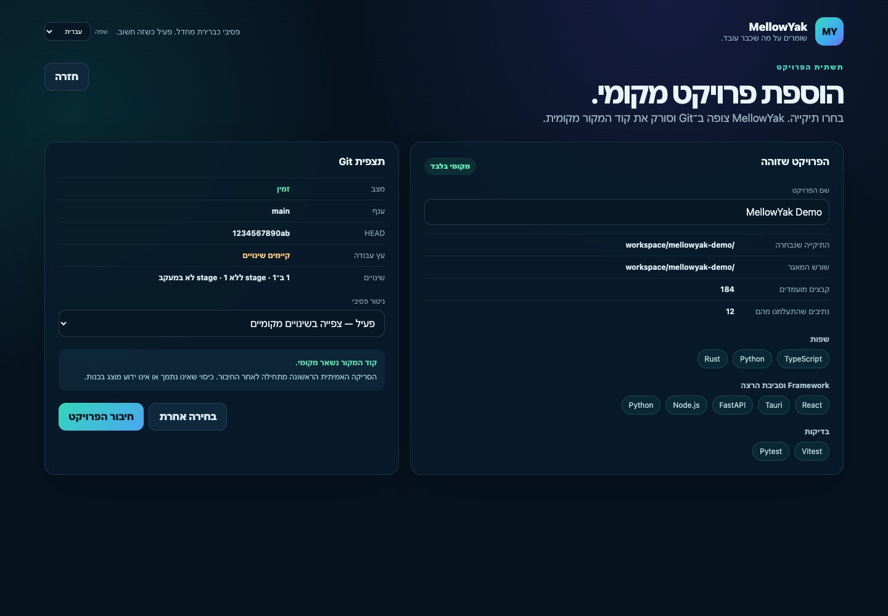

- What is shown: כל מטא־הנתונים והאפשרויות בפריסה עברית.
- Available actions: שינוי שם, מצב ניטור, בחירה מחדש וחיבור.
- Design review focus: טבלאות ערך/תווית RTL ונתיבים טכניים LTR.

## 17. סקירת פרויקט (עברית RTL)

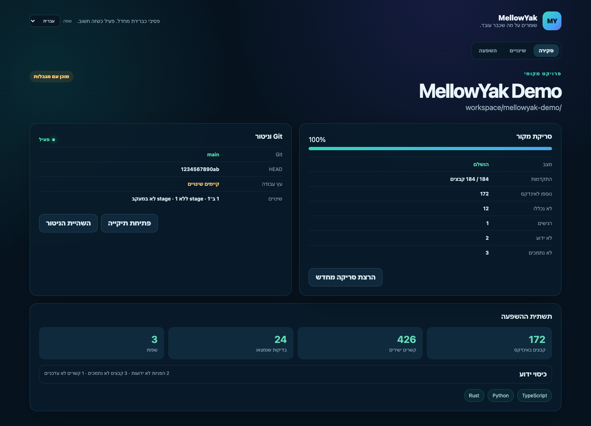

- What is shown: מצב מוכנות, סריקה, Git ומפת השפעה בעברית.
- Available actions: סריקה, פתיחת תיקייה, ניטור וניווט.
- Design review focus: קריאות המספרים והמונחים הטכניים בתוך RTL.

## 18. Change Cockpit מנותח (עברית RTL)

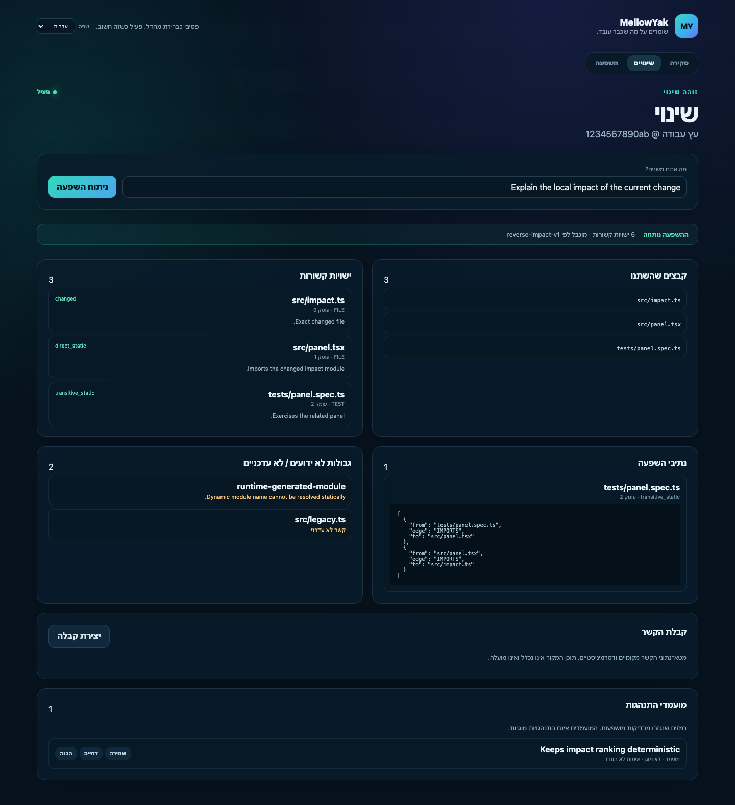

- What is shown: תוצאות השפעה, נתיבים וגבולות לא ידועים/לא עדכניים בעברית.
- Available actions: ניתוח, יצירת קבלה וניהול מועמדי התנהגות.
- Design review focus: סדר חזותי של כרטיסים והפרדת נתוני קוד LTR.

## 19. Context Receipt מורחב (עברית RTL)

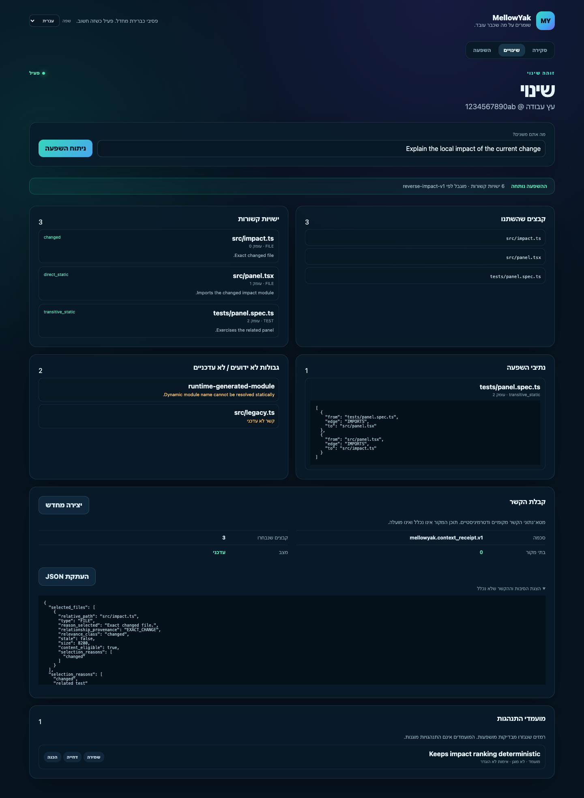

- What is shown: סיכום מקומי בעברית ו‑JSON טכני בכיוון LTR.
- Available actions: העתקה, יצירה מחדש והרחבת פירוט.
- Design review focus: איזון דו־כיווני ומניעת ערבוב סימני פיסוק.

## 20. Impact Explorer עם תוצאות (עברית RTL)

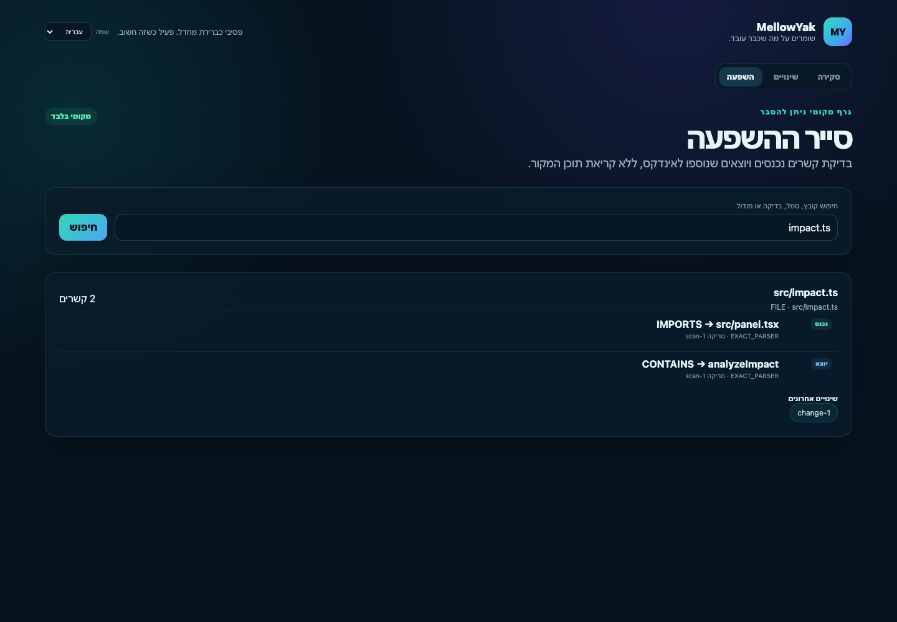

- What is shown: קשרים נכנסים ויוצאים, provenance וגרסת סריקה.
- Available actions: חיפוש ובדיקת עובדות הקשר.
- Design review focus: תגיות כיוון, יישור טקסט ונתיבים ארוכים.

## 21. עדכון חתום זמין (עברית RTL)

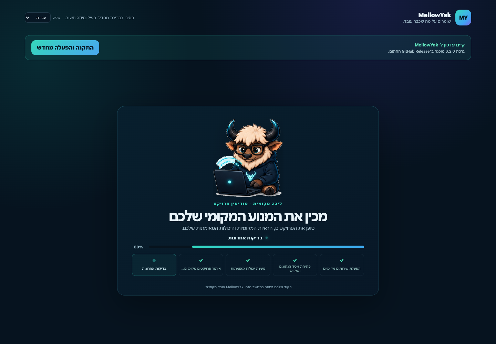

- What is shown: התראת עדכון גלובלית עם גרסה ופעולת התקנה מתורגמת.
- Available actions: התקנת העדכון והפעלה מחדש.
- Design review focus: מיקום הבאנר, אמון ודרגת הדחיפות.

## 22. Real startup pipeline (English)

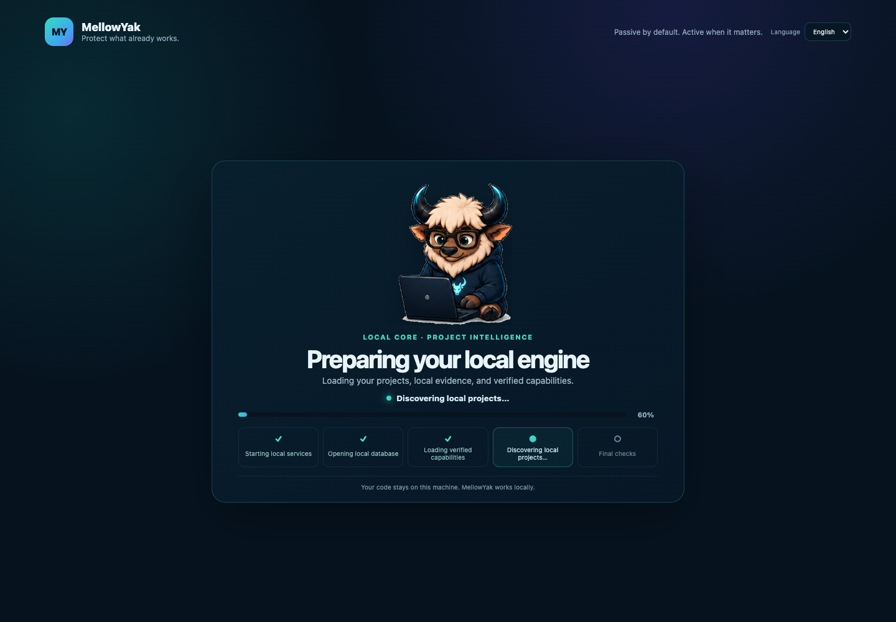

- What is shown: Animated MellowYak, the currently active real project-discovery step, meaningful progress, and completed/pending stages.
- Available actions: Wait for local startup; language remains selectable while work continues.
- Design review focus: Compact hierarchy, animation scale, progress readability, calm local tone.

## 23. תהליך אתחול אמיתי (עברית RTL)

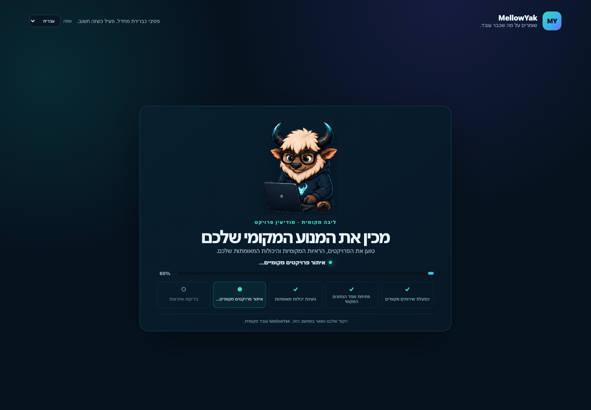

- What is shown: אנימציית MellowYak ושלב איתור הפרויקטים האמיתי בפריסת RTL מלאה.
- Available actions: המתנה להשלמת האתחול המקומי או שינוי שפה.
- Design review focus: כיוון RTL, סדר השלבים, קריאות והיררכיה קומפקטית.

## 24. Real startup pipeline — narrow window

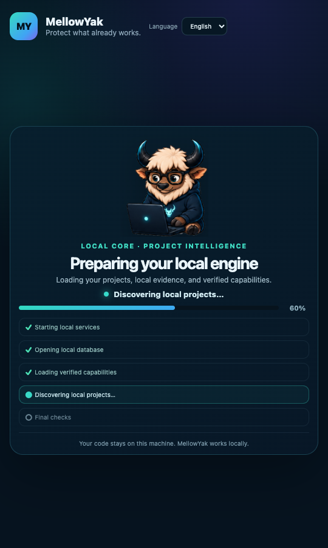

- What is shown: The same authoritative startup state at the supported narrow viewport, with every important label and step retained.
- Available actions: Wait for local startup or change language.
- Design review focus: No overlap, clipping, hidden operation, or required vertical scroll.

